# Agent Notes

English | [中文](README.zh.md)

An Agent Note records a decision a maintainer may reasonably revisit: the problem, the chosen behavior, what alternatives lost, the accepted cost, and the evidence that makes the result complete. It is repository rationale, not authority over current code.

## Layout and classification

Notes live at `{lifecycle}/{class}/yyyy-mm-dd-topic.md`.

Lifecycle:

- `proposed/` — a Spec awaiting or carrying approval; implementation is incomplete.
- `implemented/` — shipped reality, kept factually current.
- `rejected/` — an explicitly declined proposal retained only while its rationale prevents a plausible repeated mistake.

Class:

| Class | Use |
|---|---|
| `feature` | User- or model-facing capability. |
| `bug-fix` | Durable root cause and repair decision. |
| `simplification` | Removal or collapse of existing behavior or structure. |
| `architecture` | Shipped source ownership and dependency decisions. |
| `process` | Repository tooling, policy, and workflow. |
| `testing` | Test infrastructure and strategy. |

There is no `refactor` class. A refactor with a durable removal decision is a simplification; a mechanical refactor needs no note.

### Initial lifecycle selection

The class describes the subject of a decision; it does not force every note to begin as proposed. Choose the initial result from the approval need and delivery state:

| Change shape | Initial result |
|---|---|
| Local or mechanical restoration of an existing contract | No note; declare `N/A — <reason>` in the PR. |
| Durable bug fix delivered and verified in the same PR | Create an implemented `bug-fix` note directly. |
| Small, completed testing or other durable decision that does not need target approval before implementation | Create an implemented note in its owning class directly. |
| Substantial feature, architecture, process, or simplification | Create a proposed Spec before implementation. |
| Any decision whose target behavior, ownership, ACs, alternatives, or risks need human agreement before implementation | Create a proposed Spec, regardless of class. |

`N/A` is a PR classification, not a note lifecycle. `rejected` is never an initial state: it records an explicit human verdict on an existing proposal.

### State transitions

```mermaid
stateDiagram-v2
    [*] --> Classify
    Classify --> NoNote: mechanical or existing contract
    Classify --> Proposed: prior target approval required
    Classify --> Implemented: durable decision already delivered

    NoNote --> [*]: PR records N/A reason
    Proposed --> Proposed: material edit requires re-approval
    Proposed --> Implemented: final layer covers every AC
    Proposed --> Rejected: explicit human rejection
    Proposed --> [*]: unmerged exploration has no durable value

    Implemented --> Implemented: keep shipped facts current
    Implemented --> Successor: decision is reversed or fully superseded
    Rejected --> Successor: new evidence reopens the question
    Successor --> Proposed: successor requires prior approval
    Successor --> Implemented: successor is already delivered

    Implemented --> Archived: future only; no longer an active owner
    Rejected --> Archived: future only; rationale absorbed by successor
    Archived --> [*]: historical search only
```



`Successor` in the diagram means creating a new, cross-linked note; the old implemented or rejected record does not change back into proposed or implemented.

## When a note is required

Every human-authored PR declares an Agent Note or an explicit `N/A` reason in the PR template. Automation-authored PRs (repository workflows and Dependabot) are exempt from this metadata requirement, not from normal validation. A note is required for architecture choices, cross-module contracts, disk/configuration/wire formats, process policy, substantial features, and alternatives likely to be reconsidered.

A simple bug fix uses `N/A` when it restores an existing documented contract without introducing failure semantics, ownership, compatibility, or a durable tradeoff. It writes an implemented `bug-fix` note when the repair chooses among plausible alternatives, changes a persistent contract, protects security/concurrency/atomicity/lifecycle, or could reasonably be reverted by a future maintainer who lacks the root cause.

Prefer updating the note that already owns the decision. Do not add one note per commit or repeat PR narration.

## Spec-first stack

Substantial feature, architecture, process, and simplification work follows this sequence:

1. Create a bottom Spec PR containing a proposed bilingual Agent Note.
2. Give every acceptance criterion a stable `AC1`, `AC2`, ... identifier and name its verification owner.
3. Wait for an explicit human Approval on the current Spec head; merging the Spec first is optional.
4. Stack implementation PRs on that branch. Each layer links the Spec and lists the AC IDs it covers.
5. Put material behavior, ownership, AC, alternatives, or risk changes on the Spec branch; rebase the stack and obtain Approval again.
6. Keep the note proposed through intermediate layers.
7. The final layer that satisfies all ACs moves and rewrites the note as implemented.

Approval binds one exact Spec head. Silence, `CHANGES_REQUESTED`, and discussion do not mean rejection.

Agents determine the lifecycle from the stack, not from one PR in isolation. Run `gh stack view --json`; exit code 2 means the branch is standalone. For a stack, inspect the current layer and every downstack implementation PR, aggregate only ACs backed by actual verification, and transition the note only in the final layer when the cumulative evidence covers the complete approved Spec. Stack synchronization never proves completion: after `gh stack sync`, rerun change scope and the invalidated checks for each live layer.

## File format

Every note starts with this exact header block, followed by the language switcher:

```markdown
# Agent Note: <title>

Status: <lifecycle>

English | Chinese counterpart: yyyy-mm-dd-topic.zh.md
```

A proposed note contains:

```markdown
## Problem
## Proposal
## Alternatives considered
## Acceptance criteria
## Risks
```

Acceptance criteria are observable outcomes, not implementation tasks:

```markdown
- AC1 — <observable result> (verification: unit | renderer | Electron | packaged artifact | docs gate)
```

An implemented note contains:

```markdown
## Problem
## Decision
## Alternatives considered
## Consequences
## Verification
```

Transitioned Specs map every AC to actual evidence. A direct bug-fix note may use `Regression` instead:

```markdown
- AC1 — `<command or test>`: <what regression it catches>
- Regression — `<command or test>`: <what regression it catches>
```

A rejected note retains `Problem`, `Proposal`, and `Alternatives considered`, adds `Rejection rationale`, and uses:

```markdown
Status: rejected — <one-line decisive reason>
```

## Rejection and deletion

Only an explicit human decision moves `proposed` to `rejected`. A partial rejection amends the proposed note and requires new Approval; a discussion alternative stays inside `Alternatives considered`.

If the rejection rationale prevents a likely repeated mistake, convert and merge the rejected note before closing its Spec PR. If the exploration has no durable value, close the unmerged PR without adding repository noise. An implemented decision is never relabeled rejected; a new note supersedes it.

## Supersession

Before adding a note, search active notes by domain terms, mechanism names, paths, and rejected alternatives.

- New decision: create a note.
- Same decision: update the current owner.
- Partial supersession: keep both notes current and cross-link them.
- Full supersession: move every unique rationale, alternative, consequence, and verification fact into the new owner. Deleting the old note requires explicit human approval.

Do not rewrite a note into a different decision or use Git history as the only remaining rationale.

## Archived notes (deferred)

Cherry Studio does not currently have an `archived/` lifecycle, directory, or valid status. Age, a merged PR, moved code, or stale wording never archives a note automatically. An implemented note that still owns a current decision stays active and is updated in place.

Introduce an archive only when all of these repository-level conditions hold:

1. Fully superseded or removed-domain notes have accumulated enough to measurably weaken active-tree search.
2. Active-first and historical fallback search behavior is defined for agents.
3. An archive index or equivalent owner mapping keeps successors discoverable.
4. Pairing, format, supersession, and inbound-link gates understand the new lifecycle.
5. The change is approved as a repository process decision rather than inferred from note age.

Once that lifecycle exists, only an implemented or rejected note is eligible, and only when:

- it is fully superseded or its entire owning system has been removed;
- a current owner has absorbed every unique rationale, alternative, consequence, and verification fact;
- successor and inbound links identify the active owner; and
- a human explicitly confirms the supersession and archive move.

A proposed note never enters archived. An explicitly declined proposal becomes rejected when its rationale has durable value; an unmerged exploration without durable value is closed without adding a repository record. Until archive support is implemented, fully superseded notes remain active and cross-linked, and deleting one still requires explicit human approval.

## Lifecycle transitions

`proposed → implemented` is a rewrite to shipped present tense: `Proposal` becomes `Decision`; plans and checklists become actual `Consequences` and `Verification`. Move the English file, Chinese file, and sidecar together.

`proposed → rejected` preserves what was considered, adds the explicit verdict and evidence, and stops every implementation layer. A later proposal with new evidence links the rejected record rather than erasing it.

Implemented notes keep paths, names, defaults, ownership, failures, and verification current. When implementation and a note disagree, determine whether the code is wrong or the factual realization changed; do not preserve a worse implementation merely to satisfy stale prose.

Before publishing a lifecycle move, run `pnpm agent-notes:check-transition --base <verified-spec-ref> [--head <ref>]`. The checker requires a complete English/Chinese/sidecar move, permits only `proposed → implemented|rejected`, maps every approved AC exactly once for implementation, and requires an explicit rejection reason. It validates a declared transition; it never decides that a proposal was rejected or that a stack is complete.

## Pairing and gates

Every note and this README follow [the bilingual pairing contract](../../docs/i18n/README.md). Agent instruction files remain English-only.

Run:

- `pnpm docs:check-notes` for format and lifecycle structure.
- `pnpm agent-notes:check-transition --base <verified-spec-ref>` for a lifecycle move.
- `pnpm docs:check-pairing <pair>` while editing a pair.
- `pnpm docs:check` before publishing documentation changes.

The [implemented documentation-governance decision](implemented/process/2026-08-18-docs-governance-and-spec-workflow.md) owns this workflow.
