# Agent Notes

[English](README.md) | 中文

Agent Note 记录维护者可能合理重新讨论的决策：问题、选定行为、落选方案、接受的代价，以及证明结果完整的证据。它是仓库中的决策理由，不凌驾于当前代码。

## 布局与分类

Note 位于 `{lifecycle}/{class}/yyyy-mm-dd-topic.md`。

生命周期：

- `proposed/` — 等待或已经获得批准的 Spec；实现尚未完成。
- `implemented/` — 已发布事实，并持续保持事实准确。
- `rejected/` — 被明确否决的提案；只有理由仍能防止可信的重复错误时才保留。

类别：

| Class | Use |
|---|---|
| `feature` | 用户或模型可见能力。 |
| `bug-fix` | 值得长期保留的根因与修复决策。 |
| `simplification` | 删除或合并已有行为与结构。 |
| `architecture` | 已发布源码的所有权与依赖决策。 |
| `process` | 仓库工具、政策与工作流。 |
| `testing` | 测试基础设施与策略。 |

不存在 `refactor` 类别。包含持久删除决策的 refactor 属于 simplification；机械 refactor 不需要 note。

### 初始生命周期选择

Class 描述决策的主题；它不要求每条 note 都从 proposed 开始。根据是否需要前置批准以及交付状态选择初始结果：

| 变更形态 | 初始结果 |
|---|---|
| 恢复已有契约的局部或机械修改 | 不写 note；在 PR 中声明 `N/A — <reason>`。 |
| 在同一 PR 中交付并验证的持久 bugfix | 直接创建 implemented `bug-fix` note。 |
| 无需在实现前批准目标的小型已完成 testing 或其他持久决策 | 直接在归属 class 中创建 implemented note。 |
| 重大 feature、architecture、process 或 simplification | 实现前创建 proposed Spec。 |
| 任何需要人类在实现前对目标行为、ownership、AC、替代方案或风险达成一致的决策 | 无论 class 为何，都创建 proposed Spec。 |

`N/A` 是 PR 分类，不是 note 生命周期。`rejected` 绝不是初始状态；它记录人类对已有 proposal 的明确裁决。

### 状态转换

```mermaid
stateDiagram-v2
    [*] --> Classify
    Classify --> NoNote: mechanical or existing contract
    Classify --> Proposed: prior target approval required
    Classify --> Implemented: durable decision already delivered

    NoNote --> [*]: PR records N/A reason
    Proposed --> Proposed: material edit requires re-approval
    Proposed --> Implemented: final layer covers every AC
    Proposed --> Rejected: explicit human rejection
    Proposed --> [*]: unmerged exploration has no durable value

    Implemented --> Implemented: keep shipped facts current
    Implemented --> Successor: decision is reversed or fully superseded
    Rejected --> Successor: new evidence reopens the question
    Successor --> Proposed: successor requires prior approval
    Successor --> Implemented: successor is already delivered

    Implemented --> Archived: future only; no longer an active owner
    Rejected --> Archived: future only; rationale absorbed by successor
    Archived --> [*]: historical search only
```



图中的 `Successor` 表示创建一条新的、双向链接的 note；旧的 implemented 或 rejected 记录不会退回 proposed 或 implemented。

## 何时需要 note

每个人工创建的 PR 都在模板中声明 Agent Note 或明确的 `N/A` 原因。自动化创建的 PR（仓库 workflow 与 Dependabot）免除此元数据要求，但不免除常规验证。架构选择、跨模块契约、磁盘/配置/wire format、流程政策、重大 feature 和可能被再次讨论的替代方案都必须写 note。

简单 bugfix 在恢复已有文档契约、且没有引入失败语义、所有权、兼容策略或持久取舍时使用 `N/A`。当修复需要在可信方案间选择、改变持久契约、保护安全/并发/原子性/生命周期，或未来维护者缺少根因时可能合理改回去，就直接写 implemented `bug-fix` note。

优先更新当前归属决策的 note。不要为每个 commit 新建 note，也不要重复 PR 叙述。

## Spec-first stack

重大 feature、architecture、process 和 simplification 按以下顺序进行：

1. 创建底层 Spec PR，只包含 proposed 双语 Agent Note。
2. 为每个验收标准分配稳定的 `AC1`、`AC2` 等标识，并写明验证所有者。
3. 等待人类对当前 Spec head 明确 Approval；不要求先合并 Spec。
4. 在该 branch 上堆叠 implementation PR；每层链接 Spec 并列出覆盖的 AC。
5. 行为、所有权、AC、替代方案或风险发生实质变化时，在 Spec branch 修改、重排 stack 并重新获得 Approval。
6. 中间层保持 note 为 proposed。
7. 满足全部 AC 的最终层把 note 移动并重写为 implemented。

Approval 绑定一个精确 Spec head。沉默、`CHANGES_REQUESTED` 和讨论都不表示 rejection。

Agent 根据整个 stack 而不是单个 PR 判断生命周期。运行 `gh stack view --json`；退出码 2 表示当前 branch 是 standalone。对于 stack，检查当前层及每个 downstack implementation PR，只汇总有实际 verification 支撑的 AC；只有最终层的累计证据覆盖已批准 Spec 的全部 AC 时，才转换 note。Stack 同步不代表完成验证：`gh stack sync` 后，对每个存活层重新运行 change scope 和被改写范围影响的检查。

## 文件格式

每条 note 以以下精确 header block 开头，随后是语言切换器：

```markdown
# Agent Note: <title>

Status: <lifecycle>

English | Chinese counterpart: yyyy-mm-dd-topic.zh.md
```

Proposed note 包含：

```markdown
## Problem
## Proposal
## Alternatives considered
## Acceptance criteria
## Risks
```

Acceptance criteria 描述可观察结果，而不是实现任务：

```markdown
- AC1 — <observable result> (verification: unit | renderer | Electron | packaged artifact | docs gate)
```

Implemented note 包含：

```markdown
## Problem
## Decision
## Alternatives considered
## Consequences
## Verification
```

由 Spec 转换的 note 把每个 AC 映射到实际证据。直接创建的 bug-fix note 可以使用 `Regression`：

```markdown
- AC1 — `<command or test>`: <what regression it catches>
- Regression — `<command or test>`: <what regression it catches>
```

Rejected note 保留 `Problem`、`Proposal` 和 `Alternatives considered`，增加 `Rejection rationale`，并使用：

```markdown
Status: rejected — <one-line decisive reason>
```

## 否决与删除

只有明确的人类决策能把 `proposed` 移到 `rejected`。部分否决修改 proposed note 并重新 Approval；讨论中的落选方案留在 `Alternatives considered`。

如果 rejection 理由可以防止可信的重复错误，应在关闭 Spec PR 前转换并合并 rejected note。如果探索没有持久价值，直接关闭未合并 PR，不向仓库增加噪音。Implemented decision 永远不会改标 rejected；应由新 note 取代它。

## 取代关系

新增 note 前，按领域术语、机制名、路径和 rejected alternative 搜索 active note。

- 新决策：创建 note。
- 同一决策：更新当前 owner。
- 部分取代：保持两条 note 当前有效，并双向链接。
- 完全取代：把每个独有理由、替代方案、后果和验证事实移入新 owner。删除旧 note 需要明确人类批准。

不要把 note 改写成不同决策，也不要让 Git history 成为唯一残留理由。

## Archived note（延后）

Cherry Studio 当前没有 `archived/` 生命周期、目录或合法状态。Note 不会因为时间久、PR 已合并、代码已移动或文字已过时而自动归档。仍归属当前决策的 implemented note 保持 active，并就地更新。

只有在以下仓库级条件全部成立时，才引入 archive：

1. 完全被取代或归属领域已删除的 note 累积到可测量地削弱 active tree 搜索。
2. 已为 agent 定义优先搜索 active、再回退搜索历史的行为。
3. Archive 索引或等价的 owner 映射能保持 successor 可发现。
4. Pairing、格式、supersession 和入链门禁理解新生命周期。
5. 该变更作为仓库 process 决策获得批准，而不是根据 note 年龄自行推断。

该生命周期实现后，只有 implemented 或 rejected note 才有资格，并且必须同时满足：

- note 已被完全取代，或其归属系统已整体删除；
- 当前 owner 已吸收每个独有理由、替代方案、后果和验证事实；
- successor 和入链链接指向 active owner；并且
- 人类明确确认 supersession 与 archive 移动。

Proposed note 永远不进入 archived。被明确否决的 proposal 在其理由有持久价值时转为 rejected；没有持久价值的未合并探索直接关闭，不增加仓库记录。Archive 支持实现前，完全被取代的 note 仍保持 active 并互相链接；删除旧 note 仍需要明确人类批准。

## 生命周期转换

`proposed → implemented` 会重写为已发布的现在时事实：`Proposal` 变为 `Decision`；计划与 checklist 变为实际 `Consequences` 和 `Verification`。英文、中文和 sidecar 一起移动。

`proposed → rejected` 保留被考虑的内容，增加明确 verdict 与证据，并停止所有 implementation layer。未来带新证据的 proposal 应链接 rejected 记录，而不是擦除它。

Implemented note 持续同步路径、名称、默认值、所有权、失败和验证。实现与 note 不一致时，应判断代码错误还是事实实现发生变化；不要为了满足过时 prose 而保留更差的实现。

发布生命周期移动前，运行 `pnpm agent-notes:check-transition --base <verified-spec-ref> [--head <ref>]`。检查器要求英文、中文和 sidecar 完整移动，只允许 `proposed → implemented|rejected`，在 implemented 转换中逐一映射全部已批准 AC，并要求明确的 rejection reason。它只校验声明的转换；绝不自行决定 proposal 已被拒绝或 stack 已完成。

## Pairing 与门禁

每条 note 和本 README 都遵循[双语 pairing 契约](../../docs/i18n/README.md)。Agent instruction 文件保持仅英文。

运行：

- `pnpm docs:check-notes` 检查格式与生命周期结构。
- 生命周期移动时运行 `pnpm agent-notes:check-transition --base <verified-spec-ref>`。
- 编辑 pair 时运行 `pnpm docs:check-pairing <pair>`。
- 发布文档变更前运行 `pnpm docs:check`。

[已实现的文档治理决策](implemented/process/2026-08-18-docs-governance-and-spec-workflow.md)归属此工作流。
