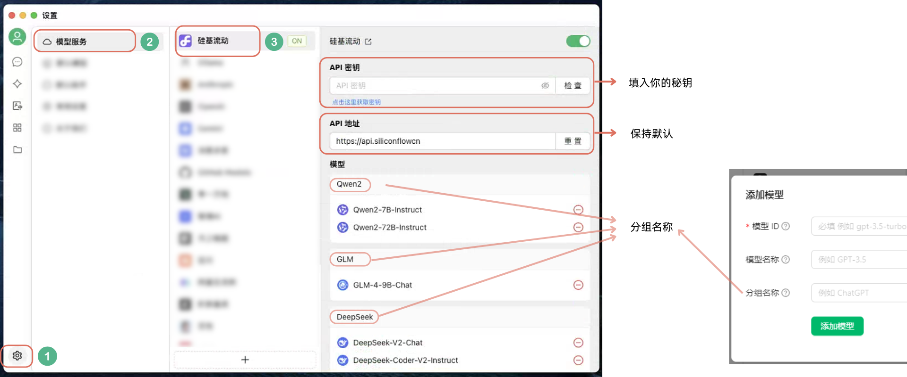

# 在 CherryStodio 中使用 SiliconCloud API

## 下载、安装CherryStudio

1. 访问[CherryStudio官网](https://cherry-ai.com)或官方[GitHub项目页面](https://github.com/kangfenmao/cherry-studio)下载。
2. 安装：
   - mac端：
     1. 下载完成后打开安装包；
     2. 将Cherry Studio拖入Applications文件夹；
     3. 打开启动台，等Cherry Studio的logo出现后点击打开；
     4. 在弹出窗口中点击打开；
     
  
  - Windows端：直接安装即可，无特殊注意事项。

## 获取SiliconCloud的API Key

1. 登录[SiliconCloud](https://account.siliconflow.cn/login)（已登录跳过此步）；
2. 登录后点击左侧侧栏菜单中的“API秘钥”标签（或[点此直达](https://cloud.siliconflow.cn/account/ak)），在该页面左上角点击“新建API秘钥”；

3. 新建后直接点击生成的API秘钥即可复制该秘钥；
4. 获取成功后保存备用。

> **❗️** 请妥善保管您的API Key，如有泄漏请在令牌页面删除该Key并重复上述步骤重新生成。

## 配置CherryStudio

1. 打开CherryStudio，点击左下角设置按钮；
2. 在硅基流动配置页面下的“API秘钥”输入框输入您的API Key；
3. API地址保持默认无需修改，如有误删误改的情况，点击输入框后的“重置”按钮即可；
4. 如果模型列表当中没有你需要的模型可手动添加：
  1. 进入“[模型广场](https://cloud.siliconflow.cn/models)”页面；
  2. 点击你想使用的“文本对话”模型的卡片，在右侧弹出页面模型名称后点击复制按钮即可复制该模型名称；
  3. 回答CherryStudio当中，点击配置页面最下方的“+”，将复制好的名称粘贴在“模型ID”栏；
  4. “模型名称”即对话页面模型选择列表当中的模型的展示名称，不懂建议保持默认；
  5. “分组名称”即配置界面模型列表的分组，可填入已有模型分组名称，也可新建分组，按自己需求设置，不懂建议保持默认；
  6. 填写完成后点击添加模型即可。
  
5. 配置完成后点击侧栏聊天气泡icon到对话界面选择模型使用即可。
