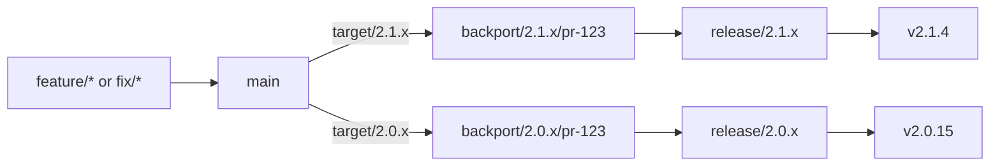

# Release Workflow

Cherry Studio's release strategy and maintainer operations live in this document. See [Branching Strategy](./branching-strategy.md) for contribution entry points.

> **Rollout:** Commitlint, minor-line backports, reviewed preparation, exact-head builds/publication, Latest selection, and version-owned metadata synchronization are implemented. Routing remains in `exact-version` mode until storage-contract CI and activation checks are complete. Use the [active exact-version runbook](#exact-version-runbook-active) for production operations; the version-line model below describes the staged replacement.

Cherry Studio is adopting a simplified [GitLab Flow](https://about.gitlab.com/topics/version-control/what-is-gitlab-flow/) for versioned desktop releases. All development converges on `main`; supported release branches receive only selected fixes from `main`. We do not use a separate `develop` branch, merge all of `main` into a release branch, or merge a release branch back into `main`.

This workflow maintains exactly two minor release lines:

- **Current**: the latest stable minor line.
- **Previous minor**: the immediately preceding minor line.

For example, while `2.1.x` is current, `2.0.x` is the previous minor. When `2.2.x` becomes current, `2.1.x` moves to previous-minor maintenance and `2.0.x` reaches end of life.

## Branch and Version Model

| Ref | Lifetime | Purpose |
| --- | --- | --- |
| `main` | Permanent | Integration point for all features, fixes, refactors, and release tooling changes |
| `release/2.1.x` | Until the line reaches end of life | Current stable line; accepts reviewed backports and release metadata |
| `release/2.0.x` | Until the line reaches end of life | Previous-minor maintenance line; accepts a narrower set of reviewed backports |
| `backport/2.0.x/pr-123` | Until its pull request closes | Isolates one source pull request for review against one release line |
| `v2.0.15` | Permanent | Identifies the exact immutable commit and artifacts for a published release |

Release branches express compatibility and support policy. Tags express exact published versions. Pull requests therefore target a release **line**, such as `2.0.x`, while a GitHub milestone on each **backport PR** schedules that line's change for an exact release, such as `v2.0.15`. The source PR may target two lines; its single milestone cannot schedule both backports.



## Change Classification

Commit type, severity, backport target, and exact release are separate decisions:

| Concern | Representation | Example |
| --- | --- | --- |
| Change intent | Commit or pull request type | `fix(chat): preserve attachments after retry` |
| Release urgency | `fix` or `hotfix`, judged by maintainers | `hotfix(database): prevent startup data loss` |
| Affected release lines | Explicit target labels | `target/2.1.x`, `target/2.0.x` |
| Scheduled release | GitHub milestone | `v2.0.15` |
| Backport state | Per-line status labels | `backport-open/2.0.x`, `backported/2.0.x` |

Use concrete version labels rather than aliases such as `target/current`. Concrete labels remain auditable after the supported lines advance.

### Normal Bug Fixes

Use `fix(<scope>): <description>` for a defect that can follow the normal patch-release schedule. A normal fix may still be backported when it applies cleanly, has sufficient value for users of the older line, and does not introduce disproportionate compatibility risk.

Examples include:

- A partial feature failure with a reasonable workaround.
- A low-frequency provider or platform edge case.
- A visual or interaction defect that does not block a core workflow.
- A regression that can wait for the next scheduled patch release.

### Critical Bug Fixes

Use `hotfix(<scope>): <description>` only when both conditions below are true:

1. The defect has at least one critical production impact:
   - Security or privacy exposure.
   - User data loss, corruption, or unrecoverable state.
   - Application startup, installation, sign-in, or update failure.
   - A core workflow is unavailable to a significant set of users without a reasonable workaround.
   - A severe regression was introduced in a supported release line.
2. The fix cannot wait for the next normal patch-release window and requires expedited release handling.

`hotfix` describes release urgency, not branch applicability. A critical fix that affects only the current line receives only `target/<current-line>`. Conversely, a normal `fix` may target both supported lines when maintainers approve the backport.

Do not use `fix!` to mean critical. The `!` marker denotes a breaking change. Release-pipeline changes normally use `fix(release-workflow)`; they use `hotfix` only when a shipped installation or update path is broken and expedited product release handling is required.

## Commit and Pull Request Linting

Commitlint validates local commit messages and non-draft pull request titles; it cannot determine whether the underlying incident is genuinely critical. Semantic eligibility remains a release-policy decision.

The allowed commit types are:

```text
build, chore, ci, docs, feat, fix, hotfix, perf, refactor, revert, style, test
```

The repository extends `@commitlint/config-conventional` with these project-specific rules:

```javascript
{
  'type-enum': [
    2,
    'always',
    ['build', 'chore', 'ci', 'docs', 'feat', 'fix', 'hotfix', 'perf', 'refactor', 'revert', 'style', 'test']
  ],
  'scope-case': [2, 'always', 'kebab-case'],
  'subject-empty': [2, 'never'],
  'header-max-length': [2, 'always', 100],
  'breaking-change-exclamation-mark': [2, 'always']
}
```

Both `fix` and `hotfix` map to a SemVer patch change. The target workflow also requires metadata and maintainer review that commitlint cannot express:

- A `hotfix` pull request must name at least one supported `target/<minor-line>`.
- Its description must identify the production impact and explain why the normal release window is insufficient.
- It must reference the incident or issue and include a regression test, or explain why an automated test is not possible.
- A release maintainer must approve its urgency and every requested backport target.

When pull requests are squash-merged, the pull request title is the authoritative final commit header and must pass the same commitlint rules. The `prek` `commit-msg` hook provides local feedback, and the **Commitlint** workflow revalidates every non-draft pull request title, including title edits. Critical impact, urgency, and regression coverage remain maintainer review decisions. No additional PR-description or severity-label validation workflow is planned.

## Backport Flow

1. Create the change from `main` and open a pull request targeting `main`.
2. Classify its intent and severity. Request each affected supported line with an explicit `target/<minor-line>` label.
3. Merge the reviewed and tested change into `main` first.
4. For every approved target line, create one backport branch and pull request from the current head of that release branch.
5. Apply the source pull request's complete intended diff. Do not assume that a GitHub merge commit alone represents squash- or rebase-merged changes.
6. Adapt conflicts for the older line without importing unrelated `main` changes. Automation must fail closed rather than resolve semantic conflicts automatically.
7. Run the target line's CI and review the resulting diff before merging the backport pull request.
8. Record the result on the source pull request with a per-line status label.

The default unit of review is one source pull request backported to one release line. This keeps provenance, CI, reverts, and failure handling independent. Emergency batches may combine fixes only when every source is recorded explicitly and remains independently auditable.

## Release Flow

The minor-line release flow is implemented but remains inactive pending storage-contract CI and activation checks. The flow for each supported line is:

1. Select the fixes for the next exact version and assign its milestone.
2. Resolve every requested backport as accepted, deferred, rejected, or blocked.
3. Freeze the release-line commit and generate the signed, DCO-signed version metadata commit.
4. Run CI and all platform builds against that exact commit.
5. Create or update the draft release only when its branch, version, tag, and workflow SHA agree.
6. Inspect the artifacts and approve publication through the protected release environment.
7. Publish an immutable version tag. Any later fix receives a new patch version.

Publishing an older maintenance release must not overwrite the current version recorded on `main`. Release history and update metadata therefore need per-version ownership. The default stable channel may upgrade users from the previous minor to the current minor, including `2.0.x` to `2.1.y`. If the product explicitly promises minor-line pinning, each supported line also needs a distinct update channel; maintaining two release branches alone does not create that promise.

## Persisted Storage Contract

Patch releases freeze the persisted storage contract. They must not add or modify Drizzle migrations, database schema, preference keys, persisted value types, or persisted value semantics. This rule freezes the on-disk contract, not its implementation: a patch may fix queries, transactions, serialization, validation, defensive reads, or documented preference behavior when existing stored data remains compatible. Do not evade the freeze by moving new durable state into a cache, JSON file, or another persistence mechanism.

A lossless, idempotent repair over the existing schema requires explicit approval from the data owner and upgrade-path tests. A fix that requires a new persisted contract ships in the next minor release. If it cannot wait, cut an expedited minor instead of weakening the patch contract. Classifying a change as `hotfix` does not override this rule.

At each minor cut, the older line's database migration chain must be an exact prefix of every later supported line's chain. For example, if `2.0.x` contains migrations `A, B`, then `2.1.y` may contain `A, B, C, D`. Because the `2.0.x` schema remains frozen after its branch cut, upgrading from `2.0.x` to `2.1.y` applies only `C, D` and follows the same forward migration path as a fresh `2.1.y` installation.

## Backport Policy

| Change | Current line | Previous minor |
| --- | --- | --- |
| Security or data-integrity fix | Required when affected | Required when affected |
| Critical crash or core-workflow regression | Normally backport | Backport after compatibility review |
| Normal bug fix | Backport when low risk and valuable | Backport selectively |
| Performance improvement | Backport only with measured benefit and low risk | Normally do not backport |
| Feature or breaking change | Release through the appropriate future version | Do not backport |
| Refactor | Do not backport independently | Do not backport |
| Dependency update | Backport only for a concrete fix or security need | Backport only when necessary |
| Database or preference implementation fix | Backport only when the persisted contract is unchanged | Same, with compatibility review |
| Database or preference contract change | Ship in the next minor or an expedited minor | Do not backport |

## Release-Line Lifecycle

The reviewed configuration distinguishes current, previous, and an optional candidate line. A candidate is the next minor under preparation, not a third supported stable line. When its first stable version is published:

1. Promote the candidate branch, previously cut from the selected `main` commit, to current.
2. Move the former current line into previous-minor maintenance.
3. Mark the former previous-minor line end of life.
4. Stop accepting new target labels and automated backports for the end-of-life line.
5. Keep its published tags and artifacts immutable.

Security support beyond the two-line window is an explicit release-team exception, not an implicit extension of the normal maintenance policy.

## Versioned Workflow Invariants

- Every product fix lands in `main` before it is backported.
- Release branches accept changes only through reviewed pull requests.
- Never merge all of `main` into a supported release branch.
- Never merge a release branch back into `main`.
- Backport targets are explicit; automation does not infer them from the latest draft release.
- Conflicted backports require human adaptation and target-line testing.
- Builds, tags, and publication are bound to the same exact commit.
- Published version tags never move.
- Patch releases do not change database or preference storage contracts.
- Every supported older migration chain is an exact prefix of later supported chains.
- Only the current and immediately previous minor lines receive routine maintenance.

## Implementation Status and Routing

The version-line model, label-driven backports, preparation, builds, publication, and metadata synchronization are implemented behind `.github/release-lines.json`. The checked-in mode is `exact-version`; existing release operations below remain active. **Do not enable `minor-line` until storage-contract CI and activation checks are complete.** This configuration selects exactly one release route; it is not a fallback between two competing destinations.

After the activation checks, an example configuration would be:

```json
{
  "mode": "minor-line",
  "current": "2.1.x",
  "previous": "2.0.x",
  "candidate": "2.2.x"
}
```

Use `null` when there is no previous or candidate line. Lines must be distinct and ordered; previous is older than current, and candidate is newer. The immediately preceding released minor is selected by maintainers, including across a major-version transition. Unknown lines and retired lines cannot receive new automatic backports. Configuration is read from the repository's current default branch, so stale workflow retries cannot revive a retired target.

A push changing this file in minor-line mode provisions `target/<line>` labels for current, previous, and candidate. It does not create release branches or delete old labels. Existing tags, branches, and label history are preserved for audit.

## Label-Driven Backport Operations

These operations apply only in `minor-line` mode:

| Event | Action |
| --- | --- |
| Add `target/2.0.x` before the source merges | Wait for merge into `main` |
| Merge the source, or add a target after merge | Create one `backport/2.0.x/pr-123` PR targeting `release/2.0.x` |
| Repeat the event | Reuse the matching PR; never overwrite human adaptations |
| Remove a target before preparation | Do not create its backport |
| Remove a target after a PR exists | Preserve that PR; close it explicitly to withdraw it |
| Backport PR opens, closes, reopens, or merges | Reconcile the source's per-line status from the current PR state |
| Conflict or preparation failure | Mark that line failed; other target lines continue |
| Manually rerun with `source_pr` and `line` | Retry preparation, or reopen the existing closed PR without resetting its branch |

Status labels are `backport-open/<line>`, `backported/<line>`, and `backport-failed/<line>`. They reflect PR state; adding a status label manually does not establish that code was backported. The engine reads current metadata, verifies source provenance, and never uses a status label to skip preparation. Existing PR lifecycle can still be recorded after the line reaches EOL, but new work and reopening via retry require a supported line and the target label.

Both `fix` and `hotfix` use explicit targets. A target requests a reviewed backport; it does not authorize bypassing compatibility review or directly updating a release branch. The engine has no dependency on a draft GitHub Release.

Backport preparation uses trusted scripts against an isolated temporary worktree. It preserves the complete intended source patch for merge, squash, and rebase merges, and rejects conflicts instead of guessing. Source version changes and changes to generated release metadata require manual adaptation. Backports preserve source release notes in both their commit message and PR body but do not regenerate version metadata; Pre Release owns that per-version operation. Preserve the release-note block when squash-merging a backport so preparation can collect it from Git history.

Each generated commit is GitHub Verified and DCO-signed off. If a commit exists but PR creation failed, a retry checks its signature, source, parent, and exact patch tree before opening the PR. An unrecognized orphan branch is preserved for manual recovery. No retry force-pushes an existing branch.

After a conflict, create or repair the standard backport branch from the target line, apply only the source change, and add exactly one `<!-- release-backport-source-pr: 123 -->` marker on its own line. Use a same-repository PR with a matching head and base. Its lifecycle events then maintain source status automatically. Assign the exact version milestone to that backport PR and wait for its CI and review before merging.

For retry, run **Backport Release Hotfixes** from the default branch with `source_pr=123` and `line=2.0.x`. Keep the source's target label present. Reopening preserves the previous work and requires the existing branch to still exist; recover a deleted branch manually.

## Minor-Line Preparation and Builds (Inactive)

After activation, run **Pre Release** from `main` with an explicit `line` and `version`:

| Intent | Inputs | Source and result |
| --- | --- | --- |
| Next maintained patch | `line=2.0.x`, `version=patch` or `2.0.14` | Freeze `release/2.0.x`; collect notes since its own latest published version |
| First candidate | `line=2.2.x`, `version=2.2.0-rc.1` | If the configured candidate branch is absent, cut it from the frozen dispatch SHA on main |

Current and previous lines must already exist and prepare stable patches only. A candidate's first version must be explicit. The new version must advance the source package version and the published baseline, belong to the selected line, and have no existing release or tag. Different lines select their own highest published semantic version, not the most recently published release across the repository.

Preparation freezes the source SHA and baseline once, then opens `release-prep/<line>/v<version>` against `release/<line>`. Only the existing release metadata files are submitted; there is no additional preparation record or marker protocol. A fresh job validates the artifact against the frozen source before creating a GitHub Verified, DCO-signed commit. The workflow never commits metadata directly to the maintained release branch.

Review the bilingual notes and merge the preparation PR through normal review, conflict resolution, and CI. Later source-branch progress or unrelated draft releases do not invalidate the frozen preparation. **Auto Release Build** selects the unpublished package version on the supported line after successful push CI and dispatches **Release** for that exact head, all platforms, and both editions. Published versions, stale CI, and a candidate branch cut still carrying main's previous-line version do not trigger a build.

A later backport may rebuild the same unpublished version after CI; it does not require another preparation PR. If its user-facing notes change, update the bilingual notes, stable history, and generated manifest as needed in an ordinary reviewed metadata PR. Pre Release prepares a new higher version, not a same-version refresh. All-platform rebuilding replaces the draft artifacts and moves only the unpublished draft tag after upload; a single-platform retry still requires the unchanged tagged SHA.

The generated changes section uses the latest published semantic version below the target on its own line, or the current line for the first candidate. Preparation, builds, and publication share `release-state-release/<line>` within each minor line. Exact-version operations retain their existing repository-wide lock.

Retries never force-reset preparation branches. If a previous attempt left a branch without a PR, inspect its signature, source, and metadata, then recover the PR manually; a conflicting or unknown branch is preserved. Activation still requires a production smoke test for permissions, branch protection, signed API commits, and CI propagation.

## Minor-Line Publication and Metadata Sync (Inactive)

After a successful all-platform **Release** build, **Publish Release** requires approval through the `release` Environment before acquiring the line's lock. It uses the package version at the approved build SHA, not the branch name, as the exact tag. The existing publication check binds the branch, tag, draft, and successful all-platform build to that SHA; published releases are never rebuilt or retagged.

Assign the exact `v<version>` milestone to each backport PR scheduled for this release. Publication reports scheduled PRs that remain unmerged or whose merge commit is absent from the approved build. Closing a PR without merging does not silently fulfill its milestone: remove or move the milestone when deferring or rejecting it. PRs scheduled for another version or another line do not block publication. A `target/<line>` label requests a backport but does not schedule an exact version; unscheduled requests remain a maintainer triage responsibility. Status labels are not evidence that a fix is included.

Minor-line publication explicitly leaves Latest unchanged. A separate short `release-latest` job then selects the highest published stable semantic version across the repository and marks it Latest using GitHub's [release API](https://docs.github.com/en/rest/releases/releases#update-a-release). Publishing an older-line patch later cannot take Latest from a newer version. Prereleases and preview releases are excluded; a candidate's first stable release becomes eligible immediately, followed by the reviewed role promotion described above. If this job fails, publication may already have succeeded: rerun only the failed job, not the build or publication. A pending Latest job may be replaced by GitHub concurrency, but its successor recomputes the same repository-wide result.

**Post Release** reads the immutable published tag and opens `release-sync/v<version>` against a snapshot of main. For a stable release it merges only that version's history entry, preserving other versions and sorting by semantic version. It updates `package.json`'s version and bilingual builder notes only when the published version is higher than main's version; other dependencies and build settings stay on main. When advancing, it regenerates the product manifest from main instead of copying the release line's older feature inventory. Prereleases do not enter stable history. An older patch therefore adds history without replacing main's newer version, notes, or manifest.

Metadata PR creation uses the shared `release-state` group; normal review and Git merge conflicts handle later main changes or overlapping sync PRs. No automatic refresh loop or forced reset is added for minor-line sync branches. If a failed attempt leaves a branch or a closed PR, inspect and recover that PR manually. Open or merged sync PRs are not duplicated, and normal signed/DCO commit requirements remain in effect.

## Remaining Multi-Release Work

| Workflow | Required change before activation |
| --- | --- |
| CI | Enforce the patch storage contract and migration-chain compatibility on prepared releases |
| Activation | Bootstrap protected release branches and tooling, verify credentials/CI propagation, smoke-test both lines, and switch the reviewed configuration |

GitHub App/PAT writes or explicit workflow dispatch must propagate automation into CI; status-label writes must not recursively enqueue backports. The current engine uses the existing `TOKEN_GITHUB_WRITE` credential for signed commits, publication, and PRs.

Finish active exact-version releases and their metadata synchronization before switching. Establish protected maintenance branches from their published version commits and backport the release tooling and CI branch filters before activation; dispatching Release from a branch uses that branch's workflow and scripts. Validate both lines, then update the reviewed configuration. Do not import newer product code from main to bootstrap an older line, and do not rename or move published tags.

## Exact-Version Runbook (Active)

The rest of this document describes `mode: exact-version`. Its `release/v<version>` names, unique-draft selection, aggregate backports, and repository-wide release lock remain in effect until the multi-release work above is complete.

## Workflow Overview

| Stage | Source | Workflow | Result |
| --- | --- | --- | --- |
| Preview | Any same-repository branch | **Preview Release** | Creates an isolated draft GitHub Release for internal testing |
| Prepare | `main` | **Pre Release** | Creates `release/v<version>` with a signed release metadata commit |
| Validate | `release/v<version>` | **CI** | Validates the exact release branch commit |
| Dispatch | Successful release-branch **CI** | **Auto Release Build** | Starts one exact-head all-platform build |
| Build | `release/v<version>` | **Release** | Creates or moves the draft tag, uploads artifacts, and composes the release body |
| Hotfix | Merged `main` pull request | **Backport Release Hotfixes** | Opens a backport pull request against the active release branch |
| Approve and publish | Successful exact-head all-platform build | **Publish Release** | Waits for the `release` Environment approval, revalidates, and publishes the draft |
| Synchronize | Published GitHub Release | **Post Release** | Opens a metadata-only `release-sync/v<version>` pull request |
| Close | `release-sync/v<version>` | **CI** | Validates the metadata pull request before it is merged into `main` |

## Internal Preview Builds

Use **Preview Release** when a maintainer needs installable packages from an unreleased feature branch for internal testing:

1. Open **Actions** → **Preview Release** → **Run workflow**.
2. Select `main` in the workflow branch selector. The workflow definition and its permissions must always come from `main`.
3. Enter a same-repository source branch in the `branch` input.
4. Select `all`, `windows`, `mac`, or `linux`, then run the workflow.
5. Open the resulting draft under **Releases** and download its installers.

Every selected platform builds both the global and China editions from the same resolved source commit. The package version is changed only inside the runner to `<base-version>-preview-<7-character-commit>`. After both editions succeed on every selected platform, the workflow creates or updates `preview-<branch>-<commit>` as a draft prerelease and uploads all installers there.

Preview macOS builds use the same signing, notarization, and application environment variables as formal releases. The build job therefore requires approval through the `release` Environment before any source-branch code runs. Preview tags do not match `v<version>` or have a corresponding `release/v<version>` branch, so they are excluded from formal release preparation, hotfix backports, and Post Release. They do not acquire the `release-state` lock and cannot be published by the formal **Release** workflow.

## Before Starting

Confirm all of the following:

- The previous release is published.
- Its `chore(release): sync v<version> metadata` pull request is merged into `main` when one was created.
- The intended `main` commit is ready to release.
- Repository secrets used by release preparation, package signing, notarization, and publishing are available.
- You have permission to run workflows and approve deployments to the `release` Environment.

Do not create the release branch, release tag, or metadata synchronization pull request by hand during the normal flow. Do not publish from the GitHub Releases page. The workflows own those operations and serialize them with the repository-wide `release-state` concurrency group.

An administrator must create the `release` Environment before this flow is enabled and configure the trusted people or teams who may approve publication. GitHub enforces the Environment's current protection rules before **Publish Release** continues.

## 1. Prepare the Release Branch

1. Open **Actions** → **Pre Release** → **Run workflow**.
2. Select `main` in the branch selector.
3. Enter one of these values for `version`:
   - `patch`, `minor`, or `major` to bump the version currently recorded on `main`.
   - An exact version such as `2.1.0`, `2.1.0-rc.1`, or `2.1.0-beta.1`.
4. Run the workflow and wait for it to finish.

The workflow freezes the selected `main` commit as the release source and verifies that it records the latest published version. If that published baseline is `v<baseline-version>`, its release-note collection base is that tag when it is an ancestor; otherwise it requires the latest commit whose full message contains the exact line `release-metadata-boundary: v<baseline-version>`. This marker always names the last published version already represented on `main`, not the requested target version. Only metadata sync commits created before that marker existed may use the legacy exact subject `chore(release): sync v<baseline-version> metadata`, optionally followed by GitHub's ` (#<number>)` squash suffix. The requested version must be strictly greater than that baseline. It then collects release notes, extracts only the three source metadata changes from the temporary preparation workspace, restores the frozen source SHA, validates the intended version, bilingual sections, and stable history, and regenerates the product manifest itself without a write token. A fresh job copies only those metadata files from the workflow artifact and creates `release/v<version>` from the frozen source commit through the GitHub API. A later `main` change does not alter or invalidate that release source. Neither the target branch nor a GitHub Release for the target tag may already exist, and the commit must be both Verified and DCO-signed off.

Release preparation may change only these files:

- `package.json`
- `electron-builder.yml`
- `resources/cherry-studio/release-history.json`
- `resources/builtin-agents/cherry-assistant/product-manifest.json`

Stable releases update release history. Prereleases leave `release-history.json` unchanged.

After the workflow succeeds, verify:

- The expected `release/v<version>` branch exists.
- `package.json` contains the same version as the branch name.
- The release commit shows **Verified** on GitHub and contains a `Signed-off-by` trailer.
- The generated English and Chinese release notes are correct.
- No release pull request against `main` was opened. The release branch stays isolated until publication.

If the workflow says the release branch already exists, stop and inspect that branch and any matching draft release. Do not overwrite or delete it until you have confirmed whether it is an active or abandoned release.

To explicitly abandon an unpublished release, first set `TAG=v<version>` and `BRANCH=release/$TAG`, then inspect `gh release view "$TAG" --json isDraft,tagName,url`, `git ls-remote --heads origin "refs/heads/$BRANCH"`, and `gh pr list --base "$BRANCH" --state open`. Continue only after confirming the release is still a draft and every related backport PR is closed. Delete the draft and its movable tag with `gh release delete "$TAG" --cleanup-tag --yes`, then delete the release branch with `git push origin --delete "$BRANCH"`. If only an orphan branch exists, skip the release deletion; if only an orphan draft exists, skip the branch deletion. These deletions are destructive and require an explicit maintainer decision.

## 2. Wait for Release Branch CI

Pushing `release/v<version>` automatically starts **CI**. After CI succeeds, **Auto Release Build** rechecks that the successful SHA is still the live branch head and dispatches **Release** with `all`. A stale CI completion is ignored, and an exact-head build is never dispatched twice.

The **Release** workflow checks GitHub Actions for a successful `ci.yml` push run whose `head_sha` exactly equals the commit being released. A successful run for an older commit does not satisfy this gate.

If CI is queued, running, cancelled, or failing, no build is dispatched. Fix or rerun CI first.

### Repairing the Initial Release Branch

The first release-branch CI run happens before a draft GitHub Release exists, so automatic backporting cannot safely select that branch yet. If code must change for this initial CI run to pass:

1. Fix the root cause through a pull request to `main` titled `hotfix: <description>` or `hotfix(<kebab-case-scope>): <description>`. The workflow adds the `hotfix` label, but it does not backport yet because there is no matching draft.
2. After the hotfix merges, create `backport/v<version>/pr-<source-number>` from `release/v<version>` and apply only the merged hotfix result. Never merge all of `main` into the release branch. Run `PR_BODY="$(gh pr view <source-number> --json body --jq .body)" node scripts/release/hotfix-release-notes.js` on that branch to apply any provided bilingual note; the command leaves release metadata unchanged for `NONE` or a missing block.
3. Push a signed, DCO-signed commit and open a pull request from that topic branch to `release/v<version>`. Put `<!-- release-backport-source-pr: <source-number> -->` on its own line in the pull request body so the lifecycle tracker automatically maintains the source hotfix's `backport/v<version>` and `backported/v<version>` labels.
4. Review the release-specific diff, merge it after CI passes, and wait for CI on the new release branch head.
5. Wait for CI on the repaired release head. Its successful completion starts the initial **Release** build automatically. Once its draft exists, later merged hotfix pull requests use the automatic backport flow.

## 3. Build or Retry the Draft Release

The initial build and every rebuild after a release-branch change start automatically when exact-head CI succeeds. Use the manual **Release** control only to retry a failed build:

1. Open **Actions** → **Release** → **Run workflow**.
2. Select `release/v<version>` in the branch selector. Never select `main`.
3. Select `all` to retry the complete build, or `windows`, `mac`, or `linux` to replace only that platform's artifacts for the exact commit already referenced by the draft tag.
4. Run the workflow and wait for every selected build job to finish.

Before building, the workflow verifies that:

- It was started from a `release/v<semver>` branch.
- The branch version matches `package.json`.
- CI succeeded for the exact branch commit.
- A matching published release does not already exist.

Each selected platform builds both the existing global edition and the China edition from the same commit. Their release asset names, package IDs, and update channels identify the edition, while their installed product name, executable, shortcut, protocol, and `userData` location stay the same. Both Windows installers also retain the existing global NSIS GUID, so installing either edition replaces the same installation instead of creating a second app. Each runner validates and stages only its own edition and platform artifacts. After every selected build succeeds, one final job downloads that complete staged set, fails on any artifact read or upload error, updates the draft by release ID, and only then creates or moves `v<version>` to the exact validated branch commit. A single-platform retry rebuilds both editions for that platform, downloads the existing draft assets, overlays the replacements, uploads the complete set, and never moves the tag. Tag movement is allowed only while the release is still a draft.

After the tag is exact, the workflow builds the GitHub Release body from the bilingual `electron-builder.yml` notes, a separator, and GitHub's generated `What's Changed` and contributor list. Stable release history remains generated during **Pre Release** in `resources/cherry-studio/release-history.json`; it is not maintained separately during publication.

Before publishing, inspect the draft release and confirm:

- The tag and release branch point to the same commit.
- All expected platform jobs succeeded.
- Global and China edition installers, archives, update manifests, blockmaps, and release notes are present.
- The version and release notes match the intended release.

Keep the release as a draft while testing or while hotfixes are still expected.

## 4. Include a Hotfix in the Active Draft

All hotfix development still starts from `main`:

1. Create a normal fix branch from current `main`.
2. Open a pull request targeting `main`.
3. Use one of these exact title forms; a scope, when present, must be lowercase alphanumeric kebab-case, the colon must be followed by one space, and the description must not be empty:
   - `hotfix: <description>`
   - `hotfix(<kebab-case-scope>): <description>`
4. If the fix is user-facing, provide exactly one component-tagged English line and one Chinese line in the pull request's `release-note` fence. Do not add bullet prefixes:

   ```text
   <!--LANG:en-->
   [Component] English description.
   <!--LANG:zh-CN-->
   [组件] 中文说明。
   <!--LANG:END-->
   ```

   Otherwise, keep `NONE` in the fence. Omitting the block is also accepted by automation, but preserving the PR template section is preferred. If a bilingual block is present, it must use the exact markers and contain Chinese content in the Chinese description.

5. Wait for review and CI, then merge the pull request into `main`.

The **Backport Release Hotfixes** workflow synchronizes the `hotfix` label from the title and separately validates any provided bilingual note. After merge, it locks release state, finds the single draft semantic-version release with a matching release branch, and applies the source PR result with trusted workflow scripts. If a backport PR is already open for that release, the new fix and source marker are appended to its topic branch; otherwise the workflow creates `backport/v<version>/pr-<source-number>`. This keeps consecutive hotfixes in one reviewed backport pull request instead of creating conflicting PRs from the same release head. Every generated commit is GitHub-verified and DCO-signed off. The workflow revalidates the draft, release head, and aggregate backport head before writing, and never commits directly to the release branch.

Track the source pull request by its labels:

| Label | Meaning | Operator action |
| --- | --- | --- |
| `backport/v<version>` | A backport pull request is open | Review the backport pull request and wait for CI |
| `backported/v<version>` | The backport pull request was merged, or the fix was already present | After a merge, wait for release branch CI and rebuild; if the workflow says the fix was already present, no rebuild is needed |
| `backport-failed/v<version>` | Automation failed before opening a pull request, or the backport pull request closed without merging | Inspect the workflow run, backport manually, or reopen the pull request |

After the backport pull request is created:

1. Confirm its base is `release/v<version>` and its source link points to the intended merged hotfix PR.
2. Review the release-specific diff and wait for the backport pull request's **CI** checks to pass.
3. Merge the backport pull request. The source hotfix PR changes from `backport/v<version>` to `backported/v<version>` only after this merge.
4. Wait for **CI** on the resulting release branch head to succeed. **Auto Release Build** then starts the required `all` rebuild.
5. Recheck the updated draft release after **Release** succeeds. Single-platform retries remain manual and are only for the exact commit already referenced by the draft tag.

Closing an automatic backport pull request without merging changes the source hotfix PR to `backport-failed/v<version>`. Reopening it restores the open `backport/v<version>` state. The workflow does not add `backport/v<version>` until an actual backport pull request exists. A preparation failure before a pull request exists sets `backport-failed/v<version>`; if a backport pull request is already open, a rerun reconciles the source PR back to the open `backport/v<version>` state.

GitHub Actions keeps at most one pending run in a concurrency group. If a burst of release-state events supersedes an older pending backport run, that source hotfix remains without `backported/v<version>`, so publication stays blocked. Rerun the cancelled backport workflow; do not bypass the publication gate.

### Resolving a Backport Failure

When the source pull request receives `backport-failed/v<version>` before a backport pull request exists:

1. Create a temporary conflict-resolution branch from the current `release/v<version>` head.
2. Apply only the hotfix pull request's intended changes. Do not merge `main` into the release branch.
3. Resolve conflicts in favor of the release branch plus the required fix; do not bring unrelated later `main` changes into the release.
4. Run `PR_BODY="$(gh pr view <source-number> --json body --jq .body)" node scripts/release/hotfix-release-notes.js` to apply any provided bilingual note to `electron-builder.yml` and, for a stable release, release history. The command is a no-op when the note is `NONE` or absent.
5. Run validation appropriate to all changed code and metadata files.
6. Create a signed, DCO-signed commit and open a pull request targeting `release/v<version>` for review.
7. After it is merged, wait for release branch CI and the automatic draft rebuild.
8. On the source pull request, replace `backport-failed/v<version>` with `backported/v<version>` and comment with the manual resolution pull request or commit.

If the workflow reports multiple active release branches, leave only the intended release active and rerun the failed workflow. If it reports no active draft release, no backport is performed.

## 5. Publish the Release

Publish only after the latest release branch commit has passed CI and an `all`-platform build for that exact commit has completed successfully.

1. Open the draft under **Releases** and confirm the tag, target commit, bilingual notes, generated changes, and artifacts one final time. Do not select **Publish release** on this page.
2. Open the **Publish Release** run created by the successful exact-head `all` build.
3. Approve its deployment to the protected `release` Environment. Stable releases are marked latest; prereleases remain prereleases and do not replace the latest stable release.

The approval job does not hold the release-state lock. After approval, the publication job acquires that lock and takes one final state snapshot. It requires the approved run, draft, tag, branch, and selected SHA to agree; rejects open release-branch PRs and every merged `hotfix` after the release branch point that lacks `backported/v<version>`; and confirms that notes and artifacts exist. This explicit hotfix gate also blocks publication when a backport job is merely queued and has not opened its PR yet. If the release branch changed while approval was waiting, publication fails closed and the new exact-head build creates a new approval. The fetched `main` SHA in the final snapshot is the hotfix cutoff for the release; a hotfix merged after it belongs to the next release. Publication makes the tag immutable for this workflow. **Release** refuses to update an already published release; any later fix requires a new version.

Publishing triggers **Post Release** automatically.

## 6. Merge the Release Metadata Pull Request

**Post Release** uses the published tag as the canonical metadata source. It computes the metadata-only delta from the release branch point to that tag, applies the delta with a three-way merge on the `main` snapshot checked out by the workflow, and opens `release-sync/v<version>`. The release branch may move or be removed after publication without preventing this synchronization. If `main` advances while the workflow is running, the pull request still contains only the metadata commit; its normal merge checks reconcile the newer base. Non-overlapping edits made on `main` are preserved, while an overlapping edit produces a pull request conflict instead of being overwritten.

The pull request may contain only:

- `package.json`
- `electron-builder.yml`
- `resources/cherry-studio/release-history.json`
- `resources/builtin-agents/cherry-assistant/product-manifest.json`

To finish the release:

1. Review the metadata pull request and confirm it contains no release-branch code or backport commits.
2. Keep its title exactly `chore(release): sync v<version> metadata`.
3. Keep the `release-metadata-boundary: v<version>` marker in its body.
4. Wait for its CI checks to pass.
5. When squash-merging, set the commit title to `chore(release): sync v<version> metadata` with only GitHub's optional ` (#<PR-number>)` suffix, and ensure the squash commit message body contains `release-metadata-boundary: v<version>` on its own line.

That squash commit is the release-note boundary used by the next **Pre Release** run. Do not start the next release until this synchronization is complete.

If the metadata files already match `main`, **Post Release** exits without opening a pull request. If a previous metadata pull request was closed without merging, use GitHub's **Re-run all jobs** control, or `gh run rerun <run-id>`, on the original **Post Release** run to reset the sync branch and create a replacement pull request.

## Failure Guide

| Symptom | Meaning | Resolution |
| --- | --- | --- |
| **Pre Release** is skipped | It was not run from `main` | Rerun it with `main` selected |
| Release branch already exists | The version has already been prepared | Inspect the existing branch and draft; do not overwrite it blindly |
| No successful CI push run found | The selected release commit has not passed CI | Wait for or repair CI on that exact SHA, then rerun **Release** |
| Automatic build was not dispatched | CI failed, the CI result was stale, or an exact-head build already exists | Repair or rerun exact-head CI; retry **Release** manually only when a build already failed |
| Branch and `package.json` versions differ | The release ref is inconsistent | Stop and correct the preparation flow; do not force a tag |
| Release is already published | Published releases cannot be rebuilt | Prepare a new version |
| Publication approval became stale | The release branch moved while approval was waiting | Use the approval run created by the new exact-head all-platform build |
| Release environment protection failed | The environment is missing or does not have the required team, self-review, and branch restrictions | Ask a repository administrator to restore the documented `release` Environment policy |
| Multiple active release branches | Backport target is ambiguous | Resolve the extra draft release state, then rerun the backport workflow |
| `backport-failed/v<version>` | Automatic preparation failed or the backport PR closed unmerged | Inspect the linked workflow run or follow the manual procedure above |
| Backport pull request closed without merging | The hotfix has not reached the release branch | Reopen the pull request or complete a manual backport |
| Published metadata conflicts with `main` | The same metadata lines changed after the release branch was cut | Reconcile those edits on `main`, then rerun **Post Release**; never replace the whole file from the tag |
| Commit is not Verified or lacks DCO | Token identity or signing failed | Fix the workflow/token configuration; never bypass the check |

## Invariants

- Build internal feature previews only with **Preview Release** from a same-repository branch; source code runs only after protected `release` Environment approval, and preview draft releases never become formal release state.
- Build from `release/v<version>` and publish only the exact approved release-branch SHA, never `main`.
- Merge every hotfix into `main` before backporting it to the release branch.
- Merge hotfixes into the release branch through a backport pull request, never through an automatic direct commit.
- Never merge all of `main` into an active release branch.
- Never publish a draft until the exact release commit passes CI and all required artifacts are present.
- Publish only through the protected **Publish Release** approval; never publish directly from the Releases page.
- Never move a published release tag.
- Never merge the complete release branch back into `main`.
- Keep the metadata synchronization pull request title and body boundary marker unchanged, squash-merge it, and finish it before preparing the next release.
