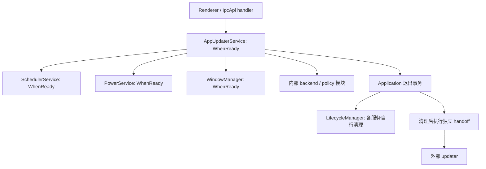

# Velopack 实施设计

> 当前代码接入说明见第 13 节；前面的接口草案不应被当作已实现 API。2026-10-10 已按确认后的 SDK 原生能力边界接入，不新增 release 服务接口。

> 状态：客户端与发布流程代码已接入，真实平台安装与性能验收待完成。配套 [接入总方案](./velopack-integration-plan.md)。
> 本文中的接口是 Cherry Studio 拟新增接口，不是对 Velopack SDK 已有 API 的声明。SDK 适配能力必须经过 P0 验证。

## 1. 设计约束与必须修正的现状

总方案负责平台范围、发布和迁移策略；本文负责实现边界。发生冲突时，以本文更具体的并发和退出契约为准。

接入前提：`Application.canQuit()` 是私有方法；更新 IPC 返回 void 且事件暴露 electron-updater 类型；主进程入口静态导入可能在 Velopack hook 前初始化应用。`shutdown()` 已改为返回共享的 `Promise<ShutdownReport>`，包含配置落盘及 stop/destroy 结果；reservation 和退出 action 仍待实现。这些都不能靠新增一个 SDK 调用解决。

必须先改进 Application 的退出协调和清理结果接口，再让更新服务使用它。不能用 `markQuitting()`、轮询私有状态或更新服务直接 `app.exit()` 绕过上游责任。

核心不变量：

1. 更新状态只有主进程的 `AppUpdaterService` 一个写入者。
2. 同一安装目录最多一个物理 SDK 操作；失效回调不能改变状态，也不能通过第二个并发操作继续写同一缓存。
3. 候选版本绑定 edition、OS、架构、渠道、安装身份及产物清单摘要，renderer 不能提交 URL 或路径。
4. 未经用户本次明确安装请求，下载缓存、日志或上次意图文件都不能触发安装。
5. 只有 Application 能承诺退出；helper 只在应用清理成功且没有系统关机请求时启动。
6. 服务销毁后，晚到 Promise 不访问容器、IPC、日志服务或已释放对象。
7. helper 移交后不再允许取消安装，也不能把同一次操作交给另一个后端。

## 2. 模块归属和依赖图

### 2.1 Ownership

| 所有者 | 拥有的资源/状态 | 创建与释放 | 不负责 |
| --- | --- | --- | --- |
| `AppUpdaterService` | 当前 snapshot、operation、SDK session、候选和 prepared handle、订阅、调度注册 | 生命周期 onInit/onAllReady 建立，onStop 先封闭入口再清理 | 不停止 Agent、不操作数据库、不强杀进程 |
| 更新能力内部模块 | 策略解析、后端适配、错误映射、纯状态转换 | service 私有对象/纯函数，不注册独立全局副作用 | 不调用 `application.get()`，不自行广播 |
| `Application` | quit holds、退出 reservation、shutdown Promise、移交事务 | 进程级；提交后活到最终退出 | 不认识 release feed、SDK 类型或下载流程 |
| 各业务服务 | 自己的任务、子进程、连接、落盘工作 | 自己的 onStop/onDestroy | updater 不按进程名替它们清理 |
| `PowerService` | 系统关机信号与 OS barrier | 既有服务生命周期 | 不负责普通更新调度 |
| SDK session | updater 原生对象、SDK 缓存锁与回调 | 由 AppUpdaterService 独占；handoff 后转交最小执行能力 | 不拥有 Cherry 用户数据 |
| 外部 updater | 包应用、平台文件替换及其日志 | 应用清理后移交，脱离 Electron 生命周期 | 不把移交成功等同新版启动成功 |
| renderer hook | snapshot 的只读投影、通知去重 | window mount/unmount | 不决定当前版本、安装资格或持久化 pending |

建议在 `src/main/services/appUpdater/` 放内部模块（拟新增）：`types.ts`、`state.ts`、`policy.ts`、`backend.ts`、`velopackBackend.ts`、`legacyBackend.ts`、`errors.ts`、`journal.ts`、`startup.ts`。保留现有 `AppUpdaterService.ts` 作为容器入口，不新增平行 UpdateManagerService，也不创建只能转发一层的服务。

`startup.ts` 是可移除更新能力的启动 hook，属于 services，而不是把所有早期代码放进 core/preboot。只在需要封装和 lint 边界时建立 barrel；不新增逻辑型 index.ts。

### 2.2 生命周期依赖

AppUpdaterService 继续为 WhenReady；同阶段显式依赖 `SchedulerService`、`PowerService`。若广播仍通过窗口类型定位，则保留既有 `WindowManager` 依赖。依赖顺序确保更新服务停止时 scheduler、power 和窗口管理仍可使用。

`PreferenceService`、`IpcApiService` 为 BeforeReady，使用阶段顺序，不加入同阶段 `@DependsOn`。`Application` 是上层协调者，不反向依赖 AppUpdaterService；只接收框架中立的退出事务。



onInit 仅探测本地安装、建立适配对象、注册有 Disposable 的订阅。网络检查在 onAllReady 后由 scheduler 或 IPC 触发。SDK 缺失使更新能力不可用，不能让聊天主流程启动失败。

onStop 顺序：设置 stopping → 增加 generation → 禁止命令 → 注销 schedule 和 power/preference 订阅 → 请求取消物理操作 → 去掉回调 → 有界 drain。未能 drain 的操作作为清理失败上报，不吞掉后继续安装。生命周期每服务 5 秒、整体 30 秒是当前上限；drain 预算应小于服务上限，并可由测试注入。

在普通停止中 dispose SDK；在已提交退出事务中，service 只释放事件和下载部分，已转移给 Application 的 handoff 能力由 Application 负责最终释放。引用所有权转移必须是一次性的，不允许 onStop 销毁 handoff 仍需使用的原生对象。

## 3. 数据模型与状态机

以下为精简 TypeScript 设计；最终 schema 是共享契约的单一来源，类型由 schema 推导。

复用现有 `AppEdition`、`SupportedPlatform` 和 `UpgradeChannel`，不重新定义同义字符串联合。edition 的运行时校验复用 `APP_EDITIONS`，渠道校验复用 `UpgradeChannel`；平台校验与 `SupportedPlatform` 保持一致。现有稳定渠道值为 `UpgradeChannel.LATEST`（`latest`），内部不另造 `stable` 渠道值。架构仅在更新支持矩阵边界收窄为 x64/arm64，不改写全局平台类型。

```ts
import { UpgradeChannel } from '@shared/data/preference/preferenceTypes'
import type { AppEdition } from '@shared/types/appEdition'
import type { SupportedPlatform } from '@shared/types/command'

type UpdateContext = Readonly<{
  edition: AppEdition
  os: SupportedPlatform
  arch: 'x64' | 'arm64'
  channel: UpgradeChannel
  installId: string
  installKind: 'velopack' | 'legacy' | 'external' | 'unsupported'
}>

type Candidate = Readonly<{
  id: string
  version: string
  context: UpdateContext
  manifestDigest: string
  releaseNotes: string
}>

type Operation = {
  id: string
  generation: number
  kind: 'check' | 'download' | 'install-preflight'
  abort: AbortController
  manualRequestIds: Set<string>
}

type UpdatePhase =
  | 'idle' | 'checking' | 'available' | 'downloading'
  | 'reconstructing' | 'cancelling' | 'ready'
  | 'install-preflight' | 'quitting' | 'unavailable'

type UpdateSnapshot = Readonly<{
  sessionId: string
  revision: number
  phase: UpdatePhase
  operationId: string | null
  candidate: Candidate | null
  progress: { stage: 'download' | 'reconstruct'; completed: number; total: number | null } | null
  capabilities: { check: boolean; download: boolean; cancel: boolean; install: boolean }
  error: UpdateFailure | null
}>
```

下载 URL、哈希、SDK UpdateInfo 和 prepared handle 只存在主进程。renderer 中的 Candidate 使用去掉 installId 等内部字段的公开投影。`candidate.id` 每次解析重新分配，不能仅用版本号：相同版本可能对应不同 edition、策略或产物。

snapshot 只在状态改变时递增 revision；每个主进程生成新 sessionId。progress 不伪造重建百分比，SDK 只给阶段时 `total = null`。进度可节流，但完成、取消、错误事件不得被节流延迟。

| 状态/事件 | 允许转换 | 后置条件 |
| --- | --- | --- |
| idle + check | checking → idle/available | 无更新是成功结果，不是错误 |
| available + download | downloading → reconstructing → ready | ready 必须有主进程可验证的 prepared handle |
| downloading + cancel | cancelling → available/idle | 物理操作结束前不能开始新下载 |
| ready + install | install-preflight → quitting | 已验证本地上下文和包，并获得退出 reservation |
| preflight 失败 | ready 或 available | 包仍有效则 ready；包失效则清除 handle |
| 渠道改变 | 失效当前 generation；回到 idle 或 cancelling | 旧 ready 立即失去安装资格 |
| 停止 | 不再对外改变业务状态 | 所有后续回调只能被丢弃 |

错误附着于可恢复状态，不另建一个丢失候选信息的万能 error 状态。普通网络错误不能把有效 prepared 包删除；本地上下文改变或完整性验证失败必须撤销其安装资格。

## 4. 函数与内部接口

### 4.1 AppUpdaterService

| 函数 | 输入/返回 | 契约 |
| --- | --- | --- |
| `getSnapshot()` | 无 → 公开 snapshot | 同步，不触发网络 |
| `requestCheck(requestId, origin)` | → operation receipt | 同 context 检查合并；manual 加入已有操作的通知归属 |
| `requestDownload(candidateId)` | → receipt | 校验候选与状态；已下载同目标返回现状；不允许旧 ID |
| `requestCancel(operationId)` | → accepted/unsupported/stale | 只取消对应操作；不等于 Promise 立即结束 |
| `requestInstall(candidateId)` | → receipt | 同目标双击复用同一 preflight；只有这一入口可形成安装意图 |
| `invalidateContext(next)` | 内部 → void | 同步失效 generation 和候选，然后请求取消；不等待取消才禁用按钮 |
| `finishOperation(token, result)` | 内部 → void | 唯一 async 结果提交入口，先验证 token 归属 |
| `publish(next)` | 内部 → void | 同步提交 revision 后广播；广播失败不回滚业务状态 |

operation receipt 表示请求已受理，不表示检查/安装成功。所有后台 Promise 由 service 持有并挂 catch；scheduler 回调只在任务结束后重新排程，避免 finally 中 resurrect 已停止服务。

### 4.2 后端适配

```ts
interface UpdateBackend {
  probe(): Promise<InstallDescriptor>
  resolve(target: ReleaseTarget, signal: AbortSignal): Promise<ResolvedTarget>
  prepare(target: ResolvedTarget, sink: ProgressSink, signal: AbortSignal): Promise<PreparedUpdate>
  verifyPrepared(prepared: PreparedUpdate, signal: AbortSignal): Promise<void>
  createHandoff(prepared: PreparedUpdate): HandoffPort
  drain(deadline: number): Promise<void>
  dispose(): void
}

interface HandoffPort {
  launch(): Promise<{ kind: 'started' }>
  dispose(): void
}
```

`InstallDescriptor` 包含安装类型、稳定身份与 capabilities；`ResolvedTarget`/`PreparedUpdate` 为主进程不透明对象，包含确切 SDK 数据、校验依据和上下文。不得允许外部构造任意路径替代 handle。

`createHandoff()` 只创建独立能力，不启动 helper，不退出应用；`launch()` 才发生不可撤销外部副作用。launch 的 SDK 返回值若不能区分未启动/已启动，结果视为 unknown，不盲目重试。该契约是 P0 对 SDK 的验收要求，不是声称 SDK 具备两阶段 API。

prepared 验证须防止缓存被清理/替换；验证到应用之间依赖 SDK 的锁定和最终校验，单次 `exists()` 或预先 hash 不能解决 TOCTOU。外部修改、跨进程锁冲突映射为失败，不能强行删锁。

backend 不拥有重试定时器，不读 Preference，不调用 Application；所有重试策略由 service 决定。不能硬套取消：不支持物理取消时进入 cancelling 并等待结束，用户界面显示实际能力。

### 4.3 纯函数

`selectBackend(descriptor)` 只按可信安装探测选后端；`validateReleaseTarget(context, manifest)` 验证目标身份；`reduceUpdateState(state, event)` 检查合法转换；`mapUpdateFailure(cause, stage)` 生成安全错误；`toPublicSnapshot(state)` 去除路径、Token 和 SDK 对象。每个函数都以输入→输出契约测试，不进行 I/O。

## 5. 异步竞态协议

service 维护单调 generation、唯一 active operation 和物理 in-flight Promise。每次 await 返回、每个 SDK callback 都必须经过 `isCurrent(token)`：service 未 stopping、generation 相同、operationId 相同且未撤销。引用快照而不是在回调中重新读取可变候选。

```ts
const token = beginOperation('download', candidate)
try {
  const prepared = await backend.prepare(token.target, progress => {
    if (isCurrent(token)) commitProgress(token, progress)
  }, token.abort.signal)
  if (isCurrent(token)) commitPrepared(token, prepared)
} catch (cause) {
  if (isCurrent(token)) commitFailure(token, cause)
} finally {
  releasePhysicalOperation(token)
}
```

`releasePhysicalOperation()` 只清除属于 token 的占用，不清除较新操作；清理发生前不准启动同缓存的新 writer。丢弃 stale 结果不等于可以删除 SDK 刚写完的共享基包；清理交由 SDK 缓存规则。

| 竞态 | 确定行为 |
| --- | --- |
| 自动检查未完成，用户点击检查 | 合并同 context 的检查，将 manual requestId 加入归属集合；完成后每个窗口至多一次通知 |
| 检查 A 慢于渠道切换后的检查 B | A 结果和错误均不更新 B；物理 SDK 不支持并发时 B 等待 A drain |
| 下载完成与取消同时到达 | 以同步状态提交顺序为准；先收到取消则完成回调不能生成 ready |
| 渠道切换时 SDK 不能取消 | 立即撤销候选资格，等待旧操作物理结束再检查新渠道 |
| ready 后文件被删 | verifyPrepared 失败，清除 handle，允许重新下载，不启动 helper |
| 两窗口同时安装 | 同 candidate 合并；不同 candidate 返回 UPDATE_BUSY/STALE_CANDIDATE |
| 普通退出发生在 preflight | Application 拒绝后续 reservation；普通退出绝不变成更新退出 |
| service stop 与网络返回同时发生 | stopping/generation 检查使所有提交失效；不得在 finally 重新排程 |
| 启动 snapshot 请求与事件乱序 | renderer 按 sessionId/revision 只接收新状态；订阅先建立，再请求 snapshot |
| 已下载后服务器撤回版本 | 本期不提供即时远程撤销；已校验缓存可离线安装，后续联网检查以现有 feed 结果为准 |

requestId 用于通知与幂等，operationId 用于实际工作，generation 用于上下文失效，revision 用于 UI 顺序，四者不能混用。

## 6. Application 退出事务

### 6.1 上游新增契约

```ts
type ShutdownReport = {
  clean: boolean
  bootConfigFlushed: boolean
  stop: TeardownSummary
  destroy: TeardownSummary
}

interface QuitReservation {
  release(): void
  commit(action: ShutdownAction): { kind: 'accepted' }
}

interface ShutdownAction {
  id: string
  deadline: number
  run(): Promise<void>
  dispose(): void
}

// 拟新增；shutdown 已实现，报告复用 lifecycle 的 TeardownSummary。
tryReserveQuit(reason: 'update'): QuitReservation | QuitDenied
shutdown(): Promise<ShutdownReport>
```

Application 从正常态同步检查 holds、普通退出状态和现有 reservation，然后原子地取得 reservation。无需把私有 `canQuit()` 公开成另一个存在 TOCTOU 的检查函数。

reservation 生效期间，新申请的 preventQuit 必须明确失败，相关调用方只有取得 hold 后才能开始关键工作。审计 renderer 的 Application_PreventQuit 及主进程调用方，传播错误并中止尚未开始的任务；不能静默返回一个无效 hold。release 在未 commit 时恢复 admission，幂等；commit 后 release 无效。

`shutdown()` 多次调用已返回同一实际清理 Promise/结果，重复 will-quit 也会阻止退出并等待清理。配置落盘失败、stop/destroy timeout 或失败均使 clean=false。当前仍在清理结尾关闭 logger；接入退出 action 时，须将关闭 logger 移到事务结束，不能在已关闭 logger 后执行 handoff。

### 6.2 安装提交顺序

1. service 执行可取消的本地 preflight：核对当前 context 与 candidate、验证 prepared 包、检查身份与空间，并创建尚未启动的 HandoffPort。不新增安装前联网授权。
2. await 返回后重查 operation token；同步取得 Application reservation。此时冻结 candidate，拒绝新更新命令和关键业务 admission。
3. 将只持有 immutable prepared 数据、journal writer 和 HandoffPort 的 ShutdownAction 转交 Application。不得捕获 service 或容器实例。
4. 在 IPC 返回 accepted 后下一轮事件循环触发正常退出；IPC 回包不是执行许可，窗口提前关闭也不取消已提交的用户意图。
5. 若窗口 close veto 阻止到达 will-quit，有限等待后撤销尚未进入清理的事务、释放 reservation，恢复可操作状态并报告 QUIT_BLOCKED；此时 helper 尚未启动。对应延迟 close 事件用事务 ID 防止二次提交。
6. will-quit 后 Application 等待全部服务清理。此时 AppUpdaterService 已停止，所以不能再次调用其 backend 方法。
7. clean=true、本地安装事务仍有效且无系统关机标记时，执行独立 action；启动 helper 后立即完成正常退出。clean=false 时不运行 action，记录失败后退出；下次启动继续旧版本并显示诊断。
8. 最后释放 action、关闭 logger。整体 watchdog 触发时不再启动 helper。

系统关机优先：PowerService 在执行自身 shutdown handlers 前同步通知 Application 锁存 OS shutdown 原因，而不是只在 updater 的订阅回调里设置标志。Application 在服务停止后仍保留此原因。若 helper 已启动后 OS 关机，依赖 SDK 的中断恢复，不能承诺撤销已开始安装。

### 6.3 不可撤销副作用与超时

每个 action 有应用整体退出预算内的短 handoff 预算。Promise.race 超时不会取消原生 launch；unknown 状态必须记录并退出，不能重试或正常 relaunch，防止两个安装器。实现前验证 SDK 是否能可靠确认 helper 启动、是否允许清理后独立调用及 helper 的超时强杀行为。

Application 不在清理失败后“恢复全部服务并继续聊天”，因为部分资源已销毁。失败但确定 helper 未启动时，保留旧程序并让用户下次正常启动；若要自动重启旧版，必须另行验证，没有该能力也不影响明确的恢复指引。

如果锁定 SDK 必须在生命周期清理前启动不可撤销 helper，或无法维持独立 HandoffPort，本方案在 P0 阻断，先寻求上游能力补齐。不能用缩短 shutdown 时间代替正确的退出协议。

## 7. IPC 与 renderer 契约

继续使用现有 app 命名空间，新增 snapshot 和取消命令，修改安装参数。所有输入使用 strict schema，禁止额外 URL/path/SDK 字段。

| 路由/事件 | 输入 | 输出 |
| --- | --- | --- |
| `app.updater.get_state` | void | PublicUpdateSnapshot |
| `app.updater.check_for_update` | `{ requestId }` | `{ operationId, disposition: 'started' \| 'joined', snapshot }` |
| `app.updater.download` | `{ candidateId }` | operation receipt |
| `app.updater.cancel` | `{ operationId }` | `{ disposition: 'accepted' \| 'unsupported' \| 'stale' }` |
| `app.updater.quit_and_install` | `{ candidateId }` | install-preflight receipt |
| `app.updater.release_notes.get` | 现有输入 | 现有输出，保持独立于正在下载的候选 |
| `app.updater.state_changed` | 主进程发送 | PublicUpdateSnapshot |
| `app.updater.operation_completed` | 主进程发送 | `{ sessionId, operationId, requestIds, outcome, error }` |

原先 available/downloaded 等事件及 Error/UpdateInfo/ProgressInfo 类型在一次客户端代码变更内同步迁移；同一进程不同时让新旧 hook 弹两次通知。跨版本运行的是各自完整程序，因此无须永久维护 renderer 的两套协议。legacy 后端也转换成统一 snapshot。

参数/权限/当前状态拒绝通过现有 IpcError 返回；已受理操作的异步失败通过 snapshot 和 operation_completed 返回。禁止先广播错误再让 UI 对同一请求额外 toast 一次。

renderer 先订阅，再读取 snapshot；同 session 只接受更大 revision，不把迟到 response 覆盖新事件。重新连接主进程时清空旧 session 的缓存，接受新 session；不比较不同 session 的 revision 数值。通知按 `(sessionId, operationId, outcome)` 去重，manual requestId 只归属发起窗口；窗口关闭后主进程继续检查，但不会把其结果当成别的窗口手动操作。

UI 将 downloading/reconstructing/cancelling/ready 分开显示；无法提供进度时显示阶段。按钮禁用仅是体验保护，主进程必须再次验证 candidateId 和状态。全部字符串经 i18n；后台检查失败仅更新状态与日志，不持续弹错误。

## 8. 现有 release 服务与静态产物适配

本期不修改 release 服务，不新增 resolve/authorize endpoint、policy revision 或安装授权 lease。安装前在线授权并非 Velopack 接入的必要条件，还会让已下载更新依赖网络，因此不采用。

版本检查继续使用现有 feed、渠道和请求头，由客户端适配模块把已经选定的目标版本转换为内部 `ReleaseTarget`。复用现有检查能力时关闭其自动下载和退出安装；它只读取元数据，不能同时成为第二个安装后端。

发布流水线把对应平台、架构、edition、渠道的 Velopack 索引及完整/差分包作为普通附件上传 GitHub Release。客户端根据已选定版本定位固定 tag 下的索引，验证索引目标与 context、版本一致，再交给 SDK。不能再次查询 GitHub latest 以替换现有服务选择的目标。

`ReleaseTarget` 由本地主进程形成，包含目标版本、context、固定索引地址和清单摘要；这些不是要求现有服务新增的返回字段。索引中的每个包地址必须解析到实际托管的 Release asset；若 SDK 默认拼接同目录 URL，而差分链跨 tag，则由发布步骤提供兼容的附件集合或客户端 source 适配解决，并测试缺链时全量回退。不能假设 GitHub Release 索引可直接当普通目录使用。

P0 验证锁定 JS binding 能否读取该固定版本索引、固定目标及实际包 URL；需要适配时优先使用其已有 source 能力。若只能选最新版本且无法保留现有目标选择，则暂停该接入路径并记录 SDK 差距，不将 release 服务改造列为默认前提。现有镜像仅在已同步新附件且验证地址规则后使用，未验证时不能宣称保留了新包的地区镜像能力。

安装 preflight 只校验本地上下文、已下载包的身份、完整性和可安装条件；允许在下载完成后断网安装。不保证已缓存版本能即时获知远端撤回。Application 的 deadline 仅用于退出/handoff 执行预算，不是服务端许可有效期。

HTTP 错误遵循现有契约：429/503 按既有退避处理，缺少目标附件不能解释为“无更新”。限制索引大小、格式和允许的 HTTPS 下载域；跳转到 GitHub/镜像时不转发策略服务身份头。Token 仅用于发布 CI，不嵌入客户端。

## 9. 错误分类和恢复

```ts
type UpdateFailure = {
  code: string
  stage: 'check' | 'download' | 'verify' | 'quit' | 'handoff' | 'apply'
  retry: 'automatic' | 'user' | 'never'
  recovery: 'retry' | 'redownload' | 'restart' | 'manual-install' | 'none'
  diagnosticId: string
}
```

实际 code 为闭合集合，表中给出最低集合；内部保留 cause，IPC 不传原始异常、HTTP body、Token 或用户路径。

| code | 处理 | 保留 prepared |
| --- | --- | --- |
| NETWORK / RATE_LIMITED | 检查按现有指数退避和抖动；尊重有上限的 Retry-After | 是 |
| CONTEXT_CHANGED / TARGET_MISMATCH | 撤销候选，重新检查；不自动换版本安装 | 缓存可保留，安装资格不保留 |
| STALE_CANDIDATE / UPDATE_BUSY | 拒绝命令，返回最新 snapshot | 是 |
| CHECKSUM_MISMATCH / INVALID_PACKAGE | 删除由 SDK 判定损坏的目标缓存，显式重下；不无限 delta 回退 | 否 |
| UNSUPPORTED_INSTALL / SDK_UNAVAILABLE | 禁止安装，提供可信手动下载入口 | 不适用 |
| DISK_FULL / PERMISSION_DENIED | 用户处理后重试，不自动提权循环 | 验证后再决定 |
| QUIT_BLOCKED | 清理开始前释放 reservation，恢复 ready | 是 |
| SHUTDOWN_UNCLEAN | 不启动 helper，下一启动展示恢复说明 | 是，但需重新校验 |
| HANDOFF_FAILED | 仅确认没有 helper 时可允许后续重试 | 是 |
| HANDOFF_UNKNOWN | 不重试、不启动第二 helper，下次探测实际安装 | 不推断 |
| APPLY_FAILED | 从 SDK 日志/真实版本探测恢复，不直接认定可回滚 | 由 SDK 管理 |

delta 回退只在适配器可识别的差分获取/重建失败发生；目标签名或身份不符不能用另一个目标的完整包掩盖。自动重试预算和调度归 service；用户主动重试仍须验证 candidate 与当前 context。

## 10. 持久化记录与进程边界

snapshot 和 operation 只在内存；重启后不恢复 aborted Promise。SDK 是缓存和 pending package 的权威，Cherry 仅保留一个有 schemaVersion 的诊断 journal：attemptId、源/目标版本、目标 digest、安装身份摘要、阶段、时间和安全错误码。

journal 通过注册路径访问、同目录临时文件后替换写入；写失败在 helper 启动前阻止此次移交。journal 不能作为自动安装指令，不存下载凭据或无限制执行路径。阶段建议为 locally-verified、shutdown-started、handoff-started、observed-target、failed/unknown；阶段名称仅表示已观察事实。

下次启动比较真实运行版本、安装标记和 SDK 结果：目标已运行才记录 observed-target；仍在旧版显示失败/未应用；处于无法识别布局则提供重装入口。不存在“journal 写了 handoff-started 所以一定安装成功”的推断。

禁用 SDK 启动自动应用是所有路径的前提。清理失败、系统关机或取消后遗留的完整包不能在下次启动自动安装。新版本数据库已经迁移时不自动切旧版；诊断 journal 不承担数据库恢复事务。

旧安装迁移使用单独 migration journal，增加 old/new install identity 和 cleanup 状态；不复用普通 update attempt。老卸载器删除注册项和新启动器注册的顺序必须单独验收，不通过本状态机暗中执行卸载。

## 11. 测试设计

### 11.1 工具和层次

service 测试使用仓库统一 application/Preference mocks；backend 用可控 Promise 的测试实现，能分别控制结果、进度、取消确认和迟到错误。fake timers 只测超时/退避；异步竞态使用显式 barrier，不依赖 sleep 运气。

纯函数测输入/输出；service 集成测公开 snapshot/命令结果与物理操作互斥；Application 测事件顺序和真实 reservation 逻辑；临时目录测 journal 恢复；真实平台包测 SDK、副作用、签名和文件系统行为。数据库兼容测试使用 `setupTestDatabase()`，不手写假表。

### 11.2 可直接转成测试的用例

| ID | 场景与控制顺序 | 必须断言的用户/系统结果 |
| --- | --- | --- |
| U01 | 自动 check 阻塞，manual check 加入，再 resolve | 一个真实检查结果；手动方一次完成通知 |
| U02 | A 检查挂起，切渠道，B 完成，再让 A 成功/失败 | snapshot 保持 B，A 不弹错误 |
| U03 | 下载取消先提交，再完成 prepare | 不出现 ready，安装命令被拒绝 |
| U04 | 无取消能力，切渠道后请求新下载 | 旧物理 writer 结束前新 writer 不开始；新 context 已可见 |
| U05 | 两窗口同 candidate 安装、不同 candidate 安装 | 同目标只有一个退出事务；旧目标拒绝 |
| U06 | ready 后删除/替换缓存文件 | helper 未启动；可重新下载；损坏内容不安装 |
| U07 | 安装 preflight await 中收到 stop | 不建立 reservation，不广播，不重新注册 timer |
| U08 | 先 ready，再切换渠道或安装身份 | 本地 preflight 拒绝旧候选，不启动 helper |
| U11 | 包下载校验完成后断网，再点击安装 | 本地验证通过仍可提交退出，不发起在线授权请求 |
| U12 | SDK 成功重建 ZIP，但大小/摘要不同于发布完整包；随后修改同长度字节 | 重建结果可进入 ready；安装前发现修改并拒绝移交，不把任意旧缓存当成 SDK 验证结果 |
| U09 | 广播 revision 12 后 get_state 返回 revision 11 | UI 保持 12；主进程新 session 可从 revision 1 开始 |
| U10 | 底层后台错误含 Token/HTML | IPC/UI 无敏感内容；diagnosticId 可关联脱敏日志 |
| Q01 | 已有 preventQuit hold，申请 reservation | 无 helper、无 shutdown，旧应用继续运行 |
| Q02 | 获得 reservation 后申请新的关键任务 hold | 新任务明确拒绝且未开始；release 后可正常申请 |
| Q03 | preflight 与普通退出竞争 | 只有普通退出发生，不意外安装 |
| Q04 | 窗口 veto；之后迟到 close 事件 | reservation 释放，旧事务不能再次启动 helper |
| Q05 | 两次 shutdown 调用，中间第一条尚未完成 | 两个调用均等真正清理完成，得到同一报告 |
| Q06 | 一个服务 onStop 失败或超时 | clean=false，helper 不启动；所有剩余清理按框架预算推进 |
| Q07 | updater onStop 已执行，再运行 action | 无访问已销毁 service；移交能力仍有效且只释放一次 |
| Q08 | OS shutdown 在本地校验后、handoff 前到达 | 不启动 helper，下一次启动不自动应用 |
| Q09 | launch 挂起直到 deadline，随后迟到成功 | 只存在一个 helper 请求，无重试/旧版自动 relaunch |
| Q10 | 数据迁移使退出被阻止 | 不强杀、不安装、不丢迁移数据 |
| J01 | journal 写入途中终止进程 | 读到完整旧记录/新记录或安全 unknown，不自动安装 |
| J02 | journal 是 handoff-started，实际仍旧版 | 不显示成功；新版本实际启动才显示 observed-target |
| H01 | HTTP 429/503、损坏 manifest、跨 edition URL | 正确退避；错误身份不下载；无凭据外传 |
| H02 | feed 上传一半、镜像缺包 | 旧 feed 仍有效；不把 404 当无更新 |
| H03 | 现有 feed 选 B，但 GitHub latest 为 C；差分附件跨 tag | 只准备 B；地址正确，缺链回退 B 完整包，不改选 C |
| P01 | 更新 hook 启动的最终打包 JS | 无正常窗口、单实例锁或数据库副作用 |
| P02 | Windows 被 Agent/终端/native 进程占用 | 服务正常释放；失败可诊断，不按进程名误杀别的应用 |
| P03 | macOS 签名/公证、Linux 执行权限失败 | 不报告更新成功，提供平台适当恢复方式 |
| P04 | 从 B 到 C 全量、delta、跨版本更新 | 目标版本/数据正确，测出总 I/O 和退出后 I/O |
| M01 | NSIS 桥接中每个阶段中断后重启 | 不重复卸载，不清用户数据，保留可用程序入口 |
| M02 | deb/rpm、portable 被误选成 Velopack | 禁止安装，维持原管理方式 |

U/Q 的边界测试不能仅用 `toHaveBeenCalled` 作为成功条件：例如 Q09 还要验证事务终态、无第二次安装入口和恢复提示。平台测试保留安装树、版本、日志与数据校验报告；不能用 mock 模拟后宣称通过真实更新。

## 12. 实现顺序和评审边界

1. **P0 适配实验**：确认 JS API、自动应用禁用、物理取消/锁、独立 handoff、精确 feed 与各架构。记录真实 API 映射表；无法表达本契约则先改上游，不进入生产实现。
2. **Application 上游改进**：独立提交 reservation、重复 shutdown Promise、ShutdownReport、OS shutdown 原因和退出 action；先过 Q 系列，不耦合 Velopack。
3. **共享契约与纯模型**：snapshot/schema、错误枚举、context/candidate 验证、revision 规则。
4. **更新服务与 backend**：先实现可控 fake，过 U/H 系列，再映射实际 SDK。审查每个 await 后的 token 验证和资源 ownership。
5. **UI 统一迁移**：同步替换事件消费者和弹窗，以 public snapshot 驱动；保留现有用户行为，增加必要阶段文案。
6. **journal 和真实平台验证**：完成 J/P 用例与总方案性能门槛，再开展旧安装 M 系列迁移和灰度。

每个提交运行 affected checks；纯文档阶段运行文档 gate。验收不以“能下载安装”结束：必须证明在取消、停止、换渠道、拒绝退出和中断安装时，系统仍满足第 1 节不变量。

### 12.1 首轮 P0 结果（2026-10-10）

实验使用 npm `velopack@1.2.161`、其 `@neon-rs/load@0.2.6` 依赖和 Windows x64 原生 binding，在 Node 24.19.0 下运行。源码核对固定到上游 `1.2.161` tag。尚未锁定 `vpk`，未完成 Electron 打包、签名、真实安装或慢盘性能实验。

P0 使用独立临时目录和回环 HTTP 服务验证 SDK，不使用本机安装，不启动 helper。一次性探测脚本不随生产接入提交；下表保留实验结论，后续验证使用维护中的测试用例及真实平台安装验收。

| 验证项 | 结果与实施影响 |
| --- | --- |
| 固定 tag 的静态 HTTP feed | 原生绑定成功读取 `/releases/download/v1.0.1/releases.win-x64.json` 并返回 1.0.1；无需新增 release 服务接口。实验模拟 URL 布局，未覆盖 GitHub CDN 重定向和跨 tag 差分包。 |
| 已存在但损坏的缓存包 | 实测 `downloadUpdateAsync()` 成功返回，`rejectedCorruptCache=false`；不能把重复调用下载当作 verifyPrepared。 |
| 启动自动安装 | JS 提供 `setAutoApplyOnStartup(false)`；最终 Electron 入口顺序仍待打包验证。 |
| 取消与释放 | JS 下载 API 没有 AbortSignal，也没有显式 dispose；逻辑取消不能解除物理 writer 占用。 |
| 移交 | `waitExitThenApplyUpdate()` 同步启动 helper，传包路径及 waitPid；只确认启动请求，不确认安装完成。 |
| 退出后磁盘工作 | Windows updater 等待旧进程后才解压完整包到临时目录，再替换 current；不是退出前展开，也不是只安装变更文件。实际收益仍需与 NSIS 慢盘基线比较。 |

源码依据：[下载缓存及移交实现](https://github.com/velopack/velopack/blob/1.2.161/src/lib-rust/src/manager.rs)、[等待旧进程后应用](https://github.com/velopack/velopack/blob/1.2.161/src/bins/src/commands/apply.rs)、[Windows 完整包展开](https://github.com/velopack/velopack/blob/1.2.161/src/bins/src/commands/apply_windows_impl.rs)。

**确认后的能力边界**：当前 SDK 下载锁在下载结束后释放，移交只检查包存在并传路径，不把候选摘要交给 helper 验证。用户确认继续完整接入后，实施采用 SDK 原生边界：下载后与安装前分别检查本地完整包的 SHA-256、大小及文件类型，不声称能防止本机其他进程在最终校验后修改文件。此项不再阻断接入，也不要求 release 服务增加授权接口。

## 13. 已落地的代码与发布方式

### 13.1 运行时边界

SDK 与 CLI 均锁定 `1.2.161`。`CHERRY_UPDATE_BACKEND=velopack` 是构建时开关，由 `scripts/packaging/velopack.js` 设置；普通 electron-builder 产物仍使用 electron-updater。同一安装不会在失败时切换另一个安装器。

`startup.ts` 是编译后的 `out/main/main.js` 入口。先调用 `VelopackApp.build().setAutoApplyOnStartup(false).run()`，再动态加载原主进程。正常启动遇到 binding 缺失会禁用更新；安装 hook 遇到此错误直接失败，不启动正常应用。Velopack Windows 进程保留 SDK 设置的 AUMID，以匹配新快捷方式。

`AppUpdaterService` 仍是状态与物理操作唯一所有者，同阶段依赖 WindowManager、SchedulerService、PowerService。SDK 不支持物理取消，取消只增加 generation、撤销候选，然后保持 cancelling 直到唯一物理 Promise 结束；这期间新检查合并到已有 Promise。停止封闭入口、撤销 generation、取消旧下载令牌，并以 3 秒预算 drain。迟到进度与结果都先检查 generation/stopping。

客户端沿用现有 Release 服务选择目标版本、release notes 和下载源。`ReleaseNotesUpdater` 从同一次检查的 provider 解析附件地址；若地址仍在 `releases.cherry-ai.com`，携带原检查请求头发起 `redirect: manual` 的 GET，取得现有下载路由返回的 GitHub/GitCode Location，取消响应体，不下载旧安装包。不会再次按地区自行选择源，也不请求新增接口。

`VelopackBackend` 验证全部解析结果属于同一 HTTPS GitHub/GitCode 仓库和已选版本 tag，再通过 `HttpSource` 读取同目录的 `releases.<win|osx|linux>-<x64|arm64>-<global|cn>.json`。SDK 的索引、完整包、差分包均使用该固定源；不向下载域名传递 Client-Id 等策略请求头。未知源、不同版本、混合镜像、缺失重定向或缺包均失败，不静默切回 GitHub。解析重定向期间取消/停止后，迟到结果不能触发下载。平台类型复用 `SupportedPlatform`，发行版复用 `AppEdition`，用户渠道仍使用 `UpgradeChannel`；不会调用 GitHub latest 改选版本。

后端从路径注册表获得 helper、sq.version、安装根目录和安装身份隔离的缓存目录。manifest 中的 package ID、当前版本以及远端目标版本必须一致；目标文件名必须属于当前平台/架构/发行版 channel。校验只读取普通文件，拒绝符号链接、大小不符与摘要不符；损坏缓存的下载结果被撤销，清除损坏目标后允许显式重试。

完整下载与已有缓存使用发布 feed 的 SHA-256/大小验证。差分重建生成的 ZIP 字节布局可能与发布完整包不同，不能直接比较两者摘要：只在本次 SDK 下载及重建成功后记录重建文件的本地 SHA-256/大小，安装前据此检查是否被修改。该记录只在当前 backend 内存中有效，不是服务端签名。无当前记录且不能匹配发布摘要的旧缓存先清除再交给 SDK，禁止因“有差分可用”就认可任意已有文件；重启后可能需要重新下载完整包。最终校验后的跨进程修改仍属于上文 SDK 能力边界。

### 13.2 实际 IPC 与退出接口

共享 schema 位于 `src/shared/ipc/schemas/updater.ts`，类型由 Zod 推导。公开 release 只包含 candidateId、version、releaseNotes、releaseDate，不传 SDK 对象、路径或摘要。snapshot 包含 sessionId、revision、phase、release、percent、error。

| 接口 | 当前契约 |
| --- | --- |
| `app.updater.get_state` | 读取当前 snapshot，不访问网络 |
| `app.updater.check_for_update` | 沿用 void 输入，检查并自动准备；失败通过事件与 snapshot 表达 |
| `app.updater.cancel` | 撤销候选；没有宣称 SDK 已停止写入 |
| `app.updater.quit_and_install` | strict `{ candidateId }`，拒绝过期候选；同候选安装复用 Promise |
| `app.updater.state_changed` | 主进程提交 revision 后广播 snapshot |
| 原 available/downloaded/error 事件 | 保留作为通知通道，release 已迁移为共享投影；error 仅发送安全消息 |
| `Application.quitWithAction` | 同步检查并占用退出资格；清理开始前窗口 veto 超过 5 秒则释放资格 |
| `Application.shutdown` | 多次调用共享同一 Promise 与 ShutdownReport；报告 flush、stop、destroy 失败 |

renderer 先订阅再读取 snapshot，同 session 只接受更大 revision。100% 下载进度不等于 ready；完整包校验通过才可安装。弹窗提交 candidateId，失败显示现有通用更新错误翻译，不再把所有失败说成“保存数据失败”。

安装前再次异步校验包，并检查 generation。随后把只捕获 SDK manager/target、诊断记录和路径的 action 交给 Application；action 不引用 service/container。Application 保留 logger 到最后，在全部服务清理成功、预算未耗尽且没有 OS shutdown 标记时运行 action。新关键任务不能在退出资格被占用后获得 preventQuit hold。PowerService 在执行关机 handlers 前把系统关机原因锁存在 Application。

helper 启动请求只执行一次，不自动重试。诊断 journal 通过同目录临时文件替换写入，退出提交前记录 targetVersion/attemptId/shutdown-requested，运行 action 时记录 handoff-requested。窗口 veto 或退出资格被拒绝时撤销记录；清理失败时保留诊断。下次启动比较真实版本，目标已运行才清除记录，否则展示通用更新失败通知并记录日志。journal 永远不触发自动安装，当前尚未引入独立诊断页面。

### 13.3 打包与分发

本地/CI 在对应 OS 安装 .NET 8 与 `dotnet tool install --global vpk --version 1.2.161`，安装仓库依赖后执行：

```sh
node scripts/packaging/velopack.js global
node scripts/packaging/velopack.js cn
```

脚本先构建 Velopack 入口与 utility processes，再分别生成 x64/arm64 应用目录。缓存/中间构建位于 dist 下的独立临时目录，不覆盖旧格式发行产物。Windows 使用现有签名脚本签应用、helper 与 Setup；macOS 在 electron-builder 的 afterSign 生命周期内复用仍有效的签名 keychain，让 vpk 签最终 bundle 并公证，发布安装用 ZIP；Linux 生成 AppImage。Windows 不发布 Velopack portable 包；deb/rpm 和原 portable 保持原路径。

从 GitHub 已发布版本选择同 channel 的较旧完整包作为 delta 基包，下载后校验 SHA-256/大小。有基包时 vpk 生成差分，否则首次发布全量。固定 tag 的索引仅保留目标版本 full/delta；不支持的跨版本差分由 SDK 回退完整包。索引最后写入 dist，发布前再次验证两种架构的索引、package identity、文件大小和 SHA-256。

安装入口名称是 `CherryStudio-<edition>-<version>-<os>-<arch>-Velopack.<exe|zip|AppImage>`。Release workflow 保留旧格式，同时打包、归档、上传这些新产物。GitHub 和 GitCode 同步产物均包含两发行版的 Velopack 索引与包，客户端使用现有服务选定的源；旧 CN 安装包仍保留原 GitCode 分发规则。旧版归档没有 Velopack 文件时仍可校验与镜像。

旧 NSIS/DMG/AppImage 安装不会静默转为 Velopack；使用新安装入口完成首次迁移，保留用户数据。自动卸载旧安装、注册项移交和旧版数据库回滚不在此次实现内，不能把本次双格式发布称作已完成无感迁移。

### 13.4 验证记录与未完成的平台验收

本机验证包括生产 electron-vite 构建、主入口检查、Windows vpk 夹具完整包及 delta 生成、退出事务、缓存损坏、取消迟到结果、安装前校验失败、snapshot 乱序及发行产物校验测试。夹具只构建文件，没有启动安装器或 helper，也没有替换本机程序。

P0 还验证了 Windows 原生 hook 边界：使用真实 SDK、在子进程覆盖测试参数，拦截应用模块加载；四种 hook 提前退出，普通启动到达应用加载边界。此记录不等于持续自动化覆盖或真实安装验收。独立开发配置还验证了实际 IPC 的 snapshot 读取与过期 candidateId 拒绝。

2026-10-10 补充本机 Windows x64 真实安装验收：使用独立安装身份、数据目录和回环 HTTP 服务，完成 `2.1.4 → 2.1.5` 全量升级。首次差分发现重建 ZIP 与发布 ZIP 的摘要比较错误；修复后验证差分 ready、同长度篡改拒绝，再从热修复后的 `2.1.5` 升级到包含修复的 `2.1.7`。后一轮仅下载 757,299 字节差分包，下载后关闭本地更新服务器，仍完成重建、退出、helper 安装、新版启动和测试偏好/文件保留。另验证缺包恢复与旧 candidateId 拒绝。测试通过安装版 IPC 驱动，未自动同意隐私条款或覆盖完整弹窗点击流程；这些 unsigned 本机包不能代替发布签名或跨 OS 验收。构建与故障注入期间存在并行磁盘负载，耗时不作为性能基准。

真实三平台签名安装/升级、中断恢复、旧安装首次迁移和慢盘性能仍需平台 CI/测试机验收；本机测试不能代替这些结果。Velopack 在 Windows 退出后仍会展开完整应用，不能据此承诺退出等待显著下降。
