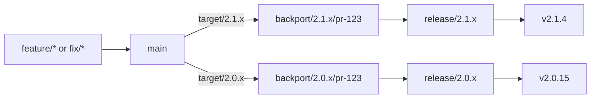

# Versioned Release Workflow

Cherry Studio uses a simplified [GitLab Flow](https://about.gitlab.com/topics/version-control/what-is-gitlab-flow/) for versioned desktop releases. All development converges on `main`; supported release branches receive only selected fixes from `main`. We do not use a separate `develop` branch, merge all of `main` into a release branch, or merge a release branch back into `main`.

This workflow maintains exactly two minor release lines:

- **Current**: the latest stable minor line.
- **Previous minor**: the immediately preceding minor line.

For example, while `2.1.x` is current, `2.0.x` is the previous minor. When `2.2.x` becomes current, `2.1.x` moves to previous-minor maintenance and `2.0.x` reaches end of life.

## Branch and Version Model

| Ref | Lifetime | Purpose |
| --- | --- | --- |
| `main` | Permanent | Integration point for all features, fixes, refactors, and release tooling changes |
| `release/2.1.x` | Until the line reaches end of life | Current stable line; accepts reviewed backports and release metadata |
| `release/2.0.x` | Until the line reaches end of life | Previous-minor maintenance line; accepts a narrower set of reviewed backports |
| `backport/2.0.x/pr-123` | Until its pull request closes | Isolates one source pull request for review against one release line |
| `v2.0.15` | Permanent | Identifies the exact immutable commit and artifacts for a published release |

Release branches express compatibility and support policy. Tags express exact published versions. Pull requests therefore target a release **line**, such as `2.0.x`, while a GitHub milestone schedules the accepted change for an exact release, such as `v2.0.15`.



## Change Classification

Commit type, severity, backport target, and exact release are separate decisions:

| Concern | Representation | Example |
| --- | --- | --- |
| Change intent | Commit or pull request type | `fix(chat): preserve attachments after retry` |
| Release urgency | `fix` or `hotfix`, plus severity label | `hotfix(database): prevent startup data loss` |
| Affected release lines | Explicit target labels | `target/2.1.x`, `target/2.0.x` |
| Scheduled release | GitHub milestone | `v2.0.15` |
| Backport state | Per-line status labels | `backport-open/2.0.x`, `backported/2.0.x` |

Use concrete version labels rather than aliases such as `target/current`. Concrete labels remain auditable after the supported lines advance.

### Normal Bug Fixes

Use `fix(<scope>): <description>` for a defect that can follow the normal patch-release schedule. A normal fix may still be backported when it applies cleanly, has sufficient value for users of the older line, and does not introduce disproportionate compatibility risk.

Examples include:

- A partial feature failure with a reasonable workaround.
- A low-frequency provider or platform edge case.
- A visual or interaction defect that does not block a core workflow.
- A regression that can wait for the next scheduled patch release.

### Critical Bug Fixes

Use `hotfix(<scope>): <description>` only when both conditions below are true:

1. The defect has at least one critical production impact:
   - Security or privacy exposure.
   - User data loss, corruption, or unrecoverable state.
   - Application startup, installation, sign-in, or update failure.
   - A core workflow is unavailable to a significant set of users without a reasonable workaround.
   - A severe regression was introduced in a supported release line.
2. The fix cannot wait for the next normal patch-release window and requires expedited release handling.

`hotfix` describes release urgency, not branch applicability. A critical fix that affects only the current line receives only `target/<current-line>`. Conversely, a normal `fix` may target both supported lines when maintainers approve the backport.

Do not use `fix!` to mean critical. The `!` marker denotes a breaking change. Release-pipeline changes normally use `fix(release-workflow)`; they use `hotfix` only when a shipped installation or update path is broken and expedited product release handling is required.

## Commit and Pull Request Linting

Commitlint validates syntax and declared intent; it cannot determine whether the underlying incident is genuinely critical. Semantic eligibility is enforced by pull request metadata and maintainer review.

The allowed commit types are:

```text
build, chore, ci, docs, feat, fix, hotfix, perf, refactor, revert, style, test
```

The baseline commitlint rules are:

```javascript
{
  'type-enum': [
    2,
    'always',
    ['build', 'chore', 'ci', 'docs', 'feat', 'fix', 'hotfix', 'perf', 'refactor', 'revert', 'style', 'test']
  ],
  'scope-case': [2, 'always', 'kebab-case'],
  'subject-empty': [2, 'never'],
  'header-max-length': [2, 'always', 100],
  'breaking-change-exclamation-mark': [2, 'always']
}
```

Both `fix` and `hotfix` map to a SemVer patch change. Pull request validation adds the rules that commitlint cannot express:

- A `hotfix` pull request must have the `severity/critical` label.
- A `hotfix` pull request must name at least one supported `target/<minor-line>`.
- Its description must identify the production impact and explain why the normal release window is insufficient.
- It must reference the incident or issue and include a regression test, or explain why an automated test is not possible.
- A release maintainer must approve its urgency and every requested backport target.

When pull requests are squash-merged, the pull request title is the authoritative final commit header and must pass the same commitlint rules. A local `commit-msg` hook provides early feedback, while CI validates the pull request title and release metadata.

## Backport Flow

1. Create the change from `main` and open a pull request targeting `main`.
2. Classify its intent and severity. Request each affected supported line with an explicit `target/<minor-line>` label.
3. Merge the reviewed and tested change into `main` first.
4. For every approved target line, create one backport branch and pull request from the current head of that release branch.
5. Apply the source pull request's complete intended diff. Do not assume that a GitHub merge commit alone represents squash- or rebase-merged changes.
6. Adapt conflicts for the older line without importing unrelated `main` changes. Automation must fail closed rather than resolve semantic conflicts automatically.
7. Run the target line's CI and review the resulting diff before merging the backport pull request.
8. Record the result on the source pull request with a per-line status label.

The default unit of review is one source pull request backported to one release line. This keeps provenance, CI, reverts, and failure handling independent. Emergency batches may combine fixes only when every source is recorded explicitly and remains independently auditable.

## Release Flow

For each supported line:

1. Select the fixes for the next exact version and assign its milestone.
2. Resolve every requested backport as accepted, deferred, rejected, or blocked.
3. Freeze the release-line commit and generate the signed, DCO-signed version metadata commit.
4. Run CI and all platform builds against that exact commit.
5. Create or update the draft release only when its branch, version, tag, and workflow SHA agree.
6. Inspect the artifacts and approve publication through the protected release environment.
7. Publish an immutable version tag. Any later fix receives a new patch version.

Publishing an older maintenance release must not overwrite the current version recorded on `main`. Release history and update metadata therefore need per-version ownership. The default stable channel may upgrade users from the previous minor to the current minor, including `2.0.x` to `2.1.y`. If the product explicitly promises minor-line pinning, each supported line also needs a distinct update channel; maintaining two release branches alone does not create that promise.

## Persisted Storage Contract

Patch releases freeze the persisted storage contract. They must not add or modify Drizzle migrations, database schema, preference keys, persisted value types, or persisted value semantics. This rule freezes the on-disk contract, not its implementation: a patch may fix queries, transactions, serialization, validation, defensive reads, or documented preference behavior when existing stored data remains compatible. Do not evade the freeze by moving new durable state into a cache, JSON file, or another persistence mechanism.

A lossless, idempotent repair over the existing schema requires explicit approval from the data owner and upgrade-path tests. A fix that requires a new persisted contract ships in the next minor release. If it cannot wait, cut an expedited minor instead of weakening the patch contract. Classifying a change as `hotfix` does not override this rule.

At each minor cut, the older line's database migration chain must be an exact prefix of every later supported line's chain. For example, if `2.0.x` contains migrations `A, B`, then `2.1.y` may contain `A, B, C, D`. Because the `2.0.x` schema remains frozen after its branch cut, upgrading from `2.0.x` to `2.1.y` applies only `C, D` and follows the same forward migration path as a fresh `2.1.y` installation.

## Backport Policy

| Change | Current line | Previous minor |
| --- | --- | --- |
| Security or data-integrity fix | Required when affected | Required when affected |
| Critical crash or core-workflow regression | Normally backport | Backport after compatibility review |
| Normal bug fix | Backport when low risk and valuable | Backport selectively |
| Performance improvement | Backport only with measured benefit and low risk | Normally do not backport |
| Feature or breaking change | Release through the appropriate future version | Do not backport |
| Refactor | Do not backport independently | Do not backport |
| Dependency update | Backport only for a concrete fix or security need | Backport only when necessary |
| Database or preference implementation fix | Backport only when the persisted contract is unchanged | Same, with compatibility review |
| Database or preference contract change | Ship in the next minor or an expedited minor | Do not backport |

## Release-Line Lifecycle

When a new minor becomes current:

1. Create its protected release branch from the selected `main` commit.
2. Move the former current line into previous-minor maintenance.
3. Mark the former previous-minor line end of life.
4. Stop accepting new target labels and automated backports for the end-of-life line.
5. Keep its published tags and artifacts immutable.

Security support beyond the two-line window is an explicit release-team exception, not an implicit extension of the normal maintenance policy.

## Invariants

- Every product fix lands in `main` before it is backported.
- Release branches accept changes only through reviewed pull requests.
- Never merge all of `main` into a supported release branch.
- Never merge a release branch back into `main`.
- Backport targets are explicit; automation does not infer them from the latest draft release.
- Conflicted backports require human adaptation and target-line testing.
- Builds, tags, and publication are bound to the same exact commit.
- Published version tags never move.
- Patch releases do not change database or preference storage contracts.
- Every supported older migration chain is an exact prefix of later supported chains.
- Only the current and immediately previous minor lines receive routine maintenance.
