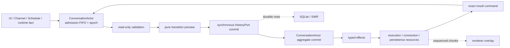

# Conversation Runtime




The actor is the owner; `transitionConversation()` is its pure reducer.
Resource managers may acknowledge and execute an effect, but they never infer a
new turn, Stop outcome, interaction continuation, or quiescence decision.

## Why the old boundary failed

The previous runtime unified Chat and Agent at the provider-stream layer. A single Agent reply was therefore represented simultaneously by an Agent turn, a Topic work lease, a Topic cycle and attempt, an active provider stream, and a pending SQLite assistant row. Correct handoff required every callback to translate between those identities. The lease and reservation protocol prevented stale work, but it was coordination state created by the ownership split rather than user-visible conversation state.

`AiStreamManager` consequently owned both resource mechanics and business policy: admission, continuation, Stop, approval, terminal persistence, quiescence, attach, replay, and grace. `AgentConnectionManager` separately owned a queue, turn lifecycle, connection, background work, compaction, and recovery. Illegal combinations were rejected after construction because the combined state was a product of independent axes.

The unified runtime moves the boundary up to Conversation and Turn. Provider streams and Agent connections execute typed effects; neither decides whether work may start, stop, continue, or quiesce.

## Durable and live authority

- Existing `message` and `agent_session_message` rows remain the durable truth. There is no conversation event log and no dual write.
- Each `ConversationActor` is the process-local business owner for one `ConversationRef`. It owns the aggregate, admission FIFO and epoch, committed input identities, effect-operation registry, Stop interrupt, and final quiescence gate.
- `ConversationRuntimeService` is the lifecycle and IPC facade. It resolves History/resource ports, routes exact commands to actors, and performs global pause/drain without storing another aggregate.
- `OwnedOperationRegistry` records process-local obligations separately from
  their execution attempts. A failed attempt may retain an obligation for a
  later retry; only `Complete` or `Abandon` removes it from owner accounting.
- An ended Agent connection retains its exact SessionMessage approval teardown
  operation until the cards are durable and the connection resource closes.
  Prewarm, successor admission, and backup drain all observe that obligation.
- Stream chunks are data-plane traffic. The execution resource owns their ring and sequence; only first-chunk, interaction, and terminal control facts re-enter the Conversation owner.
- Normal terminal notifications follow durable persistence. An explicit Stop may settle through deferred recovery after the existing exact retry policy; deferred results never produce external Channel delivery.

## Profiles

| Profile | History | Execution | Active input |
|---|---|---|---|
| Chat | real topic message tree, active node, sibling groups | stateless provider run, one logical turn may fan out to several executions | enqueue NextTurn and request a clean yield, except while waiting for interaction |
| Agent | ordered Agent rows projected as one tree branch | stateful connection with workspace, tools, background work, and one execution per logical turn | redirect to NextStep when supported and provenance-compatible, except while waiting for interaction; otherwise enqueue NextTurn |

Agent branching is disabled. The common history API still exposes a tree: the Agent adapter derives each row's parent from `(createdAt, id)` ordering without changing the database schema.

## Trigger traceability

| Trigger | Command/owner decision | Effects | Exact result |
|---|---|---|---|
| idle submit | preview Submit turn, commit skeleton, install Running/Starting | start one or more executions | open ack; exact execution terminal |
| active Chat submit | preview and commit NextTurn; request stateless driver yield | persist user row; stop at clean step boundary | current terminal persisted; successor committed |
| active Agent submit | choose NextStep redirect or NextTurn fallback | redirect connection or retain FIFO input | redirected/rejected/undelivered |
| regenerate | preview Regenerate at the replacement tree anchor | commit a new sibling skeleton | open ack; exact execution terminal |
| retry failed or paused model | preview exact execution retry | reset the same assistant row and start one model | open ack; exact execution terminal |
| append model | append to the exact live group, or open Regenerate when it has settled | add one sibling execution; preserve the live branch when applicable | open ack; exact execution terminal |
| queued-input batch boundary | claim the consecutive compatible NextTurn prefix | commit its user rows and one successor execution atomically | committed/retained on failure |
| inbox remove, reorder, or retarget | serialize the mutation in the Actor admission FIFO | reuse the exact input identity while changing its target; preserve hidden control inputs | updated snapshot/rejected |
| inbox pause or resume | retain committed inputs while settling the current turn presentation | delay successor admission; final hold release kicks one retained batch | updated snapshot/started |
| first provider chunk | move execution to Active | publish streaming status | none |
| later provider chunks | no control transition | ring append and listener broadcast | none |
| provider terminal | select immutable outcome and enter Persisting | persist final snapshot | durable/deferred/failed |
| approval or ask-user | open typed interaction | publish interaction; resolve driver-specific continuation | resolved/stale/rejected |
| Agent steer boundary | roll one assistant segment inside the same turn | persist A1a, steer user node, and A2 skeleton | rolled/failed |
| steer undelivered | move exact input from NextStep to NextTurn | schedule successor after current settlement | scheduled/stale |
| autonomous generation | suspend the exact foreground execution, then open a RuntimeInitiated turn | commit receive-only output skeleton, bind driver, restore after durable terminal plus ownership release | suspended/started/terminal/released/resumed |
| compaction | open or close blocking activity | publish/persist compaction projection | completed/failed |
| background work or flow | update concrete activity or owning-message projection | cache or row projection | completed/failed |
| resume token, usage, context, retry, commands | no Conversation lifecycle change | runtime metadata, cache, trace, and usage ports | none |
| Stop or no subscribers | select Stop outcome, clear policy-selected inbox, abort exact executions | partial terminal persistence | durable/deferred |
| attach or detach | no aggregate command | listener registry and compact replay | attached/not-found |
| Channel, schedule, delivery | submit input with explicit provenance | independent admission owner hands target input to Conversation | accepted/rejected |
| backup pause | close admission and drain effect resources | preserve inbox; defer exact foreground resume until the final hold releases | drained/stragglers |
| model/workspace change | freeze active turn policy; reconcile at safe boundary | patch, rebuild, or close Agent connection | current/patched/rebuild/invalid/failed |
| shutdown | close admission, Stop/drain, release resources last | terminal, delivery, trace, and connection cleanup | settled/stragglers |

Every new trigger must be added to this table with one control owner, its typed effects, and its result command before implementation.

## State vocabulary

Finite control vocabularies are explicit string enums. Discriminated unions narrow payloads through enum members; bare finite-state string unions and numeric enums are not used.

Each aggregate entry owns only:

- `ConversationPhase`;
- NextTurn and NextStep inboxes;
- the active logical Turn and its executions;
- open interactions;
- concrete activities that affect admission or quiescence.

Connections, AbortControllers, stream controllers, rings, listeners, timers, cleanup promises, launch single-flight, renderer refs, and private resource run fences are not aggregate state.

There is no Conversation `Preparing` phase. Context construction, compaction,
Agent connection binding, and provider open are all represented by the exact
execution's `Starting` phase.

### Legal aggregate combinations

| Phase | Run mode | Legal contents |
|---|---|---|
| Idle | none | no turn or interaction; a paused actor may retain committed inbox input; activities may still block final quiescence |
| Running | Foreground | one current turn and no autonomous runtime ownership |
| Running | Preempting | Agent only; the foreground execution is still Starting, with one runtime intent and one exact suspend effect |
| Running | RuntimePreempted | one RuntimeInitiated turn, one suspended foreground turn, and ownership Active or Released |
| Stopping | inherited | inbox is cleared, admission and new interactions are closed, and committed executions wait for terminal persistence and ownership release |

`Idle + RunMode`, nested preemption, and a suspended WaitingInteraction are not
representable. Released ownership may coexist with RuntimePreempted only until
the runtime terminal becomes durable; when both facts exist the reducer emits
one exact foreground-resume effect. Any result from an older Stop epoch is
stale.

## Admission transaction

```text
intent
→ actor FIFO operation (sequence + epoch + operation ID)
→ validation (read-only, abortable)
→ pure reducer preview with preallocated IDs
→ synchronous HistoryPort commit
→ aggregate commit as Running / Starting
→ AiExecutionManager resource registration
→ open acknowledgement
→ driver context build and provider open
```

Stop increments the actor epoch and synchronously commits `Stopping`, then owns
an exact Stop operation until terminal persistence and every execution/driver
teardown complete. Admissions submitted after Stop wait on that operation;
they validate and commit only after it succeeds. A teardown failure rejects the
waiting admissions, settles the exact Stop operation, and removes it from the
drain registry; a later explicit attempt starts from a new operation rather
than inheriting a permanent failed fence.
Admissions already validating before Stop are cancelled by epoch. Before the
history boundary this leaves no rows; after it, the acknowledged skeleton is
persisted once with a Paused terminal. Repeated Stop requests join the same
operation.

For Agent executions, the resource result freezes the exact runtime checkpoint
before invalidating the connection entry. Terminal persistence consumes that
checkpoint directly; it never queries whichever session entry happens to be
current after teardown.

`CommittedConversationInput` is a process-local control envelope that contains
only identities and immutable dispatch facts for a user row already committed
by the history adapter. It lasts until an exact Step/Turn commit, Stop, or
explicit drop. It contains no listener, `WebContents`, `AbortController`, or
callback. After a process crash, the row remains in history but is not
automatically replayed as queued work.

### Interaction lifecycle

- A Chat `NewRun` interaction is first `Observed`; its execution remains
  Active/Persisting until the checkpoint is durable. It then becomes
  `Available` and the execution becomes WaitingInteraction.
- An Agent `InPlace` interaction may become `Available` once the exact runtime
  approval registry entry exists.
- Ordinary Chat or Agent input received while WaitingInteraction is committed
  to NextTurn. It never yields or redirects the waiting execution.
- A decision moves the interaction to `Resolving`. A duplicate database result
  returns the authoritative snapshot and still advances the aggregate.
- `NewRun` is removed only after the replacement run is registered; `InPlace`
  is removed only after exact resume success. A failed resume returns to
  `Available`.

### Failure and crash boundary

| Failure point | Contract |
|---|---|
| validation | no row; aggregate unchanged |
| synchronous skeleton commit | transaction rolls back; aggregate unchanged |
| after commit, before aggregate install | boot reconcile terminates the pending assistant row |
| execution registration/start | committed execution chooses Error and enters the terminal coordinator |
| terminal persistence | the single coordinator retries the immutable outcome |
| final explicit-Stop retry | publish DeferredRecovery to Renderer only; never emit Channel delivery |

The history commit and aggregate install run in the same synchronous task, so
only a process crash can occur between them.

`ConversationRuntimeService` also owns boot crash recovery across both history
adapters. Each adapter returns the authoritative output IDs and statuses it
repaired. Agent recovery atomically marks pending assistants as Error,
terminalizes streaming/tool/background parts and orphaned SessionMessage
approvals, and clears affected resume tokens. The operation remains in the
fixed-point pause/drain barrier across retry; only after success does Delivery
re-read terminal rows. Delivery never repairs assistant rows or infers an
outcome from its pre-recovery snapshot.

## Attach snapshot protocol

Main registers the observer before it captures every execution high-water. An
attach response is `Live`, `Settled`, or `NotFound`; `NotFound` means refresh
durable history, not EOF or Success. A Live response may include settled
siblings, while Settled carries each execution terminal and the turn terminal.

Each execution replay is either `Continuous` or `Rebase`. `Continuous` covers
every sequence after the requested cursor through `throughChunkSeq`. `Rebase`
means the prefix is no longer recoverable and carries a standalone semantic
snapshot built from the retained window, plus `firstAvailableChunkSeq` and its
high-water. The resource retains at most 10,000 raw sequenced provider events
and splits text/reasoning/tool deltas at 16 KiB without crossing a sequence
boundary.

`ConversationStreamSubscription` owns the attach generation, continuous cursor,
and bounded live buffer. On `Rebase`, `ExecutionStreamOverlayService` cancels
the exact old reader without publishing finish, seeds a fresh reader from the
standalone snapshot, installs its high-water, and drains later live chunks. A
terminal is an independent control fact and settles immediately even when
attach or recovery fails; durable refresh supplies the complete final message.
IPC errors remain retryable renderer-local state. Durable `NotFound` uses an
exact execution tombstone and refresh-before-retire, while ephemeral overlays
may retire immediately.

## Ports

- `ConversationActor` serializes admission and installs the previewed state only
  after the synchronous history boundary succeeds. `ConversationRuntimeService`
  supplies the selected adapter operation and routes IPC/results to that actor.
- Chat, Agent, and Temporary Chat history adapters validate without writes,
  commit skeletons synchronously, and build model context only from committed
  identities. Their commit result contains only immutable descriptors: initial
  naming is a post-commit task, summary naming is an after-persist task, and
  trace flushing is registered for quiescence. Agent connection resources never
  create message rows.
- Temporary Chat deletion and promotion enter through `ConversationRuntimeService`:
  the owning Actor fences new admission, completes exact Stop and terminal work,
  and only then lets the in-memory store delete or move its rows.
- `AiExecutionManager` owns provider-stream resources and a private `ExecutionRunId` stale fence.
- `AgentConnectionManager` owns connection resources and executes exact Agent-driver effects:
  redirect, reconcile, warm leases, driver event subscription, segment roll, and runtime metadata
  projection. Parked foreground resources are keyed by the owning suspend `EffectId`; stale
  suspend/resume/discard operations return typed stale results. It never decides admission,
  terminal outcome, foreground resume, or quiescence. It receives the execution
  owner's `AbortSignal` and cannot create or abort a second per-turn controller.
- Renderer, Channel, trace, usage, and runtime metadata are output/projection ports.
- Every asynchronous effect result returns `ConversationRef`, `TurnId`, optional `ExecutionId`, and `EffectId`; no result resolves the current conversation by lookup and inference.

## Quiescence

Domain quiescence requires Idle phase, empty inboxes, no blocking activity, and
no execution waiting for terminal persistence. Final quiescence additionally
requires the actor's committed-input set and admission/effect/terminal
operation registries to be empty.
Subscriber presence, SharedCache values, active overlay state, connection
liveness, and scheduler single-flight are not quiescence facts.

## Closure audit protocol

A path is closed only when every accepted fact reaches one stable owner outcome
through success, rejection, failure, cancellation, and stale-result races. The
number of phases and passing happy-path tests do not prove closure.

For every trigger in the traceability table, the design and tests must identify:

```text
exact request identity
→ owner admission decision
→ synchronous durable boundary, when applicable
→ committed aggregate transition
→ typed effects
→ exact success / failure / abort / stale results
→ monotonic owner commit
→ resource, operation, and presentation cleanup
→ successor admission or a stable retained state
```

The audit uses three independent ledgers:

- **Control ledger.** `ConversationActor` accounts for every committed input,
  Turn, execution, interaction, activity, Stop, terminal outcome, and successor
  decision. A resource or projection cannot supply a missing control fact.
- **Operation ledger.** Every operation crossing an `await` is registered before
  its first attempt. Each attempt ends in `finally`, including failure, abort,
  and stale completion. The obligation remains visible while retained for
  retry, and is removed only by the owning policy's `Complete` or `Abandon`
  decision. A failed attempt may reject its caller, but may not leave a
  permanently pending attempt or failure fence in a drain registry.
- **Resource ledger.** Every stream, connection, reader, adapter attempt, timer,
  and controller has one exact identity and one cleanup owner. An obsolete
  callback may be a control no-op, but it must still release the resource it
  owns; it cannot resolve a target from the current session, latest ref, cache,
  or overlay.

Conservation checks expose ownerless state without adding phases:

```text
committed inputs = consumed + retained + terminal error + explicit drop
executions       = live registered resources + settled executions
approvals        = live resolvers + durably terminalized cards
Agent redirects  = delivered + transition-retained + NextTurn fallback
Stop operations  = draining + completed + failed-and-cleared
```

An item outside the right-hand side is a closure defect. For example, a failed
batch that disappears violates input conservation; a rejected redirect without
fallback violates redirect conservation; a failed teardown retained forever in
the registry violates Stop-operation conservation.

Every asynchronous boundary is reviewed at the same deterministic cut points:

| Cut point | Required proof |
|---|---|
| before the effect starts | rejection leaves no unowned row, resource, or aggregate mutation |
| while the effect is pending | Stop/pause aborts or retains it according to the owning policy |
| after the external side effect, before its result | retry policy accounts for whether the outcome is known or unknown |
| after the result, when the Turn/epoch changed | the result is stale for control but still completes exact cleanup |
| after terminal selection, before persistence | the immutable outcome survives retry and Stop |
| after persistence, before presentation cleanup | durable refresh and exact retirement converge without changing control state |

The final fixed-point assertion is stronger than `ConversationPhase.Idle`: no
committed input, operation, resource, interaction, or presentation record may
remain unless it is explicitly retained by a documented owner and has a future
trigger that can advance it. Permanent `pending`, `streaming`, `stopping`, or
`recovering` projections with no such trigger are closure failures.

## Pause and fixed-point drain

Every owner keeps a private operation registry. An operation is opened before
its executor's first call; each attempt is registered before its first `await`
and ends in `finally`. Conversation admission, successor dispatch, execution
runs, terminal persistence, presentation cleanup, boot recovery, and topic
naming writes are included; Agent connection startup, close, runtime binding,
background work, and compaction keep their equivalent resource registry.
Retained terminal persistence remains visible during its retry delay, so both
quiescence and backup drain observe the durable obligation rather than only the
current write Promise.

A pause closes external admission before taking a registry snapshot. Work
already inside the barrier may register terminal or recovery descendants, so
drain repeatedly samples until all registries are empty. Topic naming is an
Actor-owned effect operation rather than a second naming-service registry.
If the current turn finishes while successor admission is paused, its terminal
presentation still becomes Done/Error/Aborted; only the retained inbox work is
deferred, so the composer does not remain falsely busy.
Timeout returns stable execution/effect/session operation IDs and backup fails closed;
it must not proceed with a partial snapshot. Releasing the final pause hold
kicks retained inbox work once.
