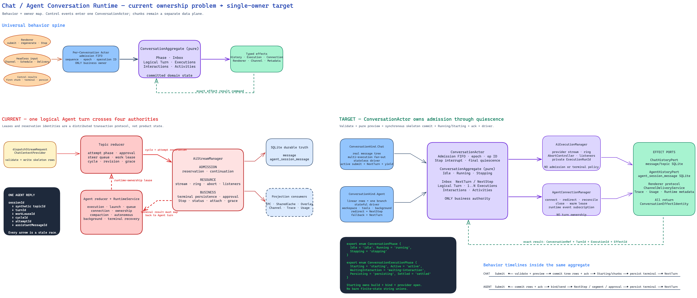
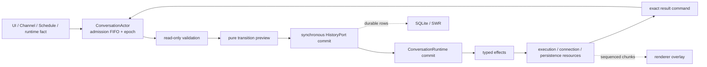

# Conversation Runtime





The actor is the owner; `ConversationRuntime` is its pure domain component.
Resource managers may acknowledge and execute an effect, but they never infer a
new turn, Stop outcome, interaction continuation, or quiescence decision.

## Why the old boundary failed

The previous runtime unified Chat and Agent at the provider-stream layer. A single Agent reply was therefore represented simultaneously by an Agent turn, a Topic work lease, a Topic cycle and attempt, an active provider stream, and a pending SQLite assistant row. Correct handoff required every callback to translate between those identities. The lease and reservation protocol prevented stale work, but it was coordination state created by the ownership split rather than user-visible conversation state.

`AiStreamManager` consequently owned both resource mechanics and business policy: admission, continuation, Stop, approval, terminal persistence, quiescence, attach, replay, and grace. `AgentConnectionManager` separately owned a queue, turn lifecycle, connection, background work, compaction, and recovery. Illegal combinations were rejected after construction because the combined state was a product of independent axes.

The unified runtime moves the boundary up to Conversation and Turn. Provider streams and Agent connections execute typed effects; neither decides whether work may start, stop, continue, or quiesce.

## Durable and live authority

- Existing `message` and `agent_session_message` rows remain the durable truth. There is no conversation event log and no dual write.
- `ConversationRuntimeService` is the process-local business owner. It composes one `ConversationActor` admission lane per `ConversationRef` with the pure `ConversationRuntime` aggregate map, exact input/turn projections, and the final quiescence gate. Each actor owns only its pre-commit FIFO, operation identity/epoch, and Stop interrupt.
- Stream chunks are data-plane traffic. The execution resource owns their ring and sequence; only first-chunk, interaction, and terminal control facts re-enter the Conversation owner.
- Normal terminal notifications follow durable persistence. An explicit Stop may settle through deferred recovery after the existing exact retry policy; deferred results never produce external Channel delivery.

## Profiles

| Profile | History | Execution | Active input |
|---|---|---|---|
| Chat | real topic message tree, active node, sibling groups | stateless provider run, one logical turn may fan out to several executions | enqueue NextTurn and request a clean yield, except while waiting for interaction |
| Agent | ordered Agent rows projected as one tree branch | stateful connection with workspace, tools, background work, and one execution per logical turn | redirect to NextStep when supported and provenance-compatible, except while waiting for interaction; otherwise enqueue NextTurn |

Agent branching is disabled. The common history API still exposes a tree: the Agent adapter derives each row's parent from `(createdAt, id)` ordering without changing the database schema.

## Trigger traceability

| Trigger | Command/owner decision | Effects | Exact result |
|---|---|---|---|
| idle submit | preview Submit turn, commit skeleton, install Running/Starting | start one or more executions | open ack; exact execution terminal |
| active Chat submit | preview and commit NextTurn; request stateless driver yield | persist user row; stop at clean step boundary | current terminal persisted; successor committed |
| active Agent submit | choose NextStep redirect or NextTurn fallback | redirect connection or retain FIFO input | redirected/rejected/undelivered |
| regenerate or append model | preview Regenerate/append at exact tree anchor | commit replacement or sibling skeleton | open ack; exact execution terminal |
| first provider chunk | move execution to Active | publish streaming status | none |
| later provider chunks | no control transition | ring append and listener broadcast | none |
| provider terminal | select immutable outcome and enter Persisting | persist final snapshot | durable/deferred/failed |
| approval or ask-user | open typed interaction | publish interaction; resolve driver-specific continuation | resolved/stale/rejected |
| Agent steer boundary | roll one assistant segment inside the same turn | persist A1a, steer user node, and A2 skeleton | rolled/failed |
| steer undelivered | move exact input from NextStep to NextTurn | schedule successor after current settlement | scheduled/stale |
| autonomous generation | suspend the exact foreground execution, then open a RuntimeInitiated turn | commit receive-only output skeleton, bind driver, restore after durable terminal plus ownership release | suspended/started/terminal/released/resumed |
| compaction | open or close blocking activity | publish/persist compaction projection | completed/failed |
| background work or flow | update concrete activity or owning-message projection | cache or row projection | completed/failed |
| resume token, usage, context, retry, commands | no Conversation lifecycle change | runtime metadata, cache, trace, and usage ports | none |
| Stop or no subscribers | select Stop outcome, clear policy-selected inbox, abort exact executions | partial terminal persistence | durable/deferred |
| attach or detach | no aggregate command | listener registry and compact replay | attached/not-found |
| Channel, schedule, delivery | submit input with explicit provenance | independent admission owner hands target input to Conversation | accepted/rejected |
| backup pause | close admission and drain effect resources | preserve inbox and join in-flight effects | drained/stragglers |
| model/workspace change | freeze active turn policy; reconcile at safe boundary | patch, rebuild, or close Agent connection | current/patched/rebuild/invalid/failed |
| shutdown | close admission, Stop/drain, release resources last | terminal, delivery, trace, and connection cleanup | settled/stragglers |

Every new trigger must be added to this table with one control owner, its typed effects, and its result command before implementation.

## State vocabulary

Finite control vocabularies are explicit string enums. Discriminated unions narrow payloads through enum members; bare finite-state string unions and numeric enums are not used.

Each aggregate entry owns only:

- `ConversationPhase`;
- NextTurn and NextStep inboxes;
- the active logical Turn and its executions;
- open interactions;
- concrete activities that affect admission or quiescence.

Connections, AbortControllers, stream controllers, rings, listeners, timers, cleanup promises, launch single-flight, renderer refs, and private resource run fences are not aggregate state.

There is no Conversation `Preparing` phase. Context construction, compaction,
Agent connection binding, and provider open are all represented by the exact
execution's `Starting` phase.

### Legal aggregate combinations

| Phase | Run mode | Legal contents |
|---|---|---|
| Idle | none | no turn or interaction; a paused actor may retain committed inbox input; activities may still block final quiescence |
| Running | Foreground | one current turn and no autonomous runtime ownership |
| Running | Preempting | Agent only; the foreground execution is still Starting, with one runtime intent and one exact suspend effect |
| Running | RuntimePreempted | one RuntimeInitiated turn, one suspended foreground turn, and ownership Active or Released |
| Stopping | inherited | inbox is cleared, admission and new interactions are closed, and committed executions wait for terminal persistence and ownership release |

`Idle + RunMode`, nested preemption, and a suspended WaitingInteraction are not
representable. Released ownership may coexist with RuntimePreempted only until
the runtime terminal becomes durable; when both facts exist the reducer emits
one exact foreground-resume effect. Any result from an older Stop epoch is
stale.

## Admission transaction

```text
intent
→ actor FIFO operation (sequence + epoch + operation ID)
→ validation (read-only, abortable)
→ pure reducer preview with preallocated IDs
→ synchronous HistoryPort commit
→ aggregate commit as Running / Starting
→ AiExecutionManager resource registration
→ open acknowledgement
→ driver context build and provider open
```

Stop increments the actor epoch and aborts the current validation plus every
Starting/Active execution. A late validation or context result must match its
operation identity and epoch; otherwise it is stale and cannot commit. Before
the history boundary, Stop leaves no rows. After the boundary, Stop keeps the
acknowledged skeleton and persists one Paused terminal.

`CommittedConversationInput` is a process-local control envelope that contains
only identities and immutable dispatch facts for a user row already committed
by the history adapter. It lasts until an exact Step/Turn commit, Stop, or
explicit drop. It contains no listener, `WebContents`, `AbortController`, or
callback. After a process crash, the row remains in history but is not
automatically replayed as queued work.

### Interaction lifecycle

- A Chat `NewRun` interaction is first `Observed`; its execution remains
  Active/Persisting until the checkpoint is durable. It then becomes
  `Available` and the execution becomes WaitingInteraction.
- An Agent `InPlace` interaction may become `Available` once the exact runtime
  approval registry entry exists.
- Ordinary Chat or Agent input received while WaitingInteraction is committed
  to NextTurn. It never yields or redirects the waiting execution.
- A decision moves the interaction to `Resolving`. A duplicate database result
  returns the authoritative snapshot and still advances the aggregate.
- `NewRun` is removed only after the replacement run is registered; `InPlace`
  is removed only after exact resume success. A failed resume returns to
  `Available`.

### Failure and crash boundary

| Failure point | Contract |
|---|---|
| validation | no row; aggregate unchanged |
| synchronous skeleton commit | transaction rolls back; aggregate unchanged |
| after commit, before aggregate install | boot reconcile terminates the pending assistant row |
| execution registration/start | committed execution chooses Error and enters the terminal coordinator |
| terminal persistence | the single coordinator retries the immutable outcome |
| final explicit-Stop retry | publish DeferredRecovery to Renderer only; never emit Channel delivery |

The history commit and aggregate install run in the same synchronous task, so
only a process crash can occur between them.

## Attach snapshot protocol

Main registers the observer before it captures every execution high-water. An
attach response is `Live`, `Settled`, or `NotFound`; `NotFound` means refresh
durable history, not EOF or Success. A Live response may include settled
siblings, while Settled carries each execution terminal and the turn terminal.

Each execution replay reports `throughChunkSeq`,
`firstAvailableChunkSeq`, and `truncated`. The resource retains at most 10,000
semantic entries and splits text/reasoning deltas at 16 KiB without collapsing
tool or approval boundaries. Renderer buffers events during attach, applies the
snapshot and replay, and then applies only events above that execution's
high-water. IPC errors remain retryable renderer-local state.

## Ports

- `ConversationRuntimeService` executes the admission transaction and commits the
  previewed command only after the synchronous history boundary succeeds.
- Chat, Agent, and Temporary Chat history adapters validate without writes,
  commit skeletons synchronously, and build model context only from committed
  identities. Agent connection resources never create message rows.
- `AiExecutionManager` owns provider-stream resources and a private `ExecutionRunId` stale fence.
- `AgentConnectionManager` owns connection resources and executes Agent-driver effects: redirect,
  reconcile, warm leases, driver event subscription, segment roll, and runtime metadata/history
  projection. It never decides admission, terminal outcome, or quiescence.
- Renderer, Channel, trace, usage, and runtime metadata are output/projection ports.
- Every asynchronous effect result returns `ConversationRef`, `TurnId`, optional `ExecutionId`, and `EffectId`; no result resolves the current conversation by lookup and inference.

## Quiescence

Domain quiescence requires Idle phase, empty inboxes, no blocking activity, and
no execution waiting for terminal persistence. Final quiescence additionally
requires the actor's admission and terminal operation registries to be empty.
Subscriber presence, SharedCache values, active overlay state, connection
liveness, and scheduler single-flight are not quiescence facts.

## Pause and fixed-point drain

Every owner keeps a private registry of short-lived promises, registered before
the operation's first `await` and removed in `finally`. Conversation admission,
successor dispatch, execution runs, terminal persistence, presentation cleanup,
boot recovery, and topic naming writes are included; Agent connection startup,
close, runtime binding, background work, and compaction keep their equivalent
resource registry.

A pause closes external admission before taking a registry snapshot. Work
already inside the barrier may register terminal or recovery descendants, so
drain repeatedly samples until all registries are empty. Timeout returns stable
execution/effect/session/topic-naming operation IDs and backup fails closed;
it must not proceed with a partial snapshot. Releasing the final pause hold
kicks retained inbox work once.
