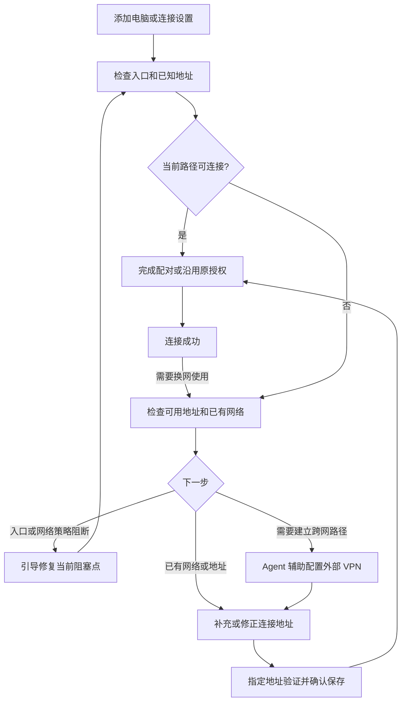

# 统一设备连接与设置助手方案

> 状态：首版代码已实现，共享包发布与平台、跨网真机验收待完成。2026-09-29。
> 目标：统一局域网、企业网络与外部 VPN 的设备连接体验，需要时由 Agent 辅助完成网络设置。
> 下方“实现进度”记录当前代码范围；其余章节保留完整设计目标，不代表所有验收已经通过。

## 实现进度

- 桌面统一设备连接文案，地址查询不再生成邀请。已有网络先使用当前路径，需要跨网时才展开 VPN 引导。
- 新增 `connectionEndpointsVersion: 1` 和 `connection.endpoints`，通过当前已授权能力读取 IPv4 / IPv6 候选与实际端口。
- 手机获取候选后不持久化；用户选择“保存并验证”才定向拨号、校验身份、认证并执行授权内的只读地址请求。
  验证失败不回退 LAN，不改原配对；成功后事务内追加、去重并保护并发配对变更与地址容量。
- 桌面可检查 Tailscale / ZeroTier 本机状态。网络名称、VPN IP / DNS 供详情查看；协议自动交接使用系统 IPv4 / IPv6 接口（排除需要接口作用域的 IPv6 link-local 地址），域名仍可手动配置。
- 内置设置技能通过已有 Cherry Assistant Skill 入口启动，与页面共享检查和安装操作。模型不可用时页面仍可使用。
  检查、安装及任务收尾由 `services/deviceConnectionSetup` 管理；远程连接服务只负责设备身份、配对和会话，不依赖 VPN 检测。
- Apple Silicon macOS 尝试固定版本 mise 的 `brew-cask:tailscale-app`；提权或安装失败及其他平台提供官方下载指引。
  已验证 dry-run 能解析官方 pkg；没有执行真实系统安装。登录、手机系统权限由用户完成。
  维护者于 2026-09-29 明确决定：暂不提供国内镜像，保留官方源自动安装；现有 npm / Python / GitHub 镜像不代表覆盖此安装包。
- 当前手机工作区以桌面构建的本地共享包联调。正式集成需先发布本次 changeset，再更新手机的依赖和 lockfile。
- 尚未完成：手机真机 UI 验收、真实 VPN 换网/后台恢复、干净系统安装、关闭向导时取消安装、手机验证结果回传桌面。
  当前安装交给主进程继续执行，退出应用会取消 Cherry 子进程；不能把关闭页面描述为卸载或回滚。

## 1. 产品目标与范围

用户只需要知道“连接我的电脑”。产品不区分 C 端和 B 端，不要求用户先选择 LAN、企业 VPN、Tailscale 或 ZeroTier 模式。
优先尝试当前网络中已知的可达地址，完成一次配对；需要换网络使用时，为同一设备补充连接地址。
在可自动获取地址的主流程中，用户无需输入终端命令、IP 或端口。

用户继续使用外部 VPN 的账号、客户端和网络。Cherry 负责把这些已有能力接入设备连接流程，
不内嵌 VPN SDK、不自建 relay、不提供 VPN 账号托管，也不改变 Agent 与配置同步的业务协议。

首版范围：

- **现有网络直接连接**：局域网、企业内网及已有 VPN 使用同一个配对入口；地址可达时不要求安装或识别 VPN 产品。
- **Tailscale**：需要建立跨网路径且没有可复用网络时的默认推荐，提供电脑辅助安装、官方登录引导、手机安装引导和端到端验证。
- **ZeroTier**：优先复用已安装、已加入的网络；提供网络选择、状态检查及待授权说明。完整的新建网络与安装向导后续交付。
- **已有配对关系**：直接补充跨网连接配置，不要求重新配对。
- **首次配对**：通过当前可达的地址与邀请完成，网络类型不改变配对方式。
  从零设置外部 VPN 时，首版推荐先在同一局域网完成 Cherry 配对，方便交接地址。
  两端已经异地且没有可达地址时保留高级地址与邀请路径，不把“远程零接触配对”列入首版承诺。

本方案以 macOS / Windows 桌面及 Android / iOS 手机为首轮验收对象；Linux 保留官方安装引导和已有 VPN 地址连接，
自动安装按发行版逐项验证后开放。上述平台范围是实施建议，不代表当前兼容性结果。

### 1.1 一个设备，多个可达地址

设备列表按配对身份展示一台电脑；局域网地址、企业域名、VPN IP 与 VPN 域名都只是这台电脑的连接候选。
地址来源与承载网络分开：扫码、局域网发现、用户输入、VPN 工具都可以提供候选，连接时使用同一协议与身份校验。

| 产品概念 | 统一规则 |
|---|---|
| 设备 | 由配对身份识别，换网络或换地址不会新增一个设备 |
| 允许连接 | 桌面提供统一的设备接入入口，不设 LAN / 企业 / Tailscale 独立开关 |
| 添加设备 | 扫码为主，输入地址为补充；所有路径都完成原有邀请与批准 |
| 连接地址 | 在设备详情中统一查看；自动发现为临时候选，明确保存的配置跨重启保留 |
| 连接状态 | 已连接、正在连接、暂时无法连接；具体路径和诊断原因在详情中展示 |
| 设置助手 | 排查当前连接或帮助增加可达路径；安装 VPN 是其中一个条件分支 |

主卡片以自然语言说明网络开放范围和配对授权要求，不展示协议族、IP 或端口。实际监听范围放在“网络设置与帮助 → 连接详情”，默认折叠，关闭网络访问时也可查看：关闭网络访问时只监听 `127.0.0.1` 和 `::1`，
开启后监听所有 IPv4 / IPv6 网络接口（`0.0.0.0` 和 `::`）。网关未运行时显示没有监听端口；状态来自真实 socket，不能只根据 Preference 推断。
切换通过两个 HTTP server 释放并重新绑定各自的监听句柄，IPv6 设置 `ipv6Only: true`，保留已有本地请求流和 MCP 会话；收窄范围前先关闭远程入口。
开启失败时恢复仅本机设置并尝试绑定回环地址；关闭失败时不恢复所有接口监听，并向调用方报告错误。
实际可达性取决于系统路由与访问策略；`0.0.0.0` 不等于已发布公网服务，也不自动限定在局域网。
文案使用“允许网络访问 / 关闭网络访问”，明确访问数据或控制 Agent 仍需要配对和授权。
Bonjour 在现有 IPv4 mDNS 通道中同时发布可用的 A / AAAA 记录；纯 IPv6 网络的组播发现尚未覆盖，仍可使用扫码或手动地址直连。
不因安装助手只适配两个产品，就把直接连接限制为这两个 VPN。

## 2. 实施前基础与新增工作

连接与恢复遵循 [Remote Connectivity Design](./remote-connectivity.md)，身份与授权遵循
[Remote Agent Access](./remote-agent-access.md)。本方案新增的是设置体验与本机 VPN 操作能力。

| 环节 | 当前基础 | 本方案新增 |
|---|---|---|
| 桌面入口 | Gateway 同端口 IPv4 / IPv6 listeners，远程仅允许 `/v1/remote/connect` | 获取真实端口，与各来源地址组成候选 |
| 身份与业务 | Noise、配对批准、独立 capability grants、Agent 恢复协议 | 继续使用原设备身份与授权 |
| 寻址 | 共享包支持域名/IP、WS/WSS；连接文档记录移动端显式地址配置 | 自动准备地址，由用户启用后保存到已配对设备 |
| Agent 工具 | 已有工具调用、审批与运行时；`cli_install` 安装 Cherry 管理的 CLI | 外部 VPN 状态探测、安装交接和有限配置动作 |
| 设置页面 | 已有设备连接、网关状态、二维码和配对批准 | 统一设置助手、步骤卡、地址详情与验证结果 |

方案制定时尚无 Tailscale / ZeroTier 专用集成；实施时已核对移动端连接管理器与持久地址能力，当前差量见“实现进度”。

安装优先复用 mise。mise 的能力不止 CLI，还支持系统包与 Homebrew cask；Cherry 当前的
`BinaryManager` / `cli_install` 只封装了工具安装路径，不能把这个产品边界当成 mise 的能力上限。
先核验并补齐现有安装基础设施对系统包的支持，VPN 领域只负责登录、网络状态、端点与连接验证。
安装成功与 VPN 可用分别判定，参见 [BinaryManager Scope](../binary-manager/README.md#scope) 和下文的安装路径。

## 3. 产品入口与正常流程

### 3.1 入口

桌面设备连接页提供“允许设备连接”和配对二维码，手机提供“添加电脑”。
已配对设备提供“连接设置”；无法连接时提供“帮我连接”，配对完成后可选“换个网络也能连接”。
这些入口进入同一个设置助手，根据用户意图和当前事实确定步骤；普通会话页始终只选择已配对电脑。

打开入口后显示固定步骤卡，Agent 在卡片旁解释当前状态和处理异常。用户不需要先创建 Agent、编写提示词或选择工具。
使用已有可用模型配置；没有可用模型或模型调用失败时，确定性的向导与检测按钮仍可继续，AI 排障暂不可用。

### 3.2 检查与选择

- 先尝试扫码、局域网发现和已配置的地址；当前网络可连接时直接完成，不展示 VPN 安装步骤。
- 企业域名、LAN 地址经 VPN 路由可达或其他 VPN 提供的地址，都可以直接使用；识别出 VPN 品牌不是前置条件。
- 用户希望增加跨网路径时，只发现一个可用 VPN：显示“检测到 Tailscale / ZeroTier”，提供“使用现有网络”。
- 发现多个 VPN 或多个 ZeroTier 网络：显示名称和状态，让用户选一次；不擅自退出、切换或重置网络。
- 未发现可用路径且用户需要建立跨网网络时：推荐 Tailscale，同时提供“使用已有地址”；单次连接失败不会自动触发安装。
- 应用存在但 CLI 不可调用：识别为“需要完成设置”或“无法读取状态”，不能直接判定未安装并装第二份。

### 3.3 电脑设置

仅在用户选择建立新的 VPN 路径时进入安装步骤；已有网络的用户跳过本节和手机 VPN 安装引导。

用户点击“安装并继续”后，工具优先通过已验证的 mise 系统包流程安装；平台不支持时再交接官方安装器。
系统提权、网络扩展启用及账号登录由用户在系统或官方页面完成；返回 Cherry 后自动重新检测。
无法可靠自动化的平台降级为打开官方下载页面，向导保留当前进度。

用户一次确认当前安装方案即可；同一操作不在按钮、Agent 审批和工具层重复索要同义确认。
需要变更目标网络或新增系统权限时，展示新的具体动作。系统自身的确认不会被 Cherry 绕过。

### 3.4 手机设置

展示 Android / iOS 对应的官方下载入口二维码；这是下载引导，不携带 Cherry 配对秘密或 VPN 凭据。
手机负责安装客户端、登录及允许 VPN 配置。桌面不承诺读取手机上其他应用的安装或登录状态。

Tailscale 引导登录目标网络对应的账号；同一账号是常见路径，共享或受管设备只要求两端获准互访。
ZeroTier 引导加入选定网络，若等待网络管理员批准，展示对应设备标识和官方管理入口。
“我已完成”只触发检查，不直接把步骤标记成功。

### 3.5 配置 Cherry 与验证

补充持久地址时，向导展示“保存后，将使用这个地址连接已配对的电脑”，用户选择“保存并验证”。
用户无需编辑地址；高级详情可查看、替换或删除配置。

1. 从已有网络、用户输入或所选 VPN 获取候选地址，保留域名以便重连时重新解析；IPv4 与 IPv6 使用同一身份和连接验证流程。
2. 使用 Gateway 的实际监听端口，沿用远程 WebSocket 路径与原配对身份。
3. 手机接收候选后，通过其现有连接 owner 验证并保存为显式配置。
4. 指定地址通过后显示“当前网络连接已验证”，当前网络连接任务完成；不要求局域网用户额外测试蜂窝网络。
5. 用户选择了换网使用时，再引导在实际目标网络验证；蜂窝网络是可选测试环境，企业网络也可测试其获准的远程接入路径。
   尚未完成该测试时显示“当前网络已验证，其他网络待验证”，不扩大成功范围。

验证必须指定选中的候选，不能失败后回退其他地址却报告该候选成功；VPN 测试尤其不能被 LAN 回退掩盖。
成功要求 WebSocket、预期 Noise 身份、设备认证以及已授权能力的一次只读请求全部通过。
验证不会发送 Agent 指令、导出供应商密钥或扩大授权。测试结果记录时间和验证地址，不保证未来永久在线。

## 4. 地址交接与现有设计的衔接

现有连接设计只持久保存用户显式配置，自动发现与二维码位置提示保存在内存。本方案保留这一规则：
“保存并验证”表示用户接受自动准备的地址配置；普通扫码、发现地址或连接成功本身不产生持久配置。

首选通过已建立、已认证的 Cherry 连接传递桌面准备的端点，由手机确认后写入自己的配置。
该配置交接能力**尚未确认已有协议支持**，需要在共享协议和手机端增加最小契约并协商能力，不能假定现有 Agent RPC 已支持。
数据仅包括目标桌面身份、候选端点和本次交接标识；不包含 VPN 密钥、账号凭据或管理 Token。

手机发起获取或接受配置，桌面仅提供候选，不直接修改移动数据库。交接必须绑定当前已认证的配对对象，重复提交去重；
配置列表已满时让用户选择替换项，不静默覆盖手动地址。较旧客户端提示升级，保留现有手动地址路径。

首版通过已有的已配对连接完成交接，局域网和已接通的 VPN 都可承载，避免“尚未连通却需要通过这条连接获取地址”的循环依赖。
QR 更新位置继续保持临时提示语义，不借原二维码格式偷偷增加持久写入。

如果后续需要“异地首次配置且不填地址”，再设计明确的配置扫码入口及邀请兼容性；不把这项依赖隐藏在首版中。

## 5. Agent、向导与系统工具的职责

### 5.1 确定性的向导拥有事实

主进程的设置 owner 管理当前操作、探测结果、超时、取消和步骤状态；renderer 渲染事实，Agent 解释事实并调用下一步工具。
安装成功、网络就绪和手机验证由工具结果决定，模型文本不能改变完成状态。

工具采用有限动作和结构化参数，不开放由模型生成任意安装脚本的主流程。拟议能力如下，具体工具名在实施时遵循现有命名规范：

| 能力 | 输入与输出边界 |
|---|---|
| 检查设备连接 | 配对目标与已知候选；返回入口、寻址和连接阶段，不要求识别 VPN 产品 |
| 检查 VPN | 选择的产品；返回安装变体、服务/登录/网络状态、可用动作与时间，不返回完整设备目录 |
| 准备安装 | 产品、系统、架构；返回官方来源、安装方式和需要用户处理的步骤 |
| 启动安装 | 已确认的安装计划；返回安装器启动或失败，之后重新探测实际结果 |
| 打开登录或网络管理 | 从可信客户端或官方适配获得目标；返回等待用户操作，不读取密码 |
| 获取连接端点 | 已知地址来源与运行中的 Gateway；返回候选，不授予信任 |
| 验证并保存 | 绑定的设备及本次确认；由手机连接 owner 完成，返回验证阶段与实际结果 |

已有 Agent 工具适配和审批机制可以复用，但不能假定 AI SDK、Claude Code 等运行时共享同一个工具注册表。
实施时核对选用运行时的工具注入与审批链，参见 [Tool Registry](../ai/tool-registry.md) 和
[Tool Approval](../ai/tool-approval.md)。普通向导按钮调用相同领域操作，不依赖模型在线。

### 5.2 资源与数据所有权

- 设置流程属于桌面设备连接领域；长期操作、子进程和轮询由生命周期 owner 管理，不塞入 Agent prompt 或 renderer effect。
- Gateway 继续拥有 listener，RemoteAccess 继续拥有配对和远程连接；VPN 适配只提供安装状态和网络候选。
- 手机既有连接管理器继续独占拨号、连接安装与恢复。验证使用其诊断入口或受控重连，不另建业务会话、重复订阅或重放命令。
  有活动流时先提示验证可能重连，允许稍后验证。
- 本机安装/探测命令走 IpcApi；临时步骤状态走 Cache。用户选择按需走 Preference；不为系统操作新增 DataApi 端点。
- 手机端点保存走现有数据 owner；设备身份、grants 和业务恢复记录保持原有所有权。
- 临时安装文件使用注册的应用路径，日志使用 loggerService。新 UI 使用 `@cherrystudio/ui`，文案使用 i18next。

现有“先开启 API Gateway，再开启 LAN”是明确的入口约束。首版向导提供就地跳转、完成后回到原步骤，
不绕过它写 Preference 或私开 listener。若要合并为一次“允许设备连接”，应单独调整 Gateway 的公开命令和产品授权语义，
作为上游改进评审后再实施。

### 5.3 有限授权与副作用

安装来源和参数由平台适配决定；Agent 不能根据聊天中的 URL 或命令直接下载执行。
平台实现要验证官方来源和平台可用的签名/完整性信息；提权交给系统安装器，不增加常驻 root helper。

配置仅围绕所选 VPN 的设备互访。默认不改全局代理、默认路由、出口节点或关闭防火墙；
不收集管理 Token 来自动批准整个网络，也不把 Cherry API Gateway 整个端口反向代理成公网服务。
仅允许现有远程连接路径，继续执行设备身份和 capability 校验。

Agent 只接收完成任务所需的脱敏状态，不读取 VPN 密钥文件、完整登录链接中的临时令牌、完整配对二维码或其他设备清单。
日志和诊断导出同样省略这些信息；账号与授权操作留在官方界面。

### 5.4 优先复用 mise 的安装路径

mise 的工具后端与系统包安装是两个入口。当前 Cherry 的 `cli_install` 使用 `mise use -g`、shim 和工具版本查询，
不能直接把系统包配方塞入该入口；应先评估 BinaryManager 的系统包能力扩展，明确安装范围、提权、状态与卸载所有权，
再由 VPN 向导调用。这个上游调整属于待评审实现项，本方案不新增一套 VPN 专属下载、校验或包管理实现。

| 安装目标 | 优先评估的 mise 路径 | 仍需 VPN 向导完成 |
|---|---|---|
| Tailscale CLI / daemon | Go 后端可对接官方 `tailscale.com/cmd/tailscale` 与 `tailscale.com/cmd/tailscaled` 构建入口 | 服务启动、系统网络权限、登录与连通检查；仅有二进制不等于完整客户端 |
| macOS 完整 Tailscale / ZeroTier | 系统包的 `brew-cask:tailscale-app` / `brew-cask:zerotier-one`，使用官方 pkg | 系统授权、既有安装变体保护、网络配置与手机验证 |
| Windows / Linux 完整客户端 | 按平台验证 mise 系统包管理器与发行方包；没有可靠路径时交接官方安装器 | 服务状态、权限、登录或加入网络 |

上述为优先验证的安装路径，本轮没有实际安装 VPN。官方依据：
[mise Go 后端](https://mise.jdx.dev/dev-tools/backends/go.html)、
[Tailscale 构建入口](https://github.com/tailscale/tailscale#building)、
[mise Homebrew 系统包与 cask](https://mise.jdx.dev/bootstrap/packages/brew.html)、
[Tailscale cask](https://formulae.brew.sh/cask/tailscale-app)、
[ZeroTier cask](https://formulae.brew.sh/cask/zerotier-one)。
mise 文档明确支持 macOS pkg；具体 cask 的生命周期步骤与目标系统权限仍需实测。

仓库下载脚本固定的 mise 为 `2026.7.14`，不能直接把最新文档的全部能力视为当前可用。
实施阶段须用 Cherry 实际打包版本验证命令、包收据、权限与重复执行行为；需要升级时先评估兼容性。
没有 registry 短名也不代表不能通过完整后端或系统包标识安装。

## 6. Tailscale 与 ZeroTier 适配

### 6.1 Tailscale 首版

使用官方客户端提供的状态能力，例如 `tailscale status --json`，读取本机在线状态及本机地址。
MagicDNS 提供域名解析，不提供 Cherry 服务端口发现；端口仍由 Gateway 提供。
这些基础能力见 [Tailscale CLI](https://tailscale.com/docs/reference/tailscale-cli) 和
[MagicDNS](https://tailscale.com/docs/features/magicdns)。具体字段兼容与权限在平台适配测试中确认。

macOS 要区分 App Store、Standalone 和 CLI-only 变体，已有安装优先复用。
新装默认采用官方推荐的 Standalone 路径；不为获取 CLI 自动卸载、切换用户已有变体。
官方说明见 [macOS variants](https://tailscale.com/docs/concepts/macos-variants)。Windows 安装器与 Linux 发行版适配单独验收。

手机通过官方客户端完成登录和 VPN 授权，参考 [Android 安装](https://tailscale.com/docs/install/android)；
移动端设置不能用桌面命令替代。网络策略或组织审批未完成时显示等待，不建议用户放宽整个网络的权限。

不启用 Tailscale Serve / Funnel 来绕过原入口；客户端底层直连或 DERP 中继由 Tailscale 自己处理。
Cherry 验证应用连接，不把底层中继误报成失败，也不承诺特定地区的延迟或可用性。

### 6.2 ZeroTier 首版与后续

首版读取已有安装与已加入网络；用户选择网络后，从该网络获取本机分配地址。
没有获准加入时展示“等待网络管理员批准”，不等同于 Cherry 设备未配对。
官方 CLI 提供 `listnetworks`、JSON 输出及网络状态，见 [ZeroTier CLI](https://docs.zerotier.com/cli/)。

后续增加官方安装流程、指定 network ID 的加入动作，以及新建网络和成员授权的官方页面引导。
这些是独立于 Cherry 配对的步骤，参见 [ZeroTier 入门](https://docs.zerotier.com/start/)。
首版不接管控制器、不要求用户复制管理 Token，也不依赖 multicast 跨 VPN 发现。

## 7. 中断恢复与失败体验

步骤状态区分：待检测、处理中、等待用户、等待手机、等待管理员、可重试失败、已配置、跨网已验证。
产品展示当前阻塞点与一个主要动作，不把这些状态全部折叠成“连接失败”。

| 观察结果 | 展示与下一步 |
|---|---|
| 安装器已启动但应用不可用 | “请完成系统安装”，返回后重新检查 |
| 无法读取 CLI 或服务状态 | “暂时无法确认 VPN 状态”，打开客户端并重试，不能推断未安装 |
| 需要登录 | “请在打开的官方页面完成登录” |
| ZeroTier 等待授权 | 展示本机节点标识与网络管理入口；无管理员权限时提示联系管理员 |
| 电脑就绪，尚无手机验证结果 | “请完成手机设置，然后检查连接” |
| DNS 失败或 socket 超时 | “暂时无法通过远程地址连接”，提供针对当前阶段的检查；不擅自断言 VPN 已关闭 |
| 候选桌面身份不符 | 拒绝该地址，保留原配对关系，提示检查目标电脑 |
| 原桌面明确撤销授权 | 提示重新授权，与网络故障区分 |
| 地址验证通过但未测试其他网络 | 当前网络任务完成；仅对换网使用意图显示“其他网络待验证”，可稍后完成 |

关闭向导会取消 Cherry 发起的探测和等待，不自动卸载 VPN、退出账号或离开网络。
系统安装器若已经接管，明确提示可继续在系统界面完成；不能声称取消已回滚系统安装。
重新打开后以本机实况和手机保存的配置重建步骤，历史会话消息不作为成功依据。
重试前重新探测，重复点击不重复安装，同一设备不并行执行冲突的设置任务。

应用重启后保留显式配置和配对关系，运行状态重新验证；VPN 地址或 Gateway 端口变化时，提示重新检查并确认更新配置，
不自动改写用户手动地址。断网后继续按原连接管理器恢复，不因 VPN 失败触发重配对。

## 8. 实施分期与验证

| 阶段 | 交付 | 验证方式 |
|---|---|---|
| 0：能力核验 | 核对移动端地址保存、工具注入、平台安装变体及官方状态接口；确定端点交接最小契约 | 已有 Tailscale 环境完成手动配置与手机跨网连接，记录真实端口和身份 |
| 1：统一已有网络接入 | 统一配对入口与设备地址、Tailscale / ZeroTier 可选探测、端点交接、确认保存、指定地址验证 | 可自动获取地址时不手输；纯 LAN 与企业网络不进入安装流程；保存后冷启动可连接 |
| 2：Tailscale 安装助手 | 电脑安装交接、登录等待、手机引导、Agent 解释和异常排障 | 干净环境完成安装到连接；取消、重启、权限拒绝均可恢复；无模型仍可使用向导 |
| 3：扩展覆盖 | ZeroTier 完整安装/加入网络引导，按发行版扩展 Linux 自动安装 | 新网络、待管理员授权、多网络选择与已有配置保护 |

阶段 1 可独立交付已有网络的统一连接体验；阶段 2 补齐需要新建 VPN 路径的安装引导。只有进入该分支时才提示 VPN 前置条件。
不在连接层增加通用插件框架、VPN 管理平台或第二套 Agent 会话系统。

核心验收场景：

- 同一局域网用户扫码即可连接，不需选择网络类型、安装 VPN 或进行蜂窝网络测试。
- 企业网络或任意已配置路由的 VPN 通过可达地址连接，不依赖 Tailscale / ZeroTier 的检测结果。
- 同一电脑的 LAN、企业域名与 VPN 地址归属同一配对对象，换网不会出现重复设备或要求重新授权。
- 从未安装 VPN 的普通用户按界面完成 Tailscale 设置，无需终端或手输 IP/端口。
- 已有 App Store / Standalone 安装、已有 ZeroTier 多网络时不会重复安装或覆盖配置。
- VPN 地址测试不能被 LAN 回退掩盖；手机关闭 Wi-Fi 后完成认证及一次授权内的只读业务请求。
- 手机切换 Wi-Fi/蜂窝、VPN 断开恢复、电脑休眠唤醒和两端冷启动后，仍连接原设备，历史与授权不变。
- Agent 回复或审批过程中中断后继续使用原事件/命令恢复机制，不重复执行副作用。
- 手机或电脑拒绝系统权限、官方站点不可达、模型不可用、组织等待审批时，显示可恢复的具体状态。
- 客户端版本不支持端点交接时提示升级，不误报配置成功；旧客户端的现有连接不受影响。
- 撤销 Cherry 设备授权后，VPN 仍在线也无法访问对应能力；其他 Gateway HTTP/MCP 路由不能经 VPN 访问。

单元与集成测试覆盖状态解释、重复操作、取消、保存意图和版本兼容；系统安装与真实跨网结果必须由真机补充。
完成自动化测试不等于某个平台或 VPN 的真机验收通过。

产品评估记录完成率、主动操作次数、耗时、手输地址次数和失败阶段；先以测试记录衡量，
不因本方案默认新增生产遥测。已有网络只需配对；新增 VPN 路径的人工操作集中到登录、系统权限和目标网络验证。

## 9. 实施前需要验证的事项

- Cherry 固定版本的 mise 系统包/cask 能力、BinaryManager 上游扩展；各安装变体的命令定位、权限、状态与安装结束判定。
- 手机端已有 endpoint 配置与连接管理器能否承载定向验证；跨仓库共享协议版本如何同步发布。
- Agent 设置入口应复用哪个现有运行时及工具适配，如何在没有可用模型时保持完整的基础向导。
- Gateway 的两步启用是否需要单独产品调整；本草案不预先改变其授权与生命周期契约。
- 与用户已有其他 VPN 的系统兼容性、手机后台恢复、网络策略及目标地区实际连通性。

这些事项决定自动化覆盖范围，不能通过放宽身份校验、修改系统全局网络设置或把人工完成步骤标成成功来规避。
