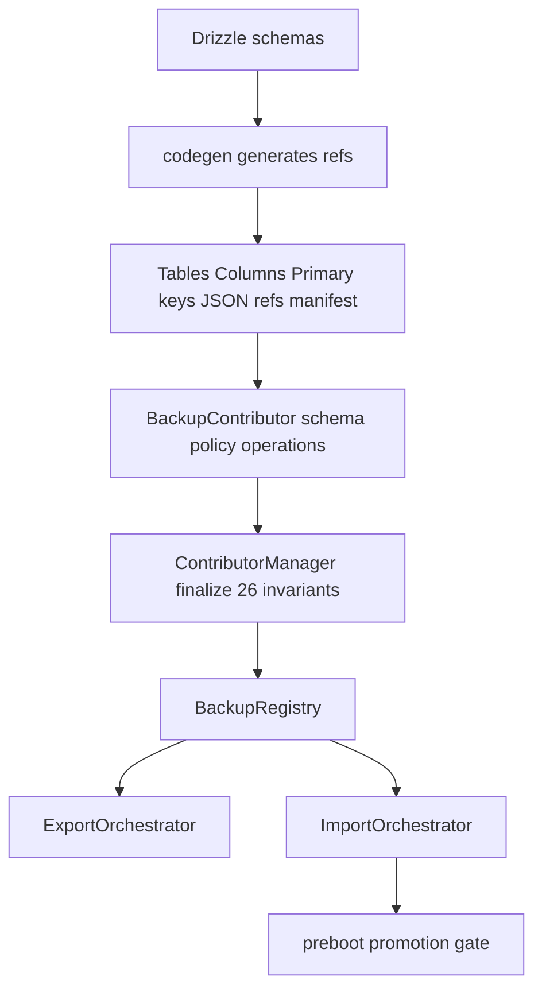
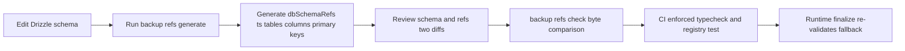
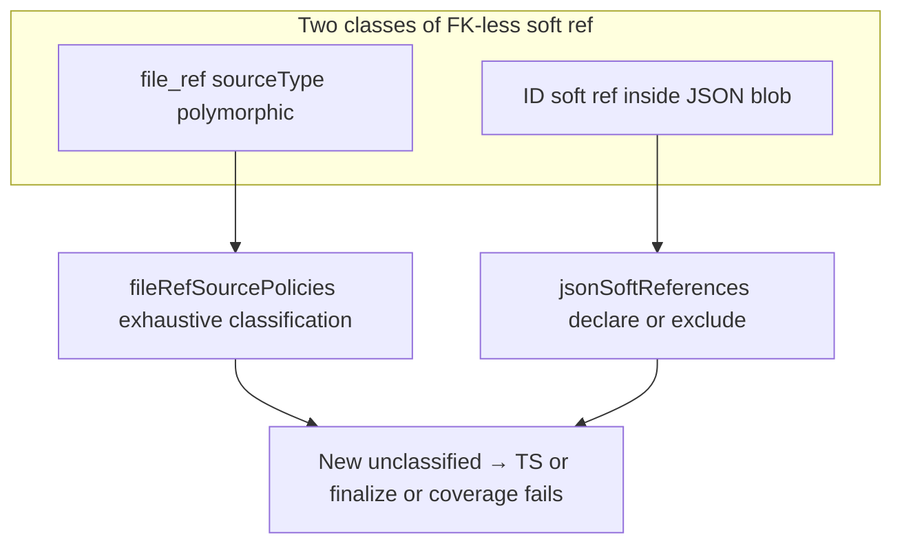
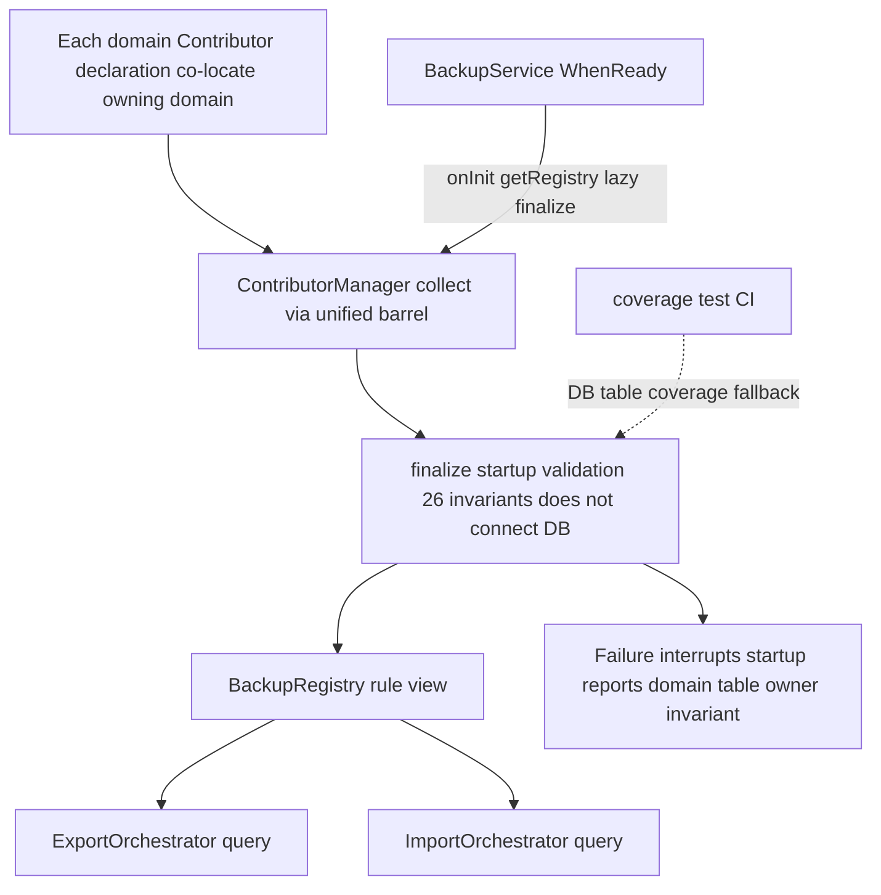

# Modular Backup Contributor Architecture Design — Final Review

> **TL;DR**: Break apart backup's centralized rule stores (`DomainRegistry`/`DomainStripper`/`DomainImporter`/`FileCollector`) into declarative `BackupContributor`s per business domain, and introduce **aggregate boundaries (AggregateBoundary)** so that conflict strategies propagate along whole-object boundaries in a statically verifiable way. Restore runs a full-database DB pre-snapshot (`VACUUM INTO`) + file snapshot + **detached write transaction** layered execution (file IO outside the transaction, DB import inside the transaction, aligning with the V2 `withWriteTx` philosophy; but in the D model the import target = detached `work.sqlite`, the transaction runs over a detached handle, **not** the live `DbService.withWriteTx`).

---

## 1. Product Requirements and Module Boundaries (Comparison Yardstick)

> [!NOTE]
> **This section is the comparison yardstick for the rest of the architecture (§2)**: every mechanism should trace back to an in-scope requirement here; anything that cannot (e.g. id remap) is over-design and should be identified during the review phase rather than argued case-by-case.

### Main scenarios
- Device migration: move user data to a new device and continue using it
- Loss prevention for local data: create a recoverable archive
- Local rollback / undo: return to pre-restore within a limited window after restore

### Data model prerequisites
- Cross-device identity stability: data in this library is identified by UUID or natural key; migration does not conflict and requires no ID regeneration
- (Technical prerequisite: all primary keys in the database are uuid v4/v7 or natural keys, with zero autoincrement primary keys; hence restore preserves source primary keys and performs no ID remap)

### What we do (in-scope)
- Backup scope: full preset includes all content; lite preset includes config, API key, chat history, assistant and Agent config (excludes images, knowledge bases, files)
- Restore rules: by default skip content already present locally; only add new content to the local device, never delete locally existing data; optionally "keep both" or "backup-wins"
- Restore safety: auto-save current state before restore; on failure or regret, can return to pre-restore
- Credentials: personal backup includes model provider API key by default

### What we do not do (non-goals)
- Multi-device real-time sync, remote push
- Sharing / troubleshooting redaction export
- Smart semantic merge (global MERGE / set-difference deletion); field-level FIELD_MERGE of natural-key aggregates is not in this category (see §3.1)
- User-visible domain-level selection UI (supported at the architecture layer, not exposed in UI)
- ID rearrangement for autoincrement or prefix primary keys (none exist in this library)

### Yardstick usage (identifying over-design)
When reviewing any mechanism, first ask "which requirement above does it serve". For example: "skip by whole object" serves main scenarios ①②; "restore pre-snapshot" serves restore safety and local undo (main scenario ③, loss prevention); while "ID remap" has no matching requirement (already excluded by the data prerequisites) → judged redundant and removed.

### Reading guide
When reading the architecture (§2), check two questions: ① can each contributor declaration be validated by types/codegen/coverage tests, is there an aggregate boundary for conflicts, and is there a failure-safety boundary for restore; ② do the product decisions (§3) match the user mental model.

---

## 2. Architecture Design

### 1. What this refactor solves

The SQLite backup code on the current branch exists only as a rule store and implementation reference, not as the architecture to keep. It is scattered across multiple centralized files; adding tables/references requires editing many places and easily leads to inconsistent export/restore semantics. (Note: the `DomainRegistry`/`DomainStripper`/`DomainImporter`/`FileCollector` in the table below are early v2 prototype names, not implemented on this branch; the current backup implementation is `LegacyBackupManager.ts`, and the table describes its imagined scattered structure to motivate the refactor.)

| Current location | Carries | Main problem |
|---|---|---|
| `DomainRegistry.ts` | Domain-to-table mapping, import order, internal table exclusion | Easy to miss new tables (e.g. agent_task) |
| `DomainStripper.ts` | Handling of omitted referenced domains, credential handling | Reference handling separated from table ownership |
| `DomainImporter.ts` | Unique-key merge, JSON reference remap, conflict handling | No mechanism for object-boundary SKIP |
| `FileCollector.ts` | Message file reference scanning | No unified classification of file-ref sources |

Two baselines: the user-visible product behavior baseline = legacy/v1 `LegacyBackupManager.ts` (IndexedDB/LocalStorage/optional Data); the architecture design baseline = the final contributor system in this proposal.

### 2. Overall approach: Entity facts + Backup policy + Operations (+ aggregate boundary)

Backup generation only operates on the backup copy and produces an archive; the backup file is the sole handoff artifact between backup and restore; restore consumes by default per the manifest domains and resources.

```mermaid
flowchart LR
  subgraph S1[Backup generation]
    A1[Choose preset full or lite] --> A2[ExportOrchestrator]
    A2 --> A3[Query ContributorManager]
    A3 --> A4[VACUUM INTO(createSnapshot) copy as backup.sqlite]
    A4 --> A5[beforeArchive preference filter (personal backup retains credentials; redaction belongs to future sharing mode)]
    A5 --> A6{Full preset?}
    A6 -->|Full| A7[Collect file and knowledge base resources]
    A6 -->|Lite| A7s[Skip external resource collection resources empty set]
    A7 --> A8[Trim missing file_entry/knowledge_base rows DB↔staged alignment]
  end
  subgraph S2[Backup archive]
    B[manifest plus backup.sqlite plus files plus knowledge]
  end
  subgraph S3[Restore consumption]
    C1[Read manifest to determine scope] --> C2[Create RestoreRecoveryPoint]
    C2 --> C3[Aggregate-boundary conflict strategy]
    C3 --> C4[Import rows defer FK via detached write transaction]
    C4 --> C5[FTS rebuild and consistency check]
    C5 --> C6[Result page and undo entry]
  end
  A8 --> B
  A7s --> B
  B --> C1
```

**manifest** (metadata of the sole handoff artifact between backup and restore, inside the archive at the same level as `backup.sqlite`/`files`/`knowledge`). Five fields in two categories:

- **Content scope**: `domains` (domains: full/lite), `resources` (file/knowledge base manifest)
- **Version compatibility**: `backupFormatVersion`, `schemaMigrationId`, `producerAppVersion`

The three version fields play different roles; only the first two enter the compatibility gate (§9 step 0):

| Field | Governs | Enters gate |
|---|---|---|
| `backupFormatVersion` | Archive **format** (from v2 = 1, major bump = incompatible → reject) | ✅ |
| `schemaMigrationId` | DB **schema** version fingerprint | ✅ |
| `producerAppVersion` | **app** version (`package.json`) | ❌ diagnostic/error message only |

- `schemaMigrationId` takes the producer's last migration's `when`(folderMillis) — drizzle migrate decides incremental by folderMillis, **not** tag lexicographic order, so comparison uses folderMillis as authoritative; the tag (e.g. `0005_lyrical_galactus`) is diagnostic only.
- **A release conversion point must major bump `backupFormatVersion`**: CLAUDE.md requires that before release `migrations/sqlite-drizzle/` be cleared and regenerated as a single brand-new clean initial migration (development-phase migrations are throwaway). This replaces the entire chain and breaks the continuity that migrate-forward relies on — the `schemaMigrationId` of an old backup points to the replaced old chain, and migrate-forward would take the new clean initial's `CREATE TABLE` and collide with tables already built in backup.sqlite (`table already exists`). Hence at that release version point, major bump formatVersion so that old-format backups are rejected directly at the gate instead of reaching a doomed migrate-forward.
- `producerAppVersion` does not enter the gate: the partial order of `schemaMigrationId` already implies the partial order of app versions; it is only used for user-visible error messages.

Each domain is represented by a `BackupContributor`:

| Layer | What goes in | What does not |
|---|---|---|
| Entity facts (schema) | Table ownership, reference facts, primary key shape, aggregate boundary, file-ref source, JSON soft reference | SET_NULL/DELETE_ROW/cascade-prune actions, import order, restore strategy |
| Backup policy | Omitted reference override, unique-key merge | Database I/O, file operations, async hooks (remap/idStrategies already removed) |
| Operations | File resource discovery, beforeArchive, per-row transform, afterImport (FTS rebuild in detached work.sqlite), blob restore, cloneAggregate | Facts and policies expressible as pure data |

> [!IMPORTANT]
> **The core mechanism is `schema.aggregates` (aggregate boundary)**, elevating object-boundary SKIP/OVERWRITE/RENAME from prose description to a statically verifiable mechanism.

#### Code architecture diagram: how the Contributor system maps to code



Four test categories: tsc + codegen check, coverage, equivalence, restore tests (aggregate conflict + preboot-promotion undo / detached-merge verification + identity propagation: DB owning FK and required JSON ref → natural-key target; polymorphic soft-ref pin/entity_tag selected-domain filter and RENAME case).

### 3. How to read a Contributor

| Reading order | Question to answer | Corresponding field |
|---|---|---|
| Ownership | Which user data tables does this domain own? | `schema.tables` |
| References | Which other domains does it reference? Which file-ref / JSON soft references belong to this domain? | `references`, `fileRefSourcePolicies`, `jsonSoftReferences` |
| Identity facts | What is the ID shape of each table? | `primaryKeys` (uuid-v4/uuid-v7/natural/composite) |
| Aggregate | What is the boundary of a user-visible object? How do conflicts propagate? | `aggregates` (root/identityKey/members/renamable) |
| Backup policy | Exceptions for missing referenced domains? Which unique keys to merge? | `omittedReferenceOverrides`, `uniqueMergeRules` |
| Operations | Any backup-specific behavior? If none, is schema-only explicit? | `operations` |

Internal exclusions (`app_state` / `job` / `*_fts` / `__drizzle_migrations`) are maintained by a global explicit exclusion set with reasons and do not enter contributor domains (`job_schedule` is a shared table, assigned to AGENTS by type row-scope, not excluded wholesale). **`__drizzle_migrations` is special**: it does not enter a contributor (not a business table), but **must be retained as backup.sqlite infrastructure metadata** — export's `createSnapshot` (VACUUM INTO) (and restore's `createSnapshot` / VACUUM INTO merge base) copies it along (§9 step 0 migrate-forward relies on it to determine producer migration state and only run incremental); "exclusion" here only means it does not participate in domain conflict strategy, **not deleted from the backup database**.

### 3.5. Domain overview (14 domains)

`Invariant 1` requires exactly 14 domains. The table below lists them centrally (for scattered information see §3.1 lite scope + §5 per-domain notes). `identityClass` / default `conflictDefault` are finalize derived values (§6.2 derivation rules); explicit declaration is only for deviating from the default.

| Domain | Aggregate root (+ include members) | identityClass | renamable | Default conflictDefault | Lite |
|---|---|---|---|---|---|
| PREFERENCES | `preference`[scope,key] / `note` (`(rootPath,path)` UNIQUE) | natural-key / natural-key | false | SKIP / SKIP (**settings-class exception**: local-first + backfill; `platformSpecificKeys` excludes cross-platform incompatible key, see §6 policy / §3) | ✓ |
| PROVIDERS | `user_provider` + `user_model` | natural-key | false | FIELD_MERGE | ✓ |
| PROMPTS | `prompt` | uuid-entity | false | SKIP | ✓ |
| MCP_SERVERS | `mcp_server` | uuid-entity | false | SKIP | ✓ |
| TAGS_GROUPS | `tag` / `group` / `pin` (single table) + `entity_tag` (polymorphic junction, tagId→tag cascade) | tag/pin natural-key (`tag.name`/`pin(entityType,entityId)` UNIQUE), group uuid-entity | false | tag/pin FIELD_MERGE, group SKIP | ✓ |
| ASSISTANTS | `assistant` + `assistant_mcp_server`/`assistant_knowledge_base` | uuid-entity | true | SKIP | ✓ |
| AGENTS | `agent_session`(+`agent_session_message`) / `agent_workspace` / `agent_channel` / `agent` + `job_schedule`(type='agent.task') row-scope + `agent_skill` (junction ref, agentId→agent + skillId→SKILLS) | agent_workspace natural-key (`path` UNIQUE), `job_schedule`(type='agent.task') natural-key (`(type,name)` UNIQUE), rest uuid-entity | session:false (workspaceId is cross-aggregate owning ref → independent agent_workspace aggregate, §5.4), rest false | agent_workspace/job_schedule FIELD_MERGE, rest SKIP | ✓ |
| MINIAPPS | `mini_app`(app_id) | natural-key | false | FIELD_MERGE | ✓ |
| SKILLS | `agent_global_skill` (`folderName` UNIQUE) | natural-key | false | FIELD_MERGE | ✓ |
| TOPICS | `topic` + `message` | uuid-entity | true | SKIP | ✓ |
| KNOWLEDGE | `knowledge_base` + `knowledge_item` | uuid-entity | **false** (`{baseId}` directory + `.cherry/index.sqlite` follow base id; RENAME clone cannot guarantee consistency; degrades to SKIP) | SKIP | ✗ |
| TRANSLATE_HISTORY | `translate_language` (natural-key langCode single table) + `translate_history` (uuid-entity independent aggregate, sourceLanguage/targetLanguage→translate_language optional ref) | natural-key / uuid-entity | false | FIELD_MERGE / SKIP | ✗ |
| PAINTINGS | `painting` (single table) | uuid-entity | false | SKIP | ✗ |
| FILE_STORAGE | `file_entry` | uuid-entity | false | SKIP | ✗ |

> Lite preset (§3.1): 10 domains included, 4 domains excluded (KNOWLEDGE / TRANSLATE_HISTORY / PAINTINGS / FILE_STORAGE). Junction tables (`agent_channel_task` / `agent_skill`) are not counted as aggregate members and follow independent junction reference.
>
> `note` is temporarily placed in PREFERENCES (a config/state domain): it is the state overlay (starred/expanded) of modules such as Notes, not part of the `preference(scope,key)` table; handled by `(rootPath,path)` natural-key + **SKIP** (settings-class local-first + backfill). **Body ownership (three-way distinction, do not conflate)**:
> - `note` table (this domain): state overlay only (`isStarred`/`isExpanded`); `rootPath`+`path` point to the Notes markdown file, **body not included**.
> - **Notes module note body** = filesystem markdown file (pointed to by `rootPath`/`path`, in an independent notes directory), belongs to **file resources** — backed up with file resources in full preset, not backed up in lite preset (which excludes file resources).
> - `knowledge_item`(type='note') is a **note item inside a knowledge base** (KNOWLEDGE domain, body at `raw/{slug}.md`), a different concept from Notes module notes.
>
> **Lite preset consistency**: when lite excludes file resources, the Notes markdown body is not backed up; if a `note` table state row has `rootPath` pointing to an un-backed-up markdown, the state is dangling after restore — must filter by selected-resource (only restore note state pointing to backed-up files, analogous to §5.2 polymorphic soft-ref filter). If clearer semantics are desired, it can be split into an independent domain later; not split in this phase.

### 4. TOPICS contributor example

Aggregate root `topic` + member `message(topicId)`; on conflict → the whole group (topic + its message tree) is processed by strategy.

### 5. Other contributor references

| Domain type | Aggregate boundary notes |
|---|---|
| ASSISTANTS | When RENAME-cloning, member assistantId is remapped to the new root PK |
| AGENTS | agent_workspace/agent_channel single-table renamable:false; agent_channel_task is a junction (double cascade FK); **job_schedule.type='agent.task' row-scope assigned to AGENTS** (natural-key `(type,name)`, FIELD_MERGE; Agent task definition, otherwise user tasks are lost by design); when job_schedule is merged by `(type,name)`, `agent_channel_task.taskId` (→ schedule id) must be rewritten via identity propagation to the local canonical schedule id (§5.4); re-arm is naturally completed by post-preboot-promotion restart + JobManager startup recovery (D model does no hot recovery, see §9) |
| FILE_STORAGE | restoreResources() runs before DB row import, returns skippedFileEntryIds; renamable:false, RENAME degrades to SKIP |
| PROVIDERS | Aggregate user_provider + user_model(providerId); natural-key, default FIELD_MERGE (apiKeys/authConfig field-level merge, prevent API key loss); renamable:false (user_model.id is a derived key) |

#### 5.1 file-ref ownership (split per source domain, not FILE_STORAGE-owned)

Post-#16532: the old polymorphic `file_ref` table has been split. `chat_message_file_ref` (FK `sourceId`→message cascade + `fileEntryId`→file_entry cascade) belongs to **TOPICS** (by source domain); `painting_file_ref` (FK `sourceId`→painting cascade + `fileEntryId`→file_entry cascade) belongs to **PAINTINGS**. Business services (TopicService / PaintingService) directly own persistent ref writes. **FILE_STORAGE only owns `file_entry`** — no longer the owner of ref tables.

These two junctions are junction tables with real single-column FKs (not polymorphic), so finalize #25 requires their owner to declare the FK (unlike `entity_tag` which is polymorphically exempt). The `temp_session` ref becomes pure memory (CacheService, no table).

`fileRefSourcePolicies` (sourceType→ownerDomain) covers 5 sourceTypes (`temp_session` runtime-only, `chat_message`→TOPICS, `painting`→PAINTINGS, `provider_logo`→PROVIDERS, `mini_app_logo`→MINIAPPS) and governs **export-phase file blob collection** — lands with the TOPICS/PAINTINGS/PROVIDERS/MINIAPPS contributors + temp_session runtime-owner decision (finalize #11).

**Implementation caveat**: ① post-restore consistency check (no dangling ref / no **internal** file_entry missing blob, rollback on failure; **external file_entry by design has no blob** — `origin='external'` only references `externalPath` user files, does not copy blob, cross-device inherent dangling by design (FILE_STORAGE origin semantics: external rows only reference user files via externalPath, internal rows own their blobs)); ② file_entry soft delete vs ref hard delete asymmetry (export filter must only take `deletedAt IS NULL`).

#### 5.2 junction reference handling under SKIP/RENAME (no cross-domain remap introduced)

junction reference (`agent_skill` / `agent_channel_task`, not counted in members derivation, not cloned with root): when root is SKIP, its rows are not imported either (cascade depends on root existence); when root is RENAME (renamable), junction rows are cascade-pruned with the old root and not cloned to the new root ("keep both" does not inherit junction binding — distinct from include members like `assistant_mcp_server` where "clone inherits"). **Double-end cascade is guaranteed by DB FK + `defer_foreign_keys`, with no cross-domain id remap** (consistent with the removed idStrategies: preserve source primary key). Attachment rendering relies on the `message.data.fileEntryId` JSON soft reference (source PK preserved), not on the file-ref junction's `sourceId` (orphan detection only) — so RENAME of source requires no file-ref remap.

**Polymorphic soft-ref selected-domain filter**: `pin(entityType,entityId)` / `entity_tag(entityType,entityId,tagId)` polymorphically point to domain entities such as topics/sessions/knowledge/file/painting via entityType (no FK). When lite preset excludes KNOWLEDGE/FILE_STORAGE/PAINTINGS, if TAGS_GROUPS imports pin/tag bindings pointing to excluded domains, it would restore pin/tag state pointing to missing objects — must filter by selected-domain (only import bindings pointing to restored domains), and include them in soft-reference coverage/finalize validation (entityType→domain mapping is exhaustive; missing → finalize fails). On RENAME, these polymorphic bindings are not cloned with root (distinct from entity_tag junction cascade-prune).

#### 5.3 RENAME cross-aggregate reference and scalar soft ref (known edge case, handled during implementation)

- **topic.activeNodeId**: scalar text soft ref (pointing to message, no FK). TOPICS `renamable:true`; when RENAME-cloning topic, `activeNodeId` **must** be rewritten by cloneAggregate (mapped to the id of the corresponding message of the new topic), otherwise the restored topic points to a node of the old aggregate / dangling reference — listed as a required rewrite rule of this domain's `cloneAggregate` + covered by finalize/test matrix (non-optional edge case). (RENAME/ownership of agent_session.workspaceId see §5.4)

> Note: current schema has no `topic_node`/`topic_edge` table; if introduced in future, their `topicId`/`sourceId`/`targetId` must also be rewritten via id mapping.

#### 5.4 Cross-aggregate owning FK handling (compact mode + workspace ownership)

- **assistant_knowledge_base.knowledgeBaseId** (compact mode): lite preset excludes KNOWLEDGE, but assistant_knowledge_base (ASSISTANTS include member)'s knowledgeBaseId→knowledge_base is NOT NULL cascade. When KNOWLEDGE is not selected, follow omitted owning → DELETE_ROW (delete the link row; assistant retained but without knowledge binding) — aligns with lite-preset semantics.
- **agent_session.workspaceId → independent agent_workspace aggregate** (**intra-domain cross-aggregate** owning reference: agent_session and agent_workspace are in the same AGENTS domain, but two separate independent aggregate roots): workspaceId is a cascade NOT NULL owning FK, but target `agent_workspace` (natural-key `path` UNIQUE) is an independent aggregate root, not `session.root`, so invariant 14 (members only collect intra-domain owning include refs pointing to this root) does not count it into session.members, and workspace is not forced to be a member. This is not equal to evading owning validation: invariant 25 (every DB FK must be declared by owner contributor) forces AGENTS to declare this FK → invariant 19 (onDelete=cascade corresponds to kind=owning) validates self-consistency (codegen `DB_FOREIGN_KEYS` as data source). `agent_session` renamable:false (cross-aggregate owning clone contradiction + collides with `path` UNIQUE). **Pending product confirmation**: workspaceId NOT NULL cascade — if one workspace is shared by multiple sessions, deleting workspace cascades to delete all bound sessions; whether this is as expected (§3.6).
- **identity propagation (owning FK rewrite after natural-key target merge)**: when an owning/required FK points to a **natural-key aggregate** (target merged via identityKey FIELD_MERGE, local UUID wins), the importer must build a `{backup target id → local canonical id}` mapping and rewrite this FK to the local id when importing source — otherwise the backup target uuid is merged away by FIELD_MERGE and the owning FK dangles (`defer_foreign_keys` COMMIT fails or source is lost). Applies to all FKs pointing to natural-key target (rewritten when target merged via FIELD_MERGE): owning/required (typical `agent_session.workspaceId → agent_workspace`, cross-device same path different uuid) must rewrite, otherwise FK hard fails; optional (e.g. `translate_history.sourceLanguage → translate_language`) rewrite to preserve association or SET_NULL per optional semantics (cannot leave dangling backup uuid); junction (e.g. `entity_tag.tagId → tag`) cascade-pruned with root (§5.2), FK rewritten together when target merged. **≠ removed ID remap**: remap generates a new uuid for a uuid-entity source record PK (not needed, preserve source PK idempotent); identity propagation redirects the source FK to the natural-key target's canonical id (source record PK unchanged, required by natural-key merge). The rewrite boundary is by whether the ref is **required** (not by whether JSON): **tolerant** ref (`message.data.fileEntryId` attachment soft ref, `file_ref.sourceType`, missing only degrades to Toast + orphan detection) is not rewritten when target merged/missing; **required** ref (target missing → functionality broken) must be rewritten when target merged — includes DB owning FK (`agent_session.workspaceId`) **and required JSON ref** (AGENTS: `agent_channel.workspace.workspaceId`, `job_schedule(type='agent.task').jobInputTemplate.workspace.workspaceId`, both `AgentSessionWorkspaceSource`). The latter is marked as required class via `jsonSoftReferences` (§6.1) and participates in identity propagation; otherwise restore appears successful (`foreign_key_check` passes) but channel/scheduled task reference a dangling workspace.

### 6. Implementation-side type contracts

#### 6.1. EntityGraphSchema and type entry

`EntityGraphSchema`: `tables` / `references` (kind: optional|owning|junction) / `primaryKeys` (kind: uuid-v4|uuid-v7|natural|composite|autoincrement(finalize rejects), ambiguous annotation) — **composite tightened**: only faithfully expresses existing schema facts (e.g. `preference[scope,key]` configuration slot, `entity_tag`/`agent_channel_task` etc. junction composite PK); composite tables do not carry new aggregate root conflict strategy (junctions only participate in FK/coverage validation), new composite roots require finalize allowlist + architecture review / **`aggregates`** (`AggregateBoundary { root, renamable, [identityKey?], [identityClass?], [conflictDefault?], [members?] }` — except `root` and `renamable`, all other fields are derived from `references + primaryKeys`; contributor explicit declaration is only for deviating from defaults) / `fileRefSourcePolicies` / `jsonSoftReferences` / `rowScopes?` (shared table row partition, e.g. job_schedule.type='agent.task' assigned to AGENTS). Derivation rules: identityKey = root PK; identityClass = primaryKeys[root].kind: uuid-v4/v7 → uuid-entity, natural/composite → natural-key (slot must be explicit); conflictDefault = identityClass mapping (uuid-entity → SKIP; natural-key/slot → FIELD_MERGE); members = source tables of intra-domain owning include references pointing to root (junction tables and cross-domain refs not counted, invariant 14 rejects drift).

`BackupContributorPolicy`: `omittedReferenceOverrides` (exceptions only, must bind to fact + non-redundant + reason), `uniqueMergeRules`, `fieldMergePolicies` (FIELD_MERGE field-level merge, each column declares one `FieldMergeStrategy`, four choices: `remote-fills-local-null` fill only when local column is NULL, `remote-fills-local-empty` fill when local column is NULL or empty value like `[]`/`{}`/empty string, `deep-merge` recursively deep-merge objects, `local-priority` local priority keeps non-empty), **`platformSpecificKeys?`** (PREFERENCES only: declare platform-related key patterns, e.g. `shortcut.*` / `*.path`, **excluded** at restore — not imported cross-platform, to avoid non-existent paths/wrong shortcuts; portable keys normally SKIP + backfill; specific list provided by PREFERENCES owner. **finalize validation**: key pattern valid (glob syntax) + only PREFERENCES domain may declare, non-PREFERENCES declaration rejected). **PROVIDERS use case**: `user_provider.apiKeys` and `user_provider.authConfig` use `remote-fills-local-empty` — local seeded `[]` empty array / skeleton object treated as missing, if remote backup has non-empty credential then fill in, thereby preserving user backed-up API key not overwritten by local empty seed (consistent with §3.5 / §5 PROVIDERS "FIELD_MERGE prevent API key loss"). **Does not include** restoreRemap / idStrategies (over-design, removed).

> [!WARNING]
> **Type entry**: `DbTableName` / `DbColumnName` must come from Drizzle codegen, not hand-written as attestation. `DbColumnName` is the Drizzle **property name (camelCase, e.g. topicId / providerId / fileEntryId)**; the physical SQLite column is auto-converted to snake_case by DbService `casing:'snake_case'` (topic_id). Backup goes through the drizzle builder throughout (`BackupScopedDb` does not expose run/raw/Client); drizzle handles casing conversion automatically, so there is no bare-SQL column-name risk.

#### 6.2. `AggregateBoundary` derivation formula (fact-derived, opposes hand-written redundancy)

Of the six fields of `AggregateBoundary`, only `root` (domain fact: which table is the semantic "object" root) and `renamable` (domain fact: whether it can be safely cloned) are genuinely new information; the other four fields are **derived from `references + primaryKeys` by default**, and contributor explicit declaration is used only when deviating from the default derivation; explicit overrides must also be self-consistent with the derived result (invariant 14 rejects drift).

| Field | Default derivation | When explicit | Exception reason |
|------|----------|----------|-------------|
| `root` | — (hand-written) | required | — |
| `renamable` | — (hand-written) | required | — |
| `identityKey` | `primaryKeys[root].columns` (root PK); **when root has a UNIQUE constraint (non-PK), identityKey must include the UNIQUE key** (business alignment, prevents cross-device same-value different UUID colliding with SQLite UNIQUE — e.g. agent_workspace.path / tag.name / note(rootPath,path) / pin(entityType,entityId) / agent_global_skill.folderName / job_schedule(type,name)) | PK is composite and UNIQUE key is not all PK | "natural-key composite PK uses single column" |
| `identityClass` | `primaryKeys[root].kind`: `uuid-v4`/`uuid-v7`→`uuid-entity`, `natural`/`composite`→`natural-key`; **root has UNIQUE constraint (non-PK) → natural-key** (business unique key alignment, FIELD_MERGE prevents SKIP colliding UNIQUE) | `slot` (predefined slot) | "preset provider slot, not inferable by codegen; composite→natural-key: the composite PK of an aggregate root must be a natural composite key (e.g. preference[scope,key]); junction tables do not take this path (not root)" |
| `conflictDefault` | `uuid-entity`→`SKIP`; `natural-key`/`slot`→`FIELD_MERGE` | explicitly declared when a domain deviates from default (e.g. to OVERWRITE) | "currently only preference/note deviates (SKIP, settings-class exception, see invariant 21); others have no deviation (PROVIDERS uses FIELD_MERGE); any new deviation requires reason + invariant 21 validation" |
| `members` | source tables of intra-domain owning include references pointing to root (junction tables and cross-domain refs not counted) | when a default member needs to be excluded (e.g. "message.parentId self-reference not counted in aggregate") | "self-ref does not participate in aggregate" |

Derivation is performed by `finalize` at startup, **not** during hook invocation. The "exceptions only, must bind to fact + reason" pattern established by `omittedReferenceOverrides` applies equally here.

#### Codegen landing plan

`scripts/generate-backup-schema-refs.ts` (tsx) discovers `sqliteTable` in `schemas/*.ts`, reads table/column/PK names via `getTableConfig()`, and stably sorts output to `dbSchemaRefs.ts` (lands in neutral layer `src/main/data/db/backup/dbSchemaRefs.ts`, main-only; `DB_TABLES`, `DB_COLUMNS_BY_TABLE`, `DbTableName`, `DbColumnName<TTable>`, `DB_PRIMARY_KEYS` with uuid-v4/v7 determination and ambiguous annotation). Does not connect to DB, does not start Electron. `pnpm backup:refs:generate` writes to disk, `pnpm backup:refs:check` does byte-for-byte comparison (CI enforced) — **both commands are delivered** (Track A2 adds the `package.json` scripts + the CI-enforced `build:check` gate).



Generated artifacts: `DB_TABLES`, `DB_COLUMNS_BY_TABLE` (camelCase property name; physical column converted to snake_case by `casing:'snake_case'`), `DbTableName`, `DbColumnName<TTable>`, `DB_PRIMARY_KEYS` (with uuid-v4/v7 determination and ambiguous annotation), `DB_FOREIGN_KEYS` (multi-column FK + onDelete, for invariant 19/24/25 validation), `DB_FTS_VIRTUAL_TABLES` (FTS5 virtual table → content table; ALWAYS_STRIP exclusion of ftsTable is guaranteed by invariant #4, contentTable owner guaranteed by invariant #2, for post-restore FTS rebuild). Hand-written as DbTableName is not an attestation path; must go through helper.

| Four-layer protection | Failure timing |
|---|---|
| TypeScript intercepts non-existent tables/columns | Compile time |
| backup:refs:check prevents schema-refs divergence | CI |
| registry test covers new table/column renames/stable output | Test |
| finalize re-validates at runtime using DB_TABLES | Startup time |

#### JSON soft reference coverage mechanism



| Classified item | Ownership |
|---|---|
| `chat_message` | TOPICS |
| `knowledge_item` | KNOWLEDGE |(Forward-looking: `knowledge_item` to be registered in `@shared/data/types/file` when KNOWLEDGE file-ref lands; current `allSourceTypes` registers `temp_session`/`chat_message`/`painting`/`provider_logo`/`mini_app_logo`)|
| `painting` | PAINTINGS |
| `provider_logo` | PROVIDERS |
| `mini_app_logo` | MINIAPPS |
| `temp_session` | excluded (runtime) |
| `message.data` (file_entry id in `parts[].providerMetadata.cherry.fileEntryId`, non-top-level fileId) | TOPICS jsonSoftReferences |
| `agent_session_message.data` (file_entry id in `parts[].providerMetadata.cherry.fileEntryId`) | AGENTS jsonSoftReferences (tolerant) |
| `agent_channel.workspace.workspaceId` / `job_schedule(type='agent.task').jobInputTemplate.workspace.workspaceId` (`AgentSessionWorkspaceSource`) | AGENTS jsonSoftReferences (**required**, target merge participates in §5.4 identity propagation) |

> JSON soft ref falls into two classes: **tolerant** (`fileEntryId` attachment, missing degrades to Toast + orphan detection, does not participate in identity propagation) and **required** (`workspaceId` of `AgentSessionWorkspaceSource`, target merge must identity propagation §5.4, missing → functionality broken). The required class must be explicitly marked in `jsonSoftReferences`, otherwise channel/scheduled task silently reference a dangling workspace after restore.

### 7. Registration model and startup validation



Registration to consumption chain: each domain contributor declaration **co-locates in the owning domain module** → ContributorManager (non-lifecycle named-export singleton) collected via unified barrel → finalize validates 26 invariants at startup (does not connect to DB) → on pass produces BackupRegistry for orchestrator querying; on failure startup is interrupted and domain/table/owner/invariant reported. `BackupService` (WhenReady) calls `contributorManager.getRegistry()` in `onInit()` to **lazily trigger** finalize (first synchronous finalize + deep freeze + cache, idempotent), equivalent to the original `@DependsOn` ordering but without promoting the pure static finalizer to a lifecycle service; actual DB table coverage is the fallback of coverage test (CI), so finalize does not connect to DB.

Each hook's timing and default: collectFileResources (collect files before export / default empty set), beforeArchive (after stripping only modify backup copy / no-op), transformRow (before import / original row, return null to skip this row), restoreResources (before DB import, outside transaction / none), cloneAggregate (only renamable aggregate RENAME / missing → finalize rejects). **When an aggregate root is SKIP'd, its members' transformRow is not called**.

**Restore-phase hooks are split into two stages** (in-tx vs post-tx boundary strictly separated, aligns with §9 "detached write transaction fn allows only DB ops" constraint — transaction runs over detached `work.sqlite` handle, **not** live `DbService.withWriteTx`):
- **`afterImport` (in detached work.sqlite, before commit)**: runs **inside** the detached write transaction, **before commit**, only allows derived operations depending on rows already written to work.sqlite — mainly **FTS rebuild** (TOPICS calls `rebuildMessageFts`, AGENTS calls `rebuildSessionMessageFts`, reuses in-tx imported rows, rebuilds FTS5 content table, commits consistently with business rows in the same transaction). This is importer responsibility (§9), completed offline on work.sqlite, not live.
- **(D model has no `afterCommit`)**: live DB is never written in-process, detached work.sqlite holds no runtime cache; old post-tx duties (PREFERENCES cache reload / AGENTS `job_schedule` timer re-arm) are naturally completed by **restart** after preboot promotion — PREFERENCES cache fresh-loaded by `PreferenceService.onInit`, AGENTS timer re-armed by `JobManager` startup recovery. Hence no longer needs `reloadFromDb` / `rearmSchedulesAfterImport` / `afterCommit` hook.

> [!IMPORTANT]
> **Contributor placement / ownership**: each contributor declaration **co-locates at the actual location of the domain's owning module** (respects existing main-process directory boundaries). The actual convention is **data layer flat** — 14 contributors all in `src/main/data/services/backupContributor<Domain>.ts` (e.g. `backupContributorTopics` / `backupContributorProviders` / `backupContributorKnowledge` / `backupContributorAgents`, unique filename); data declarations belong to the data layer, avoiding backup→business-module reverse dependency. Exceptions: `src/main/data/backupContributorPreferences.ts` (one level up), `src/main/services/translate/backupContributor.ts` (TRANSLATE_HISTORY co-locates business module). The `features/knowledge/` / `ai/` etc. business module paths are only non-binding co-location examples (early idea, currently not adopted). Contributor-consumed pure types / context types / runtime helpers / codegen artifacts / enums belong to the **process-local neutral layer** `@main/data/db/backup/` (data/schema-owned, main-only: `contributorTypes` / `contexts` / `freeze` / `dbSchemaRefs` / `domains[BackupDomain+ConflictStrategy]`); business domains and the backup service import in the **same direction** — avoids data-domain contributor → services/backup reverse dependency, and the shared layer is not enlarged (codegen artifacts / main-only enums do not go in shared). The backup module (`src/main/services/backup/`) only holds the unified barrel (aggregates 14 domain exports) + registry + finalize + orchestrator, **does not carry domain-specific facts**, nor contributor-consumed types/helpers (those belong to the neutral layer).

> [!TIP]
> **lifecycle boundary**: `ContributorManager` is positioned as a **non-lifecycle named-export singleton** (`export const contributorManager = new ContributorManager()`), **does not** enter `serviceRegistry.ts`, does not get `@ServicePhase` — it holds no long-lived resources, does not connect to DB, has no IPC/timer/event subscription, and only has the pure-functional behavior of "one-time finalize at startup producing a frozen BackupRegistry" (aligns with the CLAUDE.md Non-Lifecycle Services decision guide). finalize is **lazily triggered** by `BackupService.onInit()` calling `getRegistry()`: on failure throws `ContributorFinalizeError` → BackupService.onInit fails → lifecycle container refuses to start (startup-time validation semantics preserved). `BackupService` remains WhenReady (holds orchestrator / write quiesce orchestration / journal / relaunch trigger and other long-lived resources; preboot promotion gate is a db module exported pure function, not via BackupService); finalize only validates static consistency and **does not connect to DB** (DB coverage ensured by coverage test, avoiding WhenReady services depending on DbService in violation).

### 8. Architecture checklist

| Checkpoint | Evidence |
|---|---|
| Table ownership | §1 matrix + coverage test (post-sync target state full-table coverage; pre-sync dynamically computed by current state) |
| Aggregate boundary | schema.aggregates + invariants 13-16 |
| Reference facts | ReferenceKind derivation + invariants 6/7 |
| JSON soft reference | invariant 12 |
| File consistency | restoreResources + consistency check |
| Restore safety | RestoreRecoveryPoint (in-scope) |
| Version compatibility | manifest version gate + migrate-forward (§9 step 0) |
| identity propagation | owning/required FK → rewrite after natural-key target merge (§5.4) |
| Restore semantics | merge semantics, no set-difference deletion |

### 8.5. finalize 26 invariants (complete list)

`ContributorManager.finalize()` validates the following 26 invariants at startup (does not connect to DB, pure in-memory). Each failure throws `ContributorFinalizeError(invariantId, payload)`, with payload containing `domain/table/sourceType/owner/violated invariant` fields.

| # | Invariant | Failure-locating payload |
|---|--------|------------------|
| 1 | Exactly one contributor per domain (14 domains) | `{ missingDomains \| extraDomains }` |
| 2 | Each Drizzle user-data table has exactly one owner or is excluded with reason | `{ table, status: 'unowned' \| 'multi-owned', owners }` |
| 3 | No table owned by multiple contributors | `{ table, owners }` |
| 4 | ALWAYS_STRIP / INFRASTRUCTURE tables not owned by contributor | `{ table, declaredBy }` |
| 5 | Runtime tables in the exclusion set (job) indeed have no contributor declaration; job_schedule is not excluded wholesale (type='agent.task' row-scope assigned to AGENTS) | `{ table }` |
| 6 | The **source table** (ref.table) of references belongs to the declaring owner; target (referencedDomain) may be cross-domain (e.g. message.modelId→PROVIDERS), validated by the target owner | `{ domain, table }` |
| 7 | omittedReferenceOverrides bind a declared reference + non-redundant + reason | `{ domain, reference, reason }` |
| 8 | Each owned table has exactly one primary-key fact, columns exist in codegen | `{ table, expectedColumns }` |
| 9 | Primary key kind is not ambiguous | `{ table }` |
| 10 | The dependency graph derived from references has no cycle | `{ cycle: domains[] }` |
| 11 | Each FileRefSourceType has an owner or runtime-only exclusion | `{ unownedSourceType }` |
| 12 | Each known JSON soft-ref field is classified or excluded | `{ table, column }` |
| 13 | Each aggregate.root is in owner, identityKey is its PK or a business UNIQUE key (§6.2: include UNIQUE key when there is a UNIQUE constraint; natural-key/slot identityKey that is not PK must be confirmed by codegen `DB_UNIQUE_KEYS` to actually have a UNIQUE constraint, PK-backed identityKey exempt) | `{ domain, aggregate, missingUnique }` |
| 14 | aggregate.members derived from owning include references (junction tables, cross-domain refs, and intra-domain owning refs pointing to other aggregate roots are not counted — only owning refs pointing to this root enter members) + parent chain acyclic and unique | `{ domain, aggregate, member }` |
| 15 | Each member table in members belongs to this contributor; viaColumn is a real FK column pointing to root.identityKey or a parent member's PK (multi-layer cascade A→B→C, C.viaColumn→B, §6.2 parent derivation) | `{ domain, aggregate, member }` |
| 16 | renamable:true aggregate has operations.cloneAggregate | `{ domain, aggregate }` |
| 17 | schema is deep-frozen | N/A (internal) |
| 18 | Failure message contains domain/table/sourceType/owner/violated invariant | N/A (internal) |
| 19 | Each EntityReference.kind is self-consistent with the generated FK onDelete | `{ domain, reference, schemaOnDelete, declaredKind }` |
| 20 | junction/co-owned FK does not declare optional; NOT NULL columns cannot SET_NULL | `{ domain, reference, column, nullability }` |
| 21 | natural-key/slot aggregate's explicit conflictDefault is not SKIP —— **settings-class exception** (preference/note: SKIP local-first + backfill + `platformSpecificKeys` excludes cross-platform incompatible key). The #21 id is also reused, disambiguated by a `deviation` subkey, for `platformSpecificKeys` scope validation (only PREFERENCES may declare it + glob syntax legality) and `polymorphicEntityMap` routing-value validation (each EntityType maps to a known BackupDomain or `excluded`). | `{ domain, aggregate, identityClass, conflictDefault, deviation? }` |
| 22 | Primary key kind is not autoincrement | `{ table, kind: 'autoincrement' }` |
| 23 | Shared table row-scope coverage is exhaustive | `{ table, uncoveredTypes }` |
| 24 | Declared EntityReference corresponds to a generated FK | `{ domain, reference }` |
| 25 | Reverse: every DB FK must be declared by owner contributor | `{ table, columns, missingFromDomain }` |
| 26 | renamable:true aggregate's root PK is single-column (importer's newRootKey is a single value, cloneAggregate only replaces one PK column) | `{ domain, aggregate, pkColumns, reason }` |

**Implementation basis**:
- Invariant 13 (unique-backing) requires codegen to generate `DB_UNIQUE_KEYS` (aggregating three sources from `getTableConfig()`: indexes(unique)/uniqueConstraints/column isUnique) as data source
- Invariant 19 / 24 requires codegen to generate `DB_FOREIGN_KEYS` (`getTableConfig()` reads FK info) as data source
- Invariant 5 depends on `job_schedule` row-scope coverage
- Invariant 14/15 derived from owning references (§6.2 `AggregateBoundary` derivation formula)
- DB_FTS_VIRTUAL_TABLES is covered by #2/#4 (**no standalone FTS invariant**): contentTable (value, e.g. message) ∈ DB_TABLES validated by #2 owner, FTS virtual table (key, e.g. message_fts) ∈ ALWAYS_STRIP validated by #4 exclusion — avoids a new invariant redundant with #2/#4

### 9. Restore Orchestration: Detached Merge + Preboot Promotion (aligned with @0xfullex #16714)

> [!NOTE]
> **This section is the D-model target-state for restore.** Upstream `createSnapshot`/`applyMigrations`/preboot promotion gate (`backupRestoreGate.ts` / `runRestorePromotion`) **landed via #16884 (merged to main)**. The C-import **staging spine** (`ImportOrchestrator`: quiesce → fingerprint → snapshot → merge → migrate → seal → stage → 2nd fingerprint → staged journal + `BackupService.startRestore`/`performRestoreRecovery`) and detached merge engine are **in this PR** — `BackupService.startRestore` runs the spine via **partial quiesce** (`BACKUP_IN_PROGRESS` IPC gate + `JobManager.pause` #16925 + best-effort `drainInFlight`); merge **SKIP-only**. Full quiesce (a1 WindowManager hold + #17014 AI/channel pause) + OVERWRITE/RENAME/FIELD_MERGE + file blobs/KB/Notes stagers = **follow-up**; `startRestore` no longer throws `BACKUP_RESTORE_NOT_READY`. SKILLS `dir-add` is covered only by unit tests (`restoreJournal.ts` schema + preboot gate consume path in `restorePromotion.ts`); file blobs, knowledge directories, Notes, and complete write-quiesce remain fail-closed / deferred. Hook context types in `contributorTypes.ts` document D-model semantics in JSDoc (`AfterImportContext` / `RestoreResourceContext`); `restoreResources` is a paper contract (the preboot gate drives blob promotion via `RestoreJournal.fileResources`, not a per-contributor runtime hook).

Restore runs the **D model** (Detached Merge + Preboot Promotion, aligned with @0xfullex #16714): **never touch the live DB in-process** — at runtime merge on a detached `work.sqlite` copy, preboot atomic rename promotion. The live DB is only rename-replaced during the preboot zero-connection window, structurally eliminating the entire class of risks: half-restored / WAL sidecar replay / runtime rollback. Merge semantics (SKIP / FIELD_MERGE / only-add + aggregate conflict + identity propagation) are all preserved; only the import target changes from live to detached work.sqlite.

**Runtime (UI blocked)**:

0. **manifest version gate** (first step of restore, read-only on archive, **does not touch live DB**):

   - **Format validation**: `backupFormatVersion` major bump = incompatible → reject + clear error
   - **Schema comparison** (using `schemaMigrationId`'s `when`(folderMillis) as authoritative order, **not tag lexicographic order** — drizzle migrate decides incremental by folderMillis), three statuses:
     - **Old backup** (consumer chain prefix contains producer end) → **migrate-forward**: on `backup.sqlite` in an **independent better-sqlite3 Database connection** (not live `DbService.sqlite`, to avoid polluting the live connection) run drizzle `migrate` to consumer's last entry — because the archived copy (export `createSnapshot` / VACUUM INTO) carries producer's `__drizzle_migrations`, the migrator automatically applies only post-producer incremental
     - **New backup / cross-branch fork** (producer end not on consumer chain) → **reject**, prompt to upgrade app
     - **Equivalent** → direct import
   - **Failure cleanup**: migrate-forward failure (backup corrupted / migration SQL execution failure) = gate failure; abort restore, retain live DB original state (untouched), delete temporary `backup.sqlite`, **does not require any runtime rollback** (live DB never touched under the D model), and report error to user "backup cannot be restored: file corrupted or unsupported version"
   - migrate-forward runs the release migration chain (`migrations/sqlite-drizzle` release artifact), does not touch development-phase drift; cross-branch table-set differences (`agent_task` vs `painting`/`agent_workspace`, §4) are identified by chain position and resolved via migrate-forward
1. **write quiesce** (bounded, strict subset of the old RESTORE BARRIER): before createSnapshot, quiesce + drain **all** live SQLite writers; missing even one may violate "never delete local data" (@0xfullex #16714):
   - **pause three main-side DB writers**: JobManager (cron / GC / overdue) + in-flight AI streams / agent turns + inbound channel messages; otherwise their writes land on old live after snapshot, lost at promotion. The quiesce interface is owned by each module.
   - **drain in-flight renderer-originated writes**: restore SHALL guarantee **no renderer-originated DB write** within the snapshot→relaunch window — this is an **explicit C-import requirement, not an assumption** (the pre-quiesce codebase had no restore gate; **this PR adds the IPC restore gate** — DataApi/Preference/IpcApi reject mutations via `BACKUP_IN_PROGRESS`, see Mechanism below; the window-level hold a1 remains follow-up). **Mechanism — PARTIAL in this PR, full follow-up**: this PR gates IPC mutations via a `BACKUP_IN_PROGRESS` flag (`src/main/services/backup/quiesceGate.ts`, module singleton held for the restore window) at each mutation dispatcher — DataApi `IpcAdapter` rejects non-GET requests, `PreferenceService` rejects `Preference_Set`/`SetMultiple`, `IpcApiService` rejects non-`backup.*` routes (read requests pass; merge runs on a detached `work.sqlite`, so live reads stay safe). BackupService additionally `pause`s JobManager (#16925, refcounted hold gates new dispatch + croner) and `drainInFlight`s its in-flight executions (best-effort, bounded timeout) before the snapshot. **Full quiesce (follow-up)**: a1 — WindowManager `acquireMutationCapableWindowHold()` destroys all mutation-capable renderer BrowserWindows (kill renderer process, no renderer can send IPC) + blocks subsequent mutation-capable window opens + pauses pool/replenish; main-process **native progress UI** replaces renderer `RestorePopup` ("disable window" is not enough — a disabled BrowserWindow's renderer JS still runs and sends IPC; stronger than V1 `RestorePopup` because the D-model SQLite import window is longer); #17014 pauses AI streams / agent turns / channel messages. **Residual write paths partial quiesce does NOT cover**: legacy `File_`/`Cache_` write IPC, main-process `DbService` direct writes outside IPC, un-drained AI/channel turns — the preboot promotion gate (#16884 atomic rename) is the correctness backstop for any write that slips past. **Quiesce status**: #16850 (JobManager) **DONE via #16925 MERGED** + `drainInFlight` + IPC `BACKUP_IN_PROGRESS` gate **this PR**; AI/channel = **#17014 OPEN** (fixes #16849); a1 WindowManager hold = follow-up.
   After restore relaunch, cache naturally fresh-loads; at apply time there is no live writer.
2. **`createSnapshot(work.sqlite)`** — VACUUM INTO, as **merge base** (= current live copy, including `app_state` / `migration_v2_status`).
3. **detached connection** (independent better-sqlite3, not live `DbService.sqlite`): run contributor import pipeline on work.sqlite (handle parameterized, detached drizzle, not `DbService.getDb()`; merge semantics SKIP / FIELD_MERGE / only-add preserved; `defer_foreign_keys=ON` + upsert / leaf-cascade, see below) + `applyMigrations` (backup already migrate-forwarded in step 0; custom SQL) + **FTS rebuild** (importer responsibility, in work.sqlite) + **offline verification** (integrity_check + foreign_key_check + domain checks + FTS consistency). A work.sqlite that fails verification is never promoted.
4. **restore journal** (userData sidecar file, shape see contract below) write + per-step write-ahead fsync + `application.relaunch()` (dev mode does not relaunch → prompt manual).

**preboot** (in `src/main/main.ts` `startApp()` first; after `application.initPathRegistry()`, before `await runV2MigrationGate()`; **separate sibling `backupRestoreGate.ts`** — upstream-landed #16884; precedent `runV2MigrationGate` / `MigrationDbService`; one-domain-one-file):

5. **promotion gate** (db module exported pure function `runRestorePromotion`, consumes narrow journal contract, does not know backup semantics): validate `state == 'staged'` ∧ **fingerprint** matches ∧ **`journal.db.chain` is an item-wise prefix of the app's bundled chain** (`chainIsBundledPrefix`; see contract below).
   - **Pass** → checkpoint(TRUNCATE) + close old live (temporary connection) → delete stale -wal/-shm (**sidecar hygiene**, prevent WAL replay) → rename live → `live.pre-restore-<restoreId>` (**undo snapshot, zero-copy**) → rename work → live → **file resources promotion** (by visibility order, see below) → open + integrity_check → journal terminal.
   - **No match** → mark `expired` / `failed`, boot old live, surface "please re-run restore".
   - **gate never throws except the live-stranded pre-flight** (`isLiveDbStranded` — empty live slot + aside present, boot cannot proceed, the one unrecoverable case; transient failure otherwise → boot old live + report, never unbootable). Directory fsync after each rename (POSIX) / write-through move (Windows). journal write-ahead per step + fsync, every crash point resumable / revertible.

**Undo**: journal { promote: `live.pre-restore-<restoreId>` } + relaunch → same gate path (renamed-aside old live = undo snapshot, zero-copy). **Undo is the primary value** (§1: merge is irreversible → undo = full-database revert). Retention window + GC + consecutive restore behavior: numbers TBD.

**File resources by visibility** (key: not all additive. **Runtime `restoreResources` writes restored files to backupRoot staging area, preboot gate atomically promotes staging → live per journal `fileResources[]` — contributor runtime does not directly write live**; `RestoreResourceContext.liveFileRoot` is only used to compute the journal's `livePath` target, not in-place live write):

| Resource | visibility | Strategy |
|---|---|---|
| File blobs (`Data/Files/{uuid}`) | DB-gated (`file_entry` rows) | **additive-first** safe (unreferenced blob invisible, orphan sweep can reclaim) |
| KB `{baseId}/` dirs | DB-gated, but orphanSweep skips directories (`if (!isFile()) continue`, only scans `Data/Files`) | additive OK, but abandoned restore leaks entire dir forever → **journal-driven cleanup** |
| Notes markdown | **not DB-gated** (notes tree scans `feature.notes.path`, user may point to arbitrary folder; `note` table only stores starred / expanded). **Export**: full preset only; resolve `feature.notes.path` when set else managed `feature.notes.data` if present; set-but-unavailable custom path **fails** the export (no silent fallback to managed default); lite never resolves/stages notes bodies. Symlinks/junctions are not followed out of the notes root. | additive **wrong** (after interruption .md all visible, double-pollution on retry) → **directory-level near-atomic swap**: rename notesPath aside → move restored tree → adjacent DB rename; undo reverses |

- **Sequence**: DB-gated additive → DB rename → Notes dir-swap + destructive overwrites (old renamed aside, undo required) → terminal. Undo reverses.
- **orphanSweep interaction**: `runFileSweep` checks non-terminal restore journal and skips (after blob promote, before DB rename, promoted blobs are old live orphans; mtime > 5min gate would pass staging-preserved mtimes).

**importer invariant**: merge preserves `app_state` rows (`migration_v2_status` — already in backup exclusion set, archive untouched). work.sqlite = `createSnapshot` (live copy) carries `app_state`; after promotion migration gate reads `migration_v2_status=completed` and skips — structurally will not re-run v1 import against restored DB. Avoid naive `DELETE + re-insert` on `app_state`.

This plan makes RestoreRecoveryPoint (pre-snapshot + journal + file resource promotion / undo) an in-scope must-deliver item. **Snapshot creation failure SHALL block restore**. **Restore safety status**: #16884 (preboot promotion gate `runRestorePromotion` + journal schema + `createSnapshot`/`checkpointTruncate`/`hashDbFile`/`readAppliedChain` primitives) is **merged to main**; the C-import staging spine and detached merge engine are **in this PR** — `BackupService.startRestore` runs the spine via **partial quiesce** + **SKIP merge** (no longer gated `BACKUP_RESTORE_NOT_READY`; see §9 step 1). **DB restore stager is in this PR**; file/KB/Notes stagers + full quiesce are **deferred after #17014**; the **export pipeline is live**. Contributor is not responsible for full-database snapshot and promotion.

> [!IMPORTANT]
> Inside the restore write transaction (**in detached work.sqlite**), PRAGMA defer_foreign_keys=ON (not foreign_keys=OFF — the latter is explicitly a no-op inside a transaction per SQLite docs). `defer_foreign_keys` only defers FK constraint *enforcement* to COMMIT (`foreign_key_check` validates whole-graph consistency before COMMIT), and does **not** disable ON DELETE *actions* (CASCADE/SET NULL still trigger immediately) — so the importer must follow "OVERWRITE row-level full replace via **upsert (`ON CONFLICT(identityKey) DO UPDATE`)**, do not DELETE parent rows; explicit cascade (DELETE_ROW) only deletes **leaf/junction rows** (no ON DELETE child action beneath)", to avoid double trigger with SQLite ON DELETE. ReferenceKind must faithfully replicate schema onDelete (cascade/restrict → owning/junction, set null/no action → optional, set default → reject), validated by invariant 19. (Note: ON DELETE RESTRICT is not deferrable by defer_foreign_keys and always errors immediately, unlike NO ACTION; this architecture's importer only deletes leaf/junction, so RESTRICT does not trigger in practice.)
>
> **Upstream prerequisites (gating)**: DbService `createSnapshot(targetPath)` (VACUUM INTO — #16884 merged; restore merge base, and the intended export copy API after the createSnapshot switch) + `applyMigrations(db)` + the preboot promotion gate are landed. `backupTo(targetPath)` (online export copy) lands with this export PR stack, **pending removal in the createSnapshot switch** (follow-up trellis). **Deprecated** (D model does not need): `restoreDbFromSnapshot` / `verifyLiveDb` / onInit recovery gate; and runtime preference/cache mutation gates (restore promotes before normal startup). Remaining gates are complete write-quiesce and the non-SKILLS resource stagers.
>
> [!NOTE]
> **Journal contract (synced with @0xfullex #16714, 2026-07-04; #16884 merged)**: gate condition = **state machine + fingerprint + chain** (drop nonce / appVersion / TTL). ① state machine (`staged → promoting → completed/failed/expired`, write-ahead fsync; recovery looks at filesystem reality and idempotently rolls forward / back, does not blindly replay = one-shot, hence nonce drop); ② **fingerprint** = main DB file sha256, post `wal_checkpoint(TRUNCATE)`, assert `busy==0 && checkpointed==log` (under WAL, mtime / size / header counter all do not update, checkpoint-hash is the only one without false-match; symmetric on both sides); ③ **chain** = work.sqlite's COMPLETE applied migration sequence (read via `readAppliedChain`, never from the bundled list — drizzle `migrate()` is a silent no-op on an ahead-of-chain DB, so the bundled list can be a strict subset); the gate promotes only when this sequence is an item-wise **prefix** of the app's bundled chain (`chainIsBundledPrefix`; replaces appVersion equality, catches a fork A B′ C vs A B C even when tips match). journal = **sidecar file** in userData (`feature.backup.restore.file`, co-located with the DB so journal dir-fsyncs make the commit-step marker imply the DB rename is durable; not boot-config: global + debounced no fsync; not `app_state`: arbiter cannot be inside the DB being arbitrated, aside rename would carry it away); the journal stores ONLY the promotion contract — restore report is BackupService-side bookkeeping (not in the journal or `app_state`), undo uses `db.aside` (the renamed-aside old live). Open (non-blocking): Notes dir-swap external folder risk / KB cleanup mechanism / KNOWLEDGE restore gating (#16848). orphanSweep ownership resolved (skips non-terminal restore journal via `hasPendingRestore`).

---

## 3. Product Decisions (Finalized)

### 1. Finalized decisions

| Topic | Current direction |
|---|---|
| UI mode | Only expose "full / lite" |
| Lite preset scope | Config/settings domain + chat history + Agent history/config: PREFERENCES, PROVIDERS, PROMPTS, MCP_SERVERS, TAGS_GROUPS, ASSISTANTS, AGENTS, MINIAPPS, SKILLS, TOPICS |
| Lite preset exclusions | KNOWLEDGE, TRANSLATE_HISTORY, PAINTINGS, FILE_STORAGE; do not export/restore file_entry, file blob, knowledge base source file |
| BootConfig (file-based pre-lifecycle config) | **Excluded** (neither full nor lite contains): `~/.cherrystudio/boot-config.json` is pre-lifecycle config (affects userData path, hardware acceleration, etc. startup behavior); restore needs special timing (cannot wait for normal DB restore transaction); in device-migration scenario users usually want to retain the target device's own boot config. If needed in future, must be an independent non-SQLite contributor designed separately (restore timing earlier than DB restore) |
| API key | Personal full/lite backup includes model provider API key / auth config by default; result page unified display of backup scope **+ plaintext credential warning** (consistent with §3 threat model); no sharing/troubleshooting redaction mode |
| Restore conflict default (by identityClass) | uuid-entity default SKIP (idempotent re-import); natural-key/slot **default FIELD_MERGE** (degrading to SKIP would collide UNIQUE or lose data, e.g. PROVIDERS losing API key, so strong default, not arbitrary optional); **settings-class exception** (preference/note: SKIP local-first + backfill + `platformSpecificKeys` excludes cross-platform incompatible key, see §6 policy); deviating from default requires explicit declaration + reason + invariant 21 validation (consistent with §6.2 derivation rules: default can deviate, but must bind to fact + reason) |
| User explicit override (independent of identityClass) | RENAME explicit keep both (only `renamable:true`, otherwise degrade to SKIP + unified notification); OVERWRITE explicit backup-wins (row-level full replace: identityKey-colliding member rows fully overwritten, local-only members retained, not deleted) |
| Restore semantics | Merge semantics: locally existing records always retained, no set-difference deletion |
| Result page | Not shown after SKIP: skipped/not-imported details; missing file → click Toast "cannot load file" |

### 2. Lite preset design points

Naming adopts "lite" (existing terminology in production). Tooltip finalized: "Lite preset: skip backing up images, knowledge bases, documents, HTML, etc. data files, only back up chat history, config, and API key, to reduce space usage and speed up backup". Knowledge base excluded first (knowledge base owner confirmed only needs `{baseId}` folder + two tables, see §3.5 domain overview).

### 3. API key included in backup by default (including threat model)

Personal backup includes API key by default (plaintext), aligning with the continue-using-after-migration expectation. **Threat model**: the archive can be copied off device (cloud storage/IM/physical copy); anyone obtaining the archive can extract plaintext API key. **User-visible warning** (export confirmation page + restore result page display plaintext credential warning). Enterprise-distributed key is not part of user local backup; no sharing mode; backup encryption reclassified as a time-boxed follow-up gap (non-permanent non-goal, tracked in §3.6 P1).

### 4. Restore default strategy

The default behavior is "skip" — objects with the same identityKey already present locally are no longer re-imported. Two independent reasons:

1. **Non-destructive to local**: restore is merge semantics (only add, not delete; no set-difference deletion of local-only data). SKIP is the natural default of "merge" — objects already in local from backup are untouched, local-only objects are retained, backup-only objects are backfilled.
2. **Repeated restore idempotent**: this plan has **removed ID remap, preserve source primary key**. Restoring the same backup twice: the second time source uuid collides → SKIP hits → whole group not written. SKIP here serves as an "idempotent deduplication" mechanism, avoiding repeated restore generating redundant rows.

> [!NOTE]
> **The "mass duplication" generation path has largely disappeared after remap removal**. In the original remap era, each restore generated a new uuid for the record; repeatedly restoring the same backup would be repeatedly treated as new import → multiplied duplication. After remap removal this path is broken.
>
> Residual "similar records coexisting" (same-name topics created on two devices, different uuid) belongs to **semantic deduplication** — SKIP does not trigger (identityKey does not collide), both sides coexist after import. This is explicitly excluded in §1 non-goals "no semantic merge".
>
> **Boundary**: skip is not smart merge; it only handles system-recognizable duplicates — judged by whole object (one topic with all its messages, one Agent session with its messages, one assistant or model provider config), either all imported or all skipped; no half-import. Recognizing "same-name assistant" semantic duplicates needs separate future work.

### 5. How to explain missing related content

| Scenario | Page behavior |
|---|---|
| Lite backup without attachments/files | Restore page does not show "restore files" option; tooltip explains this backup has no file resources |
| An object referenced by some content does not exist | When user clicks the reference, Toast "cannot load file"; does not interrupt restore |
| Result page | Only confirm completion and scope; does not list skipped/not-imported details; diagnostics logged |

### 6. Implementation-phase verification items (do not block architecture finalization)

| Priority | Question | Suggested output |
|---|---|---|
| P0 | Lite preset actual size distribution? | Mock data/local sample statistics: full vs lite vs TOPICS table size |
| P1 | Does settings-class data defaulting to "skip" align with migration expectation (users usually want backup's settings on migration)? | Confirm whether settings-class should default to "backup-wins" |
| P1 | When choosing "keep both", file conflicts are silently skipped (user unaware); is additional prompt needed? | Trade-off transparency vs reduced disturbance |
| P1 | Backup encryption (at-rest encryption): algorithm (e.g. AES-256-GCM), key derivation (user passphrase + KDF), connection with §3.3 plaintext credential warning | Time-boxed follow-up gap (non-permanent non-goal): select approach + land encrypted archive format, close §3.3 encryption reclassification |
| P1 | `agent_session.workspaceId` NOT NULL cascade: if one workspace is shared by multiple sessions, deleting workspace cascades to delete all bound sessions — is this as expected? (§5.4) | Confirm with product: restrict workspace to single-session exclusive, or accept multi-session sharing + cascade-delete semantics |

---

## 4. Implementation prerequisite constraints

- Restore conflict default by identityClass: uuid-entity default SKIP (skip conflict, retain local version); natural-key/slot default FIELD_MERGE (retain local credential + merge remote, prevent data loss); **settings-class exception** (preference/note: SKIP local-first + backfill + `platformSpecificKeys` excludes cross-platform incompatible key, see §3/§6 policy). Conflict is judged by the user-comprehensible minimal whole object (aggregate root). Locally existing records are always retained (merge semantics). FIELD_MERGE via field-level merge **modifies in place** the local row fields existing on both sides (not only add not delete, but local override), so local row modifications on this path must be within the §9 preboot-promotion undo scope (renamed-aside live copy; accidental modification undoable).
- Lite backup covers the content most affecting continued use after migration: chat, assistant/Agent config, model provider config, common settings; without attachments, knowledge base, translate history, paintings.
- User-entered model provider key is restored with personal backup by default; enterprise-distributed key is not part of this backup; no sharing mode.
- Auto-save current state before restore (full-database DB snapshot + affected file snapshot); on failure or user undo can return to pre-restore; RestoreRecoveryPoint is in-scope must-deliver.
- Restore write path goes via **detached write transaction** (`withDetachedWriteTx(handle, fn)` — wraps `db.transaction(fn, { immediate: true })` over detached `work.sqlite` handle, **not** live `DbService.withWriteTx`; D model never writes live DB in-process) + `defer_foreign_keys=ON` (not FK OFF) explicit cascade.
- Implementation prerequisite: `agent_task` does not exist in current main (agent.task has been migrated to JobManager); task definition is in `job_schedule.type='agent.task'`, assigned to AGENTS by row-scope (§3.5 domain overview AGENTS row), `agent_channel_task.taskId` points to these rows. `painting`/`agent_workspace` only exist in main, spec contains them (post-sync target state); cross-branch differences are handled by manifest `schemaMigrationId` + §9 step 0 migrate-forward.
