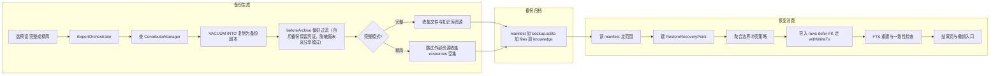
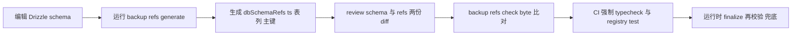
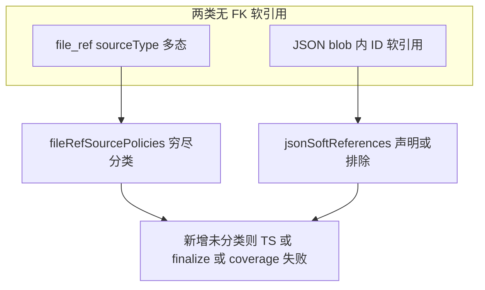
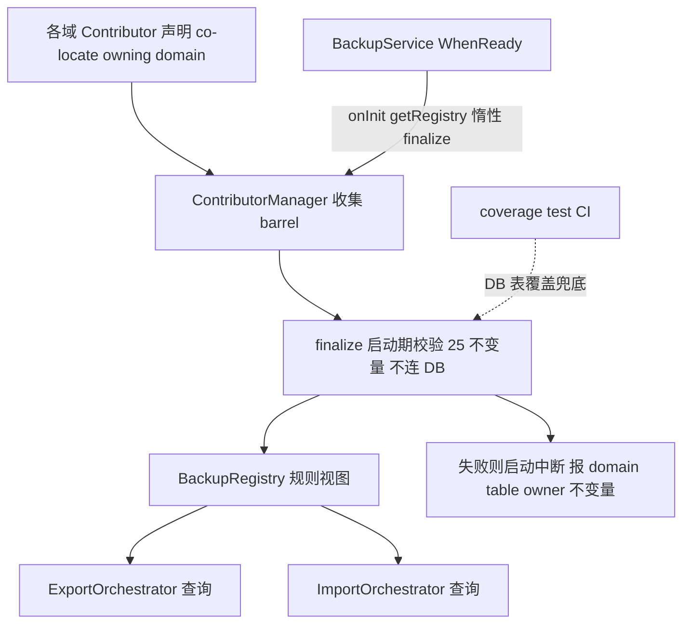

# 模块化备份 Contributor 架构设计 — Final Review

> **TL;DR**: 把 backup 的集中式规则散落（`DomainRegistry`/`DomainStripper`/`DomainImporter`/`FileCollector`）拆为各业务域声明式的 `BackupContributor`，引入**聚合边界（AggregateBoundary）**让冲突策略按完整对象边界静态可校验地传播；恢复走整库 DB pre-snapshot（`VACUUM INTO`）+ 文件快照 + `withWriteTx` 分层执行（文件 IO 事务外、DB 导入事务内，符合 V2 `withWriteTx` 哲学）。

---

## 一、产品需求与模块边界（对照标尺）

> [!NOTE]
> **本节是后续架构（§二）的对照标尺**：每个机制都应能回溯到这里的某条 in-scope 需求；无法回溯的（如 id remap）即 over-design，应在评审阶段识别，而非逐案争论。

### 主场景
- 换机迁移：把用户数据搬到新设备继续使用
- 防本地数据丢失：创建可恢复归档
- 本机回退/撤销：恢复后有限窗口内回到恢复前

### 数据模型前提
- 跨设备身份稳定：本库数据用 UUID 或自然键标识，换机不冲突、无需重新生成 ID
- （技术前提：全库主键为 uuid v4/v7 或自然键、零自增主键；故恢复保留源主键，不做 ID 重映射）

### 做什么（in-scope）
- 备份范围：完整模式含全部内容；精简模式含配置、API key、聊天记录、助手与 Agent 配置（不含图片、知识库、文件）
- 恢复规则：默认跳过本机已有的内容；只往本机补充新内容、不删本地已有数据；可选「两边都保留」或「以备份为准」
- 恢复安全：恢复前先保存当前状态，失败或反悔可回到恢复前
- 凭证：自用备份默认含模型服务 API key

### 不做什么（non-goals）
- 多设备实时同步、远程推送
- 分享 / 排障脱敏导出
- 智能语义合并（全局 MERGE / 差集删除）；natural-key 聚合的列级 FIELD_MERGE 不在此列（见 §三.1）
- 用户可见域级选择 UI（架构层支持，UI 不暴露）
- 自增或前缀主键的 ID 重排（本库不存在此类）

### 标尺用法（识别 over-design）
评审任一机制时，先问"它服务上面哪条需求"。例：「按完整对象跳过」服务主场景①②；「恢复前快照」服务恢复安全与本机撤销（主场景③、防丢失）；而「ID 重映射」找不到对应需求（数据前提已排除）→ 判为多余，移除。

### 阅读引导
读架构（§二）时对照两问：① 每个 contributor 声明能否被类型/codegen/覆盖测试校验，冲突有无聚合边界、恢复有无失败安全边界；② 产品决策（§三）是否符合用户心智。

---

## 二、架构设计

### 1. 这次重构要解决什么

当前分支的 SQLite 备份代码只作规则库存和实现参照，不是要保留的架构形态。分散在多个集中式文件，新增表/引用时需改多处且易导出/恢复语义不一致。（注：下表 `DomainRegistry`/`DomainStripper`/`DomainImporter`/`FileCollector` 为早期 v2 原型名，本分支未实现；当前 backup 实现为 `LegacyBackupManager.ts`，下表描述其设想的散落结构以说明重构动机。）

| 现有位置 | 承载内容 | 主要问题 |
|---|---|---|
| `DomainRegistry.ts` | 域到表映射、导入顺序、内部表排除 | 新增表易漏改（如 agent_task） |
| `DomainStripper.ts` | 省略被引用域处理、凭证处理 | 引用处理与表归属分离 |
| `DomainImporter.ts` | 唯一键合并、JSON 引用重映射、冲突处理 | object-boundary SKIP 无机制 |
| `FileCollector.ts` | 消息文件引用扫描 | 文件引用来源缺统一分类 |

两个基线：用户可见产品行为基线 = legacy/v1 `LegacyBackupManager.ts`（IndexedDB/LocalStorage/可选 Data）；架构设计基线 = 本方案最终 contributor 体系。

### 2. 总体方案：Entity facts + Backup policy + Operations（+ 聚合边界）

备份生成只操作备份副本并产出归档；备份文件是备份与恢复间唯一交接物；恢复消费默认按 manifest 域与资源执行。

**manifest**（备份与恢复唯一交接物的元数据，归档内与 `backup.sqlite`/`files`/`knowledge` 同级）。五字段分两类：

- **内容范围**：`domains`（域：完整/精简）、`resources`（文件/知识库清单）
- **版本兼容**：`backupFormatVersion`、`schemaMigrationId`、`producerAppVersion`

三个版本字段角色不同，仅前两个进兼容门禁（§9 step 0）：

| 字段 | 管什么 | 进门禁 |
|---|---|---|
| `backupFormatVersion` | 归档**格式**（v2 起 = 1，major bump = 不兼容 → 拒） | ✅ |
| `schemaMigrationId` | DB **schema** 版本指纹 | ✅ |
| `producerAppVersion` | **app** 版本（`package.json`） | ❌ 仅诊断/错误提示 |

- `schemaMigrationId` 取 producer 最末 migration 的 `when`(folderMillis)——drizzle migrate 按 folderMillis 决定增量、**非** tag 词典序，故比对以 folderMillis 为权威，tag（如 `0005_lyrical_galactus`）仅诊断。
- **release 转换点须 `backupFormatVersion` major bump**：CLAUDE.md 规定 release 前 `migrations/sqlite-drizzle/` 会清空并重生成成一条全新 clean initial migration（开发期 migration 是 throwaway）。此举换掉整条 chain、打断 migrate-forward 依赖的连续性——旧备份的 `schemaMigrationId` 指向已被替换的旧 chain，migrate-forward 会拿新 clean initial 的 `CREATE TABLE` 去撞 backup.sqlite 里已建好的表（`table already exists`）。故在该 release 版本点 major bump formatVersion，让旧格式备份在门禁直接被拒，而非走到必失败的 migrate-forward。
- `producerAppVersion` 不进门禁：`schemaMigrationId` 偏序已蕴含 app 版本偏序，它仅用于用户可见的错误提示。

每个域由一个 `BackupContributor` 表示：

| 层次 | 放什么 | 不放什么 |
|---|---|---|
| Entity facts（schema） | 表归属、引用事实、主键形态、聚合边界、file-ref source、JSON 软引用 | SET_NULL/DELETE_ROW 动作、导入顺序、恢复策略 |
| Backup policy | 省略引用 override、唯一键合并 | 数据库 I/O、文件操作、异步 hook（remap/idStrategies 已移除） |
| Operations | 文件资源发现、beforeArchive、逐行 transform、afterImport、blob 恢复、cloneAggregate | 可用纯数据表达的事实和策略 |

> [!IMPORTANT]
> **核心机制是 `schema.aggregates`（聚合边界）**，把 object-boundary SKIP/OVERWRITE/RENAME 从文字描述提升为静态可校验机制。

#### 代码架构图：Contributor 系统如何落到代码

测试四类：tsc + codegen check、coverage、equivalence、restore tests（聚合冲突 + pre-snapshot 回滚 + identity propagation：DB owning FK 与 required JSON ref → natural-key target；多态软引用 pin/entity_tag 的 selected-domain 过滤与 RENAME case）。

### 3. Contributor 应该怎么读

| 阅读顺序 | 要回答的问题 | 对应字段 |
|---|---|---|
| Ownership | 这个域拥有哪些用户数据表？ | `schema.tables` |
| References | 引用了哪些其它域？哪些 file-ref / JSON 软引用属于本域？ | `references`、`fileRefSourcePolicies`、`jsonSoftReferences` |
| Identity facts | 每张表的 ID 形态？ | `primaryKeys`（uuid-v4/uuid-v7/natural/composite） |
| Aggregate | 用户可见对象的边界？冲突如何传播？ | `aggregates`（root/identityKey/members/renamable） |
| Backup policy | 被引用域缺失的例外？哪些唯一键要合并？ | `omittedReferenceOverrides`、`uniqueMergeRules` |
| Operations | 有无备份专用行为？没有是否明确 schema-only？ | `operations` |

内部排除项（`app_state` / `job` / `*_fts` / `__drizzle_migrations`）由全局显式排除集维护，带 reason，不进 contributor domain（`job_schedule` 是共享表，按 type row-scope 归 AGENTS，非整表排除）。**`__drizzle_migrations` 特殊**：它不进 contributor（非业务表），但**必须作为 backup.sqlite 基础设施元数据保留**——VACUUM INTO 连带复制（§9 step 0 migrate-forward 依赖它判断 producer migration 状态、只跑增量）；此处"排除"仅指不参与 domain 冲突策略，**非从备份库删除**。

### 3.5. 域总览（14 域）

`不变量 1` 要求恰 14 域。下表集中列出（散落信息见 §三.1 精简范围 + §5 各域注意点）。`identityClass` / 默认 `conflictDefault` 为 finalize 派生值（§6.2 派生规则），显式声明仅用于偏离默认。

| 域 | 聚合根（+ include 成员） | identityClass | renamable | 默认 conflictDefault | 精简 |
|---|---|---|---|---|---|
| PREFERENCES | `preference`[scope,key] / `note`（`(rootPath,path)` UNIQUE） | natural-key / natural-key | false | SKIP / SKIP（**设置类例外**：本地优先 + 补缺；`platformSpecificKeys` 排除跨平台不兼容 key，见 §6 policy / §三） | ✓ |
| PROVIDERS | `user_provider` + `user_model` | natural-key | false | FIELD_MERGE | ✓ |
| PROMPTS | `prompt` | uuid-entity | false | SKIP | ✓ |
| MCP_SERVERS | `mcp_server` | uuid-entity | false | SKIP | ✓ |
| TAGS_GROUPS | `tag` / `group` / `pin`（单表）+ `entity_tag`（多态 junction，tagId→tag cascade） | tag/pin natural-key（`tag.name`/`pin(entityType,entityId)` UNIQUE）、group uuid-entity | false | tag/pin FIELD_MERGE、group SKIP | ✓ |
| ASSISTANTS | `assistant` + `assistant_mcp_server`/`assistant_knowledge_base` | uuid-entity | true | SKIP | ✓ |
| AGENTS | `agent_session`(+`agent_session_message`) / `agent_workspace` / `agent_channel` / `agent` + `job_schedule`(type='agent.task') row-scope + `agent_skill`（junction ref，agentId→agent + skillId→SKILLS） | agent_workspace natural-key（`path` UNIQUE）、`job_schedule`(type='agent.task') natural-key（`(type,name)` UNIQUE）、其余 uuid-entity | session:false（workspaceId 跨聚合 owning ref→独立 agent_workspace 聚合，§5.4），其余 false | agent_workspace/job_schedule FIELD_MERGE、其余 SKIP | ✓ |
| MINIAPPS | `mini_app`(app_id) | natural-key | false | FIELD_MERGE | ✓ |
| SKILLS | `agent_global_skill`（`folderName` UNIQUE） | natural-key | false | FIELD_MERGE | ✓ |
| TOPICS | `topic` + `message` | uuid-entity | true | SKIP | ✓ |
| KNOWLEDGE | `knowledge_base` + `knowledge_item` | uuid-entity | **false**（`{baseId}` 目录 + `.cherry/index.sqlite` 随 base id 一致，RENAME 克隆难保证一致性；退化为 SKIP） | SKIP | ✗ |
| TRANSLATE_HISTORY | `translate_language`（natural-key langCode 单表）+ `translate_history`（uuid-entity 独立聚合，sourceLanguage/targetLanguage→translate_language optional ref） | natural-key / uuid-entity | false | FIELD_MERGE / SKIP | ✗ |
| PAINTINGS | `painting`（单表） | uuid-entity | false | SKIP | ✗ |
| FILE_STORAGE | `file_entry` + `file_ref` | uuid-entity | false | SKIP | ✗ |

> 精简模式（§三.1）：10 域含、4 域（KNOWLEDGE / TRANSLATE_HISTORY / PAINTINGS / FILE_STORAGE）排除。junction 表（`agent_channel_task` / `agent_skill`）不计入聚合成员，走独立 junction reference。
>
> `note` 暂归 PREFERENCES（配置/状态类域）：它是 Notes 等模块的状态 overlay（starred/expanded），非 `preference(scope,key)` 表的一部分；按 `(rootPath,path)` natural-key + **SKIP**（设置类本地优先 + 补缺）处理。**正文归属（三者区分，勿混）**：
> - `note` 表（本域）：仅状态 overlay（`isStarred`/`isExpanded`），`rootPath`+`path` 指向 Notes 笔记的 markdown 文件，**不含正文**。
> - **Notes 模块笔记正文** = filesystem markdown 文件（`rootPath`/`path` 指向，独立 notes 目录），属**文件资源**——完整模式随文件资源备份，精简模式（排除文件资源）不备份。
> - `knowledge_item`(type='note') 是**知识库内的 note item**（KNOWLEDGE 域，正文 `raw/{slug}.md`），与 Notes 模块笔记是不同概念。
>
> **精简模式一致性**：精简排除文件资源时 Notes markdown 正文不备份；`note` 表状态行若 `rootPath` 指向未备份 markdown，恢复后状态悬空——须按 selected-resource 过滤（仅恢复指向已备份文件的 note 状态，类比 §5.2 多态软引用过滤）。如需语义更清晰可后续拆独立域，本期不拆。

### 4. TOPICS contributor 示例

聚合根 `topic` + 成员 `message(topicId)`；冲突 → 整组（topic + 其 message 树）按策略处理。

### 5. 其它 contributor 参照

| 域类型 | 聚合边界注意点 |
|---|---|
| ASSISTANTS | RENAME 克隆时成员 assistantId 重映射到新根 PK |
| AGENTS | agent_workspace/agent_channel 单表 renamable:false；agent_channel_task 是 junction（双 cascade FK）；**job_schedule.type='agent.task' row-scope 归 AGENTS**（natural-key `(type,name)`、FIELD_MERGE；Agent task 定义，否则设计性丢失用户 task）；job_schedule 按 `(type,name)` 合并时 `agent_channel_task.taskId`（→schedule id）须 identity propagation 重写到本地 canonical schedule id（§5.4）；afterImport 须 re-arm job_schedule timer（DB 导入不调 registerJobSchedule，否则 agent.task 不 fire 直到重启） |
| FILE_STORAGE | restoreResources() 先于 DB 行导入，返回 skippedFileEntryIds；renamable:false，RENAME 退化为 SKIP |
| PROVIDERS | 聚合 user_provider + user_model(providerId)；natural-key，默认 FIELD_MERGE（apiKeys/authConfig 列级合并，防丢 API key）；renamable:false（user_model.id 派生键） |

#### 5.1 file_ref 归属（file_entry member，非 source-owned）

`file_ref` 整表归 FILE_STORAGE（`file_entry` 的 include member，viaColumn=`fileEntryId`），**不**按 sourceType 行分区归 source 域。理由：`file_ref.fileEntryId` 是 NOT NULL cascade FK（`schemas/file.ts:131`）——文件被删则引用记录自动级联删除，是 include member 的天然语义（满足不变量 14/15）。若改 source-owned row-scope（类比 job_schedule）：file_entry 未恢复（SKIP/精简排除）时 file_ref 悬空会触发 post-restore 一致性检查硬失败，且破坏一表一 owner（不变量 2/3）。**job_schedule 可 row-scope 是因其自包含无跨域 NOT NULL FK，与 file_ref 结构不同构。**

**双轨职责**（不冲突）：`aggregates`（file_ref 作 file_entry member）管**恢复期 DB 行聚合边界**（SKIP/OVERWRITE 整组传播）；`fileRefSourcePolicies`（sourceType→ownerDomain，如 chat_message→TOPICS）管**导出期文件 blob 收集**。两者作用于不同生命周期阶段。

**实施 caveat**：① 须兑现 post-restore 一致性检查（无悬空 file_ref / 无 file_entry 缺 blob，失败回滚）；② source 删除清理缺口（MessageService/KnowledgeItemService 未调 cleanupBySource，靠 OrphanRefScanner 兜底）；③ file_entry 软删除 vs file_ref 硬删除不对称（导出过滤须只取 deletedAt IS NULL）。

#### 5.2 junction reference 在 SKIP/RENAME 的处理（不引入跨域 remap）

junction reference（`agent_skill` / `agent_channel_task`，不计入 members 派生、不随根克隆）：root SKIP 时其行也不导入（cascade 依赖 root 存在）；root RENAME（renamable）时 junction 行随旧根 cascade-prune、不克隆到新根（"保留两边"时不继承 junction 绑定——与 `assistant_mcp_server` 这类 include member"克隆继承"区分）。**双端 cascade 由 DB FK + `defer_foreign_keys` 保证，不做跨域 id remap**（与已移除的 idStrategies 一致：保留源主键）。附件渲染靠 `message.data.fileEntryId` JSON 软引用（保持源 PK），不依赖 `file_ref.sourceId`（仅 orphan 检测用）——故 RENAME source 不需 remap file_ref。

**多态软引用 selected-domain 过滤**：`pin(entityType,entityId)` / `entity_tag(entityType,entityId,tagId)` 按 entityType 多态指向 topics/sessions/knowledge/file/painting 等域实体（无 FK）。精简模式排除 KNOWLEDGE/FILE_STORAGE/PAINTINGS 时，TAGS_GROUPS 若导入指向被排除域的 pin/tag 绑定，会恢复出指向缺失对象的 pin/tag state——须按 selected-domain 过滤（仅导入指向本次恢复域的绑定），并纳入 soft-reference coverage/finalize 校验（entityType→域映射穷尽，缺失则 finalize 失败）。RENAME 时这些多态绑定不随 root 克隆（与 entity_tag junction cascade-prune 区分）。

#### 5.3 RENAME 跨聚合引用与标量 soft ref（已知边缘 case，实施期处理）

- **topic.activeNodeId**：标量 text soft ref（指向 message，无 FK）。TOPICS `renamable:true`，RENAME 克隆 topic 时 `activeNodeId` **必须**随 cloneAggregate 重写（映射到新 topic 对应 message 的 id），否则 restored topic 指向旧 aggregate 的节点/悬挂引用——列为本域 `cloneAggregate` 必需重写规则 + finalize/测试矩阵覆盖（非可选边缘 case）。（agent_session.workspaceId 的 RENAME/ownership 见 §5.4）

> 注：当前 schema 无 `topic_node`/`topic_edge` 表；若未来引入，其 `topicId`/`sourceId`/`targetId` 须一并按 id 映射重写。

#### 5.4 跨聚合 owning FK 处理（compact 模式 + workspace 归属）

- **assistant_knowledge_base.knowledgeBaseId**（compact 模式）：精简模式排除 KNOWLEDGE，但 assistant_knowledge_base（ASSISTANTS include member）的 knowledgeBaseId→knowledge_base 是 NOT NULL cascade。KNOWLEDGE 未选时按 omitted owning→DELETE_ROW（删该链接行，assistant 保留但无 knowledge 绑定）——符合精简语义。
- **agent_session.workspaceId → 独立 agent_workspace 聚合**（**域内跨聚合** owning reference：agent_session 与 agent_workspace 同属 AGENTS 域、分属两个独立聚合根）：workspaceId 是 cascade NOT NULL owning FK，但 target `agent_workspace`（natural-key `path` UNIQUE）是独立聚合根、非 `session.root`，故不变量 14（members 只收域内指向本 root 的 owning include ref）不计它入 session.members、workspace 不强制为 member。这不等于逃避 owning 校验：不变量 25（每个 DB FK 须被 owner contributor 声明）强制 AGENTS 声明此 FK → 不变量 19（onDelete=cascade 对应 kind=owning）校验自洽（codegen `DB_FOREIGN_KEYS` 作数据源）。`agent_session` renamable:false（跨聚合 owning 克隆矛盾 + 撞 `path` UNIQUE）。**待产品确认**：workspaceId NOT NULL cascade——若一 workspace 被多 session 共享，删 workspace 级联删所有绑定 session，是否符合预期（§3.6）。
- **identity propagation（natural-key target 合并后的 owning FK 重写）**：owning/required FK 指向 **natural-key 聚合**（target 按 identityKey FIELD_MERGE、本地 UUID 胜出）时，importer 须建立 `{备份 target id → 本地 canonical id}` 映射，导入 source 时把该 FK 重写到本地 id——否则备份 target uuid 被 FIELD_MERGE 合并掉、owning FK 悬空（`defer_foreign_keys` COMMIT 失败或 source 丢失）。适用所有指向 natural-key target 的 FK（target 经 FIELD_MERGE 合并即重写）：owning/required（典型 `agent_session.workspaceId → agent_workspace`，跨设备同 path 不同 uuid）须重写，否则 FK 硬失败；optional（如 `translate_history.sourceLanguage → translate_language`）重写保留关联或按 optional 语义 SET_NULL（不可留悬空备份 uuid）；junction（如 `entity_tag.tagId → tag`）随 root cascade-prune（§5.2），target 合并时 FK 一并重写。**≠ 已删的 ID remap**：remap 给 uuid-entity 源记录 PK 生成新 uuid（不需要，保留源 PK 幂等）；identity propagation 把源 FK 重定向到 natural-key target 的 canonical id（源记录 PK 不变，natural-key 合并所必需）。重写边界按 ref 是否 **required**（非按是否 JSON）：**tolerant** ref（`message.data.fileEntryId` 附件软引用、`file_ref.sourceType`，缺失仅降级 Toast + orphan 检测）target 合并/缺失时不重写；**required** ref（target 缺失则功能损坏）target 合并时必须重写——含 DB owning FK（`agent_session.workspaceId`）**与 required JSON ref**（AGENTS：`agent_channel.workspace.workspaceId`、`job_schedule(type='agent.task').jobInputTemplate.workspace.workspaceId`，均为 `AgentSessionWorkspaceSource`）。后者由 `jsonSoftReferences`（§6.1）标 required 类参与 identity propagation；否则恢复看似成功（`foreign_key_check` 通过）但 channel/定时 task 引用悬空 workspace。

### 6. 实现侧类型契约

#### 6.1. EntityGraphSchema 与类型入口

`EntityGraphSchema`：`tables` / `references`（kind: optional|owning|junction）/ `primaryKeys`（kind: uuid-v4|uuid-v7|natural|composite|autoincrement(finalize 拒绝)，ambiguous 标注）——**composite 收紧**：仅忠实表达现有 schema fact（如 `preference[scope,key]` 配置槽、`entity_tag`/`agent_channel_task` 等 junction 复合 PK）；composite 表不作新 aggregate root 冲突策略（junction 只参与 FK/coverage 校验），新增 composite root 须 finalize 白名单 + 架构评审/ **`aggregates`**（`AggregateBoundary { root, renamable, [identityKey?], [identityClass?], [conflictDefault?], [members?] }`——除 `root` 与 `renamable` 外其余字段全部从 `references + primaryKeys` 派生，contributor 显式声明仅用于偏离默认）/ `fileRefSourcePolicies` / `jsonSoftReferences` / `rowScopes?`（共享表行分区，如 job_schedule.type='agent.task' 归 AGENTS）。派生规则：identityKey=root PK；identityClass=primaryKeys[root].kind：uuid-v4/v7→uuid-entity、natural/composite→natural-key（slot 须显式）；conflictDefault=identityClass 映射（uuid-entity→SKIP；natural-key/slot→FIELD_MERGE）；members=域内指向 root 的 owning include references 源表（junction 表与跨域 ref 不计入，不变量 14 拒绝漂移）。

`BackupContributorPolicy`：`omittedReferenceOverrides`（仅例外，须绑定事实+非冗余+reason）、`uniqueMergeRules`、`fieldMergePolicies`（FIELD_MERGE 列级合并）、**`platformSpecificKeys?`**（仅 PREFERENCES：声明平台相关 key 模式，如 `shortcut.*` / `*.path` / `app.hardware_acceleration`，恢复时**排除**——不跨平台导入，避免不存在的路径/错误快捷键；portable key 正常 SKIP 补缺；具体清单由 PREFERENCES owner 提供。**finalize 校验**：key 模式合法（glob 语法）+ 仅 PREFERENCES 域可声明，非 PREFERENCES 声明则拒绝）。**不含** restoreRemap / idStrategies（over-design，移除）。

> [!WARNING]
> **类型入口**：`DbTableName` / `DbColumnName` 必须来自 Drizzle codegen，不能靠手写 as 认证。`DbColumnName` 是 Drizzle **property name（camelCase，如 topicId / providerId / fileEntryId）**；物理 SQLite 列由 DbService `casing:'snake_case'` 自动转 snake_case（topic_id）。backup 全程走 drizzle builder（`BackupScopedDb` 不暴露 run/raw/Client），drizzle 自动处理 casing 转换，故无裸 SQL 列名风险。

#### 6.2. `AggregateBoundary` 派生公式（fact-derived, 反对手写冗余）

`AggregateBoundary` 六字段中，只有 `root`（领域事实：哪个表是"对象"的语义根）与 `renamable`（领域事实：能否安全克隆）是真新信息；其余四个字段**默认从 `references + primaryKeys` 派生**，contributor 显式声明仅在偏离默认派生时使用，显式 override 也须与派生结果自洽（不变量 14 拒绝漂移）。

| 字段 | 缺省派生 | 何时显式 | 例外 reason |
|------|----------|----------|-------------|
| `root` | —（手写） | 必填 | — |
| `renamable` | —（手写） | 必填 | — |
| `identityKey` | `primaryKeys[root].columns`（root PK）；**root 有 UNIQUE 约束（非 PK）时 identityKey 须含 UNIQUE 键**（业务对齐，防跨设备同值不同 UUID 撞 SQLite UNIQUE——如 agent_workspace.path / tag.name / note(rootPath,path) / pin(entityType,entityId) / agent_global_skill.folderName / job_schedule(type,name)） | PK 是复合且 UNIQUE 键非全 PK | "natural-key 复合 PK 用单列" |
| `identityClass` | `primaryKeys[root].kind`：`uuid-v4`/`uuid-v7`→`uuid-entity`、`natural`/`composite`→`natural-key`；**root 有 UNIQUE 约束（非 PK）→ natural-key**（业务唯一键对齐，FIELD_MERGE 防 SKIP 撞 UNIQUE） | `slot`（预定义槽位） | "preset provider slot,非 codegen 可推断；composite→natural-key：聚合根的复合 PK 必为自然复合键（如 preference[scope,key]），junction 表不走此路径（非 root）" |
| `conflictDefault` | `uuid-entity`→`SKIP`;`natural-key`/`slot`→`FIELD_MERGE` | 某域要偏离默认（如改 OVERWRITE）时显式声明 | "现网仅 preference/note 偏离（SKIP，设置类例外，见不变量 21）；其余无偏离（PROVIDERS 走 FIELD_MERGE）；如有新偏离须 reason + 不变量 21 校验" |
| `members` | 域内指向 root 的 owning include references 源表（junction 表与跨域 ref 不计入） | 需排除默认成员（如"message.parentId 自引用不计入聚合"） | "self-ref 不参与聚合" |

派生由 `finalize` 启动期完成,**不**在 hook 调用期。`omittedReferenceOverrides` 已确立的"仅例外、须绑定事实 + reason"模式同样适用于此处。

#### Codegen 落地方案

`scripts/generate-backup-schema-refs.ts`（tsx）发现 `schemas/*.ts` 的 `sqliteTable`，经 `getTableConfig()` 读表名/列名/PK，稳定排序输出 `dbSchemaRefs.ts`（落 neutral layer `src/main/data/db/backup/dbSchemaRefs.ts`，main-only；`DB_TABLES`、`DB_COLUMNS_BY_TABLE`、`DbTableName`、`DbColumnName<TTable>`、`DB_PRIMARY_KEYS` 含 uuid-v4/v7 判定与 ambiguous 标注）。不连 DB、不启 Electron。`pnpm backup:refs:generate` 写盘，`pnpm backup:refs:check` byte-for-byte 比对（CI 强制）——**两命令为 planned，实现期 PR 加 package.json scripts**。

生成产物：`DB_TABLES`、`DB_COLUMNS_BY_TABLE`（camelCase property name；物理列由 `casing:'snake_case'` 转 snake_case）、`DbTableName`、`DbColumnName<TTable>`、`DB_PRIMARY_KEYS`（含 uuid-v4/v7 判定与 ambiguous 标注）、`DB_FOREIGN_KEYS`（多列 FK + onDelete，供不变量 19/24/25 校验）、`DB_FTS_VIRTUAL_TABLES`（FTS5 虚表→content table，供 restore 后 FTS 重建）。手写 as DbTableName 不算认证路径，须走 helper。

| 四层保护 | 失败时机 |
|---|---|
| TypeScript 拦截不存在的表/列 | 编译期 |
| backup:refs:check 防 schema 与 refs 脱节 | CI |
| registry test 覆盖新增表/列重命名/稳定输出 | 测试 |
| finalize 运行时用 DB_TABLES 再校验 | 启动期 |

#### JSON soft reference 覆盖机制

| 已分类项 | 归属 |
|---|---|
| `chat_message` | TOPICS |
| `knowledge_item` | KNOWLEDGE |
| `painting` | PAINTINGS |
| `temp_session` | excluded（runtime） |
| `message.data`（file_entry id 在 `parts[].providerMetadata.cherry.fileEntryId`，非顶层 fileId） | TOPICS jsonSoftReferences |
| `agent_session_message.data`（file_entry id 在 `parts[].providerMetadata.cherry.fileEntryId`） | AGENTS jsonSoftReferences（tolerant） |
| `agent_channel.workspace.workspaceId` / `job_schedule(type='agent.task').jobInputTemplate.workspace.workspaceId`（`AgentSessionWorkspaceSource`） | AGENTS jsonSoftReferences（**required**，target 合并参与 §5.4 identity propagation） |

> JSON soft ref 分两类：**tolerant**（`fileEntryId` 附件，缺失降级 Toast + orphan 检测，不参与 identity propagation）与 **required**（`AgentSessionWorkspaceSource` 的 `workspaceId`，target 合并须 identity propagation §5.4，缺失则功能损坏）。required 类须在 `jsonSoftReferences` 显式标记，否则恢复后 channel/定时 task 静默引用悬空 workspace。

### 7. 注册模型与启动校验

注册到消费链路：各域 contributor 声明 **co-locate 在 owning domain module** → ContributorManager（non-lifecycle named singleton）经统一 barrel 收集 → finalize 启动期校验 25 不变量（不连 DB）→ 通过则产出 BackupRegistry 供 orchestrator 查询，失败则启动中断并报 domain/table/owner/不变量。`BackupService`（WhenReady）于 `onInit()` 调 `contributorManager.getRegistry()` **惰性触发** finalize（首次同步 finalize + 深度冻结 + 缓存，幂等），等价于原 `@DependsOn` 排序但无需把纯静态 finalizer 提升为 lifecycle service；DB 实际表覆盖由 coverage test（CI）兜底，故 finalize 不连 DB。

各 hook 调用时机与缺省：collectFileResources（导出前收集文件/缺省空集）、beforeArchive（剥离后仅改备份副本/no-op）、transformRow（导入前/原行，返回 null 跳过该行）、afterImport（域导入后 FTS 重建/no-op）、restoreResources（DB 导入前事务外/无）、cloneAggregate（仅 renamable 聚合 RENAME/缺则 finalize 拒）。**聚合根被 SKIP 时其成员 transformRow 不调用**。

> [!IMPORTANT]
> **Contributor placement / ownership**：各 contributor declaration **co-locate 在该域 owning module 的实际位置**（遵守 main-process 现有目录边界，不强制 `src/main/services/`——如 `topicsContributor` 在 data/services/topics、providers 在 data/services、knowledge 在 features/knowledge、agent 在 ai；flat owning module 用 per-domain 子目录或唯一文件名），由业务域 owner 声明该域 entity facts（表归属/引用/聚合/file-ref/JSON 软引用）。contributor-consumed 的纯类型 / context 类型 / runtime helper / codegen 产物 / 枚举归 **process-local neutral layer** `@main/data/db/backup/`（data/schema-owned，main-only：`contributor-types` / `contexts` / `freeze` / `dbSchemaRefs` / `domains[BackupDomain+ConflictStrategy]`），业务域 + backup service **同向** import——避免 data 域 contributor → services/backup 逆向依赖、shared 层不扩大（codegen 产物 / main-only 枚举不放 shared）。backup 模块（`src/main/services/backup/`）只持统一 barrel（聚合 14 域导出）+ registry + finalize + orchestrator，**不承载 domain-specific facts**，也不持 contributor-consumed 类型/helper（归 neutral layer）。

> [!TIP]
> **lifecycle 边界**：`ContributorManager` 定位为 **non-lifecycle named singleton**（`export const contributorManager = new ContributorManager()`），**不**进 `serviceRegistry.ts`、不加 `@ServicePhase`——它不持有长生命周期资源、不连 DB、无 IPC/定时器/事件订阅，只有"启动期一次性 finalize 产出冻结 BackupRegistry"的纯函数式行为（对齐 CLAUDE.md Non-Lifecycle Services 决策指南）。finalize 由 `BackupService.onInit()` 调 `getRegistry()` **惰性触发**：失败抛 `ContributorFinalizeError` → BackupService.onInit 失败 → lifecycle 容器拒绝启动（启动期校验语义保留）。`BackupService` 仍是 WhenReady（持 orchestrator/RESTORE BARRIER/journal 等长生命周期资源）；finalize 只校验静态一致性、**不连 DB**（DB 覆盖由 coverage test 保证，避免 WhenReady 服务违规依赖 DbService）。

### 8. 架构检查清单

| 检查点 | 证据 |
|---|---|
| 表归属 | §1 矩阵 + coverage test（post-sync 目标态全表覆盖；pre-sync 按当前态动态计算） |
| 聚合边界 | schema.aggregates + 不变量 13-16 |
| 引用事实 | ReferenceKind 派生 + 不变量 6/7 |
| JSON 软引用 | 不变量 12 |
| 文件一致性 | restoreResources + 一致性检查 |
| 恢复安全 | RestoreRecoveryPoint（in-scope） |
| 版本兼容 | manifest 版本门禁 + migrate-forward（§9 step 0） |
| identity 传播 | owning/required FK → natural-key target 合并后重写（§5.4） |
| 恢复语义 | 合并语义，不差集删除 |

### 8.5. finalize 25 不变量（完整清单）

`ContributorManager.finalize()` 启动期校验以下 25 条不变量（不连 DB，纯内存）。每条失败抛 `ContributorFinalizeError(invariantId, payload)`，payload 含 `domain/table/sourceType/owner/违反不变量` 字段。

| # | 不变量 | 失败定位 payload |
|---|--------|------------------|
| 1 | 每域恰一 contributor（14 域） | `{ missingDomains \| extraDomains }` |
| 2 | 每张 Drizzle 用户数据表恰一 owner 或带 reason 排除 | `{ table, status: 'unowned' \| 'multi-owned', owners }` |
| 3 | 无表被多 contributor 拥有 | `{ table, owners }` |
| 4 | ALWAYS_STRIP / INFRASTRUCTURE 表不被 contributor 拥有 | `{ table, declaredBy }` |
| 5 | 排除集运行时表（job）确无 contributor 声明；job_schedule 不整表排除（type='agent.task' row-scope 归 AGENTS） | `{ table }` |
| 6 | references 的 **source 表**（ref.table）属声明方 owner；target（referencedDomain）可跨域（如 message.modelId→PROVIDERS），由 target owner 校验 | `{ domain, table }` |
| 7 | omittedReferenceOverrides 绑定已声明 reference + 非冗余 + reason | `{ domain, reference, reason }` |
| 8 | 每个 owned 表有恰一个 primary-key fact，列存在于 codegen | `{ table, expectedColumns }` |
| 9 | 主键 kind 非 ambiguous | `{ table }` |
| 10 | references 派生的依赖图无环 | `{ cycle: domains[] }` |
| 11 | 每个 FileRefSourceType 有 owner 或 runtime-only 排除 | `{ unownedSourceType }` |
| 12 | 每个已知 JSON soft-ref 字段已分类或排除 | `{ table, column }` |
| 13 | 每个 aggregate.root 在 owner，identityKey 是其 PK 或业务 UNIQUE 键（§6.2：有 UNIQUE 约束时含 UNIQUE 键） | `{ domain, aggregate }` |
| 14 | aggregate.members 派生自 owning include references（junction 表、跨域 ref、及域内指向其它聚合根的 owning ref 均不计入——仅指向本 root 的 owning ref 入 members）+ parent 链无环唯一 | `{ domain, aggregate, member }` |
| 15 | members 中每成员表属于本 contributor；viaColumn 是真实 FK 列指向 root.identityKey 或父 member 的 PK（多层 cascade A→B→C，C.viaColumn→B，§6.2 parent 派生） | `{ domain, aggregate, member }` |
| 16 | renamable:true 聚合的 operations.cloneAggregate 存在 | `{ domain, aggregate }` |
| 17 | schema 深度冻结 | N/A（内部） |
| 18 | 失败信息含 domain/table/sourceType/owner/违反不变量 | N/A（内部） |
| 19 | 每个 EntityReference.kind 与生成的 FK onDelete 自洽 | `{ domain, reference, schemaOnDelete, declaredKind }` |
| 20 | junction/co-owned FK 不声明 optional；NOT NULL 列不可 SET_NULL | `{ domain, reference, column, nullability }` |
| 21 | natural-key/slot 聚合显式 conflictDefault 非 SKIP —— **设置类例外**（preference/note：SKIP 本地优先 + 补缺 + `platformSpecificKeys` 排除，reason：用户设置本地优先、platform-specific 不跨平台；与 PROVIDERS 凭证合并不同） | `{ domain, aggregate, identityClass, conflictDefault }` |
| 22 | 主键 kind 非 autoincrement | `{ table, kind: 'autoincrement' }` |
| 23 | 共享表 row-scope 覆盖穷尽 | `{ table, uncoveredTypes }` |
| 24 | 声明的 EntityReference 对应生成的 FK | `{ domain, reference }` |
| 25 | 反向：每个 DB FK 须被 owner contributor 声明 | `{ table, columns, missingFromDomain }` |

**实施依据**：
- 不变量 19 / 24 须 codegen 生成 `DB_FOREIGN_KEYS`（`getTableConfig()` 读 FK 信息）作数据源
- 不变量 5 取决于 `job_schedule` 的 row-scope 覆盖
- 不变量 14/15 派生自 owning references（§6.2 `AggregateBoundary` 派生公式）

### 9. 恢复前快照与撤销恢复（恢复编排层）

当前文件级回滚只覆盖 FILE_STORAGE 覆盖写入，不覆盖 DB 行导入中途失败，也不覆盖 API key / 偏好 / provider / assistant / agent / 聊天记录等 SQLite 数据。补恢复编排层 RestoreRecoveryPoint：整库 DB pre-snapshot + restore journal + 受影响文件快照（同 restoreId）。**执行分层严格分离**（符合 V2 withWriteTx「fn 内仅 DB ops、不做文件 IO」约束）：

0. **manifest 版本门禁**（恢复第一步，先于 RESTORE BARRIER；只读/操作备份文件、**不碰 live DB**）：

   - **格式校验**：`backupFormatVersion` major bump = 不兼容 → 拒绝 + 明确错误
   - **schema 比对**（以 `schemaMigrationId` 的 `when`(folderMillis) 为权威序，**非 tag 词典序**——drizzle migrate 按 folderMillis 决定增量），三种状态：
     - **老备份**（consumer chain 前缀含 producer 末端）→ **migrate-forward**：对 `backup.sqlite` 在**独立 libsql client**（非 live `DbService.client`，避免污染 live 连接）跑 drizzle `migrate` 到 consumer 末条——因 VACUUM INTO 连带复制了 producer 的 `__drizzle_migrations`，migrator 自动只应用 producer 之后的增量
     - **新备份 / 跨分支分叉**（producer 末端不在 consumer chain 上）→ **拒绝**，提示升级 app
     - **等同** → 直接导入
   - **失败善后**：migrate-forward 失败（备份损坏 / migration SQL 执行失败）= 门禁失败，中止恢复、保留 live DB 原状（未触碰）、删临时 `backup.sqlite`，**不触发 step 4 整库回滚**（因 live DB 未变），并向用户报错「备份无法恢复：文件损坏或版本不受支持」
   - migrate-forward 跑 release migration chain（`migrations/sqlite-drizzle` 正式产物），不碰开发期 drift；跨分支表集差异（`agent_task` vs `painting`/`agent_workspace`，§四）由 chain 位置识别并经 migrate-forward 消解
1. **RESTORE BARRIER** acquire（静默 WhenReady DB writers + 阻塞 renderer mutation，全程）后用 VACUUM INTO 建快照（须事务外，持 withExclusiveAccess 写锁）
2. contributor restoreResources 文件 IO 在 withWriteTx 之外、之前
3. 仅 DB 行导入在 withWriteTx 内
4. 失败整库回滚是应用级动作（libsql 持连接无法替换文件）：checkpoint(TRUNCATE) 后关连接，再安全文件提升（integrity_check + fsync+rename 原子替换 live .sqlite + 删 stale -wal/-shm + rename-aside 回退），最后重连

本方案将 RestoreRecoveryPoint（整库 DB pre-snapshot + restore journal + 受影响文件快照）作为 in-scope 必交付项（现状 createSnapshot 已用 VACUUM INTO 建 pre-restore-snapshot，但仅创建不使用：失败仅 warn 继续、无回滚/撤销/journal/文件快照；本方案补齐持锁快照 + 回滚 + journal + 文件快照 + 失败阻塞）。**snapshot 创建失败 SHALL 阻塞恢复**（现状 warn 继续，属 breaking）。**合并语义下首要价值是「撤销成功恢复」**（用户回退），其次才是失败回滚。contributor 不负责整库快照与回滚。

> [!IMPORTANT]
> 恢复写事务内 PRAGMA defer_foreign_keys=ON（非 foreign_keys=OFF——后者在事务内是 SQLite 文档明确的 no-op，且 DbService 每次 reconnect 重放 foreign_keys=ON）。`defer_foreign_keys` 仅延迟 FK 约束 *enforcement* 到 COMMIT（COMMIT 前 `foreign_key_check` 验证整图一致），**不**禁用 ON DELETE *actions*（CASCADE/SET NULL 仍立即触发）——故 importer 须遵守「OVERWRITE 行级整替换走 **upsert（`ON CONFLICT(identityKey) DO UPDATE`）**、不 DELETE parent 行；显式 cascade（DELETE_ROW）只删 **leaf/junction 行**（其下无 ON DELETE child action）」，避免与 SQLite ON DELETE 双触发。ReferenceKind 须忠实复刻 schema onDelete（cascade/restrict 转 owning/junction、set null/no action 转 optional、set default 拒绝），由 不变量 19 校验。（注：ON DELETE RESTRICT 不可被 defer_foreign_keys 推迟、永远立即报错，与 NO ACTION 不同；本架构 importer 只删 leaf/junction，RESTRICT 实践中不触发。）DB 写走 DbService.withWriteTx（fn 内仅 DB ops，文件恢复已在事务外）。
>
> **恢复安全三件套（针对 PR #12659 review B1/B2/B3）**：① RESTORE BARRIER（应用级写屏障，区别于逐事务 writeMutex）静默 WhenReady DB writers + 阻塞 renderer mutation，跨 snapshot-文件-DB-promote 全程；② 安全文件提升 rollback 序列防 WAL sidecar replay 覆盖快照；③ journal 持久状态机（6 态）+ on-boot crash recovery + completed 门；**recoverOnBoot 作为 `DbService.onInit` 内 `migrateDb` 之前的 gate**（目标态：在 `DbService.ts:139` onInit 中插入 recovery gate，使顺序为 configurePragmas → **recovery gate** → migrateDb → seeders；当前 onInit 仅前三步无 gate）——journal 存在非终态条目时先跑补偿回滚（从 snapshot 恢复 live DB + 删 touched files）再放行 migrateDb，避免 migrateDb/seeders 碰半恢复 DB；回滚快照 schema 可能旧于 consumer，放行后 migrateDb 复用 step 0 migrate-forward 机制推进。
>
> **Upstream prerequisites（gating）**：依赖 DbService 新增 withExclusiveAccess/closeAllConnections/checkpointAndClose/reconnect + PreferenceService.reloadFromDb，须先合 upstream API PR 再合 backup 实现。
>
> **Preference cache 一致性**（M1）：`PreferenceService` 启动一次性 load DB 进内存 cache 后不再 re-read；故 PREFERENCES 域 `afterImport` 须触发 `PreferenceService.reloadFromDb()+rebroadcast` 使 main + 各 renderer cache 失效重载；整库回滚（live DB 已换）后同样触发（所有 cache 失效）。否则恢复/回滚的偏好对运行态静默不生效，直至重启。

---

## 三、产品决策（已定稿）

### 1. 已定稿决策

| 主题 | 当前方向 |
|---|---|
| UI 模式 | 只暴露「完整 / 精简」 |
| 精简模式范围 | 配置/设置域 + 聊天记录 + Agent 历史/配置：PREFERENCES、PROVIDERS、PROMPTS、MCP_SERVERS、TAGS_GROUPS、ASSISTANTS、AGENTS、MINIAPPS、SKILLS、TOPICS |
| 精简模式排除 | KNOWLEDGE、TRANSLATE_HISTORY、PAINTINGS、FILE_STORAGE；不导出/恢复 file_entry、file_ref、文件 blob、知识库源文件 |
| BootConfig（文件型 pre-lifecycle 配置） | **排除**（完整/精简均不含）：`~/.cherrystudio/boot-config.json` 是 pre-lifecycle 配置（影响 userData 路径、硬件加速等启动行为），恢复需特殊时机（不能等普通 DB restore 事务）；换机场景用户通常希望保留目标机自己的启动配置。如未来需纳入，须作独立非 SQLite contributor 单独设计（恢复时机早于 DB restore） |
| API key | 自用完整/精简备份默认含模型服务 API key / auth config；结果页统一展示备份范围 **+ 明文凭证警告**（与 §3 威胁模型一致）；不做分享/排障脱敏模式 |
| 恢复冲突默认（按 identityClass） | uuid-entity 默认 SKIP（幂等重导入）；natural-key/slot **默认 FIELD_MERGE**（降级 SKIP 会撞 UNIQUE 或丢数据，如 PROVIDERS 丢 API key，故是强默认、非随便可选）；**设置类例外**（preference/note：SKIP 本地优先 + 补缺 + `platformSpecificKeys` 排除跨平台不兼容 key，见 §6 policy）；偏离默认须显式声明 + reason + 不变量 21 校验（与 §6.2 派生规则一致：默认可偏离，但须绑定事实+reason） |
| 用户显式覆盖（不依赖 identityClass） | RENAME 显式保留两边（仅 `renamable:true`，否则退化 SKIP + 统一告知）；OVERWRITE 显式以备份为准（行级整替换：identityKey 撞的成员行整行覆盖，本机独有成员保留、不删） |
| 恢复语义 | 合并语义：仅本地存在记录一律保留，不差集删除 |
| 结果页 | SKIP 后不展示跳过/未导入明细；缺失文件点击 Toast「无法加载文件」 |

### 2. 精简模式设计要点

命名采用「精简」（现网已有该口径）。tooltip 定稿：「精简模式：备份时跳过备份图片、知识库、文档、HTML 等数据文件，仅备份聊天记录、配置和 API key，减少空间占用，加快备份速度」。知识库先排除（知识库负责人确认仅需 `{baseId}` 文件夹 + 两表，见 §3.5 域总览）。

### 3. API key 默认随备份走（含威胁模型）

自用备份默认含 API key（明文），符合换机后继续可用预期。**威胁模型**：归档可被复制出设备（云盘/IM/物理拷贝），任何获得归档者可提取明文 API key。**用户可见警告**（导出确认页 + 恢复结果页显示明文凭证警告）。企业后台下发 key 不属用户本地备份；不做分享模式；备份加密重分类为 time-boxed 后续 gap（非永久 Non-goal，§三.6 P1 跟踪）。

### 4. 恢复默认策略

默认做法是「跳过」——本机已有相同 identityKey 的对象不再重复导入。两条独立理由：

1. **不破坏本地**：恢复是合并语义（只增不删，不差集删除本机独有数据）。SKIP 是"合并"的天然默认——备份中已存在本机的对象不动，本机独有对象保留，备份独有的对象补进来。
2. **重复恢复幂等**：本方案已**移除 id remap、保留源主键**。同一份备份恢复两次：第二次源 uuid 撞 → SKIP 命中 → 整组不写。SKIP 在此作为"幂等去重"机制，避免重复恢复产生冗余行。

> [!NOTE]
> **"大量重复"产生路径在 remap 移除后已基本消失**。原 remap 时代，每次恢复给记录生成新 uuid，重复恢复同一备份会反复当新导入 → 成倍重复。remap 移除后该路径断掉。
>
> 残留的"相似记录并存"（两台设备各自建的同名话题，uuid 不同）属**语义去重**——SKIP 不触发（identityKey 不撞），导入后两边并存。这已在 §一 non-goals「不做语义合并」明确排除。
>
> **边界**：跳过不是智能合并，只处理系统能识别的重复——按完整对象整体判断（一个话题连同它的所有消息、一次 Agent 会话连同它的消息、一套助手或模型服务配置），要么整体导入要么整体跳过，不会出现导入一半。识别「同名助手」这类语义重复需要后续单独做。

### 5. 关联内容缺失如何解释

| 场景 | 页面行为 |
|---|---|
| 精简备份不含附件/文件 | 恢复页不展示"恢复文件"选项，tooltip 说明这份备份不含文件资源 |
| 某条内容引用的对象不存在 | 用户点击该引用时 Toast「无法加载文件」，不打断恢复 |
| 结果页 | 仅确认完成与范围，不列跳过/未导入明细，诊断留日志 |

### 6. 实施期验证项（不阻塞架构定稿）

| 优先级 | 问题 | 建议输出 |
|---|---|---|
| P0 | 精简模式实际体积分布？ | 模拟数据/本地样本统计完整 vs 精简 vs TOPICS 表体积 |
| P1 | 设置类数据默认「跳过」是否符合换机预期（用户换机通常希望用备份的设置）？ | 确认设置类是否应默认「以备份为准」 |
| P1 | 选「两边都保留」时文件冲突会被静默跳过（用户无感知），是否需额外提示？ | 权衡透明性 vs 减少打扰 |
| P1 | 备份加密（at-rest encryption）：算法（如 AES-256-GCM）、密钥派生（用户口令 + KDF）、与 §3.3 明文凭证警告的衔接 | time-boxed 后续 gap（非永久 Non-goal）：选定方案 + 落地加密归档格式，关闭 §3.3 加密重分类 |
| P1 | `agent_session.workspaceId` NOT NULL cascade：若一 workspace 被多 session 共享，删 workspace 会级联删所有绑定 session——是否符合预期？（§5.4） | 与产品确认：限制 workspace 单 session 独占，或接受多 session 共享 + 级联删除语义 |

---

## 四、实施前置约束

- 恢复冲突默认按 identityClass：uuid-entity 默认 SKIP 跳过冲突、保留本地版本；natural-key/slot 默认 FIELD_MERGE（保留本地凭证 + 合并远程，防丢数据）；**设置类例外**（preference/note：SKIP 本地优先 + 补缺 + `platformSpecificKeys` 排除跨平台不兼容 key，见 §三/§6 policy）。冲突按用户可理解的最小完整对象（聚合根）判断。仅本地存在一律保留（合并语义）。FIELD_MERGE 走列级合并会**就地修改**两边都存在的本地行字段（不是只增不删，而是局部覆盖），所以该路径的本地行修改须在 §9 pre-snapshot 回滚保护范围内（误改可撤销）。
- 精简备份覆盖换机后最影响继续使用的内容：聊天、助手/Agent 配置、模型服务配置、常用设置；不含附件、知识库、翻译历史、paintings。
- 用户自填模型服务密钥默认随自用备份恢复；企业统一下发 key 不属此备份；不做分享模式。
- 恢复前先自动保存当前状态（整库 DB 快照 + 受影响文件快照）；失败或用户撤销可回到恢复前；RestoreRecoveryPoint 为 in-scope 必交付。
- 恢复写路径走 `DbService.withWriteTx` + `defer_foreign_keys=ON`（非 FK OFF）显式 cascade。
- 实施前提：`agent_task` 当前 main 不存在（agent.task 已迁移 JobManager）；task 定义在 `job_schedule.type='agent.task'`，按 row-scope 归 AGENTS（§3.5 域总览 AGENTS 行），`agent_channel_task.taskId` 指向这些行。`painting`/`agent_workspace` 仅 main 有，spec 含（post-sync 目标态）；跨分支差异由 manifest `schemaMigrationId` + §9 step 0 migrate-forward 处理。
