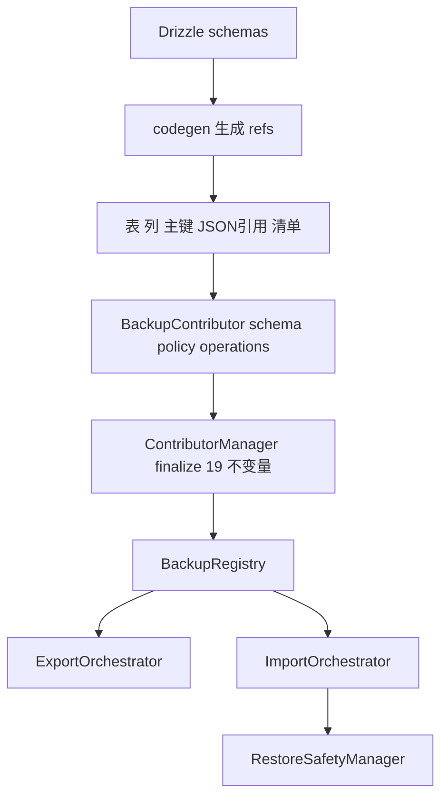
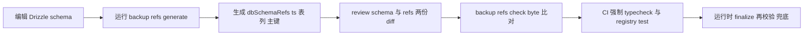
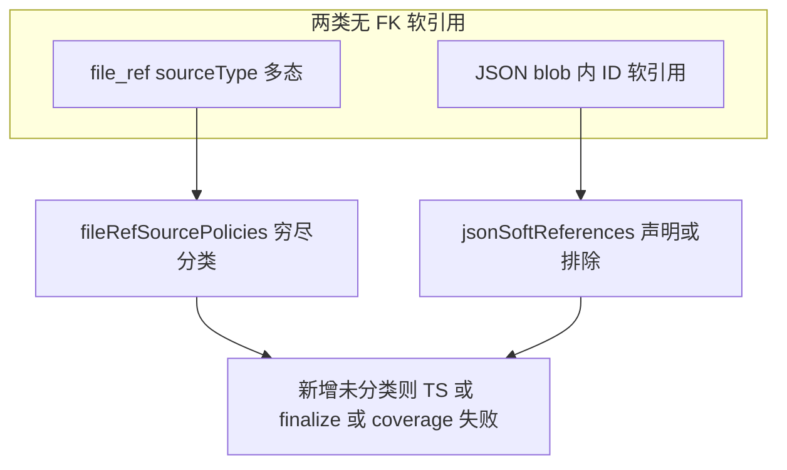
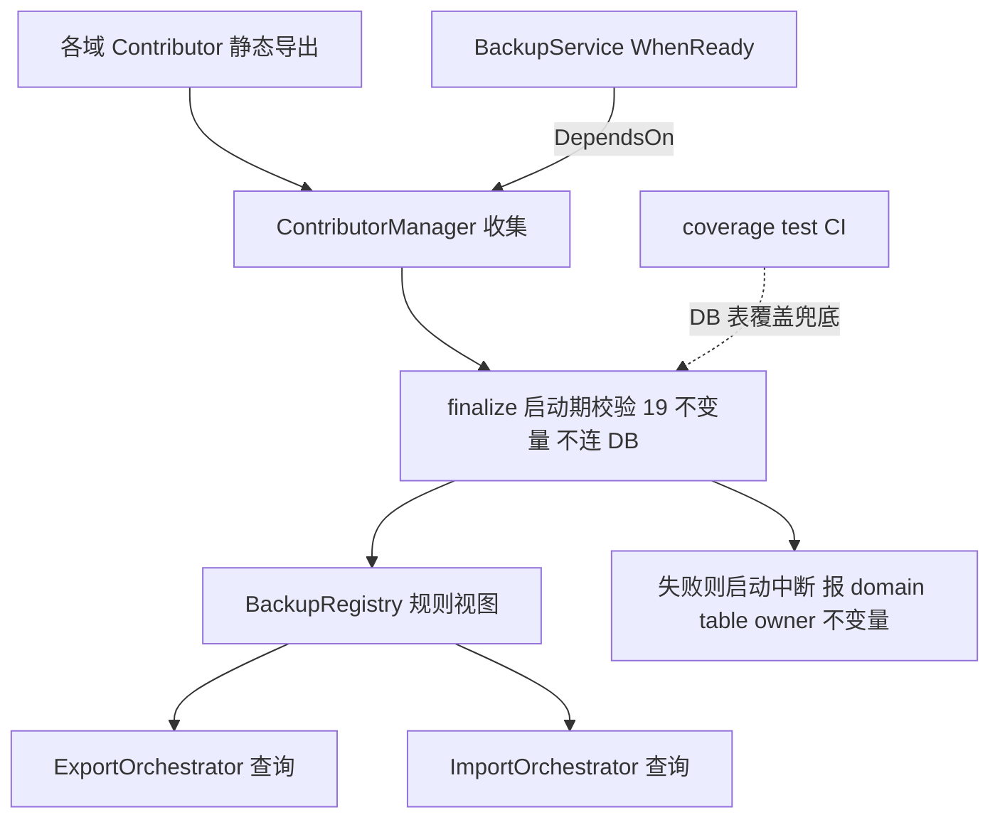

# 模块化备份 Contributor 架构设计 — Final Review

> **TL;DR**: 把 backup 的集中式规则散落（`DomainRegistry`/`DomainStripper`/`DomainImporter`/`FileCollector`）拆为各业务域声明式的 `BackupContributor`，引入**聚合边界（AggregateBoundary）**让冲突策略按完整对象边界静态可校验地传播；恢复走整库 DB pre-snapshot（`VACUUM INTO`）+ 文件快照 + `withWriteTx` 分层执行（文件 IO 事务外、DB 导入事务内，符合 V2 `withWriteTx` 哲学）。

---

## 一、产品需求与模块边界（对照标尺）

> [!NOTE]
> **本节是后续架构（§二）的对照标尺**：每个机制都应能回溯到这里的某条 in-scope 需求；无法回溯的（如 id remap）即 over-design，应在评审阶段识别，而非逐案争论。

### 主场景
- 换机迁移：把用户数据搬到新设备继续使用
- 防本地数据丢失：创建可恢复归档
- 本机回退/撤销：恢复后有限窗口内回到恢复前

### 数据模型前提
- 跨设备身份稳定：本库数据用 UUID 或自然键标识，换机不冲突、无需重新生成 ID
- （技术前提：全库主键为 uuid v4/v7 或自然键、零自增主键；故恢复保留源主键，不做 ID 重映射）

### 做什么（in-scope）
- 备份范围：完整模式含全部内容；精简模式含配置、API key、聊天记录、助手与 Agent 配置（不含图片、知识库、文件）
- 恢复规则：默认跳过本机已有的内容；只往本机补充新内容、不删本地已有数据；可选「两边都保留」或「以备份为准」
- 恢复安全：恢复前先保存当前状态，失败或反悔可回到恢复前
- 凭证：自用备份默认含模型服务 API key

### 不做什么（non-goals）
- 多设备实时同步、远程推送
- 分享 / 排障脱敏导出
- 智能语义合并（MERGE）
- 用户可见域级选择 UI（架构层支持，UI 不暴露）
- 自增或前缀主键的 ID 重排（本库不存在此类）

### 标尺用法（识别 over-design）
评审任一机制时，先问"它服务上面哪条需求"。例：「按完整对象跳过」服务主场景①②；「恢复前快照」服务恢复安全与本机撤销（主场景③、防丢失）；而「ID 重映射」找不到对应需求（数据前提已排除）→ 判为多余，移除。

### 阅读引导
读架构（§二）时对照两问：① 每个 contributor 声明能否被类型/codegen/覆盖测试校验，冲突有无聚合边界、恢复有无失败安全边界；② 产品决策（§三）是否符合用户心智。

---

## 二、架构设计

### 1. 这次重构要解决什么

当前分支的 SQLite 备份代码只作规则库存和实现参照，不是要保留的架构形态。分散在多个集中式文件，新增表/引用时需改多处且易导出/恢复语义不一致。

| 现有位置 | 承载内容 | 主要问题 |
|---|---|---|
| `DomainRegistry.ts` | 域到表映射、导入顺序、内部表排除 | 新增表易漏改（如 agent_task） |
| `DomainStripper.ts` | 省略被引用域处理、凭证处理 | 引用处理与表归属分离 |
| `DomainImporter.ts` | 唯一键合并、JSON 引用重映射、冲突处理 | object-boundary SKIP 无机制 |
| `FileCollector.ts` | 消息文件引用扫描 | 文件引用来源缺统一分类 |

两个基线：用户可见产品行为基线 = legacy/v1 `BackupManager.ts`（IndexedDB/LocalStorage/可选 Data）；架构设计基线 = 本方案最终 contributor 体系。

### 2. 总体方案：Entity facts + Backup policy + Operations（+ 聚合边界）

备份生成只操作备份副本并产出归档；备份文件是备份与恢复间唯一交接物；恢复消费默认按 manifest 域与资源执行。

```mermaid
flowchart LR
  subgraph S1[备份生成]
    A1[选预设 完整或精简] --> A2[ExportOrchestrator]
    A2 --> A3[查 ContributorManager]
    A3 --> A4[VACUUM INTO 复制为备份副本]
    A4 --> A5[beforeArchive 脱敏与偏好过滤]
    A5 --> A6[收集文件与知识库资源]
  end
  subgraph S2[备份归档]
    B[manifest 加 backup.sqlite 加 files 加 knowledge]
  end
  subgraph S3[恢复消费]
    C1[读 manifest 定范围] --> C2[建 RestoreRecoveryPoint]
    C2 --> C3[聚合边界冲突策略]
    C3 --> C4[导入 rows FK OFF 走 withWriteTx]
    C4 --> C5[FTS 重建与一致性检查]
    C5 --> C6[结果页与撤销入口]
  end
  A6 --> B
  B --> C1
```

每个域由一个 `BackupContributor` 表示：

| 层次 | 放什么 | 不放什么 |
|---|---|---|
| Entity facts（schema） | 表归属、引用事实、主键形态、聚合边界、file-ref source、JSON 软引用 | SET_NULL/DELETE_ROW 动作、导入顺序、恢复策略 |
| Backup policy | 省略引用 override、唯一键合并 | 数据库 I/O、文件操作、异步 hook（remap/idStrategies 已移除） |
| Operations | 文件资源发现、beforeArchive、JSON remap、逐行 transform、afterImport、blob 恢复、cloneAggregate | 可用纯数据表达的事实和策略 |

> [!IMPORTANT]
> **核心机制是 `schema.aggregates`（聚合边界）**，把 object-boundary SKIP/OVERWRITE/RENAME 从文字描述提升为静态可校验机制。

#### 代码架构图：Contributor 系统如何落到代码

测试四类：tsc + codegen check、coverage、equivalence、restore tests（聚合冲突 + pre-snapshot 回滚）。

### 3. Contributor 应该怎么读

| 阅读顺序 | 要回答的问题 | 对应字段 |
|---|---|---|
| Ownership | 这个域拥有哪些用户数据表？ | `schema.tables` |
| References | 引用了哪些其它域？哪些 file-ref / JSON 软引用属于本域？ | `references`、`fileRefSourcePolicies`、`jsonSoftReferences` |
| Identity facts | 每张表的 ID 形态？ | `primaryKeys`（uuid-v4/uuid-v7/natural/composite） |
| Aggregate | 用户可见对象的边界？冲突如何传播？ | `aggregates`（root/identityKey/members/renamable） |
| Backup policy | 被引用域缺失的例外？哪些唯一键要合并？ | `omittedReferenceOverrides`、`uniqueMergeRules` |
| Operations | 有无备份专用行为？没有是否明确 schema-only？ | `operations` |

内部排除项（`app_state` / `job` / `job_schedule` / `*_fts` / `__drizzle_migrations`）由全局显式排除集维护，带 reason，不进 contributor。

### 4. TOPICS contributor 示例

聚合根 `topic` + 成员 `message(topicId)`；冲突 → 整组（topic + 其 message 树）按策略处理。

### 5. 其它 contributor 参照

| 域类型 | 聚合边界注意点 |
|---|---|
| ASSISTANTS | RENAME 克隆时成员 assistantId 重映射到新根 PK |
| AGENTS | agent_task/agent_workspace/agent_channel 单表 renamable:false；agent_channel_task 双 FK 走 references optional |
| FILE_STORAGE | restoreResources() 先于 DB 行导入，返回 skippedFileEntryIds；renamable:false，RENAME 退化为 SKIP |
| PROVIDERS | 聚合 user_provider + user_model(providerId)；renamable:false（user_model.id 派生键） |

### 6. 实现侧类型契约

`EntityGraphSchema`：`tables` / `references`（kind: optional|owning）/ `primaryKeys`（kind: uuid-v4|uuid-v7|natural|composite，ambiguous 标注）/ **`aggregates`**（`AggregateBoundary { root, identityKey, members[{table, viaColumn, cascade}], renamable }`）/ `fileRefSourcePolicies` / `jsonSoftReferences` / `rowScopes?`（本期不启用）。

`BackupContributorPolicy`：`omittedReferenceOverrides`（仅例外，须绑定事实+非冗余+reason）、`uniqueMergeRules`。**不含** restoreRemap / idStrategies（over-design，移除）。

> [!WARNING]
> **类型入口**：`DbTableName` / `DbColumnName` 必须来自 Drizzle codegen，不能靠手写 as 认证。列名是 camelCase 实际 DB 列名（`topicId` / `providerId` / `fileEntryId`）。

#### Codegen 落地方案

`scripts/generate-backup-schema-refs.ts`（tsx）发现 `schemas/*.ts` 的 `sqliteTable`，经 `getTableConfig()` 读表名/列名/PK，稳定排序输出 `dbSchemaRefs.ts`（`DB_TABLES`、`DB_COLUMNS_BY_TABLE`、`DbTableName`、`DbColumnName<TTable>`、`DB_PRIMARY_KEYS` 含 uuid-v4/v7 判定与 ambiguous 标注）。不连 DB、不启 Electron。`pnpm backup:refs:generate` 写盘，`pnpm backup:refs:check` byte-for-byte 比对（CI 强制）。

生成产物：`DB_TABLES`、`DB_COLUMNS_BY_TABLE`（camelCase 实际列名）、`DbTableName`、`DbColumnName<TTable>`、`DB_PRIMARY_KEYS`（含 uuid-v4/v7 判定与 ambiguous 标注）。手写 as DbTableName 不算认证路径，须走 helper。

| 四层保护 | 失败时机 |
|---|---|
| TypeScript 拦截不存在的表/列 | 编译期 |
| backup:refs:check 防 schema 与 refs 脱节 | CI |
| registry test 覆盖新增表/列重命名/稳定输出 | 测试 |
| finalize 运行时用 DB_TABLES 再校验 | 启动期 |

#### JSON soft reference 覆盖机制

| 已分类项 | 归属 |
|---|---|
| `chat_message` | TOPICS |
| `knowledge_item` | KNOWLEDGE |
| `painting` | PAINTINGS |
| `temp_session` | excluded（runtime） |
| `message.data`（fileId） | TOPICS jsonSoftReferences |
| `agent_session_message.data`（fileId） | AGENTS jsonSoftReferences |

### 7. 注册模型与启动校验

注册到消费链路：各域 Contributor 静态导出 → ContributorManager 收集 → finalize 启动期校验 19 不变量（不连 DB）→ 通过则产出 BackupRegistry 供 orchestrator 查询，失败则启动中断并报 domain/table/owner/不变量。BackupService（WhenReady）@DependsOn(ContributorManager) 保证 finalize 先完成；DB 实际表覆盖由 coverage test（CI）兜底，故 finalize 不连 DB。

各 hook 调用时机与缺省：collectFileResources（导出前收集文件/缺省空集）、beforeArchive（剥离后仅改备份副本/no-op）、remapJsonFields（导入前 RENAME 重映射 fileId/原行不变）、transformRow（导入前/原行，返回 null 跳过该行）、afterImport（域导入后 FTS 重建/no-op）、restoreResources（DB 导入前事务外/无）、cloneAggregate（仅 renamable 聚合 RENAME/缺则 finalize 拒）。**聚合根被 SKIP 时其成员 transformRow 不调用**。

> [!TIP]
> **lifecycle**：ContributorManager 与 BackupService 均 WhenReady，BackupService 须 `@DependsOn(ContributorManager)`；finalize 只校验静态一致性、**不连 DB**（DB 覆盖由 coverage test 保证，避免 WhenReady 服务违规依赖 DbService）。

### 8. 架构检查清单

| 检查点 | 证据 |
|---|---|
| 表归属 | §1 矩阵 + coverage test（39 表全覆盖） |
| 聚合边界 | schema.aggregates + finalize #13-16 |
| 引用事实 | ReferenceKind 派生 + finalize #6/7 |
| JSON 软引用 | D19 + finalize #12 |
| 文件一致性 | restoreResources + 一致性检查 |
| 恢复安全 | RestoreRecoveryPoint（in-scope） |
| 恢复语义 | 合并语义，不差集删除 |

### 9. 恢复前快照与撤销恢复（恢复编排层）

当前文件级回滚只覆盖 FILE_STORAGE 覆盖写入，不覆盖 DB 行导入中途失败，也不覆盖 API key / 偏好 / provider / assistant / agent / 聊天记录等 SQLite 数据。补恢复编排层 RestoreRecoveryPoint：整库 DB pre-snapshot + restore journal + 受影响文件快照（同 restoreId）。**执行分层严格分离**（符合 V2 withWriteTx「fn 内仅 DB ops、不做文件 IO」约束）：

1. 停写或持 DbService writeMutex 后用 VACUUM INTO 建快照（须事务外）
2. contributor restoreResources 文件 IO 在 withWriteTx 之外、之前
3. 仅 DB 行导入在 withWriteTx 内
4. 失败整库回滚是应用级动作（libsql 持连接无法替换文件：停写→关 DbService 连接→用快照替换 live .sqlite→重连）

本方案将其作为 in-scope 必交付项（现状 createSnapshot 已用 VACUUM INTO 建 pre-restore-snapshot，但仅创建不使用：失败仅 warn 继续、无回滚/撤销/journal/文件快照；本方案补齐持锁快照 + 回滚 + journal + 文件快照 + 失败阻塞）。**snapshot 创建失败 SHALL 阻塞恢复**（现状 warn 继续，属 breaking）。**合并语义下首要价值是「撤销成功恢复」**（用户回退），其次才是失败回滚。contributor 不负责整库快照与回滚。

> [!IMPORTANT]
> 恢复写事务内 PRAGMA foreign_keys=OFF，cascade/SET_NULL/DELETE_ROW 由 importer 按 contributor policy 显式执行（不依赖 SQLite ON DELETE）；FK OFF 使恢复完全依赖 contributor 声明，故 ReferenceKind 须忠实复刻 schema onDelete（cascade→owning、set null→optional），由 finalize 校验。DB 写走 DbService.withWriteTx（fn 内仅 DB ops，文件恢复已在事务外）。

---

## 三、产品决策（已定稿）

### 1. 已定稿决策

| 主题 | 当前方向 |
|---|---|
| UI 模式 | 只暴露「完整 / 精简」 |
| 精简模式范围 | 配置/设置域 + 聊天记录 + Agent 历史/配置：PREFERENCES、PROVIDERS、PROMPTS、MCP_SERVERS、TAGS_GROUPS、ASSISTANTS、AGENTS、MINIAPPS、SKILLS、TOPICS |
| 精简模式排除 | KNOWLEDGE、TRANSLATE_HISTORY、PAINTINGS、FILE_STORAGE；不导出/恢复 file_entry、file_ref、文件 blob、知识库源文件 |
| API key | 自用完整/精简备份默认含模型服务 API key / auth config；结果页统一展示范围，不单独强调；不做分享/排障脱敏模式 |
| 恢复冲突默认 | 默认 SKIP（聚合根边界），减少重复项；RENAME 显式保留两边；OVERWRITE 显式以备份为准 |
| 恢复语义 | 合并语义：仅本地存在记录一律保留，不差集删除 |
| 结果页 | SKIP 后不展示跳过/未导入明细；缺失文件点击 Toast「无法加载文件」 |

### 2. 精简模式设计要点

命名采用「精简」（现网已有该口径）。tooltip 定稿：「精简模式：备份时跳过备份图片、知识库、文档、HTML 等数据文件，仅备份聊天记录、配置和 API key，减少空间占用，加快备份速度」。知识库先排除（知识库负责人确认仅需 `{baseId}` 文件夹 + 两表，见第五章）。

### 3. API key 默认随备份走

自用备份默认含 API key，符合换机后继续可用预期。企业后台下发 key 不属用户本地备份；不做分享模式；备份加密是独立增强。

### 4. 恢复默认策略

产品诉求"恢复后尽量不要大量重复项"，默认做法是「跳过」——本机已有的内容不再重复导入。恢复只会往本机补充备份里的新内容，**不会删除本机已有但备份里没有的数据**（只增不删）。

> [!NOTE]
> 边界：跳过不是智能合并，只处理系统能识别的重复——按完整对象整体判断（一个话题连同它的所有消息、一次 Agent 会话连同它的消息、一套助手或模型服务配置），要么整体导入要么整体跳过，不会出现导入一半。识别「同名助手」这类语义重复需要后续单独做。

### 5. 关联内容缺失如何解释

| 场景 | 页面行为 |
|---|---|
| 精简备份不含附件/文件 | 恢复页不展示"恢复文件"选项，tooltip 说明这份备份不含文件资源 |
| 某条内容引用的对象不存在 | 用户点击该引用时 Toast「无法加载文件」，不打断恢复 |
| 结果页 | 仅确认完成与范围，不列跳过/未导入明细，诊断留日志 |

### 6. 实施期验证项（不阻塞架构定稿）

| 优先级 | 问题 | 建议输出 |
|---|---|---|
| P0 | 精简模式实际体积分布？ | 模拟数据/本地样本统计完整 vs 精简 vs TOPICS 表体积 |
| P1 | 设置类数据默认「跳过」是否符合换机预期（用户换机通常希望用备份的设置）？ | 确认设置类是否应默认「以备份为准」 |
| P1 | 选「两边都保留」时文件冲突会被静默跳过（用户无感知），是否需额外提示？ | 权衡透明性 vs 减少打扰 |

---

## 四、实施前置约束

- 恢复默认 SKIP 跳过冲突备份内容、保留本地版本；冲突按用户可理解的最小完整对象（聚合根）判断。仅本地存在一律保留（合并语义）。
- 精简备份覆盖换机后最影响继续使用的内容：聊天、助手/Agent 配置、模型服务配置、常用设置；不含附件、知识库、翻译历史、paintings。
- 用户自填模型服务密钥默认随自用备份恢复；企业统一下发 key 不属此备份；不做分享模式。
- 恢复前先自动保存当前状态（整库 DB 快照 + 受影响文件快照）；失败或用户撤销可回到恢复前；RestoreRecoveryPoint 为 in-scope 必交付。
- 恢复写路径走 `DbService.withWriteTx` + FK OFF 显式 cascade。
- 实施前提：本方案基于分支目标态（`agent_task` 已合入 main）；`origin/main` 态任务定义在 `job_schedule`，需切 row-scope。当前分支落后 main（缺 `painting`/`agent_workspace`），需先同步。
