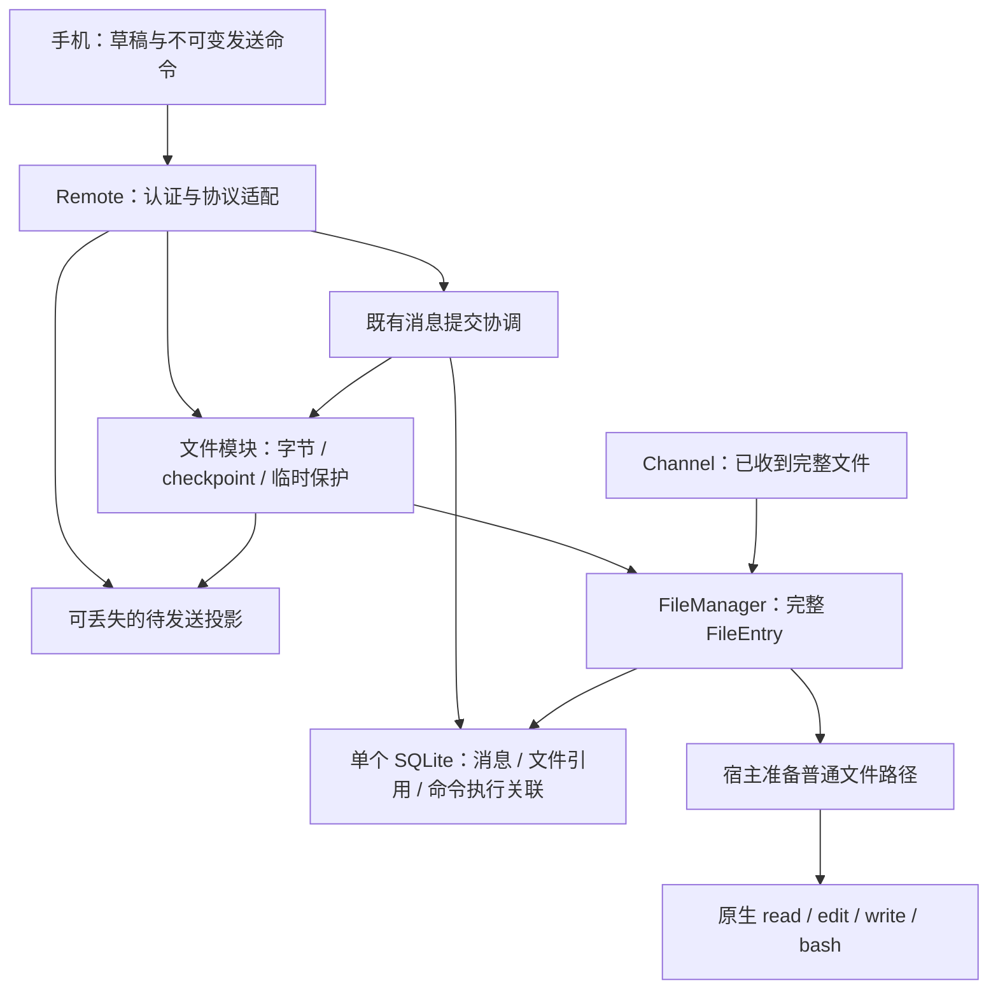

# 统一受管附件：checkpoint、发送与展示边界

状态：**简化代码已接入，正在验收**。更新日期：2026-10-10。
`file_intake`、`attachment_draft` 及其引用表、DB service 和未发布开发迁移已删除。
以下同时记录契约和当前验证边界；手机来源复制收敛仍是独立待办。

桌面跟踪 [PR #21399](https://github.com/CherryHQ/cherry-studio/pull/21399)，
移动端跟踪 [PR #1190](https://github.com/CherryHQ/cherry-studio-app/pull/1190)。
跨端设计以本文为准；移动端仓库的
`docs/references/remote-access/managed-attachments-design.md` 记录消费端映射，
`file-transfer.md` 记录传输实现和历史决策。

## 1. 决策：三个权威来源

| 问题 | 权威来源 | 持久化位置 |
|---|---|---|
| 用户准备发送什么文字、哪些附件？ | 手机草稿；发送后是不可变命令 | 手机草稿与命令 journal |
| 文件收到多少、能否恢复、是否完整？ | 桌面文件模块 | 文件与 checkpoint；完成文件登记为 FileEntry |
| 消息是否提交、关联哪次执行？ | 桌面消息与命令系统 | 现有单个 SQLite 数据库 |

桌面待发送用户块只是展示投影：手机提供完整的当前选择清单，文件模块提供真实进度。
它不参与发送校验、不持有文件、不启动 Agent，不需要持久草稿状态机。
手机离线且桌面重启后，这个块可以暂时消失；手机重连后重建。上传断点仍保留。

因此目标是删除桌面 `attachment_draft`、`file_intake` 及它们专用的引用表。
保留正常 FileEntry、消息文件引用、命令去重和执行关联。删除表之前必须补齐文件模块的
checkpoint 发布恢复与清理保护，不能只删 SQL、把一致性问题转给调用者。

受管原件统一归 FileManager，不另设 `.cherry-channel` / `.cherry-remote` 长期原件库。
受管不等于用户主动收藏：临时上传按期限保留，正式消息按业务引用保留，手动保存遵循原策略。

## 2. 为什么单数据库不要求这两张表

同一个 SQLite 数据库允许正式消息、文件引用和命令/执行预留关联在一个同步事务中提交。
这正是应复用的关系边界。文件接收的 offset、writer epoch、到期时间和发布意图属于一个
上传对象的恢复状态，不因为包含 `sessionId` / `fileEntryId` 就必须成为关系表。

当前 offset 已在文件 checkpoint 中；`file_intake` 主要登记发布身份、归属和保留引用。
把这些信息收敛到可靠 checkpoint，可以减少两处恢复状态。文件系统与 SQLite 仍不能作为
同一个事务提交，必须用固定身份和恢复对账处理崩溃，不能用“单数据库”略过这条边界。

| 真实需求 | 是否要求新增关系状态 |
|---|---|
| 断点续传、接收归属、过期、发布重试 | 不要求；单上传 checkpoint 足够 |
| 桌面展示手机当前选择、实时进度 | 不要求；可重建投影足够 |
| 正式消息引用文件、命令去重 | 需要可靠关系与事务；复用已有表 |
| 桌面也能编辑草稿、多端协作同一个持久草稿 | 才需要重新讨论草稿领域对象及并发规则；当前不支持 |
| 大规模跨上传检索、数据库内配额竞争、独立进程共同调度 | 可能值得建立上传表；当前主进程单 owner 不以此为前提 |

表并非错误的存储方式；这里的问题是为展示建立了额外业务状态，以及同一上传的恢复事实分散。
不因删表引入通用 lease 框架、第二套任务数据库或文件系统上的关系数据库模拟器。

## 3. Ownership、依赖与生命周期



- 文件模块拥有接收队列、磁盘字节、checkpoint、配额、发布恢复和清理排除项。
  `FileIntakeService` 可保留为 façade；无需为了删表再造一个长期服务。
- Remote adapter 每次操作校验当前设备、grant 和目标权限，再传入内部 owner。
  文件层比较 owner，但不反向查询 Remote、Channel、Agent 服务。客户端不能指定可信 owner。
- 消息层只在发送时校验并保护明确列出的上传，随后调用现有消息/执行预留流程。
- Channel 已拿到完整文件时直接导入 FileManager，不伪造手机草稿或分块会话。
- 文件 checkpoint 的恢复、保留集合和孤儿清理协调放在文件模块内部。
  不能让 FileManager 回调依赖它的 FileIntakeService，形成生命周期环。
- **先恢复保护集合，再启动孤儿清理和接收入口**。当前初始化顺序必须为此调整；
  不能等 Remote 启动后才告诉已经运行的清理器哪些文件应保留。
- 沿用 BaseService、同阶段依赖、受跟踪任务和事件。关闭时先停止入口，再排空写入/发布/
  发送准备，保存恢复状态，最后关闭文件服务与 DB；正常退出不等于取消上传。

## 4. 文件与 checkpoint

### 最小恢复内容

以下是概念字段，不是新增 wire schema；按现有 checkpoint 演进，避免重复派生状态。

```ts
type UploadCheckpoint = {
  uploadId: string
  owner: UploadOwner
  metadata: { filename: string; mediaType: string; byteLength: number }
  durableOffset: number
  writerEpoch: number
  resumeIdentity?: string
  phase: 'receiving' | 'verifying' | 'publishing' | 'ready' | 'cancelled'
  createdAt: number
  expiresAt: number
  publication?: { fileEntryId: string; sha256: string }
}
```

路径由文件模块和 pathRegistry 推导，不接受客户端任意路径。展示目标不赋予读取/发送权限。
`ready` 仅表示完整受管文件可用，不能表示消息已发送；消息结果只查命令/历史。
损坏状态可隔离并报错，不需要在 checkpoint 再复制完整消息状态机。

### 接收与断点

1. 按 upload 串行提交，使用 writer epoch 拒绝旧连接写入；resume 请求保持幂等身份。
2. 块写入并同步数据，再原子替换并按平台能力持久化 checkpoint，最后 ACK 连续持久 offset。
   不得先 ACK 内存进度。重启截断未确认尾部，实际文件短于确认 offset 时拒绝继续拼接。
3. 相同偏移的重复块逐字节一致才能确认；不同内容、重叠边界或缺口拒绝。
4. complete 检查完整长度并在桌面流式计算摘要，然后进入发布；100% 字节不等于 ready。
5. 取消持久记录后才能清理；保留足以阻止迟到 prepare/resume 复活同一次上传的取消记录，
   其期限与重试协议一致。不能删除状态后把旧请求当全新上传。

传输沿用已实现的 **1 MiB DATA、窗口 2**；JSON 控制上限 64 KiB，二进制记录上限 4 MiB。
Noise 管理加密分帧与 nonce；移动端用原生批量加密，桌面负责最终 hash。
手机不再做全文件 SHA-256 预扫描，也不额外计算每块业务摘要。
桌面计算的摘要不是与手机原件摘要独立比对的端到端校验；源内容稳定性另由手机保证。

### 发布与崩溃恢复

```text
完整接收并校验
  → 分配一次 fileEntryId，将发布意图持久写入 checkpoint
  → FileManager 发布受管字节
  → 插入/确认同一 FileEntry
  → checkpoint 标记 ready
```

- 发布前固定 entryId，重试不能再次调用会创建新身份的普通导入流程。
- 同盘移动或文件系统 clone 可优化复制；跨盘需要受控临时文件、校验和发布。
  只允许文件模块接管自己的暂存文件，不开放任意路径 adoption。
- 已有字节但无 DB 行：核对内容后补登记；已有 DB 行但 checkpoint 尚未 ready：核对身份、
  路径、大小和摘要后完成恢复；不符合预期或缺字节：隔离/失败，不冒充成功。
- 发布意图同时保护已分配的 entryId 和相关字节，覆盖 rename 与 DB commit 间隙。
  FileEntry 插入和必要内部元数据写入使用现有事务，不新增 intake 业务引用表。

### 临时保留与回收

FileManager 的可回收判断必须同时考虑：**正常业务引用、有效 checkpoint、正在进行的文件操作**。
这套规则归文件模块；Remote/React 不自行维护第二套保留计数。

扫描结果只是候选，删除前必须在与保护/发布互斥的短临界区内复核。恢复期间暂停相关清理。
checkpoint 读取失败不等于没有 owner；延后相关回收并记录错误，必要时隔离，不能误删文件。
只有确认到期/取消且没有活动保护及业务引用，才删除字节与恢复记录；清理中断可以重试。

现有限制保持：1 GiB/文件、2 GiB/消息、8 文件；设备/全局未提交预留 4/8 GiB；
闲置 24 小时、最长 7 天。ready 未发送也计入配额。展示心跳不无限延长期限。
发布副本及可写工作文件需计算峰值空间；不承诺所有平台零复制。

## 5. 发送与可丢失展示接口

### 发送直接表达完整意图

```ts
agent.messages.send({
  commandId,
  sessionId,
  expectedIdleRevision,
  text,
  attachments: [{ uploadId }]
})
```

不再用 `draftId + manifestRevision` 间接查找清单，也不需要草稿的
`claim / releaseClaim / consumeTx`。同一个 upload 不需要被某个草稿排他消费；
不同命令是否允许发送由既有会话/调度规则决定，去重单位是 commandId。

```text
手机：冻结并持久化 commandId + 完整参数，再发请求
桌面：先查/重放既有命令结果
  → 校验当前授权、目标与附件数量/总量
  → 逐项确认同 owner、ready，取得文件保护
  → 在事务外准备 runtime 必要输入
  → withWriteTx（同步）
      复核授权/目标及既有发送前置条件
      提交消息、正常文件引用、命令与执行预留关联
  → 释放本次临时保护，按既有机制激活执行
  → 返回/恢复既有命令结果
```

关键顺序是 **先保护 → 建立消息引用 → 再释放**。事务失败释放本次操作保护，未到期上传仍可保留。
事务成功后崩溃最多留下多余临时保护，后续回收不影响消息文件。
发送先取得保护时，取消/清理不得破坏该次发送；取消先完成时，发送拒绝已取消引用。

正常消息、引用和预留关联使用同一数据库的事务能力；最终执行状态仍由现有 journal/runtime
负责。这里没有把文件系统、模型调用或整次 Agent 执行包装成一个 SQLite 事务。
不持全局锁进行 1 GiB hash、网络等待或运行模型，也不自动重放外部工具副作用。

命令可能到达桌面后，手机保持原 ID 和参数。响应丢失先查 receipt，已提交命令即使上传过期
也应返回原结果。移除输入框文件不是撤回消息；明确终态拒绝后的用户新尝试可以创建新命令。

### 待发送展示

复用现有连接/IPC 通知基础设施，增加或替换为“完整选择快照”的短暂展示入口。
具体方法名待实现确定，概念输入如下；不新增 durable mutationId 或草稿 CAS：

```ts
type PendingSelection = {
  displayId: string
  sessionId: string
  sequence: number
  attachments: Array<{ attachmentId: string; uploadId?: string; name: string; size?: number }>
  commandId?: string
}
```

服务端把快照绑定到当前授权连接世代与 owner；旧连接/旧序号不能覆盖新状态。
手机可先展示 preparing 元数据，得到 uploadId 后补快照；进度和 ready 以文件服务为准。
重连发完整快照，空列表移除展示，过期投影可以丢弃；不为此同步每次未发送文字输入。

发送 handoff 时用 commandId 关联待发送块与正式结果。已提交命令的迟到快照不能重新出现；
无论历史消息还是 ACK 先到，均只展示一个正式用户块。displayId 不参与消息内容或权限判断。
桌面 IPC 订阅先于快照读取，读取期间失效再读，避免漏更新；实时进度不因 UI 需要而新增表。

## 6. 手机来源文件与 React

### 稳定来源不等于必须复制 1 GiB

当前普通文档经 picker cache 再导入 `Data/Files`，可能产生完整副本；导入文件按 My Files
的手动保留策略存储。当前上传复用已导入原件，可变/生成文件才另存上传快照。
**以下来源收敛是待实施工作，不能描述为已有零复制能力。**

- 来源可跨重启重开、权限持续有效且能保证相同内容时，可直接读取；普通 URI 并不足以证明这些。
- 不满足条件时只建立一份必要的稳定快照。应用自己的 picker cache 可在路径/所有权/文件系统
  允许时移动接管；跨盘复制成功后再回收应用临时来源。不得移动或删除用户外部原件。
- 不直接把 `copyToCacheDirectory` 改成 false：先确认 native reader、持久 URI 权限和恢复能力。
- 草稿/任务持有临时来源；命令 admitted/uncertain 后由命令恢复继续保留，不能随 composer
  清空而删除。终态且无其他 owner 后回收临时来源，用户主动保存的文件保持原策略。
- 准备、上传、桌面校验分开计时。源缺失或变化时拒绝拼接旧断点，明确失败/新尝试。

### React 与预览

任务由 `RemoteAgentRuntime/Scope` 持有，组件只订阅快照。选择、移除、取消、发送 handoff
是显式动作；不通过监听附件数组的 effect 推断网络操作，卸载不取消上传。
本地移除先持久化，再 abort/远端清理；旧回调检查 attachmentId、目标 binding 和 generation。

快照缓存和 subscribe 身份稳定，复用现有外部 store 适配；`canSend` 从内容、目标、提交状态和
全部附件 ready 派生。每项订阅自己的进度，约 100 ms 合并、终态立即通知；字节不进 React state。
StrictMode 重挂载不得启动第二次上传。发送清空与用户移除分开，失败恢复不覆盖更新的草稿。

输入框与消息使用同一个 CherryUI FilePreview 视觉基底，业务 adapter 分别提供本地资源或远程
metadata；用户附件右对齐且可换行。选择后立即边框 loading，字节完成后校验期间仍不可发送。
不伪造本地 URI，不为生成预览自动下载大文件；发送者可复用已确认对应内容的本地图片缩略图。
首个附件沿用提前幂等创建空会话的当前行为，不启动 Agent；取消不自动删除该会话。
后台挂起后恢复，不承诺 JS 或本期实现持续后台传输。

## 7. Agent 原生文件访问

Agent 继续使用 harness 原生 `read/edit/write/bash`，无需专用附件编辑工具或“文件管理 Agent”。
路径不必天然处于工作区内；是否可访问由 runtime 实际权限决定。受管目录也不是自动获得的沙箱权限。

保留历史原件并允许任意编辑，需要分离历史字节与可变工作字节。宿主准备普通可写路径，支持时
使用文件系统 clone，否则复制；hard link / symlink 不能冒充内容隔离。只读消费无需强制可写副本。
现有实现使用 `.cherry-studio/attachments/<session>/<preparation>/<entry>/<filename>`，
这属于可编辑工作文件，不是另一个入口专属原件库。本轮删表不隐含替换这套 runtime 路径策略。

原生 bash 不经过 FileManager 锁。watcher 只是缓存失效提示，不是可靠操作日志；重新读取/发布
时核对文件事实，发布结果采用稳定快照。不能自动重跑 bash 来修复登记，也不能让历史下载使用
已经变化字节的旧 hash。现有产物流程继续负责结果发布，本期不建设通用 VFS、版本树或脚本产物发现器。

## 8. 错误与通信反例

文件错误由 adapter 映射为协议错误，再由 UI 本地化。日志关联 uploadId/commandId，
不输出密钥、内容或主机私有路径。沿用现有错误体系，不为每个内部阶段创建一套 RPC。

| 场景 | 正确处理 | 禁止行为 |
|---|---|---|
| 离线选择、Wi-Fi/VPN 切换 | 本地保存，等待已配对主机，按 durable offset 恢复 | 假装桌面已看到或自动换授权对象 |
| 桌面重启、手机仍离线 | 恢复上传保护；待发送投影可暂缺 | 为保留展示再建权威草稿 |
| 手机重启 | 恢复稳定来源、任务及冻结命令，重发选择快照 | 以新文件内容续写旧上传 |
| 两连接同时 resume | 幂等 takeover、epoch fencing | 让旧 writer 的 complete 生效 |
| 移除后旧 prepare/complete 返回 | 本地 generation 拒绝挂回；清理可重试 | 迟到结果重新选中附件 |
| 同名文件、不同设备 | 独立身份与 owner，名称仅展示 | 按名称覆盖或按 hash 越权复用 |
| 100% 后校验失败 | 标记失败，保留不可发送状态 | 只看百分比启用 Send |
| 磁盘/配额不足 | 可诊断失败，保留有效断点；释放空间后显式恢复 | 丢弃已确认字节却报告可续传 |
| 授权撤销或目标删除 | 阻止新操作，清理未提交保护；正常消息引用独立保留 | 自动换 grant 或删已提交文件 |
| send 回包丢失且上传已过期 | 优先查同一命令结果 | 重新上传并产生第二条消息 |
| 清理、取消、发送并发 | 文件模块保护与删除互斥，消息引用接棒 | 先释放上传，再异步补消息引用 |
| checkpoint 无法读取 | 延后相关回收、报错/隔离 | 当无引用垃圾立即删除 |
| 旧投影晚于正式历史到达 | 按 commandId 抑制重复块 | 复活“正在上传”的第二条用户块 |

## 9. 文件与函数调整范围

签名沿用现有 façade，删除不再需要的职责，不预建多层框架。

| 位置 | 目标调整 |
|---|---|
| `services/file/FileIntakeService.ts`、`intakeTypes.ts` | prepare/get/resume/write/complete/cancel 保留；checkpoint 接管发布身份与临时持有 |
| `services/file/internal/entry/publishIntake.ts` | 从持久 checkpoint 接受固定 entryId；发布重放核对，移除 intake 表登记依赖 |
| `services/file/FileManager.ts`、`internal/orphanSweep.ts` | 初始化恢复屏障、保护/回收协调；withEntries 或等价回调保护跨越发送事务 |
| `data/db/schemas/fileIntake.ts`、`data/services/FileIntakeService.ts` | 迁移有效恢复信息后退役表与 data service、专用引用聚合 |
| `ai/agentSession/AttachmentDraftService.ts` 及同名 data service/schema | 删除草稿 CAS、claim、consume 和引用；展示逻辑转 Remote 投影 |
| `services/remoteAccess/RemoteUploads.ts`、`agentHandlers.ts` | 验权与映射；发送仅冻结直接 refs；receipt 查找先于上传查找 |
| `packages/remote-protocol/src/agent/` | 单一共享 schema；移除草稿事务协议，定义短暂选择快照；上传传输保持 |
| `shared/ipc/schemas/ai.ts`、`main/ipc/handlers/ai.ts`、`AgentPendingAttachments.tsx` | 待发送投影及失效通知，移除对草稿 DB 的依赖 |
| `main/data/services/AgentSessionMessageService.ts`、`FileRefService.ts` | 保留正式引用事务，移除专用 intake/draft 引用来源 |
| Mobile `RemoteAttachmentDrafts`、`RemoteAgentActions` | 本地草稿权威；去远端 CAS；显式冻结 refs、来源保留和命令 handoff |
| Mobile `remoteUploads.ts`、conversation adapters、Composer | 保留二进制/续传；发布选择快照，稳定订阅，统一附件呈现 |

所有新路径经 pathRegistry；保持文件模块公开边界，不从 Remote deep import 文件内部实现。
临时展示用 IPC/现有连接接口，不为没有表的数据创建 DataApi endpoint。

## 10. 当前实现、迁移与验收

当前两端已有选择即上传、1 MiB 二进制传输、断点与 writer fencing、受管发布、逐文件边框进度、
桌面 pending 块和原生工作文件。**当前发布身份和临时保留已转入 checkpoint，选择展示不再使用桌面草稿 CAS。**
checkpoint-only 临时所有权、直接附件引用发送和短暂展示已接入；手机来源复制收敛尚未实现。

现有小文件真机反馈很快；一次 2,145,653 字节记录的上传函数耗时约 1.20 秒，准备段约 171 ms，
不包含 picker 与最初受管导入。合成 8 MiB LAN 加密传输约 1.27 秒也不等于完整文件流程。
这些不能证明 1 GiB 的手机内存、磁盘峰值、双端重启或后台恢复已验收。

实施顺序：

1. 先补文件模块恢复屏障、固定身份发布和清理保护，用故障测试证明后再移除 intake 表依赖。
2. 将发送收敛为直接 refs，验证正式引用/命令事务及丢响应重放。
3. 手机去远端草稿 CAS、桌面换可重建投影，再退役草稿服务、表与引用来源。
4. 按实际来源能力减少手机复制；独立验证 native 权限与重启恢复，不能只改 picker 参数。
5. 更新共享包、两端消费与文档；联调后记录设备验收，不把文档完成写成代码完成。

迁移先调查实际发布和存量 checkpoint/命令。已经可能发送的旧命令不得改写冻结参数。
需要兼容时限定为真实存量的恢复/一次性迁移，不能仅为未发布迭代引入永久 v1/v2 协议分支。
本分支相关迁移未发布，已直接移除建表/删表 SQL 与 snapshot，恢复原迁移链。
本机开发库单独备份后移除了四张开发表和这两条已应用的开发迁移记录，正常消息/文件/命令不变。
不为此保留产品兼容 DB service。冻结旧命令仍可按原请求解码并查 receipt；没有已知 receipt 的旧草稿发送明确拒绝，要求重新准备。
已发布的其他 migration 不重写，用户数据库不重置。
现有开发 tarball 保持同一共享源、可移植路径；正式发布依赖正常共享包发布流程。

验收必须覆盖：

- fsync、checkpoint 替换、字节发布、FileEntry 插入、消息事务提交前后逐点崩溃；恢复身份不变。
- 清理启动早于恢复被禁止；checkpoint 损坏、清理与保护竞争、取消与发送竞争不会误删。
- 实际字节续传、相同/变化重复块、跨 owner、过期、0 字节、1 GiB；两端重启最终内容一致。
- 同命令丢 ACK 后重放且上传已过期仍只有一个消息/执行；不同命令不受旧草稿排他消费规则限制。
- 新连接拒绝旧展示、重连完整快照、手机离线桌面重启、历史与 ACK 两种顺序无重复用户块。
- 发送清空不取消、卸载不取消、StrictMode 不重复任务，失败恢复不覆盖新草稿。
- 原生 read/edit/write/bash 后历史原件不变；未发布的可变内容不冒充历史附件。
- Android/iOS 与 Electron 实测 1 GiB 磁盘/内存峰值、源准备、传输、校验各段耗时，
  低磁盘、VPN 切换及前后台恢复；文件测试不替代 native 验收。
