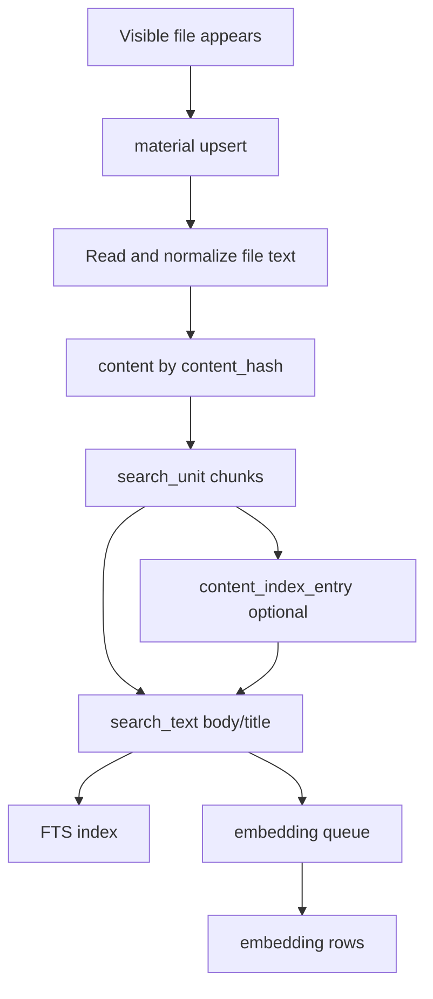

# 知识库 index.sqlite 表结构设计

Date: 2026-06-06

> 状态(2026-06-10): 本篇主体已由 **PR A 落地**（核心在 commit `029709d201`，C1 / I1–I8 review 修订在本分支）。文中描述的 9 张表（`index_meta` / `material` / `material_relation` / `content` / `search_unit` / `content_index_entry` / `search_text` / `embedding` / `search_text_fts`）、material 模型、`KnowledgeIndexStore`（`rebuildMaterial` / `deleteMaterial` / `listMaterialUnits` / `listExistingEmbeddingHashes`）、`unit_id` 稳定生成、chunk offset 均**已实现**，`search()` 与索引 job 已切到新 store；旧单表 `libsql_vectorstores_embedding` + `external_id` API（`replaceByExternalId` / `deleteByIdAndExternalId` / `deleteItemChunk`）已从 runtime 移除，仅 v1→v2 迁移器仍读旧表作迁移来源。**仍待执行**：embedding / content 孤儿行的机会式 GC（当前只有删除时的级联，无独立孤儿 GC 入口，排期 PR B/C）、`content_index_entry` 生成与 Agent-first material 结果（v2.x / PR C）、`index_meta` snapshot 契约比对 + 选择性重嵌（见 §6.1）。baseline 早先落地的地基（`.cherry/index.sqlite` 路径、用户文件入 base 目录并记 `relativePath`、path-based 文件处理）依旧成立。下文逐节状态注仍标注「已具备 / 仍待执行 / baseline 现状」。

本文记录 Cherry Studio v2 / v2.x 文件夹型知识库的 `index.sqlite` 设计共识。它面向实现和后续审计，不是用户 PRD。

相关产品语义见：

- [Agent 管理型知识库产品文档](./agent-managed-knowledge-product.md)
- [Knowledge UI Presentation](./knowledge-ui-presentation-options.md)
- [KnowledgeService](../knowledge-service.md)
- [Knowledge Operation Guards](../operation-guards.md)

## 1. 设计目标

新的知识库以真实文件夹为用户可见事实：

```text
KnowledgeBase/
  {baseId}/
    user-file.pdf
    user-file.md
    notes/
      README.md
    .cherry/
      index.sqlite
```

`index.sqlite` 是每个知识库自己的隐藏索引库。它保存可重建的索引状态、文件到内容的映射、检索单元、全文检索文本、向量和少量持久失败摘要。它不保存用户可见文件的副本，也不替代真实目录树。

核心目标：

- v2 阶段直接写入与 v2.x 兼容的最终表结构，避免用户从 v2 切换到 v2.x 时重嵌入或重建索引。
- 旧 v1 知识库迁移到 v2 后形成稳定终态；当前开发中的 v2 向量表可以修改。
- 搜索以 Agent 场景为主：先返回材料级结果和 locator，再由 Agent 调用 `read(locator)` 获取邻近上下文。
- v2.x 目标是全文检索在未配置 embedding 或 embedding 未完成时也可用。当前 v2 仍保留 embedding 必需条件，只是先写入终态兼容的 `index.sqlite` schema。
- 向量库字段保持简单，未来迁移到 `better-sqlite3 + sqlite-vec` 时只需要替换向量存储层。

## 2. 非目标

第一版明确不做：

- 不把全局 `knowledge_item` 作为 v2.x 文件夹型知识库的长期材料事实。当前 v2 仍保留 `knowledge_item` 作为 UI 数据源、任务编排和状态展示表。
- 不在 UI 中长期显示“已索引 / 未索引”状态；导入时只显示解析进度，完成后不显示持久 badge。
- 不在 `index.sqlite` 中保存 job 进度；进度复用现有 JobManager。
- 不创建 `.cherry/artifacts/` 或 `.cherry/assets/`。
- 不把 MinerU 处理过程中的页面图、临时资产、缓存文件纳入第一版目录设计。
- 不为目录创建 material 记录；目录摘要应是用户可见的 `README.md` / `index.md` 文件。
- 不做软删除。
- 不通过文件指纹推断 App 关闭期间发生的离线移动。
- 不在每条 embedding 行保存 `model_id` 和 `dimensions`。
- 不在第一版提供权重、启用开关、排序字段等高级调参字段。
- 不维护目录级摘要表；如果需要目录摘要或目录索引，应生成用户可见的 `README.md` / `index.md`。
- 不保留单个 chunk 删除能力。chunk、FTS、embedding 都是派生索引；用户如果不满意索引结果，应重建整个材料索引或修改材料内容。

## 3. 目录与文件约定

### 3.1 目录

> 状态(2026-06-08): baseline 已直接采用隐藏布局，索引库已位于 `{baseId}/.cherry/index.sqlite`（见 `src/main/services/knowledge/utils/storage/pathStorage.ts:8-28`，`.cherry` 是保留前缀）。原先「v2 先放根目录、v2.x 才移进 `.cherry/`、升级时移动 `index.sqlite`」的区分已作废——移动已经发生，无需再做。

索引库最终位置为：

```text
KnowledgeBase/{baseId}/.cherry/index.sqlite
```

baseline 已把用户上传文件通过 filesystem copy 写入 `KnowledgeBase/{baseId}/` 可见目录，而不是只通过 FileManager external entry 指向原始外部文件。这样后续切换到文件夹型知识库时不需要再次复制用户文件。

用户文件已经在 `KnowledgeBase/{baseId}/` 下，隐藏索引库已经在 `.cherry/` 下，二者均无需再搬迁。

### 3.2 可见材料

可见文件是知识库材料。用户、Agent 或处理器写入知识库可见目录的普通文件，都可以成为 `material`。

默认忽略：

- `.cherry/**`
- 隐藏文件
- 临时文件
- 系统文件

这些 scan-level ignored 文件不进入 `material` 表。

当前 v2 暂不做 watcher 自动导入。只有通过当前 v2 UI / Job 创建的 `knowledge_item` 会同步创建 `material` 并进入索引；用户手动放入 `KnowledgeBase/{baseId}/` 的文件，当前 v2 可以先不自动显示和索引。

v2.x 文件夹型知识库中，用户直接在知识库文件夹里新增普通可见文件，扫描或 watcher 应自动发现它，创建 `material(origin = discovered)`，并按默认规则进入索引。

当前 v2 中，`material.relative_path` 已经使用 `KnowledgeBase/{baseId}/` 下的真实相对路径，不使用 `items/{knowledge_item.id}` 这类虚拟路径。UI 仍可以继续从 `knowledge_item` 读取标题、状态和任务信息，但索引层路径从当前 v2 开始就对齐 v2.x。

当前 v2 的知识库文件不再需要通过 FileManager `file_entry` 作为材料身份。`knowledge_item.data` 对 file leaf 应记录知识库目录内的 `relativePath`，reader 通过 `KnowledgeBase/{baseId}/{relativePath}` 读取。v2.x 继续沿用同一目录语义。

当前 v2 的 URL 和 note 也应落成知识库目录中的 Markdown 文件，而不是只把正文保存在 `knowledge_item.data` 中：

```text
captures/url/<title>.md
captures/note/<title>.md
```

`knowledge_item.data` 可以保留 `url`、`sourceUrl`、`source` 等刷新或展示信息，但索引读取应走 `relativePath` 指向的本地 Markdown。v2.x 继续把这些文件视为普通可见 captured material。

当前 v2 仍可保留 `knowledge_item.type = directory` 作为 UI 和 Job 编排容器，但它不创建 `material`，也不直接进入索引。directory 上传时先把目录树复制到 `KnowledgeBase/{baseId}/`，展开出的 leaf file items 记录各自的 `relativePath` 并创建 material。v2.x 中目录由真实文件夹表达。

> 状态(2026-06-08): sitemap 已不再作为独立 item 类型，v1 sitemap 迁移为 `url`（`KNOWLEDGE_ITEM_TYPES = ['file','url','note','directory']`）。本设计不再把 sitemap 当作容器或 material 来源。

当前 v2 写入知识库目录时遇到同路径冲突，采用 reject-on-conflict 策略：直接报错 `Knowledge file already exists`，并通过 reservedPaths 预检避免与待落盘文件互撞，而不是静默生成 `_2`、`_3` 后缀覆盖或并存（仅 v1 迁移器为去重用 `-N` 连字符后缀）。`knowledge_item.data.relativePath` 和 `material.relative_path` 都记录最终落盘路径。v2.x 再提供 replace / keep both / skip 的完整文件管理器式冲突对话框。

> 状态(2026-06-08): baseline 已采用 reject-on-conflict（`pathStorage.ts:122-133`），实时 add 冲突直接报错；仅 `KnowledgeMigrator` 在 v1 迁移时去重（用 `-N` 连字符），见 `KnowledgeMigrator.ts:115-130`。

当前 v2 的 `knowledge_item.data.source` 保留，但它只表示原始来源标识，不是读取路径。文件读取、处理和索引都走 `relativePath`：

```text
read path = KnowledgeBase/{baseId}/{relativePath}
```

例如本地文件的 `source` 可以是用户最初选择的 `/Downloads/paper.pdf`，URL 的 `source` 可以是原始 URL，note 的 `source` 可以是笔记标题或来源描述。用户或系统移动知识库内文件时，更新 `relativePath`，不把 `source` 当成知识库内位置。

### 3.3 处理器产物

MinerU 等处理器输出的 Markdown 是普通可见文件，保存到用户上传目录中，通常与源文件相邻：

```text
paper.pdf
paper.md
```

第一版只保存处理后的 Markdown，不保存 MinerU 的 artifacts、assets、页面缓存等中间产物。

当前 v2 中，文件处理产物也应直接生成到源文件所在目录。比如用户上传 `paper.pdf` 到知识库当前目录，MinerU 输出应保存为同目录的 `paper.md`，而不是只保存为 FileManager internal artifact。文件处理流程需要支持 path-based 输入和输出，不能要求知识库材料先注册为 FileManager `file_entry`。

file processing 不应新增一套自定义 `source.kind = file_entry | path` 兼容参数，而应复用现有文件系统抽象 `FileHandle`：

```ts
type FileHandle =
  | { kind: 'entry'; entryId: FileEntryId }
  | { kind: 'path'; path: FilePath }

type FileProcessingOutputTarget =
  | { kind: 'path'; path: FilePath }

interface StartFileProcessingJobInput {
  feature: FileProcessorFeature
  file: FileHandle
  processorId?: FileProcessorId
  output?: FileProcessingOutputTarget
  context?: {
    dataId?: string
  }
}
```

> 状态(2026-06-08): baseline 已把文件处理 intake 收敛为单一 `{kind:'path'}` 输出，`managed_artifact` 被整个删除（不是保留作默认）；`document_to_markdown` 入队前强制要求 path output，MinerU 仅认 `context.dataId`（无 `fileEntryId` 回退）。见 `src/shared/data/types/fileProcessing.ts:28`、`FileProcessingService.ts:80-82`、`mineru/document-to-markdown/handler.ts:88-90`。

当前 v2 知识库调用 file processing 时使用 `file.kind = path` 和 `output.kind = path`。processor 内部只接收 resolved `FileInfo`，不需要关心调用方选择 entry 还是 path。

当前 v2 中，处理器生成 Markdown 后不新增一个 processed Markdown `knowledge_item`。原 file item 保留：

```ts
{
  relativePath: 'paper.pdf',
  indexedRelativePath: 'paper.md'
}
```

当前 v2 UI 仍显示 `paper.pdf` 这一条数据源，但索引读取 `indexedRelativePath ?? relativePath`。v2.x 文件夹型知识库扫描真实目录时，再把 `paper.md` 作为独立 visible material，并写入 `material_relation(processed_from)`。

当前 v2 中，`material.relative_path` 指向实际被索引的文件。没有处理产物时，它等于 `knowledge_item.data.relativePath`；有处理产物时，它等于 `knowledge_item.data.indexedRelativePath`。因此当前 v2 允许 UI 上的一条 `knowledge_item` 显示 `paper.pdf`，而索引侧的 `material.relative_path` 是 `paper.md`。这样 search/read 的路径与实际内容一致，v2.x 再把 `paper.pdf` 和 `paper.md` 拆成两个 material。

当前 v2 删除带处理产物的 `knowledge_item` 时，应同时删除 `relativePath` 源文件、`indexedRelativePath` 处理产物和对应索引。因为当前 v2 中处理产物没有独立 `knowledge_item`，它仍是该 item 的索引产物。v2.x 中处理产物成为独立 visible material 后，再遵循“删除 PDF 不自动删除 Markdown”的独立生命周期。

当前 v2 删除任意 file/url/note leaf `knowledge_item` 时，都应物理删除 `KnowledgeBase/{baseId}/{relativePath}` 这份知识库副本，并清理对应 material/index。删除不会影响 `source` 指向的外部原文件、URL 或笔记来源。v2.x 继续沿用“删除 material = 删除知识库内保存文件 + 清理索引”的语义。

当前 v2 删除 knowledge base 时，应取消相关 jobs，然后删除整个 `KnowledgeBase/{baseId}/` 目录，再删除全局 `knowledge_base` / `knowledge_item` 行。v2.x 继续沿用同一目录删除语义。当前 v2 restore / duplicate base 时，应复制知识库目录内的材料文件并重建索引，不应重新依赖外部 `source` 路径。

v2.x 文件夹型知识库中，当 `paper.pdf` 和 `paper.md` 都成为独立 visible material 后：

- `paper.pdf` 可以是 `index_policy = suppress`，避免重复索引。
- `paper.md` 是 `index_policy = index`，作为搜索来源。
- 两者关系写入 `material_relation`。
- 删除或移动 Markdown 不自动重建，也不静默回退索引 PDF。

## 4. 表清单

> 状态(2026-06-10): 下表 9 张表**已由 PR A 全部创建**（`src/main/features/knowledge/vectorstore/indexStore/schema.ts` 的 `createKnowledgeIndexSchema`，DDL 全用 `CREATE TABLE IF NOT EXISTS`）。runtime 已写入本表结构，旧单表 `libsql_vectorstores_embedding` 仅剩 v1→v2 迁移器读取作迁移来源。

建议第一版创建以下表：

| 表 | 用途 |
| --- | --- |
| `index_meta` | 单行索引库元信息和版本快照 |
| `material` | 可见文件材料的稳定身份、路径和持久失败摘要 |
| `material_relation` | 材料之间的来源关系，例如 Markdown processed_from PDF |
| `content` | 规范化后的索引文本，按内容哈希保存 |
| `search_unit` | Agent 可读取的检索单元，例如 chunk、heading section |
| `content_index_entry` | 可编辑的内容索引条目，例如问题、摘要、关键词、标签 |
| `search_text` | 统一检索文本投影，供 FTS 和 embedding 共用 |
| `embedding` | 当前 embedding 文本的向量 |
| `search_text_fts` | FTS5 虚表 |

不建议创建：

| 表 | 原因 |
| --- | --- |
| `knowledge_item` | 新知识库材料由各自知识库目录和 `index.sqlite` 管理 |
| `job` | 进度复用现有 JobManager |
| `embedding_target` | `search_text.embedding_text_hash` 已能连接文本与向量 |
| `schema_migration` | 第一版用 `index_meta.schema_version` 单值当版本游标即可；后续 schema 演进迁移策略见 §11 |
| `ignore_rule` | 先记录 `ignore_rules_version`，规则由代码侧统一维护 |
| `material_link` | 第一版缺少明确维护方和必要场景 |

## 5. 枚举约定

### 5.1 material.status

| 值 | 语义 |
| --- | --- |
| `active` | 文件当前存在，是可用材料 |
| `missing` | 之前存在的材料现在找不到 |

不做软删除。删除文件后，清理对应索引和材料记录；只有需要表达“之前存在但当前暂时找不到”的场景才保留 `missing`。

### 5.2 material.origin

| 值 | 语义 |
| --- | --- |
| `user` | 用户上传、拖入或手动创建 |
| `processor` | 处理器生成，例如 MinerU Markdown |
| `agent` | Agent 写入 |
| `captured` | URL、Cherry Note、未来云文档等快照 |
| `discovered` | watcher 或扫描发现的普通可见文件 |

### 5.3 material.index_policy

| 值 | 语义 |
| --- | --- |
| `index` | 进入搜索索引 |
| `suppress` | 作为材料保留，但不直接索引，常见于已生成 Markdown 的 PDF |
| `ignore` | 可见材料，但用户或系统明确排除出搜索 |

`ignore` 与 scan-level ignored 不同。scan-level ignored 文件不会进入 `material` 表；`index_policy = ignore` 用于已经是可见材料但不希望进入搜索的文件。

### 5.4 search_unit.unit_type

| 值 | 语义 |
| --- | --- |
| `chunk` | 第一版必需的基础切块 |
| `heading_section` | Markdown 标题段落，可在 Markdown 索引中生成 |
| `page` | PDF / 文档页面级单元，第一版可只保留 schema |
| `paragraph` | 段落级单元，第一版可只保留 schema |
| `manual` | 手动创建的检索单元，第一版可只保留 schema |

### 5.5 content_index_entry.kind

| 值 | 语义 |
| --- | --- |
| `question` | 这个 chunk 能回答的问题 |
| `summary` | 这个 chunk 的简短摘要 |
| `keyword` | 关键词 |
| `tag` | 标签 |

### 5.6 content_index_entry.origin

| 值 | 语义 |
| --- | --- |
| `manual` | 用户手动编辑 |
| `agent` | Agent 生成 |
| `imported` | 导入自外部索引 |
| `system` | 系统生成 |

### 5.7 search_text.kind

| 值 | 来源 |
| --- | --- |
| `body` | `search_unit` 正文 |
| `title` | `search_unit.title` 或材料标题 |
| `question` | `content_index_entry.kind = question` |
| `summary` | `content_index_entry.kind = summary` |
| `keyword` | `content_index_entry.kind = keyword` |
| `tag` | `content_index_entry.kind = tag` |

## 6. 表结构

下面是建议 DDL 草案。实现时可以按 Drizzle / libSQL 语法调整，但语义、字段和约束应保持一致。

### 6.1 index_meta

`index_meta` 是固定单行表，不做 key-value。

```sql
CREATE TABLE index_meta (
  id INTEGER PRIMARY KEY CHECK (id = 1),
  schema_version INTEGER NOT NULL,
  base_id TEXT NOT NULL,
  created_at INTEGER NOT NULL,
  updated_at INTEGER NOT NULL,
  last_scanned_at INTEGER,
  embedding_model_id_snapshot TEXT,
  dimensions_snapshot INTEGER,
  normalization_version INTEGER NOT NULL,
  chunker_version INTEGER NOT NULL,
  chunker_config_hash TEXT NOT NULL,
  ignore_rules_version INTEGER NOT NULL,
  CHECK (dimensions_snapshot IS NULL OR dimensions_snapshot > 0)
);
```

`base_id` 必须等于文件夹 `{baseId}`。打开 `index.sqlite` 时需要校验；如果不一致，应拒绝打开或进入修复流程，避免误挂载另一个知识库的索引。

`embedding_model_id_snapshot` 和 `dimensions_snapshot` 是索引库当前向量契约的快照。真正的用户配置仍以全局 `knowledge_base.embeddingModelId` 和 `knowledge_base.dimensions` 为准；如果两者不一致，说明该知识库需要清空向量并全量重嵌入。

> 状态(2026-06-10): `index_meta` 单行写入（`schema_version` / `base_id` / 契约快照）与 `base_id` 防误挂载校验已由 PR A 落地（`ensureIndexMeta`，打开库时执行）。但 snapshot 的**契约比对 + 选择性重嵌**仍是**未来计划目标**：baseline 过渡手段是 embedding 配置每库不可变，改模型 / 维度会触发把整库 restore 进一个新库（见 `KnowledgeVectorStoreService.ts` 注释 + `RagConfigPanel` restore 流程），而非 snapshot 选择性重嵌。restore 仅是过渡，终态仍以本节 snapshot 机制为准。

当前 v2 不放开 FTS-only 知识库，仍要求 `knowledge_base.embeddingModelId` 和 `knowledge_base.dimensions` 有效。v2.x 文件夹型知识库再把 embedding 改为可选增强项。

### 6.2 material

`material` 只记录文件材料，不记录目录。

```sql
CREATE TABLE material (
  material_id TEXT PRIMARY KEY,
  relative_path TEXT NOT NULL UNIQUE,
  status TEXT NOT NULL CHECK (status IN ('active', 'missing')),
  origin TEXT NOT NULL CHECK (origin IN ('user', 'processor', 'agent', 'captured', 'discovered')),
  index_policy TEXT NOT NULL CHECK (index_policy IN ('index', 'suppress', 'ignore')),
  current_content_hash TEXT,
  title TEXT,
  file_ext TEXT,
  mime_type TEXT,
  size_bytes INTEGER,
  mtime_ms INTEGER,
  last_seen_at INTEGER,
  missing_since INTEGER,
  last_indexed_at INTEGER,
  last_error_stage TEXT,
  last_error_code TEXT,
  last_error_message TEXT,
  last_failed_at INTEGER,
  created_at INTEGER NOT NULL,
  updated_at INTEGER NOT NULL,
  FOREIGN KEY (current_content_hash) REFERENCES content(content_hash),
  CHECK (relative_path <> ''),
  CHECK (relative_path NOT LIKE '/%'),
  CHECK (relative_path <> '.cherry' AND relative_path NOT LIKE '.cherry/%'),
  CHECK (status != 'active' OR missing_since IS NULL),
  CHECK (status != 'missing' OR missing_since IS NOT NULL)
);

CREATE INDEX material_status_idx ON material(status);
CREATE INDEX material_content_idx ON material(current_content_hash);
CREATE INDEX material_indexable_idx ON material(status, index_policy, relative_path);
```

`material_id` 生成规则：

- v1 迁移时，旧 `knowledge_item.id` 合法且不冲突则保留为 `material_id`。
- 当前 v2 中，leaf `knowledge_item.id` 直接作为对应 `material.material_id`。
- 新增材料使用 UUID。
- App 运行期间由 Cherry Studio 发起或 watcher 明确观察到的移动，可以保留 `material_id` 并更新 `relative_path`。
- App 关闭期间发生的外部移动不推断；旧路径可变成 missing，新路径作为新发现文件处理。

`current_content_hash` 指向当前文件规范化后的内容。文件内容变化后，生成新的 `content_hash`，更新 `material.current_content_hash`，重新生成相关 `search_unit`、`search_text` 和 embedding。

`mtime_ms` 和 `size_bytes` 只是快速判断线索。只修改几个字时，文件大小可能不变，但 mtime 通常会变；它们不作为强一致身份，不用于离线移动推断。

第一版不保存 `file_hash` 或 `fingerprint_hash`。即使未来为了去重或完整性校验增加文件哈希，也不能把它用于 App 关闭期间的离线移动推断，除非另行确认产品语义。

### 6.3 material_relation

`material_relation` 记录材料来源关系，不绑定生命周期。

```sql
CREATE TABLE material_relation (
  relation_id TEXT PRIMARY KEY,
  relation_type TEXT NOT NULL CHECK (
    relation_type IN ('processed_from', 'summarized_from', 'captured_from', 'refreshed_from')
  ),
  source_material_id TEXT,
  target_material_id TEXT NOT NULL,
  source_ref_json TEXT,
  metadata_json TEXT,
  created_at INTEGER NOT NULL,
  FOREIGN KEY (source_material_id) REFERENCES material(material_id) ON DELETE SET NULL,
  FOREIGN KEY (target_material_id) REFERENCES material(material_id) ON DELETE CASCADE
);

CREATE INDEX material_relation_source_idx ON material_relation(source_material_id);
CREATE INDEX material_relation_target_idx ON material_relation(target_material_id);
CREATE INDEX material_relation_type_idx ON material_relation(relation_type);
```

示例：

```text
paper.pdf --processed_from--> paper.md
```

对应行为：

- `paper.pdf.index_policy = suppress`
- `paper.md.index_policy = index`
- 处理器名称、版本、参数、源页范围等写入 `metadata_json`
- URL、Cherry Note、未来云文档等外部来源可用 `source_ref_json` 记录刷新身份

`content` 表不保存 source / generated-by 信息，这些信息属于 material provenance。

如果 `source_material_id` 因源文件删除而变为 `NULL`，`target_material_id` 指向的处理后 Markdown 仍是普通可见材料，不因此失效。

当前 v2 只创建 `material_relation` 表，不把它作为处理器流程的必需写入。当前 v2 通过 `knowledge_item.data.relativePath` / `indexedRelativePath` 表达源文件和处理后 Markdown 的关系；索引侧只记录最终用于索引的 material/content。v2.x 文件夹型知识库中，当 PDF 和处理后的 Markdown 都成为可见 material 后，再正式写入 `processed_from` 等关系。

### 6.4 content

`content` 保存规范化后的索引文本，而不是用户文件副本。

```sql
CREATE TABLE content (
  content_hash TEXT PRIMARY KEY,
  text TEXT NOT NULL,
  text_format TEXT NOT NULL CHECK (text_format IN ('markdown', 'plain', 'extracted_text')),
  normalization_version INTEGER NOT NULL,
  created_at INTEGER NOT NULL
);
```

设计语义：

- `content_hash` 由规范化文本和 normalization contract 生成。
- 相同内容可以被多个 material 复用。
- 内容历史按 hash 保留；后续由 GC 删除不可达旧内容。
- `content.text` 可以与原 Markdown 文件内容相同，也可以是抽取、清洗、标准化后的索引文本。
- 当前 v2 也应让 `content.text` 保存整份 material 的规范化文本，而不是每个 chunk 的文本。`search_unit.char_start` / `search_unit.char_end` 标记 chunk 在整份文本中的范围。
- token 数不作为 PR A 的持久索引字段；需要展示、预算或诊断时按使用场景对 `content.text` 或 chunk 文本即时估算。

### 6.5 search_unit

`search_unit` 直接绑定 `material_id`，同时记录 `content_hash`。

```sql
CREATE TABLE search_unit (
  unit_id TEXT PRIMARY KEY,
  material_id TEXT NOT NULL,
  content_hash TEXT NOT NULL,
  unit_type TEXT NOT NULL CHECK (
    unit_type IN ('chunk', 'heading_section', 'page', 'paragraph', 'manual')
  ),
  unit_index INTEGER NOT NULL,
  title TEXT,
  char_start INTEGER NOT NULL,
  char_end INTEGER NOT NULL,
  locator_json TEXT,
  created_at INTEGER NOT NULL,
  FOREIGN KEY (material_id) REFERENCES material(material_id) ON DELETE CASCADE,
  FOREIGN KEY (content_hash) REFERENCES content(content_hash) ON DELETE CASCADE,
  CHECK (unit_index >= 0),
  CHECK (char_start >= 0),
  CHECK (char_end >= char_start)
);

CREATE UNIQUE INDEX search_unit_material_index_idx ON search_unit(material_id, unit_type, unit_index);
CREATE INDEX search_unit_content_idx ON search_unit(content_hash);
CREATE INDEX search_unit_material_idx ON search_unit(material_id);
```

当前 v2 中，`search_unit.material_id = knowledge_item.id = material.material_id`。这样 `listMaterialUnits(materialId)`、`deleteMaterial(materialId)`、`rebuildMaterial(materialId)` 都可以直接按 material 操作，替代旧的 `external_id` vectorstore 抽象。

v2.x 文件夹型知识库中，`search_unit.material_id` 继续指向当前可见材料。即使多个材料共享同一个 `content_hash`，也允许各自拥有自己的 `search_unit` 行；这样搜索结果天然落到具体文件，Agent locator 也更直接。`content` 仍然可以按 hash 复用规范化文本，但检索单元以材料为边界生成。

当前 v2 的 chunker 需要从“只返回 chunk 文本”升级为“返回 chunk 文本和 offset”。`search_text.text` 仍写 chunk 文本，embedding 仍对 chunk 文本生成；但 `read(locator)` 和 chunk 详情可以通过 `content.text + char_start/char_end` 找回原文位置。

`unit_id` 应稳定生成，不依赖随机 UUID。推荐规则：

```text
unit_id = hash(material_id + content_hash + unit_type + unit_index + char_start + char_end)
```

同一 material、同一 content、同一 chunker 结果重复重建时，`unit_id` 应保持不变。当前 v2 下掉单 chunk 删除后，稳定 `unit_id` 主要服务于 chunk 详情、搜索结果和未来 v2.x locator；v2.x 启用 `content_index_entry` 后，它还会成为内容索引条目的绑定目标。

`unit_id` 不包含 `chunker_config_hash`。chunker contract 是否变化由 `index_meta.chunker_config_hash` 判断；`unit_id` 标识的是某个 material 中的实际文本范围。如果 chunker 参数变化后某个 unit 的 `unit_index + char_start + char_end` 仍然相同，它可以继续保持同一个 `unit_id`。

搜索结果回到材料时，可以直接按 `search_unit.material_id` 取当前材料：

```sql
SELECT *
FROM material
WHERE material_id = :material_id
  AND status = 'active'
  AND index_policy = 'index'
```

如果需要识别重复内容，再通过 `material.current_content_hash` 找出同 hash 的其他 active indexed materials。默认搜索返回一个 primary material，并把其他路径作为 duplicate paths。primary 选择规则：

```text
status = active
index_policy = index
relative_path ASC
```

### 6.6 content_index_entry

`content_index_entry` 是 FastGPT-like 的可编辑内容索引条目。它帮助 Agent 判断一个 chunk 是否符合检索意图。

```sql
CREATE TABLE content_index_entry (
  entry_id TEXT PRIMARY KEY,
  unit_id TEXT NOT NULL,
  kind TEXT NOT NULL CHECK (kind IN ('question', 'summary', 'keyword', 'tag')),
  origin TEXT NOT NULL CHECK (origin IN ('manual', 'agent', 'imported', 'system')),
  text TEXT NOT NULL,
  created_at INTEGER NOT NULL,
  updated_at INTEGER NOT NULL,
  FOREIGN KEY (unit_id) REFERENCES search_unit(unit_id) ON DELETE CASCADE
);

CREATE INDEX content_index_entry_unit_idx ON content_index_entry(unit_id);
CREATE INDEX content_index_entry_kind_idx ON content_index_entry(kind);
```

一个 `search_unit` 可以有多个 `content_index_entry`。例如某段内容是：

```text
Cherry Studio 支持通过 Jina 抓取 URL，并保存为本地 Markdown 快照。
```

可以生成：

```text
kind=question text="Cherry Studio 的 URL 知识材料是实时同步还是快照？"
kind=summary  text="URL 会被抓取并保存为本地 Markdown 快照。"
kind=keyword  text="URL 快照"
kind=tag      text="captured material"
```

第一版不加 `edited_at`、`sort_order`、`enabled`。不想要的条目直接删除。

当前 v2 只创建 `content_index_entry` 表，不生成、不写入、不展示内容索引条目。当前 v2 的搜索文本只来自 `search_unit` 的 `body` / `title`。v2.x 再启用 question、summary、keyword、tag 的生成、编辑和检索。

### 6.7 search_text

`search_text` 是统一检索文本投影，供 FTS 和 embedding 共同使用。

```sql
CREATE TABLE search_text (
  search_text_id TEXT PRIMARY KEY,
  target_type TEXT NOT NULL CHECK (target_type IN ('search_unit', 'content_index_entry')),
  target_id TEXT NOT NULL,
  kind TEXT NOT NULL CHECK (kind IN ('body', 'title', 'question', 'summary', 'keyword', 'tag')),
  text TEXT NOT NULL,
  embedding_text_hash TEXT NOT NULL,
  created_at INTEGER NOT NULL
);

CREATE UNIQUE INDEX search_text_target_kind_idx ON search_text(target_type, target_id, kind);
CREATE INDEX search_text_embedding_hash_idx ON search_text(embedding_text_hash);
CREATE INDEX search_text_kind_idx ON search_text(kind);
```

同一个 target 可以有多种检索文本，例如一个 `search_unit` 同时有 `body` 和 `title`。因此唯一约束如果存在，应是 `(target_type, target_id, kind)`，不能只约束 `(target_type, target_id)`。

`embedding_text_hash` 由实际 embedding 输入文本生成。FTS 和向量搜索都以 `search_text.text` 为入口，避免旧 RAG 中“全文文本”和“向量文本”不一致。

同一个 `embedding_text_hash` 可以被多条 `search_text` 复用，因此 `embedding` 不能通过外键引用 `search_text.embedding_text_hash`。向量可达性由查询和 GC 通过 `EXISTS (SELECT 1 FROM search_text WHERE embedding_text_hash = ...)` 判断。

### 6.8 embedding

`embedding` 只保存当前 embedding contract 下的向量。

```sql
CREATE TABLE embedding (
  embedding_text_hash TEXT PRIMARY KEY,
  vector_blob BLOB NOT NULL,
  created_at INTEGER NOT NULL
);
```

注意：

- 不保存 per-row `embedding_model_id`。
- 不保存 per-row `dimensions`。
- 如果用户修改 embedding 模型或维度，历史行不能保留旧维度；需要清空 embedding 并全量重嵌入。
- `model_id` 和 `dimensions` 从全局 `knowledge_base` 表读取，`index_meta` 只保存快照用于校验。
- 实现侧应校验 `vector_blob` 长度等于当前 `dimensions * 4`，但不把维度写进每行。

第一版可以继续使用 libSQL 的 Float32 blob。未来迁移到 `better-sqlite3 + sqlite-vec` 时，可把 `embedding` 表替换或迁移成 sqlite-vec 的虚表 / shadow table。

> 状态(2026-06-08): 本节「改模型 / 维度 = 清空 embedding 并全量重嵌入」的契约保留为终态设计。baseline 当前的过渡实现是把整库 restore 进一个新库（每库 embedding 配置不可变），未来仍以 `index_meta` snapshot 选择性重嵌为目标（见 6.1 状态注）。

### 6.9 search_text_fts

FTS5 虚表基于 `search_text` 构建：

```sql
CREATE VIRTUAL TABLE search_text_fts
USING fts5(
  text,
  kind UNINDEXED,
  content='search_text',
  content_rowid='rowid'
);
```

FTS 触发器可在实现中选择：

```sql
CREATE TRIGGER search_text_ai AFTER INSERT ON search_text BEGIN
  INSERT INTO search_text_fts(rowid, text, kind)
  VALUES (new.rowid, new.text, new.kind);
END;

CREATE TRIGGER search_text_ad AFTER DELETE ON search_text BEGIN
  INSERT INTO search_text_fts(search_text_fts, rowid, text, kind)
  VALUES ('delete', old.rowid, old.text, old.kind);
END;

CREATE TRIGGER search_text_au AFTER UPDATE ON search_text BEGIN
  INSERT INTO search_text_fts(search_text_fts, rowid, text, kind)
  VALUES ('delete', old.rowid, old.text, old.kind);
  INSERT INTO search_text_fts(rowid, text, kind)
  VALUES (new.rowid, new.text, new.kind);
END;
```

如果 libSQL / Drizzle 集成触发器成本较高，也可以由索引服务在同一写事务中维护 FTS 表。

因为 `search_text_id` 是业务主键，不一定是 SQLite rowid，查询 FTS 命中时应通过 `search_text.rowid = search_text_fts.rowid` 回表，或者实现时改用 INTEGER rowid 作为 FTS content rowid。两种方式二选一，避免把 TEXT 主键误当 FTS rowid。

## 7. 与 MinerU 的取舍

MinerU Document Explorer 的核心思想值得借鉴：用内容哈希保存文本，用文档路径映射到内容，用 chunk offset 支持 search 后的精确 read。

Cherry 采用这些思想：

- `content(content_hash, text)` 对应内容身份。
- `material(relative_path, current_content_hash)` 对应可见路径到内容的映射。
- `search_unit(char_start, char_end, locator_json)` 对应可读 locator。
- `search_text` 统一承载正文、标题、问题、摘要、关键词和标签，让 Agent-first 搜索既能查正文，也能查内容索引。

Cherry 不复制 MinerU 的这些部分：

- 不创建 first-version `pages_cache`、`toc_cache`、`section_map`、`slide_cache`。
- 不创建 `.cherry/artifacts` 或 `.cherry/assets`。
- 不把 collection / wiki 表作为 UI 材料模型。
- 不把目录作为材料记录。

目录组织应反映为真实文件。目录摘要或目录索引如果需要存在，应是用户可见的 Markdown 文件，例如：

```text
research/
  README.md
  paper-a.md
  paper-b.md
```

## 8. Agent 检索工作流

### 8.1 写入流程



导入或解析中的进度由 JobManager 展示，例如“解析中 42%”。完成后 UI 不显示持久索引状态。

如果失败，`material.last_error_*` 保存最后一次失败摘要，方便详情页或重试逻辑解释，不承担任务进度职责。

### 8.2 搜索流程

Agent 搜索知识库时，内部可以混合：

- `search_text_fts` BM25
- `embedding` 向量相似度
- 可选 rerank

但对 Agent 返回应是材料级结果，而不是裸 chunk 列表：

```ts
type KnowledgeSearchResult = {
  baseId: string
  materialId: string
  path: string
  title?: string
  bestLocator: KnowledgeLocator
  snippets: string[]
  matchedKinds: Array<'body' | 'title' | 'question' | 'summary' | 'keyword' | 'tag'>
  duplicatePaths?: string[]
}
```

当前 v2 暂不修改现有 `KnowledgeService.search` 的返回形状。底层可以从 `search_text` / `embedding` / `search_unit` 查询，但返回仍映射成现有 chunk-oriented `KnowledgeSearchResult`：

```text
pageContent = chunk 文本
itemId = search_unit.material_id
chunkId = search_unit.unit_id
metadata.chunkIndex = search_unit.unit_index
```

v2.x 再新增或切换到 Agent-first material result，返回 `materialId`、`path`、`bestLocator`、`snippets`、`matchedKinds` 和 `duplicatePaths`。

示例场景：

用户问：

```text
帮我找一下知识库里 URL 快照是否会自动同步。
```

系统可能命中一个 `content_index_entry.kind = question`：

```text
Cherry Studio 的 URL 知识材料是实时同步还是快照？
```

即使正文 chunk 没有完整出现“自动同步”这个表达，问题索引也能帮助 Agent 判断该 chunk 很相关。搜索结果返回：

```json
{
  "path": "product/knowledge.md",
  "materialId": "8f0f...",
  "bestLocator": {
    "baseId": "kb_123",
    "materialId": "8f0f...",
    "contentHash": "sha256:...",
    "unitId": "unit_456",
    "charStart": 1200,
    "charEnd": 1580
  },
  "snippets": ["URL 内容是快照，不是实时引用..."],
  "matchedKinds": ["question", "body"]
}
```

如果命中来自 `content_index_entry`，`bestLocator` 仍指向它绑定的 `search_unit`。Agent 后续读取的是原始 chunk 附近上下文，不只是问题、摘要或标签文本。

### 8.3 read(locator)

Agent 拿到搜索结果后调用 `read(locator)` 读取邻近上下文。

`read(locator)` 必须校验：

- `material.status = active`
- `material.current_content_hash = locator.contentHash`
- `material.index_policy = index`
- 文件路径仍在当前知识库内

如果文件缺失、材料被抑制、内容已变化或 locator 过期，返回 stale / missing，让 Agent 重新搜索，而不是读旧内容。

### 8.4 重复内容

多个路径内容相同且共享一个 `content_hash` 时，默认结果聚合为一个 primary material：

```text
primary: docs/a.md
duplicates: docs/copy-a.md, backup/a.md
```

Agent 可告诉用户存在重复路径，但默认不展开成多个几乎相同的结果。

## 9. 文件变化行为

### 9.1 App 运行期间

watcher 或 App 操作能明确观察到移动时：

- 保留 `material_id`
- 更新 `relative_path`
- 更新 `mtime_ms`、`size_bytes`、`last_seen_at`
- 如内容变化，更新 `current_content_hash` 并重建索引

App 发起的重命名、移动、处理器写文件也遵循这个规则。

### 9.2 App 关闭期间

App 关闭期间用户在外部移动文件，不做推断：

- 旧路径找不到时可标记 `missing` 或清理。
- 新路径扫描到时按新 material 处理。
- 不通过 hash、文件大小、mtime 或文件名猜测“这是同一个文件”。

### 9.3 文件内容变化

当 active indexed material 内容变化：

1. 读取文件并规范化文本。
2. 计算新的 `content_hash`。
3. upsert `content`。
4. 更新 `material.current_content_hash`。
5. 为新 content 生成 `search_unit`。
6. 生成 `search_text` 和 FTS。
7. 需要 embedding 时排队嵌入。

旧 content、旧 unit、旧 search_text、旧 embedding 暂时可以保留，后续由 GC 清理。

## 10. v1 到 v2 迁移

v2 当前仍在开发阶段，v2 向量表可以直接改成本文结构。最终只需要保证 v1 迁移到 v2 的终态稳定。

> 状态(2026-06-08): 索引库位置区分已作废，下文步骤 1 与末尾的「移动 index.sqlite」步骤已不需要——baseline 直接在 `{baseId}/.cherry/index.sqlite` 创建（见 §3.1 状态注）。

迁移流程：

1. 创建 `KnowledgeBase/{baseId}/` 和 `{baseId}/.cherry/index.sqlite`。
2. 物化用户可见文件；目录不进入 `material`；隐藏和系统文件忽略。
3. 旧 `knowledge_item.id` 合法且不冲突时必须保留为 `material_id`。
4. URL、Cherry Note 等 captured material 生成本地 Markdown 或源文件快照。
5. 处理器产物作为普通 Markdown 文件进入可见目录。
6. 生成 `content`、`search_unit`、`search_text` 和 FTS。
7. 只有在新旧 `embedding_text_hash` 完全一致，且 embedding 模型 / 维度契约一致时，才复用旧 embedding。
8. 不能按路径、chunk index、loader id 或猜测移动来复用向量。
9. 缺失 embedding 排队重嵌入；FTS 可先可用。

索引库已位于 `{baseId}/.cherry/index.sqlite`，v2 -> v2.x 切换时无需再移动目录或索引文件。仍需保证的是 v2 阶段使用本文表结构，而不是先写临时向量表（PR A 已落地本文表结构，见顶部状态注）。

## 11. index.sqlite schema 演进迁移

本节描述 `index.sqlite` **自身表结构**在 v2.x 及以后演进时，如何迁移已经躺在用户磁盘上的旧库。它与 §10 不是一回事：§10 是把 v1 单表向量库的**数据**搬进 v2 material 模型；本节是同一套 material 模型的 schema 自身**加字段 / 删字段 / 改约束**后，旧 `index.sqlite` 如何跟上。

> 状态(2026-06-10): 本节为 v2.x 计划，**迁移 runner 尚未实现**。当前 baseline 打开库时已写入 `index_meta.schema_version`（`ensureIndexMeta`），但还没有「读版本 → 比对 → 跑迁移」的逻辑，迁移步骤表为空。实验分支没有真实用户的 `index.sqlite`，开发期改 schema 直接删本地 `.cherry/index.sqlite` 重建即可（schema 在开发期是 throwaway，见 CLAUDE.md）。只有在 v2.x 第一次要对已发布用户改 `index.sqlite` schema 之前，才需要落地本节 runner。

### 11.1 版本游标

不建独立的 `schema_migration` 表（见 §4 表清单），改用 `index_meta.schema_version` 单值当游标：每个库记录它当前所处的 schema 版本；代码侧维护一个常量 `KNOWLEDGE_INDEX_SCHEMA_VERSION` 表示当前代码期望的版本。打开库时比对二者，决定要不要迁移、迁到哪一步。

### 11.2 默认路径：版本门控的就地增量迁移（不删数据）

绝大多数演进是加/删字段。默认走 forward-only 的就地迁移：维护一张只进的迁移步骤表，每步把一个旧版本升到下一版本；打开库时按 `schema_version` 把缺的步骤在**一个写事务**里顺序跑完，再更新版本号。

```ts
// 索引 i 处的步骤把 schema_version 从 i 升到 i+1
const INDEX_MIGRATIONS: Array<(driver) => Promise<void>> = [
  // v1 -> v2: 加字段
  (driver) => driver.execute('ALTER TABLE material ADD COLUMN mime_type TEXT'),
  // v2 -> v3: 删字段
  (driver) => driver.execute('ALTER TABLE content DROP COLUMN legacy_field'),
]

// 打开库时（伪代码，包在写事务 / 写 mutex 内）:
//   const from = SELECT schema_version FROM index_meta
//   for (let v = from; v < KNOWLEDGE_INDEX_SCHEMA_VERSION; v++)
//     await INDEX_MIGRATIONS[v - 1](driver)
//   UPDATE index_meta SET schema_version = KNOWLEDGE_INDEX_SCHEMA_VERSION
```

这条路**一行旧数据都不动**：

- `ALTER TABLE ... ADD COLUMN` —— SQLite 一直支持。
- `ALTER TABLE ... DROP COLUMN` —— SQLite 3.35（2021）起支持。

**引擎可移植性不受影响**：libsql 与 `better-sqlite3 + sqlite-vec` 都是 SQLite，上述 DDL 在两个引擎语义一致，迁移 SQL 在哪个引擎打开就在哪个引擎执行。整段升级包在一个写事务里，失败回滚、版本号保持旧值，下次重试。这也是 §1「直接写入与 v2.x 兼容的最终表结构」能成立的机制：v2 写下的库带着 `schema_version`，v2.x 即便加了字段，也只在打开时就地补上，不要求用户重嵌入或重建。

### 11.3 三类需要额外处理的变更（仍不回源头）

1. **新列要带真值给旧行**：例如新增 `mime_type` 还想给存量 material 填上。`ADD COLUMN` 只给结构，旧行是 NULL；要真值就在该迁移步骤里再跑一次**只补这个字段的 backfill**（从源头算这一个字段，或从已有列推导），仍是就地、不重切分、不动 embedding。
2. **改约束 / 改类型 / 改名**：SQLite 的 `ALTER` 不支持这些，需走官方的「建新表 → `INSERT INTO new SELECT ... FROM old` → drop old → rename」。这一步**确实把旧行 copy 进新表，但只是就地变形、不回源头**，数据照样保留。
3. **动到被 FTS 索引的列**（`search_text.text` 等）：external-content FTS5 镜像可能要补一次 `INSERT INTO search_text_fts(search_text_fts) VALUES('rebuild')`。只有改到被索引列时才需要。

### 11.4 兜底：从源头重建（派生本质给的安全网）

`index.sqlite` 是**派生**库——`material` / `content` / `search_unit` / `search_text` 都能从主库 `knowledge_item` + 磁盘文件重算，唯一贵的 `embedding` 按 `embedding_text_hash` 存、可复用。因此**任何就地迁移都有一条「扔掉重算」的退路**，这是普通源头库不具备的安全网。

兜底**不是日常路径**，仅在异常时触发：

- 某个迁移步骤跑挂、回滚后不再信任该库；
- 库被检测到损坏（`PRAGMA integrity_check` 不过、文件 malformed）；
- 库的 `schema_version` 比代码还新（用户降级了 App，代码没有往回降的步骤）。

兜底动作：删掉该 `index.sqlite`（或其派生表）→ 按当前 schema 建空表 → 从主库 + 文件重跑索引 pipeline；embedding 能按 hash 救回的就救回省钱（与 §10 第 7 步同一约束）。代价是重索引一次，但搜索结果等价，用户最多感知到「该库重新索引了一下」。`base_id` 对不上是另一回事——那是 §6.1 的防误挂载拒绝，不走兜底重建。

## 12. 清理策略

第一版可采用保守 GC：

- 删除 material 时，同事务删除它自己的材料关系；如果没有其他 active indexed material 指向同一个 `content_hash`，其内容相关索引可进入 GC 候选。
- 定期或手动 GC 删除不可达旧内容：
  - 没有 active material 指向的 `content`
  - 随 content 删除级联删除的 `search_unit`
  - 随 search_unit 删除级联删除的 `content_index_entry`
  - 不再被任何 `search_text.embedding_text_hash` 引用的 `embedding`
- 长期 missing material 的保留期限暂不定，可先不自动清理，避免用户短暂卸载磁盘或同步盘时丢失身份。

需要注意：手动编辑的 `content_index_entry` 绑定在旧 `search_unit` 上。文件变化后，旧 unit 如果被 GC，手动条目也会被删除。第一版建议接受这个行为，不做自动 range overlap 迁移；如果未来用户强需求保留手写问题索引，再设计显式迁移或“待重挂载”机制。

## 13. 与当前代码的关系

当前主库仍有全局：

- `knowledge_base`
- `knowledge_item`

并且 libSQL vector store 当前有：

```text
libsql_vectorstores_embedding(id, external_id, collection, document, metadata, embeddings)
```

> 状态(2026-06-10): PR A 后 knowledge runtime 已改用 per-base `.cherry/index.sqlite` 9 表 store；上面的单表 `libsql_vectorstores_embedding` 仅作 v1→v2 迁移来源保留。

本文方案要求：

- `knowledge_base` 继续作为全局知识库配置表，保存 `embeddingModelId`、`dimensions` 等用户模型绑定。
- 当前 v2 暂不修改 `knowledge_base` 的 embedding 必需语义；v2.x 再放开 FTS-only 创建和搜索。
- 当前 v2 继续使用 `knowledge_item` 支撑 UI 数据源列表、任务编排、状态展示、删除、重建和 chunk 详情入口。
- 当前 v2 的 leaf `knowledge_item` 应同步写入 per-base `index.sqlite.material`，并使用 `knowledge_item.id = material.material_id`。
- 当前 v2 应移除旧的 `external_id` vectorstore 抽象，把 `replaceByExternalId(itemId, nodes)` 收敛为知识库专用的 `rebuildMaterial(materialId, nodes)`。
- 当前 v2 可以保留 chunk 查看能力，但不再提供单个 chunk 删除能力；删除或重建以整个 material 为单位。
- v2.x 文件夹型知识库切换后，长期材料事实逐步转向真实目录 + per-base `material`，`knowledge_item` 不再作为最终材料模型。
- 每个知识库自己的 `.cherry/index.sqlite` 保存材料索引状态。
- libSQL vector store 可以修改，不需要兼容当前开发中的临时向量表。

路径访问实现必须走 `application.getPath(...)`。写入 SQLite 的业务路径需要遵守现有 DataApi / IPC 边界；每个知识库自己的 `index.sqlite` 可能更适合由 main process service 通过 IPC 暴露，而不是直接作为全局 DataApi 表暴露给 renderer。

## 14. 推荐实现顺序

本节是完整 v2.x 终态的推荐顺序。当前 v2 的落地范围以 [当前 v2 知识库改造技术方案](./current-v2-knowledge-index-migration-plan.md) 为准；material scanner、Agent-first material result 和 `read(locator)` 不属于当前 v2 必做项。

1. 定义 `index.sqlite` schema 初始化器。
2. 修改 v2 vectorstore，使其变成知识库专用 `KnowledgeIndexStore`，写入 `material` / `content` / `search_unit` / `search_text` / `embedding`。
3. 实现 material scanner：只扫描可见文件，不扫描目录为材料。
4. 实现文件规范化、chunk、search_text 和 FTS 构建。
5. 接入 JobManager 展示导入 / 解析进度。
6. 实现 `search` 返回材料级结果和 locator。
7. 实现 `read(locator)` 的 current-content 校验。
8. 实现 v1 到 v2 迁移，保留合法旧 `knowledge_item.id`。

> 状态(2026-06-08): 原第 9 步「实现 v2 到 v2.x 的 `index.sqlite` 位置移动」已不需要——索引库已直接落在 `{baseId}/.cherry/index.sqlite`（见 §3.1 状态注）。

## 15. 仍需后续确认

以下点不阻塞第一版 schema，但实现前需要明确：

- `missing` material 保留多久，是否需要用户可见恢复入口。
- 手动 `content_index_entry` 在文件内容变化后的高级保留策略。
- FTS 维护用 trigger 还是索引服务同事务写入。
- `locator_json` 的具体格式：Markdown heading path、page number、block id、char range 如何组合。
- captured material 的 `source_ref_json` 结构：URL、Cherry Note、云文档是否统一 envelope。
- `last_error_stage` / `last_error_code` 的枚举是否需要进入 shared type。
- 每个知识库 `index.sqlite` 的访问层是 DataApi 扩展还是独立 lifecycle service + IPC。
- FTS tokenizer 是否使用 trigram、unicode61，或应用层 CJK 分词后写入 `search_text`。
