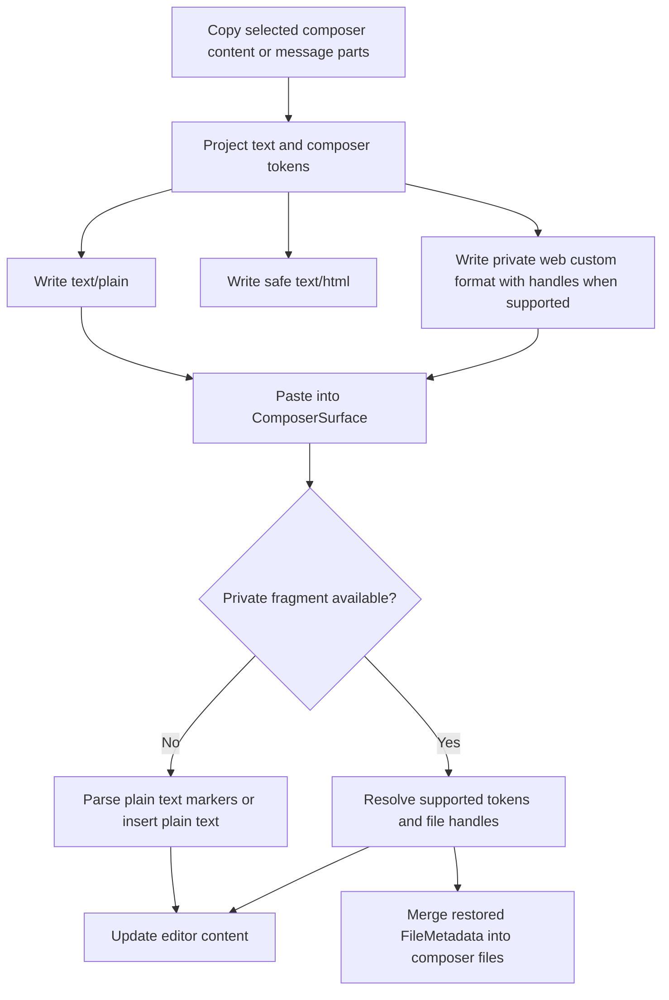

# Composer Rich Clipboard

This document describes the private clipboard format used to preserve composer
tokens when users copy and paste between Cherry Studio message surfaces and the
composer.

## Goals

- Preserve composer tokens across internal copy/paste for `skill`, `knowledge`,
  `file`, `quote`, and `promptVariable` content.
- Keep regular clipboard behavior useful outside Cherry Studio through
  `text/plain` and `text/html`.
- Never expose unsanitized token JSON, parseable composer token metadata in
  `text/plain` / `text/html`, or local file paths in any clipboard payload.
- Preserve existing rich HTML copy, such as markdown table copy, when no composer
  token fragment is present.

## Clipboard Shape

Rich composer copies write three payloads:

| Format | Purpose |
| --- | --- |
| `text/plain` | Human-readable fallback text. |
| `text/html` | Human-readable HTML without parseable composer token metadata. |
| `web application/x-cherry-composer-fragment+json` | Private Cherry Studio token fragment. |

The private fragment is versioned JSON with ordered text/token segments. Token
payloads are sanitized before writing. File token payloads never carry a local
path or original path-derived id. A restorable file token carries only an
unguessable handle plus display fields; the corresponding file metadata stays in
the current renderer session's in-memory restoration context.

## Flow



## Restore Rules

- `skill` and `knowledge` tokens are restored only through the current surface's
  resolver, so Chat and Agent keep their existing token ownership boundaries.
- `file` tokens are restored only when the private payload has a handle that
  resolves in the current renderer session's restoration context. Restored files
  are deduplicated by `id:path`.
- File handles are not trusted clipboard data. They only locate restoration
  context already held in this renderer session; missing, unknown, expired,
  cross-window, post-restart, or forged handles fall back to visible text.
- A file token copied from a user message is restorable only when the message file
  part carries a file token source that exactly matches the text token source.
  Filename, display name, and token label are never used as fallback identity.
- Path-derived file token ids are never written to the clipboard. If the current
  renderer session has the original file metadata, the token may still be
  restored through a handle.
- `quote` and `promptVariable` tokens are restored from sanitized token fields.
- Unsupported, unsafe, or unresolved token segments fall back to their visible
  text.
- If the browser cannot write the private custom format, clipboard writing falls
  back to `text/html` plus `text/plain`, then to plain text when `ClipboardItem`
  is unavailable.

## Boundaries

- `MessageListActions.copyRichContent` is the shared action surface for rich
  clipboard writes. Message components request the capability; page/window
  adapters provide it.
- `composerClipboard.ts` owns private fragment parsing, serialization, HTML
  escaping, in-memory file restoration handles, and system clipboard helpers.
- `ComposerSurface` owns editor copy/paste event handling and delegates fragment
  parsing/projection to utilities.
- Normal OS file paste and drag/drop are separate flows that use the browser or
  Electron file APIs. They do not restore files from private composer fragments.
- File restoration does not re-read the file or re-run supported-extension
  checks. Later send/file-processing paths remain responsible for file
  availability.
- File part `mediaType` inference is not part of this feature. Keep that change
  separate if MIME normalization is needed.

## Focused Verification

Use focused checks for this feature instead of full-suite runs during local
iteration:

```bash
pnpm vitest run src/renderer/components/chat/composer/__tests__/ComposerSurface.test.tsx src/renderer/utils/messageUtils/__tests__/composerClipboard.test.ts
pnpm vitest run src/renderer/components/chat/messages/frame/__tests__/messageMenuBarActions.test.tsx src/renderer/components/chat/messages/utils/__tests__/messageSelection.test.ts src/renderer/pages/shared/messages/hooks/__tests__/useMessagePlatformActions.test.tsx src/renderer/pages/shared/messages/hooks/__tests__/useMessageSelectionController.test.tsx
```
