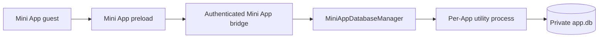

# Mini App Database API Design

> [!IMPORTANT]
> **Status: Proposed — not implemented.** `window.cherry.db` does not currently exist. This document is a maintainer design proposal, not part of the current Mini App capability contract. Until the implementation ships, authors must continue to use the capabilities documented in [Capabilities](./capabilities.md).

## 1. Summary

The proposed API gives each installed Mini App one private, host-owned SQLite database. Mini App code sends SQL and bound values through `window.cherry`; it never receives a database path, native driver, Node.js access, or prepared-statement handle.

The public API follows the remote-safe shape established by `@libsql/client`: one `execute()` result shape, an explicit atomic `batch()`, and a host-scoped transaction callback. Drizzle's `run` / `all` / `get` / `values` modes belong in a Drizzle adapter rather than the general Cherry contract.

The host owns:

- the database file and connection;
- transaction boundaries and scheduling;
- SQL authorization and resource limits;
- worker lifecycle, crash recovery, and change notifications;
- update, rollback, clear-data, and uninstall persistence semantics.

The Mini App owns its tables, schema version, and forward/backward-compatible migrations.

## 2. Goals and non-goals

### Goals

- Persist structured, relational, full-text-searchable Mini App data locally.
- Support ordinary SQLite DDL and DML without exposing host filesystem access.
- Support atomic batches and interactive read-then-write transactions.
- Preserve SQLite integers and BLOBs across the context bridge.
- Let browser-bundleable ORMs integrate through a small adapter.
- Keep the public SQL contract usable if Cherry later moves execution to another host process or deployment.

### Non-goals for v1

- Exposing `better-sqlite3`, `node:sqlite`, a file path, or any native connection object.
- Multiple or author-named databases, `ATTACH`, or arbitrary database deployment.
- Prepared-statement handles, streaming cursors, or long-lived row iterators.
- User-defined functions, aggregates, collations, virtual-table modules, or native extensions.
- Database import/export, replication, changesets, encryption configuration, or backup destinations.
- Nested public transactions, public savepoints, or selectable transaction modes.
- Making Node-only ORM drivers work inside the browser sandbox.

## 3. Proposed public contract

`CherryDbValue` is a Cherry wire type, not a re-export of a Node driver type. Node's SQL input types include Node-specific `ArrayBufferView` variants and do not define the cross-process result contract. Cherry needs one browser-visible definition shared by preload, main, and the database worker.

```ts
type CherryDbValue = null | number | bigint | string | Uint8Array

type CherryDbArgs =
  | readonly CherryDbValue[]
  | Readonly<Record<string, CherryDbValue>>

interface CherryDbStatement {
  sql: string
  args?: CherryDbArgs
}

interface CherryDbResultSet {
  /** Ordered names corresponding exactly to indexes in every row. */
  columns: string[]
  /** Array rows preserve column order and duplicate result-column names. */
  rows: CherryDbValue[][]
  rowsAffected: bigint
  /** Non-null only for a successful top-level INSERT. */
  lastInsertRowid: bigint | null
}

interface CherryDbExecutor {
  execute(statement: CherryDbStatement): Promise<CherryDbResultSet>

  /** Executes in order and commits all statements or rolls all of them back. */
  batch(statements: readonly CherryDbStatement[]): Promise<CherryDbResultSet[]>
}

interface CherryDbTransaction extends CherryDbExecutor {}

interface CherryDb extends CherryDbExecutor {
  transaction<T>(callback: (tx: CherryDbTransaction) => T | Promise<T>): Promise<T>
  usage(): Promise<{ bytes: number; bytesLimit: number }>
}

interface CherryApi {
  db: CherryDb
}
```

### 3.1 Values and bindings

- SQLite `NULL`, `REAL`, `TEXT`, and `BLOB` map to `null`, `number`, `string`, and `Uint8Array`.
- SQLite `INTEGER` results always map to `bigint`; both finite `number` and `bigint` are accepted as inputs.
- `undefined`, `NaN`, and positive or negative infinity are rejected before IPC.
- Array arguments bind `?` and `?NNN` placeholders.
- Object arguments use bare ASCII keys such as `{ userId: 7n }` and bind `$userId`, `:userId`, or `@userId` in SQL.
- Missing bindings, unknown object keys, invalid names, and mixing multiple prefixes for the same bare name are rejected.
- Each `execute()` accepts exactly one prepared statement. A non-whitespace SQL tail after that statement is rejected.

### 3.2 Result semantics

- A query with no rows still returns its known `columns`.
- Statements without result columns return `columns: []` and `rows: []`.
- `INSERT ... RETURNING`, `UPDATE ... RETURNING`, and `DELETE ... RETURNING` return both rows and write metadata.
- `rowsAffected` is `0n` for read-only statements and schema operations.
- `lastInsertRowid` is not the connection's stale last insert ID: it is `null` unless the top-level statement performed an insert.
- Result rows are arrays rather than objects so duplicate aliases remain lossless and ORM adapters avoid another row-shape conversion.

Large result sets use SQL pagination. v1 caps one result at 1,000 rows and does not create a cursor handle. Keyset pagination is preferred over large `OFFSET` values.

## 4. Transactions and batches

```ts
await cherry.db.transaction(async (tx) => {
  const balance = await tx.execute({
    sql: 'SELECT balance FROM account WHERE id = ?',
    args: [accountId]
  })

  await tx.execute({
    sql: 'UPDATE account SET balance = balance - ? WHERE id = ?',
    args: [amount, accountId]
  })

  return balance.rows[0]
})
```

The host starts every root transaction with `BEGIN IMMEDIATE`. A callback result commits the transaction; a callback exception rolls it back.

Transaction rules:

- One App has at most one active root transaction.
- Transaction-bound calls execute FIFO on that App's one connection.
- Calls from other guests of the same App wait behind the transaction.
- A non-transactional `cherry.db.execute()` from the transaction owner is rejected immediately, preventing the callback from awaiting itself.
- A second transaction from the same owner is rejected as nested; v1 exposes no public savepoint.
- A transaction has a 30-second total deadline and a five-second idle deadline while no database request is in flight.
- An individual statement has a ten-second execution deadline. Because `node:sqlite` is synchronous and has no suitable asynchronous interrupt API, the host terminates an unresponsive worker.
- Guest destruction, App quiesce, permission revocation, deadline expiry, or worker failure closes the transaction and rolls back uncommitted work.
- No write is retried automatically. A crash after SQLite commits but before the response arrives is an ambiguous outcome; authors must use unique constraints or application idempotency keys when duplicates matter.

`batch()` outside a transaction uses its own `BEGIN IMMEDIATE` transaction. `tx.batch()` uses a host-created internal savepoint: a failed batch rolls back the batch, while a caller that catches the error may continue the root transaction. Public SQL still cannot issue `BEGIN`, `COMMIT`, `ROLLBACK`, `SAVEPOINT`, or `RELEASE`.

The callback's resolved value must be context-bridge-cloneable. The preload validates that value before requesting commit; an uncloneable result rolls the transaction back and rejects with `InvalidArgument`. This avoids an ambiguous outcome where the database commits but the callback result cannot cross the bridge. Host-generated failures follow the `CherryError` contract. An exception thrown by the author's callback is rolled back and then propagated as that callback exception; it is not rewritten as a host error.

## 5. Database errors

The seven existing `CherryErrorName` values remain unchanged. The proposal adds an optional stable `code`; it does not expose platform-specific SQLite numeric codes.

```ts
interface CherryError {
  name: CherryErrorName
  message: string
  code?: CherryDbErrorCode
}

type CherryDbErrorCode =
  | 'DB_SQL_ERROR'
  | 'DB_BIND_ERROR'
  | 'DB_OPERATION_DENIED'
  | 'DB_CONSTRAINT_UNIQUE'
  | 'DB_CONSTRAINT_FOREIGN_KEY'
  | 'DB_CONSTRAINT_NOT_NULL'
  | 'DB_CONSTRAINT_CHECK'
  | 'DB_CONSTRAINT'
  | 'DB_FULL'
  | 'DB_BUSY'
  | 'DB_LIMIT_EXCEEDED'
  | 'DB_TRANSACTION_NESTED'
  | 'DB_TRANSACTION_CLOSED'
  | 'DB_TRANSACTION_EXPIRED'
```

SQLite extended result codes map to these Cherry codes. Messages may identify the Mini App's own tables or columns but must never include host paths, SQL parameter values, internal stacks, worker protocol details, or raw SQLite numeric codes.

The existing names continue to express the broad response policy: constraint and SQL input errors use `InvalidArgument`, a full database uses `QuotaExceeded`, lock or worker availability failures use `Unavailable`, forbidden SQL uses `PermissionDenied`, and expired host work uses `Cancelled`.

## 6. Permission model

Database access is one capability. Consent must not present separate permissions for executing one statement, executing several statements, and grouping statements into a transaction.

The current method registry therefore needs an alias gate rather than treating write-capable methods as introspection siblings:

```ts
const MINI_APP_METHODS = {
  'db.execute': { gate: 'grant' },
  'db.batch': { gate: 'alias', target: 'db.execute' },
  'db.transaction': { gate: 'alias', target: 'db.execute' },
  'db.usage': { gate: 'sibling' }
} as const
```

Only `db.execute` is declarable, persisted, revocable, and shown on the consent card. `db.*` authoring shorthand expands to that grant. `db.batch` and `db.transaction` check the same grant at every host request; `db.usage` becomes available when the App holds that namespace grant.

## 7. Runtime architecture



`MiniAppRuntimeService` remains the lifecycle owner. Its internal `MiniAppDatabaseManager` lazily creates one utility process and one SQLite connection per active App. All windows and guests for that App share that worker; different Apps execute independently. An App that never calls the API consumes no database-worker memory.

The main process authenticates the sender and derives `appId`; no guest-supplied identity is trusted. It resolves the fixed file location through `application.getPath(...)`, mints request and transaction IDs, enforces permission and quota state, schedules calls, and supervises worker deadlines.

The preload implements the callback transaction as host-controlled begin, transaction-bound execute/batch, and commit/rollback operations. The transaction ID is captured inside the `tx` methods and is never a public argument. Main binds it to `appId`, sender ID, and worker generation so it cannot be guessed, replayed after a restart, or moved between windows.

The worker owns synchronous `node:sqlite` calls. It returns cloneable value-only responses and never receives arbitrary filesystem paths or environment-derived App identity. Worker stdout and stderr route through `loggerService`; SQL, bindings, and result data are not logged.

## 8. SQL authorization and resource limits

An Electron utility process is a Node.js process boundary, not a filesystem sandbox. The database broker and SQLite authorizer are the security boundary.

Worker startup must successfully configure [`DatabaseSync.setAuthorizer()`](https://nodejs.org/docs/latest-v24.x/api/sqlite.html#databasesetauthorizercallback). If the pinned Electron runtime does not provide the required API, the worker fails closed instead of falling back to unrestricted SQL.

Before guest SQL runs, the host configures foreign keys, WAL, defensive mode, `trusted_schema=OFF`, synchronous mode, busy timeout, page quota, and bounded cache/temp behavior. Extension loading starts disabled and cannot be enabled.

The authorizer permits ordinary DDL and DML in `main`, JSON functions, and FTS5 virtual tables. It denies:

- any attached database or schema other than `main`;
- `ATTACH`, `DETACH`, temp-schema objects, and arbitrary virtual-table modules;
- extension loading and functions that can reach host files;
- guest transaction-control statements;
- `VACUUM`, including `VACUUM INTO`;
- PRAGMAs that change host-owned connection, journal, path, safety, or quota settings.

The safe PRAGMA allowlist covers schema introspection, read-only foreign-key state, `schema_version`, and App-owned `user_version`. Host transaction and savepoint statements travel through a narrow internal control path while the guest policy remains active for every guest statement.

Proposed limits:

| Resource | Limit |
|---|---:|
| Logical database size | 50 MiB |
| SQL text per statement | 64 KiB UTF-8 |
| Statements per batch | 100 |
| One bound value | 1 MiB |
| One request | 4 MiB |
| One response | 4 MiB |
| Rows per result | 1,000 |
| Pending requests per App | 8 |
| Calls per App per minute | 600 |
| One statement | 10 seconds |
| Transaction idle / total | 5 / 30 seconds |

`usage().bytes` reports allocated logical database pages, not transient WAL or shared-memory file size. The host checkpoints WAL and enforces the page limit independently of the guest.

## 9. Change notification

The shared event contract gains one coarse event:

```ts
type CherryEvent = 'app.visibilityChange' | 'app.localeChange' | 'db.change'

interface CherryEventPayload {
  'db.change': { revision: number }
}
```

After a successful autocommit write, atomic batch, or dirty root-transaction commit, the manager increments an App-scoped runtime revision and broadcasts one event to all currently authorized guests of that App, including the writer. It emits nothing for reads, rejected statements, or rolled-back work.

The signal intentionally names no table or row. Triggers, cascades, virtual tables, and schema changes make precise broker-level invalidation easy to under-report. A successful write-capable statement may emit even when it affected zero rows; an extra refresh is preferable to a stale cache. Revisions are monotonic only for the current Cherry process lifetime and are invalidation tokens, not persistent database versions.

## 10. Persistence and lifecycle

The only database path is conceptually:

```text
feature.mini_app.data/<appId>/app.db
```

The path is host-derived and not public API. Update, rollback, and in-place reinstall retain the current database. Explicit clear-data and uninstall operations first quiesce the App, terminate its database worker, and then remove the whole App data directory. Uninstall followed by a fresh install therefore creates a new database.

When the last guest closes, the manager waits for active work to settle or expire, rolls back an open transaction, checkpoints, closes the connection, and stops the worker. App update and clear-data flows perform the same quiesce sequence before mutating package or data files. Main-process shutdown stops database workers before the Mini App runtime completes shutdown.

Cherry does not snapshot the database with each package version. Mini App authors own forward and backward schema compatibility when users update or roll back their package. Migrations should use an App-owned migration table or `PRAGMA user_version`, bundled single statements, and `transaction()` / `batch()`.

## 11. ORM integration and prior art

The API borrows remote-safe concepts rather than promising drop-in compatibility with another client:

| Reference | What Cherry borrows | What Cherry does not expose |
|---|---|---|
| [`@libsql/client`](https://docs.turso.tech/sdk/ts/reference) | `execute`, unified result metadata, named arguments, explicit batch | URLs, replicas, synchronization, manual transaction handles |
| [Cloudflare D1](https://developers.cloudflare.com/d1/worker-api/d1-database/) | Ordered remote batches and a brokered SQLite boundary | Cross-process prepared-statement objects |
| [Expo SQLite](https://docs.expo.dev/versions/latest/sdk/sqlite/) | An exclusive callback receiving a transaction-bound executor | Ambient transactions and platform file APIs |
| [better-sqlite3](https://github.com/WiseLibs/better-sqlite3/blob/master/docs/api.md) | Commit-on-return and rollback-on-throw callback semantics | Synchronous/native connection and statement objects |
| [Drizzle SQLite Proxy](https://orm.drizzle.team/docs/connect-drizzle-proxy) | Query and batch adapter callbacks | Drizzle's method union in the Cherry core API |

The v1 developer reference should include a small `createCherryDrizzle` adapter rather than a new runtime package:

```ts
const { db, withTransaction } = createCherryDrizzle(cherry.db, { schema })

const users = await db.select().from(userTable)

await withTransaction(async (txDb) => {
  await txDb.insert(userTable).values({ name: 'Alice' })
})
```

The adapter translates Drizzle's private `run` / `all` / `get` / `values` modes into Cherry ResultSets and maps Drizzle batches to `cherry.db.batch()`. It must not use SQLite Proxy's native `.transaction()`, which sends raw transaction SQL; `withTransaction()` creates a new proxy bound to the host-provided `tx` executor.

The reference must be executable source rather than a second implementation pasted into Markdown. The implementation phase should add it at `docs/references/mini-app/examples/drizzle/cherryDrizzle.ts`; the Drizzle integration test imports that exact file. This keeps the recipe independently copyable without publishing a Cherry adapter package, while CI prevents the documented glue from drifting from the installed Drizzle version or the Cherry contract.

Migration SQL is generated at build time, bundled as a statement array, and applied through the Cherry executor. The sandbox cannot read a migration directory at runtime.

Other browser-bundleable ORMs may provide a custom driver over the same contract. Drivers that require Node.js, native addons, direct file paths, or their own connection pool — including ordinary Prisma, TypeORM, and Sequelize SQLite drivers — cannot run in the current Mini App sandbox merely because raw SQL is available.

## 12. Deferred capabilities

The locally inspected pinned Electron build includes more SQLite facilities than the stable Mini App contract should promise. v1 guarantees standard SQLite SQL, JSON, and FTS5 only. RTree, Geopoly, Session/changeset, RBU, and other compiled modules remain unavailable or unsupported until Cherry can guarantee and test them on macOS, Windows, and Linux.

Prepared handles and streaming cursors are deferred because they introduce guest-owned resource lifetimes, explicit close/finalize behavior, transaction binding, idle expiry, and worker-crash recovery. Transparent host-side statement reuse may be added without changing the API.

Host-mediated export, import, backup, encryption, cancellation, and external database deployment are separate capabilities with their own permissions and lifecycle requirements. They must not be smuggled into v1 through paths, PRAGMAs, `VACUUM INTO`, extensions, or driver handles.

## 13. Implementation sequence

1. **Contract and permission model** — add shared types, bridge schemas, `db.execute` plus alias gates, public declarations, documentation, and contract tests.
2. **Worker and single-statement execution** — add the manager, utility entry, fixed path, authorizer, value conversion, ResultSet metadata, quotas, and crash handling.
3. **Batch and transaction state machine** — add scheduling, opaque transaction identity, deadlines, internal savepoints, quiesce rollback, and structured database errors.
4. **Change events and product surfaces** — add revision broadcasts, usage UI, clear-data integration, activity metadata, and multi-window tests.
5. **Developer adapters** — add the Drizzle reference adapter, bundled-migration example, capability test coverage, and author-facing documentation. Only here should `capabilities.md` and `cherry.d.ts` begin describing the API as available.

## 14. API and runtime test strategy

The core acceptance evidence comes from the Cherry API and runtime themselves. A Drizzle adapter test is useful compatibility coverage, but it cannot prove that the context bridge, authenticated host bridge, transaction scheduler, utility process, or SQLite security boundary works.

Tests follow the repository's [database testing](../testing/database-testing.md) and [frontend testing](../testing/frontend-testing.md) rules: assert promised outcomes from real inputs, use real files for database behavior, and replace only the narrow external boundary needed to make a failure deterministic.

### 14.1 Test ownership by layer

| Layer | Production boundary under test | What stays real | Permitted substitute | Contract it owns |
|---|---|---|---|---|
| Public contract | Shared schemas, method registry, and shipped `cherry.d.ts` | TypeScript compilation and the actual declarations | None | Exact method/type surface, one `db.execute` grant, argument/value/result types, and stable `DB_*` codes |
| Preload API | The object exposed as `window.cherry.db` | Validation and transaction callback implementation | `ipcRenderer` only, backed by a stateful fake host | Calls are cloneable, transaction IDs stay private, callback success commits, callback failure rolls back, and a closed `tx` cannot be reused |
| SQLite executor | The code used inside the utility process | Production `node:sqlite`, authorizer, value conversion, limits, and a temporary file-backed database | Clock or configured limits only | SQL semantics, metadata, atomicity, error mapping, authorization, quota enforcement, JSON, and FTS5 |
| Host runtime | Authenticated bridge plus `MiniAppDatabaseManager` | Sender-to-App identity, permission resolution, queues, transaction state, event routing, and lifecycle hooks | A stateful worker transport only for hangs, crashes, and deliberately reordered replies | Per-App ownership, ordering, deadlines, revocation, quiesce, crash handling, and `db.change` |
| Electron end to end | Installed Mini App guest through its preload, main bridge, real utility process, and private file | Electron sandbox, context bridge, IPC serialization, utility-process transport, and SQLite | No Electron or database mocks | The complete author-visible behavior, especially callbacks, `bigint`, `Uint8Array`, multiple guests, persistence, and process teardown |

The SQLite executor must be separated from the utility-process message-loop entry so the same production executor can run directly in Vitest. That is a test seam, not a second database implementation. The manager's fake transport is allowed only for process failures and timing that cannot be made deterministic with a real child process; all successful SQL behavior remains owned by the real executor tests.

### 14.2 Database and bridge harnesses

Implementation should add a Mini-App-specific `setupMiniAppDatabase()` test helper. For each test it creates a unique temporary Mini App data root, starts the production executor against `<root>/<appId>/app.db`, and closes every connection and worker during teardown. Test schemas are created through the executor's normal request path so the production statement parser, authorizer, bindings, quotas, and result conversion are never bypassed.

This is intentionally different from the repository-wide `setupTestDatabase()`. The latter remains required when a bridge test needs real Cherry installation and permission rows backed by the production migrations. It must not stand in for the Mini App's private database, which has no Cherry schema or migrations and uses `node:sqlite` rather than Cherry's `better-sqlite3` connection. A full bridge integration test may use both helpers for their separate ownership domains.

The stateful worker transport used by manager tests must model observable worker states — started, ready, request pending, exited, and closed — and let a test hold or drop a response. It must not interpret SQL or fabricate result sets. Successful requests should be routed to the real executor; the fake-only path exists to prove supervision behavior.

### 14.3 Public API contract tests

The implementation must add the following contract coverage:

- Extend `src/main/features/miniApp/runtime/__tests__/apiSurface.test.ts` so `MINI_APP_METHODS`, shared bridge schemas, the preload object, and `cherry.d.ts` agree on `execute`, `batch`, `transaction`, `usage`, `db.change`, the alias grant, and the database error codes.
- Compile a small author fixture against the shipped `cherry.d.ts`. Positive cases use positional and named arguments, `bigint`, `Uint8Array`, array rows, and an async transaction callback. Negative `@ts-expect-error` cases reject `undefined`, object rows, a caller-supplied transaction ID, a raw native connection, and undeclared transaction-control methods.
- In preload tests, invoke the real `cherry.db.transaction()` facade against a stateful fake host. A returned value commits; a synchronous throw or asynchronous rejection rolls back and preserves the author's exception; an uncloneable callback result rolls back before commit with `InvalidArgument`; and any later use of the captured `tx` rejects with `DB_TRANSACTION_CLOSED`.
- Prove that wire validation happens before IPC for `undefined`, non-finite numbers, malformed argument containers, oversized values, and oversized batches. Binding completeness and SQL tails are validated by the production SQLite executor rather than a second SQL parser in preload. Host failures must be reconstructed as the documented `CherryError`, while raw `Error`, paths, stacks, SQL text, and parameter values never reach the guest.

Real file-backed executor tests then cover the value and SQL contract:

| Scenario | Required observable result |
|---|---|
| DDL and CRUD | Tables created through `execute()` persist across executor close and reopen |
| Bindings | Positional and all three named prefixes bind correctly; missing, unknown, mixed-prefix, and invalid-name bindings reject |
| Values | Every SQLite integer returns as `bigint`; finite `number` input works; BLOBs round-trip as independent `Uint8Array` values |
| Row shape | Ordered columns match array indexes; duplicate aliases are preserved; an empty query still reports known columns |
| Write metadata | DML and `RETURNING` produce the documented rows, `rowsAffected`, and non-stale `lastInsertRowid` |
| Atomic batch | A failure in statement two leaves no effect from statement one and returns no partial result array |
| Usage and limits | `usage()` grows with allocated pages, never exposes a path, and writes crossing the page/request/response/row limits fail with the documented code |
| Error recovery | A constraint or SQL error maps to the stable `DB_*` code and leaves the connection usable for the next valid statement |

### 14.4 Transaction and runtime state tests

Manager and authenticated-bridge tests must prove behavior, rather than merely checking that a mocked function was called:

- A Mini App that never calls `db` creates neither a worker nor `app.db`. The first call starts one worker; two guests of the same App share its state and queue, while a second App has an independent worker and can make progress during the first App's transaction.
- A successful callback commits its writes and return value. A thrown or rejected callback, guest destruction, permission revocation, App quiesce, idle deadline, total deadline, or worker exit rolls back all uncommitted writes.
- Transaction-bound requests run FIFO. A request from another guest waits until the root transaction closes. A root `cherry.db.execute()` from the transaction owner rejects immediately instead of waiting on itself, and nested `transaction()` rejects with `DB_TRANSACTION_NESTED`.
- A failed `tx.batch()` rolls back only its internal savepoint. If the callback catches that error, earlier and later root-transaction writes can still commit; if it does not, the root transaction rolls back.
- Opaque transaction identity is bound to App, sender, and worker generation. Cross-window use, guessed IDs, use after commit/rollback, and replay after worker restart all reject without executing SQL.
- A held worker request exercises the statement, idle, and total deadlines with a fake clock. Expiry terminates that worker generation, rejects every affected promise once, and does not dispatch a queued stale request to a replacement worker.
- A transport that drops the reply after a real commit proves the manager does not retry an ambiguous write. Reopening the real file shows one committed row, while the caller receives `Unavailable` and must reconcile using an idempotency key.
- Killing a real utility process with an open transaction and reopening the file proves SQLite rolled the transaction back. A later request starts a fresh generation; a delayed response from the dead generation is ignored.

Permission integration uses real installed-App and grant rows. It proves that `db.batch` and `db.transaction` resolve through the single `db.execute` grant, `db.usage` follows the namespace grant, revocation takes effect at every request, a caller-supplied `appId` is ignored, and an unauthenticated sender cannot create a database file.

### 14.5 Security, events, and persistence tests

Security tests create a sentinel file outside the App's data directory and execute the hostile SQL through the production executor. `ATTACH`, `DETACH`, `VACUUM INTO`, extension loading, unsafe PRAGMAs, temp objects, non-FTS5 virtual tables, raw transaction SQL, and trailing statements must reject without changing the sentinel or creating any outside file. The same suite proves ordinary DDL/DML, JSON, FTS5, allowed introspection PRAGMAs, and App-owned `user_version` still work. A startup test removes or disables `setAuthorizer` and proves the worker fails closed before opening a guest database.

Event tests observe authorized guest listeners:

- one successful autocommit write, batch commit, or dirty root commit produces exactly one `db.change` for every live authorized guest of that App;
- reads, rejected writes, rolled-back work, and a read-only transaction produce none;
- an event is emitted only after commit, so a listener that immediately queries can observe the committed state;
- revisions increase within the current Cherry process and are not treated as durable database versions.

Lifecycle tests use real temporary App data directories. Update, rollback, and in-place reinstall retain `app.db`. Last-guest close and Cherry shutdown wait for work to settle or expire, roll back an open transaction, checkpoint, close the connection, and stop the worker while retaining the file. Clear-data and uninstall first complete that shutdown sequence and only then remove the App data directory. If graceful close fails, the supervisor terminates the worker and waits for its exit before deleting; deletion must never race a live writer.

### 14.6 Electron end-to-end proof

The [Electron E2E fixture](../../../tests/e2e/README.md) should gain an isolated user-data directory and an installable database-test Mini App. The test App calls raw `window.cherry.db`; it does not use the Drizzle adapter. It writes scenario results into its own DOM, and Playwright only performs user actions and observes that output, so the test cannot bypass the public bridge by invoking manager internals.

The minimum real-Electron scenarios are:

1. Install and grant the fixture, then create, write, and query a table with named arguments, `bigint`, `Uint8Array`, duplicate aliases, and `RETURNING`.
2. Run an actual function callback through `transaction()`, prove commit-on-return, rollback-on-throw, rollback of an uncloneable result, and rejection when a captured `tx` is reused.
3. Open two guests of the same App, prove shared committed state and post-commit `db.change`, then close both and prove the database survives reopening. The real-transport smoke separately observes the child-process exit.
4. Revoke the grant during a transaction and prove rollback; then clear data and prove reopening starts with a new empty database.

The utility-process smoke path must run on macOS, Windows, and Linux using the pinned Electron runtime. It verifies that the worker PID differs from main, `setAuthorizer` is present, JSON and FTS5 are available, and the process can close without leaked handles. This platform test is required because system Node tests cannot prove what each packaged Electron binary compiled into SQLite.

### 14.7 Acceptance gates

Before the proposal can become current capability documentation:

- focused main and preload Vitest suites for every layer above pass, followed by `pnpm build:check`;
- the real Electron database E2E passes without retries or skipped scenarios;
- the utility-process smoke passes on macOS, Windows, and Linux;
- the Drizzle test imports the exact reference adapter and passes against the same real file-backed harness, as a separate compatibility gate rather than runtime evidence;
- capability docs, declarations, examples, and the generated docs index are updated only in the implementation change that makes the API callable.
