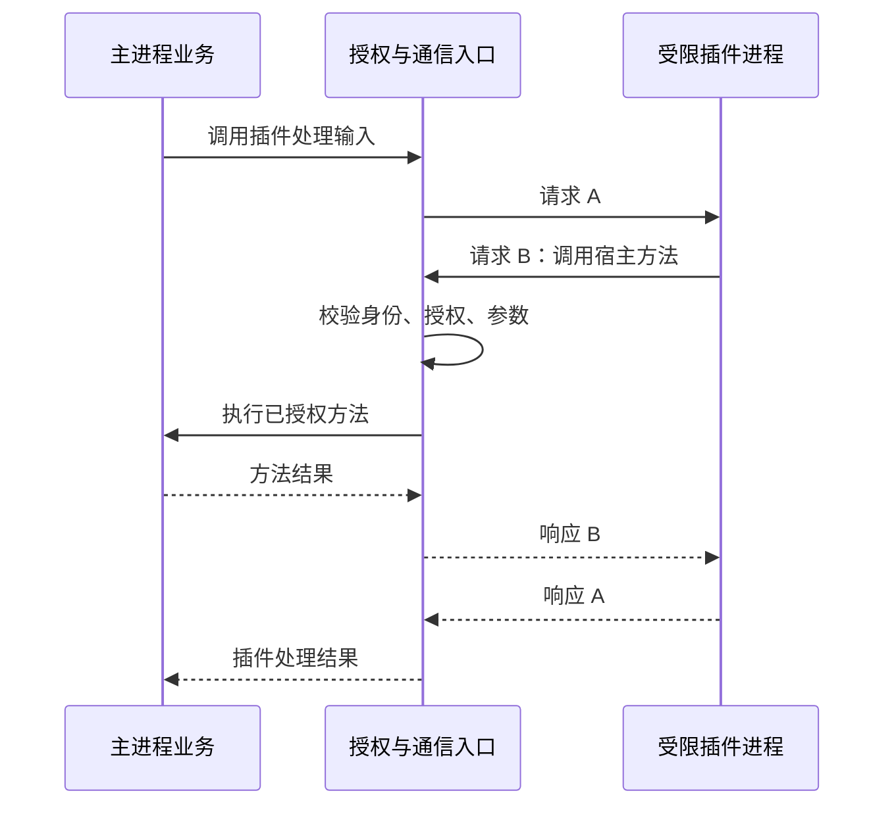

# Sandbox Design Draft

本文细化 [proposal](./proposal.md)，状态为设计草案，不代表接口、后端或实现已定案。只覆盖三平台进程隔离、受控通信和生命周期；不设计插件业务 API、Agent 编排或 Durable API。外部技术文档核对日期：2026-09-24。

[API 草案](./api.md)定义宿主类型、后端契约、跨语言 RPC 和原型验收；本文保留职责与语义依据。API 草案尚待原型验证，不代表已完成生产实现。

## 1. 已确认的需求

- 支持 macOS、原生 Windows、Linux，供 Agent 执行与未来插件进程使用。
- 需要隔离的代码始终在受限进程内执行，能够通过双向调用参与主进程业务。可信第一方代码允许直接在 main 引用和执行，不属于沙盒隔离保证范围；不展开其设计或集成。
- 主进程可以调用插件，插件可以调用宿主明确开放且经过授权的方法。
- 通信采用双向 RPC over 本地 IPC：RPC 定义调用语义，IPC 承载消息；具体协议库和传输实现仍需验证。
- 跨语言双向调用是必需能力：沙盒内代码可以调用获准的主进程方法，主进程也可以调用沙盒内方法；仅支持启动 Node/Python 不等于满足通信要求。
- 允许同一信任组、接受相同有效权限的插件共享宿主进程；需要独立权限或故障隔离的插件使用独立进程，不能仅按“轻量”分组。
- 沙盒不理解 Agent 或 workflow 的业务语义，也不负责恢复业务调用。
- Windows 允许首次初始化时请求一次管理员授权；后续日常启动、运行与停止应使用普通用户权限，不反复提权。

以下设计建议以这些需求为依据；平台机制和现有模块的扩展方案仍需原型验证及决策。

[后端候选方案](./backend-options.md)记录各平台原生隔离机制。已决定不实现 WSL2 后端，避免硬件虚拟化前置条件；Windows 仅推进原生路线，具体机制仍待验证。原型采用独立的 `packages/sandbox` 包，边界与实施顺序见[第 11 节](#11-独立包结构与-demo-实施顺序)。

## 2. 最小分层

| 层 | 职责 | 不承担的职责 |
| --- | --- | --- |
| 平台隔离后端 | 检测环境、落实资源限制、启动受限进程树、提供退出及清理证据 | 业务方法、用户审批 |
| 进程管理 | 持有实例、有效策略、通道和生命周期；集中处理退出与清理 | Agent 循环、插件业务调度 |
| 双向通信 | 请求关联、结果、错误、协议校验、背压和断线处理 | 决定调用者拥有哪些业务权限 |
| 业务适配 | 注册明确的方法、校验输入输出、检查调用者权限、调用现有服务 | 自行创建不受限插件进程 |

一个沙盒实例建议对应一个策略固定的根进程及其子进程树。插件宿主实例可以长驻，并加载一个或多个插件；Agent 工具实例可以短命，同一个 Agent 会话可以拥有多个实例。业务 owner、插件、沙盒实例和一次 RPC 请求是不同的身份，不能共用一个 ID。

首版不引入池化、不同权限的插件共享进程、自动重启或自动业务重试。进程间隔离还必须验证操作系统账户、ACL 和代理没有产生跨实例授权，不能仅凭 PID 不同判定安全。

可信组件包括主进程策略与授权入口、平台启动器、通道认证组件，以及代理和资源清理组件。它们持有宿主权限，必须分别证明不会代目标越权；目标代码、请求参数、日志和返回值均不属于可信组件。Windows 若引入特权服务或开机任务，也进入这份可信组件清单，是否采用仍待决策。

### 2.1 插件共享进程的边界

插件层决定一个宿主加载哪些插件，沙盒层仍只管理进程树及其统一策略，无需增加按插件加载的底层接口。

| 宿主方式 | 适用条件 |
| --- | --- |
| 多插件共享进程 | 应用内置插件，或明确属于同一信任组、接受相同有效权限及共同故障影响的插件 |
| 单插件独立进程 | 不可信第三方插件，或需要独立权限、资源与故障隔离的插件 |

共享组的有效权限包括直接文件和网络访问，以及可调用的宿主 RPC 能力；不能通过合并各插件权限静默扩权。同进程插件之间不承诺内存、运行时状态或凭据隔离。RPC 中的插件 ID 可用于路由和业务归属，但不能作为对抗同进程恶意代码的独立身份凭证；安全授权边界是宿主绑定的实例及其信任组。

共享进程中的阻塞、资源耗尽、崩溃和强制终止会影响整组插件，不能承诺单插件强制终止而其他插件继续运行。若某插件需要独立授权或撤权，应调整分组并按实例重建规则处理，不能仅修改插件 ID 对应的内存权限表。

## 3. 与现有基础设施的接点

当前代码存在需要先处理的上游限制：

| 现有模块 | 现状 | 设计约束 |
| --- | --- | --- |
| [Utility Process](../references/utility-process/README.md) | 面向可信子进程；只支持主到子 RPC，无业务载荷运行时校验；每个 definition 一个实例 | 不能直接用来运行不可信插件；需评估受限启动、实例身份、反向调用和载荷 schema 的上游扩展 |
| [ProcessAdapter](../../src/main/core/utilityProcess/host/processAdapter.ts) | 已有进程适配接点，但绑定现有 frame 契约；生产实现使用 Electron MessagePort | 可以研究复用生命周期实现，不能认定增加一个 launcher 就完成适配 |
| [IpcApi](../references/ipc/README.md) | 入口使用 Electron sender 校验；`IpcContext` 目前只有窗口身份 | 不能伪造窗口或使用 `senderId: null` 将插件接入所有现有路由 |

建议先验证能否在现有进程基础设施中添加明确的受限执行能力，并保持当前可信消费者语义不变。若通道或启动方式不兼容，应将所需上游改动与独立实现的成本列出后再决策；本草案不默认复制第二套 ProcessHost。

插件调用宿主的身份应由宿主绑定到私有连接，至少能够关联 owner 与当前实例。具体身份类型和授权上下文需在 IpcApi 的入口能力扩展中讨论，不能靠把任意插件请求转发成 renderer IPC 来绕过限制。方法层复用现有业务服务，不复制业务实现。

实现时，持有长驻资源的管理者遵循 [lifecycle](../references/lifecycle/README.md)；主进程路径通过 [路径注册表](../../src/main/core/paths/README.md) 访问，日志经过 `loggerService`。本轮不新增生产目录、服务或依赖。

## 4. 进程接口的最小契约

语义如下，具体 TypeScript 类型和时序见 [API 草案](./api.md#4-宿主控制-api)，尚未冻结生产接口：

| 操作 | 输入 / 输出 | 必须满足的语义 |
| --- | --- | --- |
| 探测 | 所需策略 → 后端、能力和缺失条件 | 仅诊断；通过探测不能代替每次启动时建立限制 |
| 启动 | 可信宿主指定的 owner、程序、参数、cwd、环境和策略 → 实例句柄 | 限制建立后才允许执行目标代码；失败不运行普通进程 |
| 观察 | 状态、标准流、退出结果、有效策略 | 明确区分包装器、目标进程与整个进程树；不能把包装器退出当作清理完成 |
| 终止 | 实例句柄 → 终止与清理结果 | 有界地停止进程树并回收授权资源；失败继续保留管理责任 |

启动描述由主进程构造。使用可执行文件与参数数组表达命令；若需要 shell，由业务适配显式选择，不能隐式拼接插件提供的命令字符串。环境只传入必要变量，不复制主进程凭据。

RPC 是需要受控双向通信的消费者建立在进程通道上的能力；普通 Agent 命令不必实现插件 RPC。后端仍须维持普通程序的 stdin、stdout、stderr 语义，不能强制所有目标程序使用同一种业务协议。

启动完成至少区分两件事：可信启动器已建立隔离，目标进程的通信已就绪。插件业务初始化是否完成由业务层决定。插件自行报告的 `ready` 不是操作系统已强制隔离的证据。

## 5. 权限策略

策略由主进程根据授权生成，在一个实例生命周期内固定。首版建议通过停止旧实例、确认退出和必要清理后重建来改变策略；不承诺跨平台原地修改文件权限。

| 项目 | 建议契约 |
| --- | --- |
| 文件读写 | 分别声明允许范围；应用敏感路径限制不能被插件请求覆盖；运行时必要的读取范围由后端展开并列入有效策略 |
| 网络 | 关闭、指定目标或显式不限制；是否支持目标限制、DNS 和本地地址限制分别报告，不能只有一个 `network: true` |
| 本地通道与系统服务 | 默认拒绝非必要入口；覆盖 socket、pipe、继承句柄及凭据、桌面、系统代启动服务；必要例外由运行时基础策略列明，见[后端矩阵](./backend-options.md#21-系统服务与资源验证矩阵) |
| 环境 | 宿主控制的最小环境与临时目录；不向插件传入模型密钥或数据库路径访问能力 |
| 资源限制 | 区分硬配额和宿主侧超时、输出限制；只报告实际可以执行的约束 |

授权按范围求交集：调用者请求的范围不得超过用户授予及应用允许的范围。路径规则的合并不能退化为字符串拼接；实际路径解析、链接和竞态边界由后端与文件能力实现共同验证。

后端必须返回要求未满足的原因，例如系统组件缺失、需要管理员初始化或无法执行读取限制。必需能力未满足就拒绝启动；较弱后端不能以相同的“已隔离”状态替代它。

Windows 初始化与日常执行分开：初始化可以建立专用账户和系统级规则，但插件目标进程始终以受限权限执行，不能继承安装器的管理员权限。后端探测必须能够在普通用户权限下识别初始化缺失或损坏，返回可诊断的不可用状态；日常启动路径不得自动反复请求 UAC。后续修复、升级或卸载是否需要管理权限属于维护流程，不能隐式混入业务调用。

### 5.1 宿主代办操作与输出边界

- 宿主授权覆盖操作的实际效果，包括经其他服务或工具执行的间接效果。不能只检查 RPC 方法名，再以宿主完整权限执行目标提供的任意命令。业务能力由接入层定义并约束，不向通用沙盒层加入 Agent 或业务调度语义。
- 宿主访问目标可写目录时，检查路径与实际操作必须绑定到同一受授权对象。使用经平台验证的句柄相对操作、链接限制及对象身份检查等机制；仅 `realpath`、前缀检查或先检查后按路径重新打开均不充分。持有句柄本身也不自动证明目录移动等场景仍符合授权。
- 以上规则同样覆盖挂载准备、ACL 授权和递归清理。宿主维护的权限记录与管理目录不得由目标修改；Windows 未获授权的 UNC/远程路径应在可能触发解析或认证前拒绝。无法保证安全的宿主文件操作不开放，优先由目标在沙盒内完成自身 I/O。
- 返回内容继续按不可信数据处理，不能直接变成 shell、脚本或扩大权限的依据。接入 Agent 时，消费该内容的执行路径必须落实获授的业务能力；未完成接入验证前，不能宣称沙盒约束了整个 Agent 执行链。
- 进入 renderer 的结果同样不获得脚本执行或 preload/IpcApi 权限；普通内容需按其渲染上下文处理。未来若支持可执行的第三方 UI，须有独立的隔离与授权设计，本提案不定义其集成。[Electron 安全指南](https://www.electronjs.org/docs/latest/tutorial/security)

该边界不要求沙盒识别恶意文本或实现完整污点追踪。验收使用受控输出，检查消费方不会因文本、路径或请求形式变化而扩大权限；没有消费方的能力保持未接入状态，不能用通信测试替代业务安全验证。

## 6. 双向通信契约

### 6.1 已确认的通信决策与待验证选型

决策：采用双向 RPC over 本地 IPC。RPC 与 IPC 分属调用层与传输层，不是二选一；业务层通过类型化异步接口发起调用，不依赖底层平台通道。

| 层次 | 选择与边界 |
| --- | --- |
| 调用层 | 双向异步 RPC，支持请求、结果、错误和通知；优先评估 JSON-RPC，取消等扩展语义另行明确 |
| 传输层 | 优先验证 macOS / Linux 的 Unix domain socket、Windows 的 named pipe；不要求开放 localhost HTTP / TCP 服务 |
| 授权层 | 宿主根据连接绑定的实例身份逐次检查方法、参数和资源权限，不直接开放全部 IpcApi |

[Node net](https://nodejs.org/api/net.html#ipc-support) 支持这两类本地 IPC。每个实例使用独立端点，结合端点访问控制和实例认证；随机端点名称本身不构成授权。需验证 Windows 专用账户的 pipe 访问权限，以及三平台启用隔离后只允许指定通道的能力。

仓库已有 [DSH Bridge](../../src/main/ai/runtime/dsh/DshBridgeServer.ts) 和[双向协议](../../packages/dsh-bridge/src/protocol.ts)采用本地 socket / named pipe 承载 JSON-RPC，可作为复用评估的起点。通用沙盒协议不绑定 DSH 业务类型，现有连接认证也不能直接视为不可信插件场景的安全验收。

私有管道或继承式通道保留为备选；平台启动器是否正确传递专用句柄、Windows 跨账户启动是否可用，需要原型验证后再决定。普通日志不能与协议帧混在同一未经分帧的流中。

Linux 后端需验证 socket 访问约束与所选隔离机制是否兼容，必要时验证预先建立的专用连接或继承管道。这些变化不改变双向 RPC over 本地 IPC 的决策，不能为接通通道而放开全部本地 socket。验收要求见[后端候选方案](./backend-options.md)。

[Electron utilityProcess](https://www.electronjs.org/docs/latest/api/utility-process) 使用 MessagePort，标准流接口不支持可写 stdin；[Node child_process](https://nodejs.org/api/child_process.html) 提供另一套标准流和 IPC 机制。不能假设两者可以原样替换，或默认外层 OS launcher 可以保留 Electron 的引导通道。

协议实现优先复用已维护的库。[API 草案](./api.md#51-协议草案-v1)拟采用 JSON-RPC 2.0 + Content-Length 分帧。[vscode-jsonrpc](https://github.com/microsoft/vscode-languageserver-node/blob/main/jsonrpc/README.md) 是 Node 侧候选，仓库 lockfile 已有 `8.2.0` 的间接依赖，具体依赖尚未选定。依赖树中存在不等于可直接作为应用依赖使用；仍需检查双向重入、取消、断线及消息限制语义。

本轮不手写 wire format，不决定开放 localhost HTTP 服务，也不以 monkey patch Node API 作为安全边界。

### 6.2 调用与校验

- 主、子两端可以同时发起请求；请求身份在两个方向上不能冲突。
- 宿主只分派明确注册且授予该实例的方法；未知方法与越权方法在调用业务代码前拒绝。
- 宿主校验来自插件的请求参数、响应结果和事件。TypeScript 类型不替代运行时 schema。
- 接收循环持续处理消息，不能等待一个业务 handler 完成后才读取下一条消息。
- 请求、响应、日志和事件都需要大小、并发量和排队上限；超过限制时明确拒绝或终止异常实例，不建立无界内存队列。具体数值在原型阶段测量后确定，并作为验证配置记录。
- 重复响应不能重复完成调用；不允许传输层自动重试业务请求。连接身份来自宿主持有的通道，不来自插件填写的 owner 或请求 ID。

最小业务闭环：



主进程业务不能在等待插件时持有插件反向调用需要的锁或数据库事务。通信层允许并发读取只解决传输死锁，无法消除业务锁形成的循环等待。

### 6.3 取消与结果不确定性

单次 RPC 取消是协作式的：取消等待、发送取消信号，并通知相关宿主 handler。它不证明插件停止执行，也不回滚已经发生的业务副作用。需要强制停止不可信执行时，应终止整个实例；同实例其他调用会一起失败。

通道断开、超时或进程退出后，尚未完成的调用必须结束等待。若请求已发出，结果应允许表达“执行结果未知”，不能解释为“操作没有发生”。沙盒不得自动重放该请求。

已在主进程启动的业务操作不随插件退出自动消失。业务层负责响应取消、检查执行前的当前授权，并明确是否支持中止或事务回滚；沙盒不能终止主进程来模拟插件取消。

### 6.4 跨语言接入边界

宿主侧沙盒 API 使用 TypeScript，负责探测、启动、策略与进程生命周期；跨进程通信契约保持语言无关。需要双向调用的目标运行时提供最小通信接入，负责注册处理函数、发起请求以及接收结果、错误、事件与取消信号。普通命令仍可仅使用标准输入输出和退出码。

协议需明确分帧、数据编码、版本兼容、请求关联、错误、取消和断连语义，不能直接传递函数、对象引用或 `AbortSignal`。[API 草案](./api.md#5-双向-rpc-api)给出协议建议及 Node/Python 接入示例，不要求为每种语言建设完整 SDK。

首轮互通验证覆盖 Node 与 Python，分别完成“主进程请求 A → 沙盒反向请求 B → 返回 B → 返回 A”，同时检查越权拒绝、并发、取消和断连。只有实际通过验证，才能声明相应运行时支持双向调用。

示例：主进程请求 Python 执行 `analyze({ recordId })`，Python 通过 `records.read({ id })` 请求数据；主进程校验当前实例权限后返回获准的数据，Python 完成计算并返回结果。数据库连接不传入沙盒，沙盒进程不因此获得数据库文件访问权。方法名仅用于解释通信需求，不属于沙盒 API。

## 7. 生命周期与清理

建议状态为 `starting → running → stopping → stopped`，启动或运行错误进入 `failed`。状态表示可用性，退出证据与清理结果单独记录；`failed` 不意味着已无存活进程或残留授权。

1. 启动前校验描述与策略，探测后端，并准备专用资源。
2. 由可信启动器落实限制，启动目标代码，建立绑定当前实例的通道。
3. 业务层完成必要初始化后开始分派业务调用。
4. 停止时先拒绝新调用、撤销宿主调用入口，通知在途操作取消，再请求目标进程退出。
5. 超出停止预算后由后端终止整个进程树；只有获得退出证据后才能进行依赖退出的清理。
6. 清理代理、通道、临时资源和本实例可撤销的权限授予。失败保留实例记录与诊断，不伪装成成功停止。

同一逻辑实例的替代进程必须等待旧进程树确认退出；授权残留如果可能影响新实例，也必须先处置。旧通道不能重新绑定到新实例。应用退出或主进程异常死亡后的子进程行为必须逐平台验证，不能仅依赖 JavaScript 的退出回调。

## 8. 失败分类

以下为语义分类，[API 草案](./api.md#8-错误与原型验收)给出建议错误码，尚未冻结：

| 类型 | 含义 | 调用方行为 |
| --- | --- | --- |
| 后端不可用 / 策略不支持 | 隔离条件不能满足，目标未启动 | 显示具体原因，不能自动降级 |
| 启动或初始化失败 | 可能已有部分资源或目标进程 | 由管理者继续清理，禁止业务自动重试 |
| 权限拒绝 / 参数无效 | 请求在进入对应业务方法前被拒绝 | 返回受控错误，不扩权执行 |
| 插件业务错误 | 插件返回失败，不代表通信失效 | 交由业务层处理 |
| 协议异常 / 通道断开 / 进程退出 | 当前连接无法继续可靠使用 | 拒绝在途调用，保留结果可能未知的语义 |
| 终止或清理失败 | 仍可能存在资源或执行 | 保留管理责任，阻止不安全的重启 |

## 9. 决策与待验证事项

| 事项 | 当前状态 | 对设计的影响 |
| --- | --- | --- |
| Windows 首次管理员初始化 | 已确认允许一次；日常运行不反复提权 | 可继续验证专用账户和系统级网络限制方案，但必须证明普通用户可完成日常生命周期 |
| 插件通信架构 | 已确认双向 RPC over 本地 IPC | 优先验证 Unix domain socket / Windows named pipe；JSON-RPC 与具体库仍待验证，不引入 durable 调用或自动重放 |
| 插件共享进程 | 已确认允许同一信任组、相同有效权限的插件共享 | 插件层负责分组；沙盒实例仍对应统一策略的进程树，共享组共同承担权限与故障影响 |
| 扩展 Utility Process 与 IpcApi 的具体方式 | 已识别上游缺口，未定案 | 先验证受限 launcher 与通道兼容性，再决定模块改动；不先创建平行基础设施 |
| 后端、运行时和 RPC 库 | 候选验证阶段 | 不能把开发机单平台成功当作可发布结论 |
| 宿主 API 与跨语言协议 | 已有可供原型使用的 API 草案，尚未冻结 | 原型验证启动、清理和 Node/Python 互通后再定稿；不展开插件设计或集成 |
| 平台范围 | 已确认原生 macOS、Windows、Linux；不实现 WSL2 | 排除硬件虚拟化前置条件；Windows 原生机制仍待选型，不能回退普通进程 |
| 独立包与 demo | 已确认 `packages/sandbox`，按宿主控制、平台后端、RPC 和目标接入分层 | 先实现 macOS 进程闭环，再验证跨语言 RPC；仅创建实际实现的文件，见第 11 节 |
| Windows 特权组件 | 允许一次 UAC 不等于已批准常驻服务或开机任务 | 是否采用、最小职责、认证和维护边界需单独决策；日常不反复弹出 UAC 的要求保持不变 |
| 消息上限、停止预算与资源配额 | 待原型测量 | 固定配置后补充边界测试，不在本轮猜测数值 |

## 10. 下一步可验证工作

本轮只交付设计文档。后续原型应按以下顺序推进，每项都保留平台和版本证据：

1. 验证短命令与长驻进程的受限启动、退出和通道，先暴露 Windows 与打包运行时限制；重点验证专用账户的 named pipe 权限，以及 Unix domain socket 在隔离策略下的可达性和跨实例访问拒绝。
2. 分别使用 Node 与 Python 运行请求 A → 反向请求 B → 返回 B → 返回 A 的闭环，验证跨语言互通、并发请求和业务取消不会阻塞接收循环。
3. 使用错误类型、越权方法、伪造身份、异常结果及超限消息检验宿主入口；同时验证直接越界文件和网络访问被拒绝。
4. 在请求前、反向调用中、业务完成但响应未送达时终止插件，检查请求结算、结果未知和无自动重放。
5. 验证双实例不串权、停止超时、主进程异常退出、权限撤销和清理残留；共享宿主场景验证插件 ID 无法扩大实例权限，进程退出时整组在途调用结束等待。
6. Windows 完成一次初始化后，以非管理员身份跨应用重启重复启动、运行、停止沙盒；不得再次请求 UAC。初始化缺失或损坏时明确失败，插件目标进程不得以管理员身份运行。
7. 按后端矩阵逐项验证系统服务访问与必要例外；宿主代办文件操作时执行路径替换对抗测试，消费返回值时验证不会隐式授予执行、网络或 renderer 权限。

以 [API 草案](./api.md)开展上述验证，通过后再冻结生产类型并收敛实现任务。当前未运行任何 sandbox 原型或三平台验收。

## 11. 独立包结构与 demo 实施顺序

原型放在 `packages/sandbox`，包名为 `@cherrystudio/sandbox`，初期设为 private。包围绕“宿主控制 API → 平台后端 → 受限进程树”组织；RPC 使用后端交付的受控通道。demo 通过包的公开 API 运行，不另写绕过策略或生命周期的启动路径。

以下是目标组织形式，不要求首个切片创建全部目录或空实现。文件可随实现规模合并，职责边界保持不变：

```text
packages/sandbox/
  package.json
  README.md
  src/
    types.ts                       # Spec、Probe、EffectivePolicy、Completion
    host/
      SandboxManager.ts            # 探测、实例归属、启动与停止调度
      instance.ts                  # 实例状态、ready/completion、标准流
      validateSpec.ts              # 平台无关的输入校验
    backends/
      types.ts                     # SandboxBackend、BackendLease
      resolveBackend.ts            # 显式环境选择，不静默降级
      macos/
        MacosBackend.ts
        probe.ts
        policy.ts                  # Seatbelt 策略转换
        launch.ts                  # 可信受限启动
        lease.ts                   # 进程树、通道与资源清理
        runtimeProfiles.ts         # 运行时必要访问与系统服务例外
      linux/
        LinuxBackend.ts
        probe.ts
        policy.ts                  # namespace、挂载、seccomp 等配置
        launch.ts
        lease.ts
        runtimeProfiles.ts
      windows/
        WindowsBackend.ts
        probe.ts
        policy.ts                  # 选定原生机制对应的权限配置
        launch.ts
        lease.ts
        runtimeProfiles.ts
    rpc/
      types.ts                     # RpcPeer、绑定、授权上下文、错误
      connection.ts                # 双向调用、取消、断连与并发预算
      framing.ts                   # 有界分帧与协议校验
      handshake.ts                 # 实例认证、版本与就绪协商
    guest/
      node.ts                      # Node 目标的薄接入层
  examples/
    host.ts
    nodeGuest.ts
    python_guest.py
  tests/
    contracts/                     # 各后端共用的行为契约
    backends/                      # 平台真实隔离、越权与清理测试
    rpc/                           # 协议与跨语言互通测试
```

职责与依赖约束：

- `host` 持有实例与 lease，组织生命周期和宿主 RPC 授权，不包含 Seatbelt、ACL 等平台细节。`launch()` 在创建 OS 资源前交付 lease；启动中失败、停止及清理失败均不能丢失管理责任。
- `backends` 完整承担隔离建立、可信启动、进程树终止与资源回收，不能只包装 `spawn()`。`started`、`targetExit`、`terminate` 和 `cleanup` 分别表达隔离建立、根退出、树退出与资源回收的事实。每个平台的运行时例外由该后端维护并计入有效策略。
- 端点创建、访问限制、继承句柄和底层通道关闭属于 backend/lease；`rpc` 只使用所交付的字节通道，负责协议、认证与消息预算，不自行创建进程或扩大 OS 权限。RPC ready 不能替代可信启动证据。
- `guest` 只提供协议接入便利，不承担安全边界。包通过明确的 exports 分开宿主与 Node 目标入口，目标入口不引入宿主后端依赖；Python 先提供互通样例，不承诺所有语言 SDK。
- 包不依赖 Electron、`@application`、数据库或 Agent 业务。宿主传入所需路径、日志接口与 RPC 绑定；未来 Cherry 适配仍使用既有路径、日志和 lifecycle 设施。现有 Utility Process 的复用或上游扩展按第 3 节单独验证，不在包内另建通用 ProcessHost 框架。
- 仅在原型证明需要时增加 `native/<platform>/` 存放自有原生 helper 源码；不预定实现语言或 Windows 常驻特权服务。安装与管理员初始化独立于日常 `launch()`，不创建 WSL2 后端或桥接。

实施与验证顺序：

1. **macOS 进程闭环**：实现 spec 校验、管理者、macOS backend 与 lease，让普通命令通过公开 API 启停。验证允许文件访问成功，越界读写、直接网络/DNS 及非授权本地通道被拒绝；启动中取消、根退出后的子进程回收及清理失败均有明确结果。尚未实现的后端或必需能力返回不可用，不提供普通进程回退。
2. **跨语言通信**：在真实受限进程中接入 Node/Python，验证嵌套双向请求、授权拒绝、帧与并发预算、超时及断连结算。通道按第 6 节验证专用端点或私有管道，不为接通 RPC 放开整类本地入口。
3. **其余原生后端与打包验证**：实现 Linux 和选定的 Windows 原生机制，运行共同契约及各平台对抗测试。Windows 可行性探针提前开展，尽早验证运行时、named pipe 和日常免提权条件；生产支持结论必须来自三平台实际打包运行证据。

每个切片补齐第 10 节及后端矩阵中相关的失败、多实例、宿主异常退出和系统服务测试。mock 仅用于管理和协议契约，不能作为平台隔离证明。当前仅确定包边界和实施顺序，尚未创建包或实现 demo。
