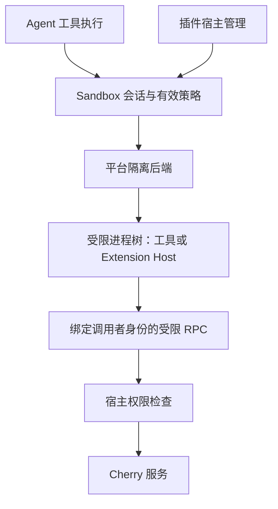

# Sandbox Proposal

状态：调研与设计提案，尚未实施，也未完成三平台运行验证。仓库基线为 `d382f4d514`，外部资料核对日期为 2026-09-24；上游支持范围可能继续变化。

[设计草案](./design.md)进一步细化最小进程契约、双向通信、权限和生命周期，并记录现有基础设施的接入缺口与待决策项；本 proposal 保留调研背景和选型依据。

[API 草案](./api.md)提供宿主进程控制、权限描述、平台后端契约和跨语言双向 RPC 的拟议接口及调用示例；仅供原型验证，尚未冻结或实现。

## 1. 目标与范围

为 Cherry Studio 引入可供 Agent 和未来 Extension Host 共用的进程沙盒抽象，支持 macOS、原生 Windows 和 Linux。WSL2、容器或远程 Linux 环境不能替代原生 Windows 的支持要求。

两个消费者共用隔离能力，但拥有不同的权限与生命周期：

| 消费者 | 使用方式 | 权限归属 |
| --- | --- | --- |
| Agent | 按任务或会话执行工具，覆盖短命令、长任务及子进程 | 会话授权的工作区、网络与工具能力 |
| Extension Host | 从加载开始运行第三方插件，支持长驻进程，并通过受控跨进程接口参与主进程业务 | 插件身份、插件私有数据目录及用户明确授予的能力 |

需要隔离的插件代码在受限进程内执行，同时能够参与主进程业务逻辑。主进程可以调用它处理业务输入，它也可以调用主进程明确开放且经过授权的业务方法。可信第一方代码允许直接在 main 引用和执行，不属于沙盒隔离保证范围；本提案不展开其设计或集成。

需要验证的使用场景是：主进程请求受限代码处理输入，受限代码调用获准的宿主能力后返回结果。此闭环不预先决定插件定义、加载方式或 Agent 执行循环的集成。

本提案优先研究本地原生进程隔离、受控通信与生命周期。暂不实现插件市场、安装器、完整插件 API、权限 UI 或云端 sandbox；`defineAgent()`、`defineWorkflow()`、业务编排引擎、Durable API 和编排持久化恢复均不在本次范围内，也不预先确定最终接口和目录布局。沙盒无需理解 Agent 或 workflow 的业务语义。

## 2. 安全目标与保证边界

将进入沙盒的代码视为不可信。目标是限制它们读取敏感文件、修改授权范围外的数据、连接未授权网络服务，以及通过子进程或宿主 API 绕过权限。

沙盒不识别代码是否恶意，而是强制执行权限边界。以下限制必须明确：

- 获得工作区写权限的代码仍可破坏该工作区；恢复机制与敏感操作审批有独立价值。
- 获得文件读取和网络访问权限的代码可能外传可读数据；允许的域名不等于允许的业务操作。
- 与宿主共享内核的进程隔离不承诺抵抗内核漏洞、已控制宿主的攻击者或管理员主动解除限制。
- 超时、输出限制和进程终止不等于 CPU、内存、磁盘配额；资源限制必须单独报告和验证。
- 仅设置 `cwd`、命令正则检查、工具审批、Worker 或独立进程，不构成完整的 OS 安全边界。

权限边界必须覆盖三条访问路径：目标直接访问资源、目标请求操作系统服务代办，以及目标通过 RPC 请求 Cherry 代办。文件和网络限制之外，还需验证凭据服务、桌面交互、系统代启动等入口；后端按默认拒绝和必要例外管理这些入口，不能借宿主用户或应用身份绕过限制。各平台清单与证据状态见[后端验证矩阵](./backend-options.md#21-系统服务与资源验证矩阵)。

来自受限进程的数据始终不可信，合法 RPC 响应不授予执行权或扩权资格。宿主据此执行操作时，必须落实该实例已获授的业务能力边界；OS 权限和宿主业务能力共同构成有效授权，不能仅比较文件策略。将输出用于 Agent 指令或界面时，接入层仍负责工具授权和内容安全；本提案不承诺解决提示注入，也不引入污点传播或插件 UI 系统。

对需要隔离的代码，初始化、动态导入、原生模块加载和子进程启动均属于待隔离执行。不能先在主进程加载这类代码，再将后续工具调用移入沙盒。如果未来允许安装脚本或构建脚本执行，这些阶段也必须进入明确的隔离边界；运行时沙盒不自动保护安装阶段。

## 3. Agent / Harness 调研

以下是官方文档和源码层面的观察，不是 Cherry 的兼容性或安全验收结果。

| 方案 | 机制与平台 | 对 Cherry 的启示 |
| --- | --- | --- |
| Claude Code / Agent SDK | 产品内置工具 sandbox 使用 macOS Seatbelt、Linux/WSL2 bubblewrap；产品文档仍不支持原生 Windows。可配置文件、网络限制和非沙盒重试 | 可参考工具审批与隔离的配合；不能推断整个 SDK、插件及 MCP 均被隔离。[文档](https://code.claude.com/docs/en/sandboxing) |
| Codex | macOS Seatbelt；Linux 当前默认 bwrap + seccomp；原生 Windows 区分 elevated 与较弱的 unelevated 后端 | 重点参考平台能力表达、审批与隔离分离，以及 Windows 实现；复用前需评估内部依赖。[跨平台机制](https://learn.chatgpt.com/docs/agent-approvals-security)、[Windows](https://learn.chatgpt.com/docs/windows/windows-sandbox) |
| DeepSeek Harness（DSH） | 拆分 sandbox contract、policy、local backend。Linux bwrap / Landlock，macOS Seatbelt，Windows restricted token + ACL；核心语义为文件写入限制 | 与现有集成最接近；Windows 文档明确不限制读取、网络和进程可见性，不能当作恶意插件的完整隔离。[架构](https://github.com/deepseek-ai/deepseek-harness/blob/main/packages/sandbox/README.md)、[Windows 边界](https://github.com/deepseek-ai/deepseek-harness/blob/main/packages/sandbox/sandbox-windows-acl/README.md) |
| Gemini CLI | macOS Seatbelt、Docker/Podman、Windows Native，以及 Linux gVisor/LXC；区分工具级和整个 CLI 隔离 | 可参考多后端与临时扩权；Windows Low integrity 标签存在持久化副作用。[文档](https://geminicli.com/docs/cli/sandbox/) |
| Pi | 默认继承启动用户权限，需要额外的进程隔离边界 | 工具级隔离不能覆盖进程内扩展和其他直接调用。[安全模型](https://github.com/earendil-works/pi/blob/main/packages/coding-agent/docs/security.md) |
| OpenCode | 文档的核心权限机制为工具级 allow / ask / deny，以及命令和路径匹配 | 可参考审批体验，不能将这些规则直接作为 OS 隔离证据。[文档](https://opencode.ai/docs/permissions/) |
| OpenClaw | Gateway 留在宿主，工具执行进入 Docker、Podman、SSH 等后端，支持 session / agent 范围配置 | 可参考控制进程与执行环境分离，以及环境生命周期。[文档](https://docs.openclaw.ai/gateway/sandboxing) |
| LangChain Deep Agents | Sandbox backend 提供文件操作与命令执行，接入多个托管执行环境 | 可参考执行环境抽象；远程环境的客户端跨平台不等于本地三平台隔离。[文档](https://docs.langchain.com/oss/python/deepagents/sandboxes) |

VS Code 的 Extension Host 拥有与 VS Code 相同的权限，可以访问文件、网络和外部进程。它的进程分离方案可供架构参考，但不是插件权限沙盒模板。[官方说明](https://code.visualstudio.com/docs/configure/extensions/extension-runtime-security)

## 4. 当前仓库状态

| 入口 | 已确认的事实 | 接入时需解决的问题 |
| --- | --- | --- |
| [DSH composition](../../src/main/ai/runtime/dsh/compositionBuilder.ts) | 普通权限映射为 `workspace-write`，`bypassPermissions` 映射为 `danger-full-access`，按平台选择 Bash / PowerShell sandbox | 统一设计时分离审批与隔离策略；不能把现有 shell 限制扩大解释为整个 DSH 的隔离 |
| [Pi session](../../src/main/ai/runtime/pi/PiRuntimeConnection.ts) | 在主进程中调用 SDK 创建 session，Bash spawn hook 当前主要处理执行环境 | 只包装 Bash 无法隔离 Pi 进程内扩展；需评估将不可信执行移入独立宿主 |
| [Pi approval](../../src/main/ai/runtime/pi/approvalExtension.ts) | 明确说明审批模式不构成 sandbox，Bash 对路径检查是不可透视的 | 保留审批职责，隔离保证由执行后端提供 |
| [Claude 进程入口](../../src/main/ai/runtime/claudeCode/ClaudeCodeProcessManager.ts)及[配置](../../src/main/ai/runtime/claudeCode/settingsBuilder.ts) | 已有可控制的子进程启动入口，尚无 Cherry 统一 sandbox 策略 | 评估整体包装与 SDK 内置工具 sandbox 的关系，验证嵌套限制和通信兼容性 |
| [Utility Process](../../src/main/core/utilityProcess/README.md) | 用于可信工作的崩溃与原生库隔离，明确不是安全 sandbox | 不能直接把 utility process 标为插件安全边界 |
| [Code Mode](../../src/main/ai/tools/codeMode/runtime.ts) | Worker 编排明确不是安全 sandbox | 如纳入不可信代码执行，需更换实际执行边界 |

已检查的 DSH `0.1.2-rc.1` 本地依赖主要实施文件写入限制，Windows 后端将强制执行程度标为 `partial`。该指标相对于其文件策略，不代表网络、秘密保护或完整插件安全等级。当前 checkout 尚未发现独立 Extension Host 实现；本提案将其作为未来消费者。

## 5. 建议的职责划分

### 5.1 审批、权限与强制执行分离

- 审批回答“本次操作是否获准”，自动批准不能隐式解除 sandbox。
- 权限策略回答“允许访问哪些资源”，由可信宿主根据用户授权生成；插件、工作区配置和模型不能自行扩大它。
- 平台后端回答“操作系统实际限制了什么”，必须暴露有效能力和不可支持的要求。
- Harness adapter 负责接入既有工具、进程和取消机制，不能对未经覆盖的执行路径宣称隔离。

对于一个声明必须隔离的会话，后端缺失、初始化失败或必需能力无法强制执行时应拒绝启动。不允许静默回退为普通进程。不可信插件不提供自动脱离 sandbox 的重试路径；Agent 如需更宽权限，应由宿主形成新的明确授权，不能复用插件路径自行升级。

### 5.2 以会话和进程树为核心

概念上需要能力探测、会话创建、进程启动、输出与退出观察、取消、整体终止、资源清理以及有效策略查询。接口名称和 TypeScript 类型留待原型验证后确定。

不能只设计 `exec(command)`：Extension Host 是长驻进程，Agent 也可能启动后台任务。沙盒需持有明确的 owner 和生命周期，插件卸载、会话结束或应用退出时能清理其进程树与资源。

策略变化必须说明何时生效。文件权限收紧若不能应用到存量进程，应停止旧进程并重建；不能仅更新内存配置后宣称撤权成功。新一代宿主不能继承旧进程已失效的 RPC 授权。

### 5.3 按资源报告能力

| 资源 | 所需语义 |
| --- | --- |
| 文件 | 分别描述可读、可写与敏感路径限制；处理符号链接、硬链接、路径替换及平台路径语义 |
| 网络 | 默认关闭，按需允许目标；验证忽略代理后的直接连接、DNS、IPv6、回环及局域网边界 |
| 本地 IPC | 限制 Unix socket、Windows named pipe、继承句柄及其他可借用宿主权限的通道 |
| 环境与凭据 | 仅传入必要环境变量；模型凭据和 Cherry 数据库留在可信宿主，按需通过受控 API 使用 |
| 子进程 | 子孙进程继承限制；终止与崩溃后不留下继续执行的任务 |
| 资源消耗 | 区分超时、输出限制、进程数量以及 CPU / 内存 / 磁盘配额的实际支持范围 |

能力探测按本次 spec 的每项要求返回“满足”“不满足”或“未知”及原因。后端仅支持某个资源的部分限制时，拆分检查并记录缺失项；不能以“部分支持”接受未完整兑现的策略。只有所有必需项都满足时才能 ready，不用一个布尔值掩盖平台差异。

### 5.4 通过双向调用参与主进程业务

已确认采用 **双向 RPC over 本地 IPC**：RPC 定义异步调用、结果和错误，IPC 负责跨进程传输。优先验证 macOS / Linux 的 Unix domain socket 与 Windows 的 named pipe；JSON-RPC 是优先评估的协议，具体库与传输实现尚未冻结，详见[通信设计决策](./design.md#61-已确认的通信决策与待验证选型)。宿主逐次校验授权，不直接开放全部 IpcApi；不引入 durable 调用或自动重放。

跨语言双向调用是必需能力，不能以“可以启动 Python”代替“Python 可以调用宿主并处理宿主请求”。宿主 API 与语言无关的通信契约分开设计，首轮用 Node/Python 验证最小接入，不扩展为完整多语言 SDK；详见[跨语言接入边界](./design.md#64-跨语言接入边界)。

| 方向 | 行为 | 执行位置 |
| --- | --- | --- |
| 主进程 → 插件 | 传入业务输入，请求插件执行处理函数或回调，接收结果或错误 | 插件函数始终在受限插件进程中执行 |
| 插件 → 主进程 | 请求调用主进程明确开放的业务方法，接收结果或错误 | 主进程完成身份和权限检查后执行宿主方法 |

例如，主进程请求受限代码处理一份输入；它在处理期间调用获准的宿主方法，再将结果返回。通信必须支持这种嵌套调用，不能因主进程正在等待结果而阻塞反向请求。结果仅是数据，后续宿主操作仍需独立满足授权边界。

职责边界如下：

- 沙盒层负责受限进程、通信通道和生命周期，不定义业务方法或调度业务流程。
- 业务层负责定义输入输出、开放的方法、调用时机，以及每次调用的身份和资源权限检查。
- 跨进程调用传递数据和结果；插件实现留在插件进程中，不向插件暴露主进程对象或任意内部 IPC 转发能力。
- 通信中断或进程退出时，等待中的调用应明确失败；沙盒不自动重放可能产生业务副作用的调用，也不负责恢复编排。

## 6. 插件宿主的权限模型

建议初始策略为：只读插件代码、仅写自身私有数据目录、默认无网络、默认不可访问用户工作区。工作区访问、网络与宿主能力由用户按需授予。系统运行库等启动必需资源由后端提供经过验证的最小读取范围。

宿主 RPC 是第二条安全边界：

- 调用者身份由宿主绑定到通信连接，不能信任请求体自报的插件 ID。
- 每个方法都检查能力、资源范围和当前授权；参数校验不能替代权限检查。
- 不提供可绕过策略的任意文件读取、任意 shell、任意内部 IPC 转发接口。
- 文件和网络 API 同样执行资源限制，防止主进程代插件越权；网络代理还需约束重定向与目标地址。
- 输出、事件和错误应有大小与速率约束，日志避免记录秘密。

已确认允许同一信任组、接受相同有效权限的插件共享宿主进程；轻量程度只影响资源收益，不能作为安全分组依据。不可信第三方插件或需要独立权限、故障隔离的插件使用独立进程。插件层决定加载一个或多个插件，沙盒层仍管理一个策略固定的进程树，详见[共享进程边界](./design.md#21-插件共享进程的边界)。

共享组共同承担文件、网络和宿主 RPC 权限，以及阻塞、资源耗尽、崩溃和强制终止的影响；不能通过合并权限静默扩权。同进程插件之间没有独立的内存或 OS 权限边界，RPC 插件 ID 只能用于路由和业务归属，不能作为组内安全隔离凭证。即使分进程，也必须验证后端账户、ACL、网络代理和本地 IPC 是否导致跨插件权限共享。

## 7. 候选方案与未决事项

Cherry 定义自己的沙盒契约，按平台评估原生隔离机制与可复用的基础组件；DSH 的 policy / backend 拆分和 Codex 的平台实现仅作为设计参考。尚未选择生产依赖或冻结后端实现。

[后端候选方案](./backend-options.md)记录 macOS Seatbelt、Linux bubblewrap / namespaces / seccomp 候选机制，以及 Windows 原生后端与 WSL2 两条路线。Windows 原生方向继续比较专用身份与受限进程、AppContainer；WSL2 尚未决定替代原生 Windows 要求。具体机制、RPC 接入、多实例隔离与验收门槛见该文档。

需要通过设计决策或实验收敛的问题：

1. Windows 已确认接受首次初始化时一次 UAC 授权，后续日常运行不反复提权；需验证普通用户完整生命周期，以及企业策略拒绝初始化时的不可用状态，不能降低插件安全要求。
2. 三平台最低系统版本、CPU 架构和 Linux 用户命名空间限制；本提案不预先承诺所有发行版可用。
3. Extension Host 使用何种可分发运行时，如何保持 Node 生态兼容，同时从进程启动前施加隔离。
4. 已确认按独立插件或共同信任组划分宿主；具体分组规则、动态授权与撤权方式，以及存量文件句柄和网络连接的处理仍待细化。
5. 各平台如何保证跨会话隔离；独立管理进程不能替代对底层身份、文件权限、网络与通道授权的验证。
6. Pi 的进程迁移与 Claude / DSH 原生 sandbox 如何组合，哪些 MCP、hooks 或辅助执行路径仍留在宿主。
7. 插件是否允许原生模块、安装脚本、任意子进程，以及需要哪些硬资源配额。

## 8. 分阶段验证与验收

先验证边界，再确定最终接口和接入实现。所有实验使用专用临时文件与测试端点，不读取真实密钥或破坏用户数据。

| 阶段 | 产出 | 验证方式 |
| --- | --- | --- |
| 平台原型 | 短命令执行器和支持双向调用的长驻 Node 插件宿主样例 | 在三平台实际运行，记录系统、架构、后端版本、安装条件与有效能力 |
| 隔离验证 | 允许与拒绝行为证据 | 使用下表检查直接系统调用及宿主 API，不能仅断言包装器被调用 |
| 抽象定稿 | 最小会话、进程、策略与能力契约 | 两种消费者均可接入；能力不足和初始化失败不会执行不受限代码 |
| 逐一接入 | 一个 Agent 路径与最小插件宿主，再扩展其他 harness | 重新验证其完整执行路径、权限撤销、并发与生命周期 |

| 场景 | 验收标准 |
| --- | --- |
| 主进程调用插件，插件调用获准的宿主业务方法，再返回结果 | 三平台均完成调用闭环，无嵌套调用死锁；插件代码始终在插件进程执行，直接越界访问和未授权宿主调用仍被拒绝 |
| 双向调用期间插件崩溃或通道断开 | 等待中的调用明确失败，不无限等待，不由沙盒自动重放业务操作 |
| 授权内文件与网络操作 | 正常成功，证明拒绝结果不是运行时整体损坏 |
| Node / Python 直接读取敏感测试文件、越界写入及删除 | 在承诺的策略范围内被实际拒绝，不能只拦截特定 shell 命令 |
| 链接、路径替换和 Windows 路径变体 | 不扩展授权范围；无法满足的语义明确列为不支持并阻止相应策略启动 |
| 清空代理环境后直接联网、访问回环 / LAN / IPv6 / DNS | 结果符合声明的网络策略，DNS 等未覆盖通道不得被描述为完全断网 |
| 子进程、后台进程及宿主异常退出 | 限制持续有效，清理后没有存活执行任务 |
| 伪造插件身份、越权 RPC、旧连接在撤权后重试 | 宿主拒绝操作，不替插件执行越界请求 |
| 系统服务代办与宿主消费输出 | 按后端矩阵验证凭据、桌面和代启动入口；目标返回的命令、路径或界面内容不自动获得执行、文件访问或 preload 能力 |
| 宿主代办文件操作、ACL 授权和清理时替换路径 | 不访问或修改授权外对象；无法保证安全的操作不开放 |
| 两个插件或 Agent 并发、其中一个退出或扩权 | 文件授权、代理、临时目录和清理互不串扰 |
| 运行时缺失、平台不支持、初始化或代理故障 | 清晰失败，不静默启动普通进程或开放网络 |
| 重启、崩溃恢复及 Windows ACL / 账户残留 | 明确记录保留状态，验证其不授予其他会话意外权限，并有可验证的清理方式 |
| 资源滥用与敏感日志 | 验证已声明的资源限制及日志脱敏，未实现的配额单独列出 |

当前验证状态：仅完成文档和源码调研。三平台运行、安全边界、性能开销、打包与签名兼容性均待验证；文档检查通过不代表这些验收项通过。
