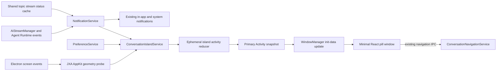

# macOS Conversation Island Design

Status: approved

## Summary

Add an opt-in macOS Conversation Island that presents the state of Assistant Conversations and Agent Sessions at the top of the display where the activity originated. The feature uses one short-lived Electron window, existing conversation status cache entries, existing navigation IPC, and a one-shot AppKit geometry probe. It does not add a native helper, poll for activity, process streamed tokens, or remain resident while idle.

This is a medium-sized, macOS-specific feature. The expected production implementation is five to eight engineering days plus two to three days of real-device QA. The largest uncertainty is window placement across macOS versions, notched and non-notched displays, fullscreen Spaces, and display topology changes.

## Goals

- Surface current conversation state outside the conversation view without stealing focus.
- Cover both Assistant Conversations and Agent Sessions.
- Place the island precisely around a built-in display notch when AppKit exposes reliable geometry.
- Provide a centered top-capsule fallback on external, non-notched, or unrecognized displays.
- Make the disabled and idle costs structurally close to zero.
- Reuse existing state, navigation, preference, localization, and window-management contracts.
- Keep the implementation replaceable without changing the AI streaming pipeline.

## Non-goals

- Reproduce Cindy's expanded session list, mascot, sounds, per-tool progress, streaming preview, or hover interactions.
- Render message content, Markdown, reasoning text, tool output, or token progress.
- Add a notification history or replace macOS Notification Center.
- Add Windows or Linux variants.
- Add a bundled Swift helper, native Node extension, or third-party Dynamic Island library.
- Add an idle island, terminal-state carousel, drag placement, layout persistence, or per-display user preferences.
- Change `AiStreamManager`, `CacheService`, `WindowManager`, `core/paths`, or another shared infrastructure contract.

## Repository and reference evidence

### Existing Cherry Studio contracts

- `ChatStreamLifecycle` already writes `topic.stream.statuses.${topicId}` to the main-owned shared Cache. `CacheService.subscribeSharedChange()` can observe template-key changes from either process without renderer polling. Because Agent Session topic IDs use the deliberate `agent-session:` namespace while runtime template segments exclude colons, complete observation uses the existing general topic template plus the narrower `agent-session:${sessionId}` template; it does not change Cache matching rules.
- `TopicStreamStatus` already defines `pending`, `streaming`, `awaiting-approval`, `done`, `error`, and `aborted`.
- `ConversationNavigationService` and `navigation.focus_or_open_conversation` already focus or open both Assistant Conversations and Agent Sessions.
- `WindowManager` already supports manual singleton panels, `showInactive()`, macOS panel windows, screen-saver stacking, fullscreen Spaces, Dock suppression, and always-on-top reapplication.
- Preference is the repository owner for stable user-configurable feature toggles. New v2-only keys originate in `target-key-definitions.json` and are generated; generated Preference schemas are not edited by hand.
- `NotificationService` already owns presentation-ready conversation notifications, topic-to-navigation-target projection, title fallback, and the existing completion/approval triggers. It becomes the single main-process conversation-notification source; system notifications and Conversation Island remain independent presentation policies over that source and may both be enabled.

### Cindy lessons

Cindy keeps product arbitration in TypeScript and sends a compact priority snapshot to a native AppKit/SwiftUI helper. The useful patterns are the single, main-owned priority answer and its treatment of the physical notch as an explicit occluded layout region. On a hardware-notch display, Cindy places leading content and trailing content in separate side wings with a center spacer equal to the measured notch width. Its black surface visually joins those wings to the hardware. Its persistent helper process, JSON-lines protocol, hover tracking, session list, streaming preview, sounds, mascot, restart state, and per-display layout preferences are intentionally excluded.

Relevant Cindy sources:

- <https://github.com/makecindy/cindy/blob/main/apps/desktop/src/main/agent-island/state.ts>
- <https://github.com/makecindy/cindy/blob/main/apps/desktop/src/main/agent-island/MacAgentIslandNativeHost.ts>
- <https://github.com/makecindy/cindy/blob/main/apps/desktop/src/shared/agentIsland.ts>
- <https://github.com/makecindy/cindy/blob/336d2bf9353eb48ac8263e57624fd55fc7f546fb/apps/desktop/native/agent-island/macos-agent-island-helper.swift#L2434-L2455>
- <https://github.com/makecindy/cindy/blob/336d2bf9353eb48ac8263e57624fd55fc7f546fb/apps/desktop/native/agent-island/macos-agent-island-helper.swift#L2548-L2615>

The small `electron-dynamic-island` project was also considered. Its Electron-only approach is closer to Cherry Studio, but its model-based notch approximation and limited multi-display handling do not satisfy this design's geometry requirements. Cherry Studio can implement the small required surface directly without adding a dependency.

## User experience

### Settings

Add a macOS-only group under **Settings → Notifications**:

| Preference | Default | Presentation |
|---|---:|---|
| `feature.conversation_island.enabled` | `false` | Main “macOS Conversation Island” switch |
| `feature.conversation_island.show_title` | `true` | Nested “Show conversation title” switch, visible only when enabled |

The group is hidden on Windows and Linux. The keys still use Preference rather than `app.notification.*` because the island is an independent feature surface, not a system-notification transport.

### Compact layout

The window contains one single-line surface. Its layout depends on whether the AppKit probe recognized a physical notch.

Capsule fallback:

```text
[state indicator] [state text] · [optional title] [+N]
```

Hardware-notch presentation:

```text
[state indicator] [state text] [physical notch: no content] [optional title] [+N]
```

- Title is enabled by default after the user opts into the feature.
- The title is the stored topic or Agent Session name. Message content is never a fallback.
- An empty or unavailable name uses the existing localized “new conversation” or “new agent task” fallback.
- The renderer keeps the existing fixed compact width. Long titles use one-line ellipsis.
- The hardware-notch presentation is an opaque black top-connected surface with no border, backdrop blur, or theme-dependent background. The capsule fallback keeps its existing theme-aware popover styling and full rounding.
- The hardware-notch presentation uses a three-column grid: a leading wing for the state, a center spacer equal to the measured physical notch width, and a trailing wing for the optional title and `+N`. Both wings clip overflow. Text truncates before entering the center spacer; the state indicator and `+N` have higher layout priority than text.
- If title display is disabled, the trailing wing contains only `+N` when present. No replacement content is added to the center spacer.
- `+N` counts all other eligible activities. It is absent when the Primary Activity is the only eligible activity.
- The entire visible pill is clickable and opens the Primary Activity.
- There is no hover expansion, context menu, drag behavior, or invisible hit area beyond the pill.

### State wording and lifetime

| Cache status | Assistant Conversation | Agent Session | Lifetime |
|---|---|---|---|
| `pending` | 正在思考 | 正在准备 | Until the next state |
| `streaming` | 正在回复 | 正在执行 | Until the next state |
| `awaiting-approval` | 等待确认 | 等待确认 | Until the interaction is resolved |
| `done` | 回复完成 | 任务完成 | 4 seconds |
| `error` | 回复失败 | 执行失败 | 6 seconds |
| `aborted` | Hidden | Hidden | Immediate removal |

All wording is localized. Pending and streaming have one restrained CSS state animation. Awaiting Confirmation, done, and error are static. State remains identifiable through text and shape, not color alone. `prefers-reduced-motion` disables all nonessential motion.

The Conversation Island appears while Cherry Studio is foreground or background and over fullscreen applications. Showing it never activates Cherry Studio. Clicking it intentionally focuses or opens the target conversation.

### Primary Activity arbitration

At any moment, one eligible activity is the Primary Activity:

1. Awaiting Confirmation.
2. Newly completed or failed activities still inside their terminal lifetime.
3. Live pending or streaming activities.

Within a class, the activity with the most recent state change wins. A newly completed or failed activity may temporarily replace a live activity. Multiple terminal activities do not form a queue: the newest wins, older eligible activities remain represented by `+N`, and every terminal entry expires on its own deadline.

## Display ownership and geometry

### Origin display

When an activity is first observed as pending, the main service snapshots the currently focused full-chrome Cherry Studio window and its Electron display ID. This is a best-effort attribution that avoids adding a source-window contract to `AiStreamManager`.

- A renderer-triggered request from an unfocused Cherry window may use the fallback display.
- A background or headless Agent Session with no visible origin prefers the internal display, then Electron's primary display.
- When Primary Activity changes, the island moves to that activity's recorded display.
- If the recorded display has disconnected, the service uses the internal-display/primary-display fallback.
- The island does not follow later window movement during the same activity.

### Notch probe

A feature-local macOS geometry function resolves the fixed command name `osascript` through the existing command resolver and runs a constant JXA/AppKit script using `execFile` with `shell: false`.

The script returns strict JSON containing only required `NSScreen` fields:

- `NSScreenNumber`;
- screen frame;
- `safeAreaInsets`;
- `auxiliaryTopLeftArea`;
- `auxiliaryTopRightArea`.

The result is size-limited, parsed and validated before use. A short timeout terminates the child process. No user data enters the script or arguments, and the probe does not require Accessibility or Automation permission.

The service maps `NSScreenNumber` to Electron display IDs. It derives the notch center and gap width from the auxiliary areas, then positions the Electron window using the target display's Electron bounds. A recognized-notch placement carries that validated gap width forward as the physical occlusion width; the renderer does not infer it from the window size. Missing APIs, malformed output, command-resolution failure, timeout, ID mismatch, or implausible geometry all select the top-capsule fallback and carry no occlusion width.

Probe results are cached and refreshed only on:

- first enable;
- display added, removed, or metrics changed;
- system resume.

There is no geometry poll and no per-activity `osascript` execution.

### Window behavior

Add `WindowType.ConversationIsland` as a manual singleton with no retention configuration:

- frameless, transparent, non-resizable macOS panel;
- context isolation on, Node integration off, sandbox on;
- minimal feature preload exposing only the generic IpcApi bridge;
- non-focusable and shown with `showInactive()`;
- `acceptFirstMouse`, `hiddenInMissionControl`, `skipTaskbar`, and no Dock contribution;
- screen-saver always-on-top level with visibility on all workspaces and fullscreen Spaces;
- reapply always-on-top after every show;
- exact window bounds equal the pill hit area.

On a recognized notched display, the black surface joins the top edge around the physical notch while all meaningful content remains in the two visible side wings. On other displays, it is a theme-aware rounded capsule centered eight pixels below the top edge.

The window is created on the first eligible activity, reused while any activity remains eligible, and destroyed when the activity set becomes empty after terminal lifetimes. Disabling the feature immediately closes the window and clears display listeners and timers. The lightweight `NotificationService` activity listener remains so enabling during a live response can present the current activity.

## Architecture



### Main-process ownership

`NotificationService` is the shared conversation-notification source. It keeps its existing precise `AiStreamManager` and Agent Runtime completion/approval subscriptions for in-app and system notifications, and adds two lightweight shared-Cache subscriptions for the complete transient status stream:

- `topic.stream.statuses.${topicId}` for ordinary Assistant Conversation keys;
- `topic.stream.statuses.agent-session:${sessionId}` for namespaced Agent Session keys.

The second pattern places the colon in the fixed prefix, so it works with the existing runtime placeholder character set. `NotificationService` converts every concrete key into the existing `ConversationNavigationTarget`, emits a main-only `ConversationActivityChangedEvent`, and remains the sole owner of conversation name lookup and localized fallback. This is an in-process lifecycle event, not a new IpcApi event or shared event bus. Existing system-notification foreground/background gates and completion/approval IDs do not change.

`ConversationIslandService` is a macOS-conditional lifecycle service because it owns the island activity reducer, preference subscriptions, display listeners while enabled, transient timers, and a managed window. It depends on `NotificationService` and never reads the shared Cache directly. Its topic grows into `src/main/services/conversationIsland/` only because the implementation has three independent responsibilities:

- lifecycle orchestration and island snapshot projection;
- pure activity arbitration and expiry;
- feature-local macOS display geometry probing and validation.

No new top-level directory or `features/` domain is justified.

The service subscribes to `NotificationService.onConversationActivityChanged` before any island window exists. The event path performs constant work per status transition and never receives streamed content. The in-memory map contains only live activities and terminal activities with an expiry timestamp. While the feature is disabled, expired entries are pruned lazily on the next status change or enable instead of arming a timer.

When both the feature and title display are enabled, the service asks `NotificationService` for the conversation name only when an activity first becomes Primary and caches it for that activity lifetime. Turning title display off removes title data from subsequent island snapshots and avoids island-triggered name queries; independently enabled system notifications may still resolve their own title. A runtime `app.language` change rebuilds the localized snapshot without recreating the window.

### Renderer ownership

The feature preload is a self-contained CommonJS entry. It exposes only the existing generic `ipcApi` request/event bridge and imports no local preload module, because Electron's sandbox cannot load Rollup-generated relative preload chunks. A build assertion verifies that `conversationIsland.js` contains no relative `require()` call.

Add a small `src/renderer/windows/conversationIsland/` entry containing:

- an HTML entry with a strict CSP;
- a minimal entry point that imports only the needed styles;
- one React component consuming typed `useWindowInitData` snapshots;
- a click handler calling existing `navigation.focus_or_open_conversation`.

It intentionally does not call the regular `prepareWindow()` path and does not initialize theme providers, custom CSS, renderer Preference cache, DataApi DevTools, or renderer i18n. Main sends already-localized presentation text. This avoids the full-window bootstrap while retaining React's existing component and test conventions.

### Cross-process contract

A declaration-only snapshot type belongs in `src/shared/types/conversationIsland.ts`. It contains only:

- stable Primary Activity identity and navigation target;
- localized state text and semantic state kind;
- optional bounded title;
- a localized navigation title that is retained when the visible-title preference is off, so the existing navigation route can still name a newly opened tab without querying renderer state;
- secondary activity count;
- notched/fallback presentation variant;
- the validated physical notch width for the notched variant only.

Initial and subsequent snapshots use `WindowManager` init data and `pushInitData()`. The existing `window.reused` IpcApi event updates `useWindowInitData` in place. Clicking uses the existing navigation request. No new IpcApi schema, handler, preload method, or event bus is needed.

## Failure isolation

- Conversation state production never depends on the island. Every island failure is logged and swallowed at the feature boundary.
- Geometry failure selects the top capsule; it does not hide the feature.
- Missing or invalid physical notch width cannot select the three-column notch layout.
- Title lookup failure uses a localized generic title.
- Window creation or renderer failure hides the island until a later state change; there is no restart loop.
- Disabling the setting synchronously prevents further presentation work and releases the window.
- App shutdown disposes notification/activity subscriptions, screen listeners, child process, and timers through their lifecycle services.

## Performance contract

### Disabled

- No BrowserWindow or renderer process.
- No JXA child process.
- No display listener or timer.
- Two Cache template subscriptions owned by the already-resident `NotificationService`, one in-process activity listener, and a bounded ephemeral activity map updated only on status transitions.

### Enabled but idle

- No BrowserWindow, renderer process, helper process, timer, or polling.
- Cached display geometry, three passive Electron display-change listeners, and the same notification activity listener only.

### Active

- At most one extra BrowserWindow.
- No per-token work and no message-body transfer.
- No global mouse monitor, hover loop, sound, or expanded state.
- The window is destroyed after the last terminal lifetime ends.

Tracked-app verification must compare disabled, enabled-idle, single-activity, and concurrent-activity scenarios and record process count, CPU, and memory. The structural acceptance criterion is that disabled and enabled-idle add no renderer/helper process and active adds at most one transient renderer.

## Expected change scope

### Production code

| Area | Expected change |
|---|---|
| Preferences | Two v2-only target definitions and generated Preference output |
| Settings | One macOS-only group in the existing Notification settings page |
| Shared | One declaration-only snapshot type |
| Notifications | Extend `NotificationService` with one normalized conversation-activity event while preserving existing delivery rules |
| Main lifecycle | One registered conditional service topic with reducer and geometry helper |
| Window system | One `WindowType`, one registry entry, and renderer build input |
| Preload | One minimal IpcApi-only preload entry |
| Renderer | One small conversation-island window entry and pill component |
| Localization | Main status/fallback strings and renderer setting labels in all supported locales |

Expected hand-written production footprint: roughly 14–18 files and 700–1,100 lines. Generated Preference output and locale catalogs increase the changed-file count without adding architectural complexity. There is no database migration, DataApi resource, new IPC route, native binary, third-party runtime dependency, or shared infrastructure extension.

### Tests worth adding

Each test below protects a distinct regression:

- Pure reducer tests: incorrect priority, tie-breaking, `+N`, terminal expiry, immediate abort removal, or accidental terminal queuing.
- Geometry parser tests: malformed JXA output accepted as geometry, invalid notch gaps, missing display IDs, fallback not selected, or recognized notch width not carried into the placement.
- Notification service tests: both Assistant and namespaced Agent Cache keys produce the same normalized activity contract, while existing completion/approval delivery and foreground/background gates remain unchanged.
- Island service tests: feature-off window creation, title queries while hidden, duplicate windows, missed runtime preference changes, leaked timers/listeners, and failure propagation into status handling.
- Window registry invariant test: wrong lifecycle, preload, focus, Dock, fullscreen, sandbox, or always-on-top configuration.
- Renderer component test: visible state/title/count contract, physical-notch center spacer and black treatment, unchanged capsule treatment, and click invoking the existing navigation route.
- Notification settings test: macOS-only visibility and both Preference writes.

Do not add snapshots, render-without-crashing cases, class-name assertions for ordinary styling, or duplicate tests of the existing navigation service.

### Verification

Implementation verification should include:

1. Focused unit/component tests for the files above.
2. `pnpm lint` for formatting, types, generated Preference contracts, and i18n checks.
3. `pnpm docs:check` when the design or reference documentation changes.
4. Real tracked-app tests on:
   - a notched built-in display;
   - a non-notched or external display;
   - mixed-display activity and display disconnection;
   - fullscreen Spaces;
   - sleep/resume;
   - foreground and background Cherry Studio;
   - title on/off;
   - Assistant and Agent wording;
   - concurrent activity and simultaneous terminal transitions;
   - system notifications enabled alongside the island.

## Alternatives rejected

### Cindy-style native helper

It can reduce renderer overhead and gives native shape/hover control, but requires a second UI implementation, signed universal binary, packaging changes, a process protocol, restart policy, and substantially broader testing. Those costs are not justified for a one-line transient status surface.

### Permanent hidden Electron window

It reduces first-show latency but keeps renderer memory resident whenever the preference is enabled. The approved design accepts a small cold-show delay after idle periods and destroys the window when activity ends.

### Content row below the physical notch

It provides more uninterrupted title width, but increases the black surface height and visual weight. The approved compact surface instead uses the existing height and places content in the two visible side wings, truncating low-priority text when necessary.

### Renderer-owned status reporting

It could carry exact source-window identity but duplicates status projection across windows and becomes stale on renderer crash. Main already observes authoritative shared status transitions.

### Island-owned Cache subscription

It keeps the first implementation superficially local, but duplicates topic-to-target parsing, title fallback, and notification semantics already owned by `NotificationService`. Extending the existing notification source with a narrow main-only activity event gives the system-notification and island presenters one normalization boundary without changing their different delivery policies.

### Extending `AiStreamManager` with source-window metadata

It would make attribution exact but introduces a UI concern into shared AI infrastructure and changes more producers. Focused-window attribution is sufficient for the feature and remains independently removable.

### Extending `core/paths` for `osascript`

A single-feature system executable does not justify a new public core path key. Existing fixed-name command resolution keeps discovery feature-local and avoids an infrastructure contract.

### Sound in the first release

The repository has no reusable sound assets or playback service. A product-quality sound option adds asset licensing, settings, deduplication with system notification audio, and tests. The architecture can add event-driven sound later without redesign.

## Decision-record policy

No ADR is required. The visible product and technical decisions are captured here, and the native-vs-Electron renderer remains replaceable behind the main-owned snapshot contract. There is no hard-to-reverse shared infrastructure change.
