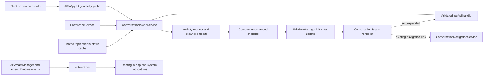

# macOS Conversation Island Design

Status: approved

## Summary

Add an opt-in macOS Conversation Island that presents Assistant Conversation and Agent Session state at the top of the display where the activity originated. The compact surface shows the Primary Activity. When at least two activities are eligible, a 500 ms hover expands the same Electron window into a dense list of all eligible Conversation Activities; leaving the full surface for 250 ms collapses it.

The feature reuses existing conversation status cache entries, navigation IPC, Preference, localization, WindowManager, and a one-shot AppKit geometry probe. Its macOS-conditional lifecycle service owns continuous activity observation, while target-aware packaging omits feature-only preload and renderer artifacts from Windows and Linux packages. It does not add a native helper, poll for activity, process streamed tokens, or remain resident while idle.

This is a medium-sized, macOS-specific feature. The largest uncertainty is window placement and pointer continuity while resizing across macOS versions, notched and non-notched displays, fullscreen Spaces, and display topology changes.

## Goals

- Surface current conversation state outside the conversation view without stealing focus.
- Cover both Assistant Conversations and Agent Sessions.
- Show every eligible Conversation Activity on deliberate hover, while keeping the idle surface compact.
- Keep row targets stable enough to click while statuses continue changing.
- Place the island precisely around a built-in display notch when AppKit exposes reliable geometry.
- Provide a centered top-capsule fallback on external, non-notched, or unrecognized displays.
- Make the disabled and idle costs structurally close to zero.
- Omit feature-only preload and renderer artifacts from Windows and Linux packages.
- Reuse existing state, navigation, preference, localization, and window-management contracts.
- Keep the implementation replaceable without changing the AI streaming pipeline.

## Non-goals

- Reproduce Cindy's mascot, sounds, per-tool progress, streaming preview, large cards, or native helper architecture.
- Render message content, Markdown, reasoning text, tool output, or token progress.
- Add inline approval, pinning, click-to-expand, keyboard navigation, a context menu, or drag placement.
- Add a notification history or replace macOS Notification Center.
- Add Windows or Linux variants.
- Add a bundled Swift helper, native Node extension, or third-party Dynamic Island library.
- Add platform-specific Vite builds, service registries, IPC registries, or window registries.
- Remove inert Conversation Island types and metadata from the common main bundle.
- Add an idle island, terminal-state carousel, layout persistence, or per-display user preferences.
- Change `AiStreamManager`, `CacheService`, `WindowManager`, `core/paths`, or another shared infrastructure contract.

## Repository and reference evidence

### Existing Cherry Studio contracts

- `ChatStreamLifecycle` already writes `topic.stream.statuses.${topicId}` to the main-owned shared Cache. `CacheService.subscribeSharedChange()` can observe template-key changes from either process without renderer polling. Because Agent Session topic IDs use the deliberate `agent-session:` namespace while runtime template segments exclude colons, complete observation uses the existing general topic template plus the narrower `agent-session:${sessionId}` template; it does not change Cache matching rules.
- `TopicStreamStatus` already defines `pending`, `streaming`, `awaiting-approval`, `done`, `error`, and `aborted`.
- `ConversationNavigationService` and `navigation.focus_or_open_conversation` already focus or open both Assistant Conversations and Agent Sessions.
- `WindowManager` already supports manual singleton panels, `showInactive()`, macOS panel windows, screen-saver stacking, fullscreen Spaces, Dock suppression, always-on-top reapplication, and init-data updates.
- The existing screenshot overlay establishes the relevant process boundary: renderer pointer events trigger a semantic IpcApi command; the main handler validates its sender and delegates the authoritative action.
- Electron 41 supports programmatic `BrowserWindow.setBounds(bounds, animate)` on macOS and exposes the system reduced-motion setting.
- Preference is the repository owner for stable user-configurable feature toggles. New v2-only keys originate in `target-key-definitions.json` and are generated; generated Preference schemas are not edited by hand.
- `NotificationService` already owns presentation-ready completion and confirmation notifications. Continuous status observation has a different lifecycle and only one consumer, so it remains inside the macOS-conditional Conversation Island service instead of expanding the all-platform notification contract.
- Lifecycle `@Conditional(onPlatform('darwin'))` is the repository mechanism for excluding a macOS-only service at boot. Target-platform file filtering belongs to electron-builder's `beforePack` hook, which receives the packaging target independently of the build host.

### Cindy lessons

Cindy confirms that a short hover dwell, delayed collapse, stable expanded ordering, and a bounded visible list make the island usable without an explicit open action. Its current implementation uses a 500 ms expansion delay, a shorter delayed collapse, and at most five visible sessions before internal scrolling. Cindy does not provide a setting to hide titles; its Agent Island settings cover enablement and unrelated presentation choices.

Cherry Studio adopts the interaction principles, not Cindy's architecture or information density. Cindy's persistent helper process, JSON-lines protocol, native SwiftUI surface, global hover tracking, large session cards, streaming preview, tools, sounds, mascot, restart state, and per-display preferences remain excluded. Cherry also keeps the physical notch as an explicit occluded layout region instead of inferring it from window size.

Relevant Cindy sources:

- <https://github.com/makecindy/cindy/blob/main/apps/desktop/src/main/agent-island/state.ts>
- <https://github.com/makecindy/cindy/blob/main/apps/desktop/native/agent-island/macos-agent-island-helper.swift>
- <https://github.com/makecindy/cindy/blob/main/apps/desktop/src/renderer/hooks/useAgentIslandSettings.ts>
- <https://github.com/makecindy/cindy/blob/main/apps/desktop/src/renderer/components/settings/AgentIslandSection.tsx>

The small `electron-dynamic-island` project was also considered. Its Electron-only approach is closer to Cherry Studio, but its model-based notch approximation and limited multi-display handling do not satisfy this design's geometry requirements. Cherry Studio can implement the small required surface directly without adding a dependency.

## User experience

### Settings and title policy

Add one macOS-only group under **Settings → Notifications**:

| Preference | Default | Presentation |
|---|---:|---|
| `feature.conversation_island.enabled` | `false` | Main “macOS Conversation Island” switch |

The group is hidden on Windows and Linux. The key uses Preference because the island is an independent user-configurable feature surface, not a system-notification transport.

Conversation titles always appear in compact and expanded modes. There is no `feature.conversation_island.show_title` preference. The title is the stored topic or Agent Session name; message content is never a fallback. An empty or unavailable name uses the existing localized “new conversation” or “new agent task” fallback. Titles are bounded before crossing into the renderer and use one-line ellipsis when space is limited.

### Compact mode

The initial window is 320 × 38 logical pixels and presents the Primary Activity on a single line.

Capsule fallback:

```text
[state indicator] [state text] · [title] [+N]
```

Hardware-notch presentation:

```text
[state indicator] [state text] [physical notch: no content] [title] [+N]
```

- `+N` counts all other eligible activities. It is absent when the Primary Activity is the only eligible activity.
- The compact surface does not expand when only one activity is eligible.
- Long text truncates before indicators, counts, or the physical notch spacer.
- Clicking the compact surface opens the Primary Activity through the existing navigation route.
- Pending and streaming use one restrained CSS state animation. Awaiting Confirmation, done, and error are static.

### Expanded mode

When `secondaryCount > 0`, keeping the pointer inside the compact surface for 500 ms requests expanded mode. The same window grows around its horizontal center and downward from its top anchor to approximately 420 logical pixels wide.

The expanded content is a dense, equal-height list:

```text
● 正在回复    Conversation title
○ 等待确认    Conversation title
○ 任务完成    Agent Session title
```

- Every row contains only a state indicator, localized state text, and required title.
- The Primary Activity receives a subtle surface emphasis; it is not a larger hero card.
- Two through five activities determine the surface height. Six or more keep five visible rows and scroll inside the exact window bounds.
- The window does not grow for every additional activity beyond the fifth row.
- Clicking any row first requests collapse, then opens that row's existing navigation target.
- After a row click, expansion is locked until the pointer fully leaves and enters again. Window shrinkage under a stationary pointer cannot reopen it.
- Leaving the entire expanded surface starts a 250 ms collapse delay. Re-entering before the delay ends cancels collapse, which also absorbs transient `mouseleave` events caused by resizing.
- There is no pin, explicit close control, inline action, message preview, tool detail, or keyboard-only expanded mode.

### Stable expanded structure

Main freezes the target display, row order, and visible membership snapshot at the moment expansion succeeds. This prevents changing statuses from moving click targets under the pointer.

- Existing rows update their semantic state and localized state text in place.
- A newly eligible activity appends to the end of the frozen order.
- A `done` or `error` row whose normal terminal lifetime expires remains visible until collapse.
- An explicitly aborted or removed activity disappears immediately because its navigation target is no longer valid.
- If the emphasized Primary Activity is removed, the first remaining row receives emphasis without reordering the list.
- If immediate removals leave fewer than two rows, main collapses to compact mode.
- On collapse, main prunes expired entries and recomputes Primary Activity, display ownership, compact count, and order from authoritative current state.

### State wording and lifetime

| Cache status | Assistant Conversation | Agent Session | Lifetime |
|---|---|---|---|
| `pending` | 正在思考 | 正在准备 | Until the next state |
| `streaming` | 正在回复 | 正在执行 | Until the next state |
| `awaiting-approval` | 等待确认 | 等待确认 | Until the interaction is resolved |
| `done` | 回复完成 | 任务完成 | 4 seconds |
| `error` | 回复失败 | 执行失败 | 6 seconds |
| `aborted` | Hidden | Hidden | Immediate removal |

All wording is localized. State remains identifiable through text and shape, not color alone. The Conversation Island appears while Cherry Studio is foreground or background and over fullscreen applications. Showing or expanding it never activates Cherry Studio. Clicking a row intentionally focuses or opens its target conversation.

### Primary Activity arbitration

At any moment, one eligible activity is the Primary Activity:

1. Awaiting Confirmation.
2. Newly completed or failed activities still inside their terminal lifetime.
3. Live pending or streaming activities.

Within a class, the activity with the most recent state change wins. A newly completed or failed activity may temporarily replace a live activity. Multiple terminal activities do not form a queue: the newest wins, older eligible activities remain represented by `+N`, and every terminal entry expires on its own deadline unless an expanded snapshot temporarily retains it.

## Display ownership and geometry

### Origin display

When an activity is first observed as pending, the main service snapshots the currently focused full-chrome Cherry Studio window and its Electron display ID. This is best-effort attribution that avoids adding a source-window contract to `AiStreamManager`.

- A renderer-triggered request from an unfocused Cherry window may use the fallback display.
- A background or headless Agent Session with no visible origin prefers the internal display, then Electron's primary display.
- In compact mode, the island moves when a new Primary Activity owns a different recorded display.
- Expanded mode freezes the current display so pointer targets do not jump between screens.
- If the recorded or frozen display disconnects, the service immediately collapses and uses the internal-display/primary-display fallback.
- The island does not follow later window movement during the same activity.

### Notch probe

A feature-local macOS geometry function resolves the fixed command name `osascript` through the existing command resolver and runs a constant JXA/AppKit script using `execFile` with `shell: false`.

The script returns strict JSON containing only required `NSScreen` fields:

- `NSScreenNumber`;
- screen frame;
- `safeAreaInsets`;
- `auxiliaryTopLeftArea`;
- `auxiliaryTopRightArea`.

The result is size-limited, parsed, and validated before use. A short timeout terminates the child process. No user data enters the script or arguments, and the probe does not require Accessibility or Automation permission.

The service maps `NSScreenNumber` to Electron display IDs. It derives the notch center and gap width from the auxiliary areas, then positions the Electron window using the target display's Electron bounds. A recognized-notch placement carries that validated gap width forward as the physical occlusion width; the renderer does not infer it from the window size. Missing APIs, malformed output, command-resolution failure, timeout, ID mismatch, or implausible geometry all select the top-capsule fallback and carry no occlusion width.

Probe results are cached and refreshed only on:

- first enable;
- display added, removed, or metrics changed;
- system resume.

There is no geometry poll and no per-activity `osascript` execution. A display topology or metrics event, and system resume, force compact mode before reprobe and repositioning rather than retaining stale expanded bounds.

### Window shape and placement

Add `WindowType.ConversationIsland` as a manual singleton with no retention configuration:

- frameless, transparent, non-user-resizable macOS panel;
- context isolation on, Node integration off, sandbox on;
- minimal feature preload exposing only the generic IpcApi bridge;
- non-focusable and shown with `showInactive()`;
- `acceptFirstMouse`, `hiddenInMissionControl`, `skipTaskbar`, and no Dock contribution;
- screen-saver always-on-top level with visibility on all workspaces and fullscreen Spaces;
- reapply always-on-top after every show;
- exact window bounds equal the visible surface and hit area in both modes.

On a recognized notched display, the surface is opaque black, anchored to the physical top edge, and visually joins the hardware notch. Compact content occupies two visible side wings around the measured occlusion. Expanded rows begin below the physical notch and remain inside the approximately 420-pixel black surface, whose bottom corners are rounded.

On other displays, or whenever notch geometry is unreliable, both modes use the existing theme-aware, fully rounded capsule/popover treatment centered eight pixels below the top edge. Cherry Studio does not draw a fake black notch on a non-notched display.

Main computes and applies every compact and expanded bound. It grows the same window symmetrically left and right and downward, preserving the top anchor. It uses native macOS `setBounds(nextBounds, animate)` for the short resize when system reduced motion is off, and applies bounds without animation when reduced motion is on. Renderer content may use a light motion-safe opacity transition; rows do not bounce or stagger.

The window is created on the first eligible activity, reused while any activity remains eligible, and destroyed when the activity set becomes empty after terminal lifetimes. Disabling the feature immediately closes the window and clears display listeners, timers, expanded state, and frozen structure. On macOS, the service's lightweight Cache subscriptions remain so enabling during a live response can present the current activity.

## Architecture and ownership



### Main-process ownership

`NotificationService` keeps its existing precise `AiStreamManager` and Agent Runtime completion/approval subscriptions for in-app and system notifications. It does not subscribe to the continuous status Cache, publish a Conversation Island activity event, or expose title lookup for the feature.

`ConversationIslandService` is a macOS-conditional lifecycle service. In addition to presentation state, it owns two lightweight shared-Cache subscriptions for the complete transient status stream:

- `topic.stream.statuses.${topicId}` for ordinary Assistant Conversation keys;
- `topic.stream.statuses.agent-session:${sessionId}` for namespaced Agent Session keys.

The second pattern places the colon in the fixed prefix, so it works with the existing runtime placeholder character set. The service converts every concrete key into the existing `ConversationNavigationTarget` and resolves stored titles with localized fallback. These feature-local projections do not create a shared event or public service contract. Existing system-notification foreground/background gates and completion/approval IDs do not change.

`ConversationIslandService` is a macOS-conditional lifecycle service because it owns:

- the authoritative activity reducer and Primary Activity arbitration;
- resolved and bounded titles for all eligible activities;
- expanded/compact mode, frozen order and display, and terminal retention;
- preference and language subscriptions;
- display listeners, transient expiry timers, geometry, and managed window bounds.

It has same-phase dependencies only on `WindowManager` and `PowerService`; earlier lifecycle phases already guarantee Cache and Preference availability. Its topic lives in `src/main/services/conversationIsland/` because lifecycle orchestration, a pure activity reducer, and feature-local geometry are separate implementation responsibilities. No new top-level directory or shared infrastructure abstraction is justified.

The service subscribes to the two Cache templates before any island window exists. The path performs constant work per status transition and never receives streamed content. The in-memory map contains only live activities and terminal activities with an expiry timestamp. While disabled, expired entries are pruned lazily on the next status change or enable instead of arming a timer.

Titles are resolved when an activity first becomes presentation-eligible and cached for its activity lifetime. Entering expanded mode ensures all frozen rows have resolved fallback-safe titles before publishing the snapshot. A runtime `app.language` change rebuilds localized state and fallback text without recreating the window or changing frozen order.

### Renderer ownership

The feature preload is a self-contained CommonJS entry. It exposes only the existing generic `ipcApi` request/event bridge and imports no local preload module, because Electron's sandbox cannot load Rollup-generated relative preload chunks. A build assertion verifies that `conversationIsland.js` contains no relative `require()` call.

The small `src/renderer/windows/conversationIsland/` entry contains an HTML entry with strict CSP, a minimal entry point importing only needed styles, and one React surface consuming typed `useWindowInitData` snapshots. It intentionally does not call the regular `prepareWindow()` path and does not initialize theme providers, custom CSS, renderer Preference cache, DataApi DevTools, or renderer i18n. Main sends already-localized presentation text.

Renderer owns only pointer interpretation and local interaction timers:

- start or cancel the 500 ms hover dwell;
- start or cancel the 250 ms full-leave delay;
- prevent re-expansion after a row click until a real leave/re-enter cycle;
- cancel a pending expansion when the latest snapshot no longer has a secondary activity;
- render compact or expanded snapshots and invoke row navigation.

Renderer does not compute bounds, choose a display, arbitrate activity order, retain expired rows, or treat raw pointer events as main-process state.

### Cross-process contract

The existing generic preload bridge remains unchanged. Add one narrow IpcApi command:

```text
conversation_island.set_expanded({ expanded: boolean })
```

This command expresses a feature mode transition rather than forwarding `mouseenter` or `mouseleave`. Its main handler validates that `IpcContext.senderId` belongs to the current Conversation Island window, no-ops for missing or mismatched senders, and delegates to an idempotent service method. It does not accept dimensions, positions, display IDs, or activity order. A broad `window.set_bounds` capability and renderer self-resizing are explicitly rejected.

A declaration-only snapshot type belongs in `src/shared/types/conversationIsland.ts`. It contains:

- presentation variant and validated physical notch width when applicable;
- compact Primary Activity item and secondary count;
- authoritative compact/expanded mode;
- an optional ordered expanded item list.

Each activity item contains only stable identity, existing navigation target, required bounded title, semantic state kind, and localized state text. Initial and subsequent snapshots use `WindowManager` init data and `pushInitData()`. The existing `window.reused` IpcApi event updates `useWindowInitData` in place. Clicking continues to use `navigation.focus_or_open_conversation` after requesting collapse.

No DataApi resource, Cache entry, Preference key, renderer-global channel, or custom preload method stores expanded state. Expanded state is transient main-service memory because it controls authoritative window geometry and frozen presentation; the renderer retains only timers and the post-click re-entry latch.

### Platform registration and packaging

The lifecycle registry remains static and includes `ConversationIslandService`, while `@Conditional(onPlatform('darwin'))` excludes the service entirely at boot on Windows and Linux. The exhaustive IPC schema and handler map plus the static `WindowType` registry also remain common. They are inert without the conditional service and packaged renderer; creating platform-specific variants would expand shared infrastructure for one feature.

Electron Vite continues to build the same entries on every build invocation so development, type checking, and generic build commands keep one contract. During packaging, `scripts/before-pack.js` reads `context.packager.platform.name`, the electron-builder target rather than the build host. For Windows and Linux it appends exclusions for exactly the feature-owned outputs:

- `out/preload/conversationIsland.js`;
- `out/renderer/windows/conversationIsland/**`;
- `out/renderer/assets/conversationIsland-*.js`.

macOS packaging keeps those outputs. Shared renderer chunks remain because other windows consume them. Source maps are already excluded by the common package filters. This contract means non-macOS packages contain no standalone Conversation Island preload, HTML, or renderer entry; it does not promise byte-level removal of dormant types, IPC schemas, handler code, or window metadata from the common main bundle.

## Failure isolation

- Conversation state production never depends on the island. Every island failure is logged through the central logger and swallowed at the feature boundary.
- An expansion request with fewer than two eligible activities is an idempotent no-op.
- A late request, missing window, or request from a non-island sender is a no-op and exposes no generic window capability.
- Geometry failure selects the top capsule; it does not hide the feature.
- Missing or invalid physical notch width cannot select the notch layout.
- Display disconnection, display metrics change, or system resume collapses the surface, clears its frozen structure, reprobes when required, and repositions from current state.
- Explicit abort removes a row immediately. If no activity remains, the window closes; if fewer than two remain expanded, it collapses.
- Feature disablement clears pending service work, expanded mode, frozen structure, listeners, and the managed window immediately.
- Window creation, resize animation, or renderer failure resets expanded mode and attempts a compact fallback or closes the window. It must never leave a large transparent hit area blocking other applications.
- Clicking collapses before calling existing navigation. Navigation failure is logged centrally and does not add an inline island error surface.
- App shutdown disposes the feature's Cache subscriptions, screen listeners, child process, and timers through its lifecycle service.

## Performance contract

### Disabled

- No BrowserWindow or renderer process.
- No JXA child process.
- No display listener or timer.
- On macOS only, two feature-owned Cache template subscriptions and a bounded ephemeral activity map updated only on status transitions.
- On Windows and Linux, no Conversation Island service, Cache subscription, Preference subscription, or standalone packaged renderer/preload artifact.

### Enabled but idle

- No BrowserWindow, renderer process, helper process, timer, or polling.
- Cached display geometry, three passive Electron display-change listeners, and the same feature-owned Cache subscriptions only.

### Active

- At most one extra BrowserWindow in compact or expanded mode.
- No per-token work and no message-body transfer.
- No global mouse monitor; hover interpretation uses events inside the exact island window only.
- Expanded height is capped at five visible rows; further rows scroll internally.
- The window is destroyed after the last terminal lifetime ends.

Tracked-app verification compares disabled, enabled-idle, single-activity, and concurrent-activity scenarios and records process count, CPU, and memory. Disabled and enabled-idle add no renderer/helper process; active adds at most one transient renderer.

## Expected change scope

### Production code

| Area | Expected change |
|---|---|
| Preferences | Keep one v2-only enable target; remove the branch-only `show_title` target and regenerate Preference output |
| Settings | Keep one macOS-only enable group and remove the title control |
| Shared | Extend the declaration-only snapshot type and add one narrow IpcApi schema |
| Notifications | Keep `NotificationService` limited to its existing completion and confirmation delivery rules |
| Main lifecycle | Let the conditional service own Cache observation, target/title projection, frozen expanded state, bounds, and reduced-motion handling |
| IPC | Add one sender-validating feature handler for `set_expanded` |
| Window system | Keep one `WindowType`, one singleton registry entry, and one renderer build input; do not extend WindowManager |
| Preload | No contract change to the minimal generic IpcApi-only preload |
| Renderer | Extend the small surface with dense rows, pointer timers, scrolling, and the post-click re-entry latch |
| Localization | Keep main status/fallback strings and renderer enable label; remove title-setting strings |
| Packaging | Exclude the feature-only preload, HTML, and renderer entry from Windows and Linux in the target-aware `beforePack` filter |

`feature.conversation_island.show_title` exists only on this unshipped feature branch. Removing its generator source and regenerating the schema requires no SQLite migration or compatibility fallback. `feature.conversation_island.enabled` remains Preference-owned. There is no DataApi resource, database migration, native binary, third-party runtime dependency, or shared infrastructure extension.

### Tests worth adding

Each test below protects a distinct regression:

- Pure reducer tests: incorrect priority or tie-breaking; frozen order changing; status update reordering a row; new activity not appending; terminal expiry disappearing while expanded; abort retaining a dead target; or collapse failing to re-arbitrate.
- Renderer fake-timer tests: expansion with one activity; expansion before 500 ms; missed dwell cancellation; collapse before 250 ms; re-entry failing to cancel collapse; resize-driven leave flicker; or click allowing immediate re-expansion without a real leave/re-enter cycle.
- Renderer contract tests: more than five rows growing the window instead of scrolling; required titles missing; wrong row target opened; or notch and fallback treatments becoming indistinguishable.
- IpcApi handler tests: a wrong, stale, or missing sender changing the island; valid island requests failing to delegate; or repeated requests losing idempotence.
- Island service tests: feature-off window creation; duplicate windows; incomplete expanded title snapshots; wrong dynamic bounds; stale frozen display/order; display disconnect not collapsing; language change recreating the window; disable leaking state/listeners; or resize failure leaving an expanded hit area.
- Geometry tests: expanded width losing center/top anchoring; two-to-five row height errors; six-plus rows increasing bounds; invalid notch gaps; fallback not selected; or recognized notch width not carried into placement.
- Island service and settings tests: both Assistant and namespaced Agent keys produce the normalized activity contract; the group is macOS-only; `enabled` persists; or removed `show_title` schema/UI/i18n references survive regeneration.
- Notification tests: existing completion, confirmation, and foreground/background delivery gates remain unchanged without a continuous activity contract.
- Packaging filter tests: Darwin keeps all three feature outputs; Windows and Linux exclude exactly the preload, HTML tree, and hashed renderer entry without removing shared chunks.
- Window registry invariant test: wrong lifecycle, preload, focus, Dock, fullscreen, sandbox, or always-on-top configuration.

Do not add snapshots, render-without-crashing cases, ordinary class-name assertions, or duplicate tests of the existing navigation service.

### Verification

Implementation verification includes:

1. Regenerate Preference schemas after removing the generator source for `show_title`.
2. Run `pnpm i18n:sync` after removing its source locale key and translate any genuinely new strings.
3. Run focused unit and component tests for the reducer, renderer timers, handler, service, settings, and geometry.
4. Run `pnpm lint` for formatting, types, generated contracts, and i18n checks.
5. Run `pnpm docs:check` when this specification or reference documentation changes.
6. Run the focused `beforePack` script tests and inspect one unpacked Windows or Linux package to confirm that no standalone Conversation Island output is present.
7. Perform tracked-app tests on:
   - a notched built-in display;
   - a non-notched or external display;
   - one versus multiple eligible activities;
   - five versus more than five activities;
   - click navigation and the leave/re-enter lock;
   - mixed-display activity, display metrics change, and display disconnection;
   - fullscreen Spaces and sleep/resume;
   - foreground and background Cherry Studio;
   - system reduced motion on and off;
   - Assistant and Agent wording;
   - concurrent activity and simultaneous terminal transitions;
   - system notifications enabled alongside the island.

The full repository test suite is not required unless implementation expands beyond these named cross-process surfaces. Exact bounds must always equal the visible hit area, showing and resizing must not steal focus, row targets must remain stable while expanded, and invisible transparent window regions must not block other applications.

## Alternatives rejected

### Fixed transparent expanded-size window

Keeping a 420-pixel window permanently avoids native resizing, but its invisible area would intercept pointer input over other applications. Passing mouse events through that area conflicts with reliable hover entry and scrolling. Exact compact and expanded bounds are safer.

### Separate expanded overlay window

A second window preserves compact geometry, but introduces seams, ordering, focus, fullscreen Space, display-change, and lifecycle synchronization problems. One singleton window already owns the surface and can resize programmatically.

### Renderer-owned bounds

Allowing the renderer to submit dimensions appears direct, but exposes a broad window capability and duplicates display/notch policy across processes. A semantic boolean command keeps pointer timing in renderer and geometry authority in main.

### Main-owned raw hover timers

Forwarding `mouseenter` and `mouseleave` makes main interpret noisy DOM events and resize artifacts. Renderer is the correct owner of local pointer timing; main receives only the requested semantic mode transition.

### Cindy-style card stack or Primary hero

Large cards support richer messages, tools, and metadata that Cherry deliberately does not transfer. A Primary hero also consumes space and visually demotes other actionable activities. Dense equal rows show more useful targets with less motion; a subtle Primary emphasis preserves compact-mode continuity.

### Cindy-style native helper

It can reduce renderer overhead and gives native shape control, but requires a second UI implementation, signed universal binary, packaging changes, process protocol, restart policy, and substantially broader testing. Those costs are not justified for this bounded transient list.

### Permanent hidden Electron window

It reduces first-show latency but keeps renderer memory resident whenever the preference is enabled. The design accepts a small cold-show delay after idle periods and destroys the window when activity ends.

### Renderer-owned status reporting

It could carry exact source-window identity but duplicates status projection across windows and becomes stale on renderer crash. Main already observes authoritative shared status transitions.

### Shared NotificationService activity event

It centralizes a small amount of topic-to-target and title fallback logic, but continuous status observation has only one consumer and a macOS-only lifecycle. Adding all-platform Cache subscriptions, an emitter, and a public title method to `NotificationService` would place feature-specific work and API surface in the wrong owner. Keeping the projection inside the conditional service makes the feature independently removable without changing notification delivery.

### Target-specific Vite inputs or registries

They could remove dormant Conversation Island code from the entire non-macOS build output, but the repository has no target-platform Vite contract or platform-specific service, IPC, or window registry. Introducing those shared build and registration variants for one small feature would increase cross-build risk and violate the static exhaustive registries. Target-aware electron-builder filtering satisfies the package-artifact requirement at the existing ownership boundary.

### Extending `AiStreamManager` with source-window metadata

It would make attribution exact but introduces a UI concern into shared AI infrastructure and changes more producers. Focused-window attribution is sufficient for the feature and remains independently removable.

### Extending `core/paths` for `osascript`

A single-feature system executable does not justify a new public core path key. Existing fixed-name command resolution keeps discovery feature-local and avoids an infrastructure contract.

### Sound in the first release

The repository has no reusable sound assets or playback service. A product-quality sound option adds asset licensing, settings, deduplication with system notification audio, and tests. The architecture can add event-driven sound later without redesign.

## Decision-record policy

No ADR is required. The visible product and technical decisions are captured here, and the native-vs-Electron renderer remains replaceable behind the main-owned snapshot contract. There is no hard-to-reverse shared infrastructure change.
