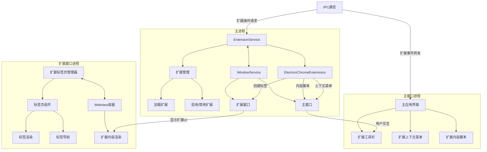
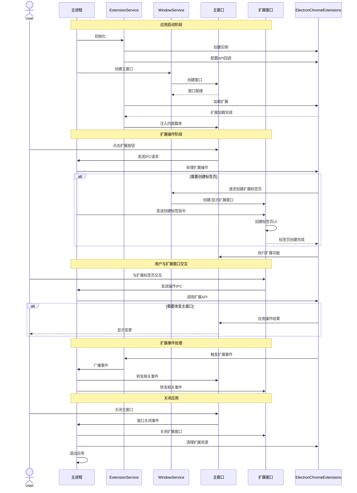

```mermaid
graph TD
    subgraph "主进程"
        A[ExtensionService] --> B[ElectronChromeExtensions]
        A --> C[扩展管理]
        C --> D[加载扩展]
        C --> E[启用/禁用扩展]

        F[WindowService] --> G[主窗口]
        F --> H[扩展窗口]

        A <--> F
    end

    subgraph "扩展窗口进程"
        I[扩展标签页管理器] --> J[标签页组件]
        J --> K[标签渲染]
        J --> L[标签导航]

        M[Webview容器] --> N[扩展内容渲染]

        I <--> M
    end

    subgraph "主窗口进程"
        O[主应用界面] --> P[扩展工具栏]
        O --> Q[扩展上下文菜单]
        O --> R[扩展内容脚本]
    end

    B -- "创建标签" --> H
    B -- "内容脚本" --> G
    B -- "上下文菜单" --> G

    S[IPC通信] -- "扩展事件转发" --> O
    S -- "扩展操作请求" --> A

    G -- "用户交互" --> P
    H -- "显示扩展UI" --> N
```

时序图

```mermaid
sequenceDiagram
    actor User
    participant Main as 主进程
    participant ExtService as ExtensionService
    participant WindowService as WindowService
    participant MainWindow as 主窗口
    participant ExtWindow as 扩展窗口
    participant ChromeExt as ElectronChromeExtensions

    Note over Main,ExtWindow: 应用启动阶段

    Main->>ExtService: 初始化
    ExtService->>ChromeExt: 创建实例
    ExtService->>ChromeExt: 配置API回调

    Main->>WindowService: 创建主窗口
    WindowService->>MainWindow: 创建窗口
    MainWindow-->>WindowService: 窗口就绪

    ExtService->>ChromeExt: 加载扩展
    ChromeExt-->>ExtService: 扩展加载完成
    ExtService->>MainWindow: 注入内容脚本

    Note over Main,ExtWindow: 扩展操作阶段

    User->>MainWindow: 点击扩展按钮
    MainWindow->>Main: 发送IPC请求
    Main->>ChromeExt: 处理扩展操作

    alt 需要创建标签页
        ChromeExt->>WindowService: 请求创建扩展标签页
        WindowService->>ExtWindow: 创建/显示扩展窗口
        Main->>ExtWindow: 发送创建标签指令
        ExtWindow->>ExtWindow: 创建标签页UI
        ExtWindow-->>ChromeExt: 标签页创建完成
    end

    ChromeExt->>MainWindow: 执行扩展功能

    Note over Main,ExtWindow: 用户与扩展窗口交互

    User->>ExtWindow: 与扩展标签页交互
    ExtWindow->>Main: 发送操作IPC
    Main->>ChromeExt: 调用扩展API

    alt 需要改变主窗口
        ChromeExt->>MainWindow: 应用操作结果
        MainWindow-->>User: 显示变更
    end

    Note over Main,ExtWindow: 扩展事件处理

    ChromeExt->>ExtService: 触发扩展事件
    ExtService->>Main: 广播事件
    Main->>MainWindow: 转发相关事件
    Main->>ExtWindow: 转发相关事件

    Note over Main,ExtWindow: 关闭应用

    User->>MainWindow: 关闭主窗口
    MainWindow->>Main: 窗口关闭事件
    Main->>ExtWindow: 关闭扩展窗口
    Main->>ChromeExt: 清理扩展资源
    Main->>Main: 退出应用
```
