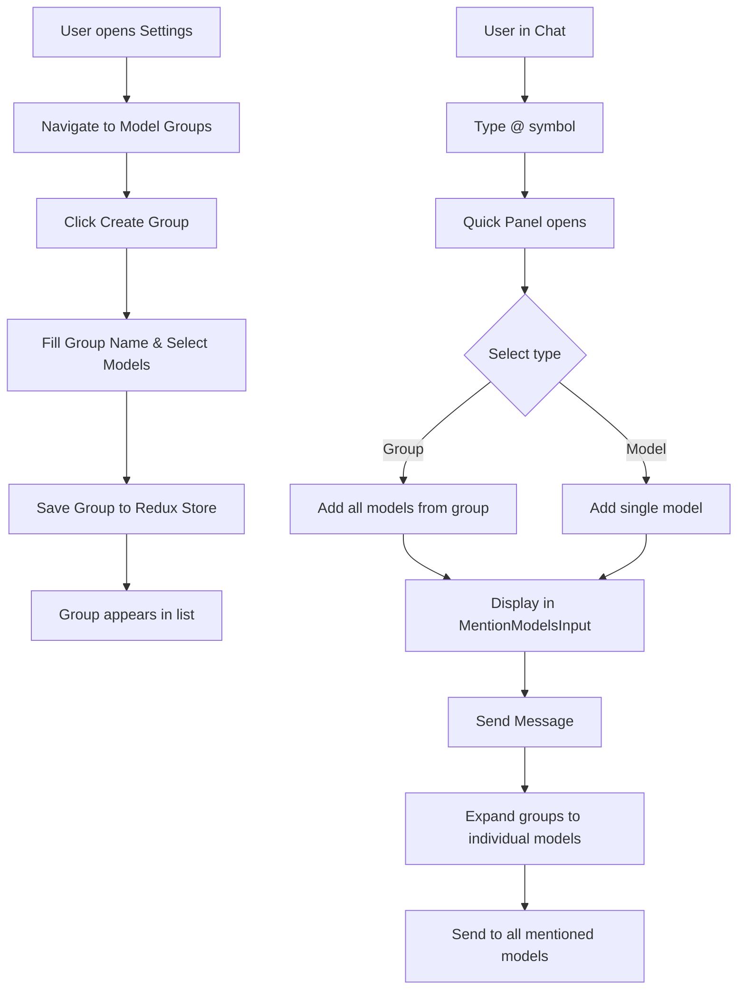

# Model Group Feature - Technical Design Document

## Overview
This document outlines the technical design for the Model Group feature, which allows users to create named groups of models for easier multi-model conversations.

## Feature Requirements

### User Stories
1. As a user, I want to create named model groups in the settings page
2. As a user, I want to @mention a group in chat to automatically mention all models in that group
3. As a user, I want to combine @group with individual @model mentions
4. As a user, I want to manage (add, edit, delete) my model groups

### Functional Requirements
- Users can create multiple model groups with names and descriptions
- Each group contains a list of models (references by provider + model ID)
- When @group is used, it expands to all models in that group
- @group and @model can be used together in the same message
- Model groups are persisted in Redux store (and localStorage via persist)

## Technical Design

### 1. Type Definitions

#### New Types (to be added to `src/renderer/src/types/index.ts`)

```typescript
/**
 * Represents a model group with multiple models
 */
export type ModelGroup = {
  id: string
  name: string
  description?: string
  models: ModelReference[]
  createdAt: string
  updatedAt: string
}

/**
 * Reference to a model within a group
 */
export type ModelReference = {
  modelId: string
  providerId: string
}
```

### 2. Redux Store

#### Store Slice: `src/renderer/src/store/modelGroups.ts`

```typescript
import { createSlice, PayloadAction } from '@reduxjs/toolkit'
import { ModelGroup } from '@renderer/types'
import { uuid } from '@renderer/utils'

export interface ModelGroupsState {
  groups: ModelGroup[]
}

const initialState: ModelGroupsState = {
  groups: []
}

const modelGroupsSlice = createSlice({
  name: 'modelGroups',
  initialState,
  reducers: {
    addModelGroup: (state, action: PayloadAction<Omit<ModelGroup, 'id' | 'createdAt' | 'updatedAt'>>) => {
      const now = new Date().toISOString()
      const newGroup: ModelGroup = {
        ...action.payload,
        id: uuid(),
        createdAt: now,
        updatedAt: now
      }
      state.groups.push(newGroup)
    },
    
    updateModelGroup: (state, action: PayloadAction<ModelGroup>) => {
      const index = state.groups.findIndex(g => g.id === action.payload.id)
      if (index !== -1) {
        state.groups[index] = {
          ...action.payload,
          updatedAt: new Date().toISOString()
        }
      }
    },
    
    removeModelGroup: (state, action: PayloadAction<string>) => {
      state.groups = state.groups.filter(g => g.id !== action.payload)
    },
    
    setModelGroups: (state, action: PayloadAction<ModelGroup[]>) => {
      state.groups = action.payload
    }
  }
})

export const {
  addModelGroup,
  updateModelGroup,
  removeModelGroup,
  setModelGroups
} = modelGroupsSlice.actions

export default modelGroupsSlice.reducer
```

#### Integration with Root Store (`src/renderer/src/store/index.ts`)

Add the new reducer to the root reducer:
```typescript
import modelGroupsReducer from './modelGroups'

const rootReducer = combineReducers({
  // ... existing reducers
  modelGroups: modelGroupsReducer,
  // ...
})
```

### 3. UI Components

#### Settings Page Structure

```
src/renderer/src/pages/settings/ModelGroupSettings/
├── index.tsx                    # Main settings page
├── ModelGroupList.tsx           # List of model groups
├── ModelGroupItem.tsx           # Individual group item
├── CreateModelGroupModal.tsx    # Modal for creating/editing groups
└── ModelGroupSelector.tsx       # Model selector component
```

#### Main Settings Page Component

**File:** `src/renderer/src/pages/settings/ModelGroupSettings/index.tsx`

```typescript
import { FC, useState } from 'react'
import { useTranslation } from 'react-i18next'
import { useAppDispatch, useAppSelector } from '@renderer/store'
import { addModelGroup, updateModelGroup, removeModelGroup } from '@renderer/store/modelGroups'
import { ModelGroup } from '@renderer/types'
import { SettingGroup, SettingTitle, SettingSubtitle } from '..'
import ModelGroupList from './ModelGroupList'
import CreateModelGroupModal from './CreateModelGroupModal'
import { Button } from 'antd'
import { Plus } from 'lucide-react'

const ModelGroupSettings: FC = () => {
  const { t } = useTranslation()
  const dispatch = useAppDispatch()
  const modelGroups = useAppSelector(state => state.modelGroups.groups)
  const [isModalOpen, setIsModalOpen] = useState(false)
  const [editingGroup, setEditingGroup] = useState<ModelGroup | null>(null)

  const handleCreate = () => {
    setEditingGroup(null)
    setIsModalOpen(true)
  }

  const handleEdit = (group: ModelGroup) => {
    setEditingGroup(group)
    setIsModalOpen(true)
  }

  const handleDelete = (groupId: string) => {
    dispatch(removeModelGroup(groupId))
  }

  const handleSave = (group: Omit<ModelGroup, 'id' | 'createdAt' | 'updatedAt'>) => {
    if (editingGroup) {
      dispatch(updateModelGroup({ ...editingGroup, ...group }))
    } else {
      dispatch(addModelGroup(group))
    }
    setIsModalOpen(false)
  }

  return (
    <>
      <SettingTitle>{t('settings.modelGroup.title')}</SettingTitle>
      <SettingSubtitle>{t('settings.modelGroup.subtitle')}</SettingSubtitle>
      
      <SettingGroup>
        <div style={{ marginBottom: 16 }}>
          <Button type="primary" icon={<Plus size={16} />} onClick={handleCreate}>
            {t('settings.modelGroup.create')}
          </Button>
        </div>
        
        <ModelGroupList
          groups={modelGroups}
          onEdit={handleEdit}
          onDelete={handleDelete}
        />
      </SettingGroup>

      <CreateModelGroupModal
        open={isModalOpen}
        group={editingGroup}
        onSave={handleSave}
        onCancel={() => setIsModalOpen(false)}
      />
    </>
  )
}

export default ModelGroupSettings
```

### 4. Input Integration

#### Modify MentionModelsInput Component

**File:** `src/renderer/src/pages/home/Inputbar/MentionModelsInput.tsx`

Add support for displaying group tags:

```typescript
import { ModelGroup } from '@renderer/types'

interface Props {
  selectedModels: Model[]
  selectedGroups?: ModelGroup[]  // NEW
  onRemoveModel: (model: Model) => void
  onRemoveGroup?: (group: ModelGroup) => void  // NEW
}

const MentionModelsInput: FC<Props> = ({ 
  selectedModels, 
  selectedGroups = [],
  onRemoveModel,
  onRemoveGroup
}) => {
  // ... existing code
  
  return (
    <Container>
      <HorizontalScrollContainer dependencies={[selectedModels, selectedGroups]} expandable>
        {/* Render groups first */}
        {selectedGroups.map((group) => (
          <CustomTag
            icon={<i className="iconfont icon-folder" />}
            color="#52c41a"
            key={group.id}
            closable
            onClose={() => onRemoveGroup?.(group)}>
            @{group.name}
          </CustomTag>
        ))}
        
        {/* Then render individual models */}
        {selectedModels.map((model) => (
          <CustomTag
            icon={<i className="iconfont icon-at" />}
            color="#1677ff"
            key={getModelUniqId(model)}
            closable
            onClose={() => onRemoveModel(model)}>
            {model.name} ({getProviderName(model)})
          </CustomTag>
        ))}
      </HorizontalScrollContainer>
    </Container>
  )
}
```

#### Update InputBar Component

**File:** `src/renderer/src/pages/home/Inputbar/InputBar.tsx`

Add state for selected groups and expand them when sending:

```typescript
const [mentionedGroups, setMentionedGroups] = useState<ModelGroup[]>([])

// In sendMessage function, expand groups to models
const sendMessage = useCallback(async () => {
  // ... existing code
  
  // Expand groups to models
  const groupModels = mentionedGroups.flatMap(group => 
    group.models.map(ref => getModel(ref.modelId, ref.providerId)).filter(Boolean)
  )
  
  // Combine with individually mentioned models
  const allMentionedModels = [...mentionedModels, ...groupModels]
  
  if (allMentionedModels.length > 0) {
    baseUserMessage.mentions = allMentionedModels
  }
  
  // ... rest of code
}, [mentionedModels, mentionedGroups, ...])
```

### 5. Quick Panel Integration

#### Update InputbarTools Component

**File:** `src/renderer/src/pages/home/Inputbar/InputbarTools.tsx`

Modify the mention panel to show both models and groups:

```typescript
const openMentionModelsPanel = (triggerInfo: TriggerInfo) => {
  const providers = useAllProviders()
  const modelGroups = useAppSelector(state => state.modelGroups.groups)
  
  // Create list items for groups
  const groupItems = modelGroups.map(group => ({
    id: `group-${group.id}`,
    label: `@${group.name}`,
    description: group.description,
    icon: <i className="iconfont icon-folder" />,
    onSelect: () => {
      setMentionedGroups(prev => [...prev, group])
      // Remove @group from text
      // ... text manipulation logic
    }
  }))
  
  // Create list items for models
  const modelItems = providers.flatMap(provider => 
    provider.models.map(model => ({
      id: getModelUniqId(model),
      label: model.name,
      description: provider.name,
      onSelect: () => {
        setMentionedModels(prev => [...prev, model])
        // Remove @model from text
      }
    }))
  )
  
  quickPanel.open({
    title: t('chat.mention.title'),
    list: [
      { type: 'group', title: 'Groups', items: groupItems },
      { type: 'group', title: 'Models', items: modelItems }
    ],
    // ... rest of config
  })
}
```

### 6. Route Configuration

#### Update SettingsPage

**File:** `src/renderer/src/pages/settings/SettingsPage.tsx`

Add the new route after Model Provider:

```typescript
import ModelGroupSettings from './ModelGroupSettings'

// In the menu items
<MenuItemLink to="/settings/model-group">
  <MenuItem className={isRoute('/settings/model-group')}>
    <Package size={18} />
    {t('settings.modelGroup.title')}
  </MenuItem>
</MenuItemLink>

// In the Routes
<Route path="model-group" element={<ModelGroupSettings />} />
```

### 7. i18n Translations

Add translations for the new feature:

**File:** `src/renderer/src/i18n/locales/en-US.json`

```json
{
  "settings": {
    "modelGroup": {
      "title": "Model Groups",
      "subtitle": "Manage model groups for easier multi-model conversations",
      "create": "Create Group",
      "edit": "Edit Group",
      "delete": "Delete Group",
      "name": "Group Name",
      "description": "Description",
      "models": "Models",
      "selectModels": "Select Models",
      "confirmDelete": "Are you sure you want to delete this model group?",
      "namePlaceholder": "Enter group name",
      "descriptionPlaceholder": "Enter description (optional)",
      "noGroups": "No model groups created yet",
      "createFirst": "Create your first model group to get started"
    }
  },
  "chat": {
    "mention": {
      "title": "Mention Models or Groups",
      "groups": "Groups",
      "models": "Models"
    }
  }
}
```

**File:** `src/renderer/src/i18n/locales/zh-CN.json`

```json
{
  "settings": {
    "modelGroup": {
      "title": "模型分组",
      "subtitle": "管理模型分组，方便进行多模型对话",
      "create": "创建分组",
      "edit": "编辑分组",
      "delete": "删除分组",
      "name": "分组名称",
      "description": "描述",
      "models": "模型",
      "selectModels": "选择模型",
      "confirmDelete": "确定要删除这个模型分组吗？",
      "namePlaceholder": "请输入分组名称",
      "descriptionPlaceholder": "请输入描述（可选）",
      "noGroups": "还没有创建任何模型分组",
      "createFirst": "创建您的第一个模型分组开始使用"
    }
  },
  "chat": {
    "mention": {
      "title": "提及模型或分组",
      "groups": "分组",
      "models": "模型"
    }
  }
}
```

## Implementation Flow Diagram



## Data Flow

```
Settings Page Flow:
User Input → CreateModelGroupModal → Redux Action → Store Update → UI Re-render

Chat Input Flow:
@ Symbol → Quick Panel → Group Selection → State Update → Display Tags

Send Message Flow:
Send Button → Expand Groups → Combine with Individual Models → Create Message → Dispatch
```

## Migration & Compatibility

### Backward Compatibility
- Existing code continues to work as-is
- Model groups are a new optional feature
- No breaking changes to existing message format

### Data Persistence
- Model groups are stored in Redux store
- Persisted to localStorage via redux-persist
- No database changes required (groups stored in app state)

## Testing Checklist

- [ ] Create a model group with multiple models
- [ ] Edit an existing model group
- [ ] Delete a model group
- [ ] @mention a group in chat
- [ ] Combine @group with @individual models
- [ ] Verify all models from group receive the message
- [ ] Test group with models from different providers
- [ ] Test empty group handling
- [ ] Test group with unavailable models
- [ ] Verify persistence across app restarts

## Future Enhancements

1. **Group Templates**: Provide pre-defined useful groups
2. **Smart Groups**: Auto-create groups based on model capabilities
3. **Group Sharing**: Export/import group configurations
4. **Group Statistics**: Show usage stats for each group
5. **Nested Groups**: Allow groups within groups (if needed)

## Implementation Priority

1. **High Priority** (Core functionality):
   - Type definitions
   - Redux store slice
   - Basic settings UI
   - Input integration
   - i18n translations

2. **Medium Priority** (Enhanced UX):
   - Quick panel integration
   - Validation & error handling
   - Empty states & loading states

3. **Low Priority** (Nice to have):
   - Group templates
   - Advanced UI features
   - Analytics

## Estimated Effort

- Type definitions & Redux store: 2 hours
- Settings UI components: 4 hours
- Input integration & Quick Panel: 3 hours
- i18n & Route setup: 1 hour
- Testing & refinement: 2 hours

**Total: ~12 hours**

## Notes

- The implementation follows existing patterns in the codebase
- Model groups expand at send time, not at selection time
- Groups don't affect the message storage format
- The feature is purely a UI convenience layer