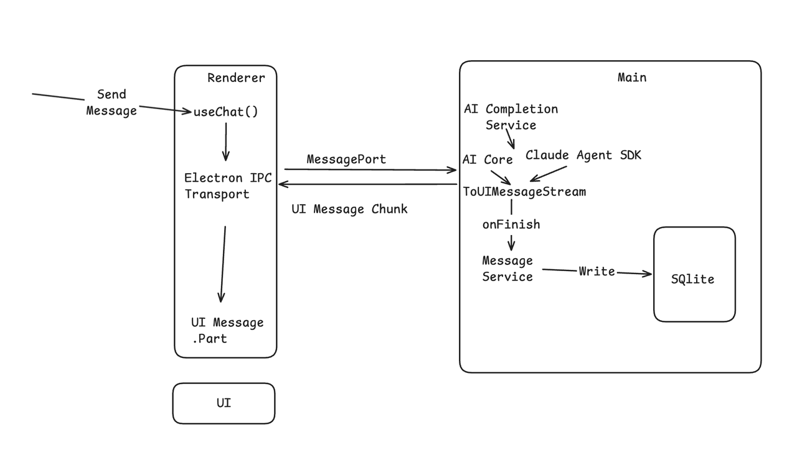

# aiCore 后端迁移完整方案（细化版）

## Cherry Studio 现在的调用链路


### 问题

| 问题 | 影响 |
|------|------|
| 安全性 | API Key、OAuth Token 暴露在 Renderer 进程，可通过 DevTools 获取 |
| 稳定性 | AI 长连接流式请求阻塞 Renderer 主线程，影响 UI 响应性 |
| 可维护性 | src/renderer/src/aiCore/ 包含 50+ 文件，深度耦合 Redux Store、window.api、i18n、toast 等浏览器 API |
| 扩展性 | 无法为外部客户端（Web、Mobile、CLI、API、Plugin）复用 AI 调用能力 |
| 架构债务 | 自建的 30+ 种 ChunkType + BlockManager + AiSdkToChunkAdapter 流式管线，维护成本高 |

## Cherry Studio V2 的调用链路（AI 统一）




## 架构对比

| 维度 | v2 当前 | 目标 (本方案) | 未来 (Utility Process) |
|------|---------|---------------|----------------------|
| AI 执行路径 | 2 条 (Renderer Chat + Main Agent) | 1 条 (Main AiCompletionService) | 1 条 (Utility AiCompletionService) |
| AI 执行进程 | Renderer (Chat) + Main (Agent) | **Main Process** | Utility Process (独立 V8) |
| Main 职责 | 数据层 + Agent SSE + 窗口管理 | 数据层 + 窗口管理 + **AI 执行** | 数据层 + 窗口管理 + Utility 生命周期 |
| 流式协议 | ChunkType (30+) + SSE TextStreamPart | 统一 UIMessageChunk | 统一 UIMessageChunk |
| 流式通道 | 无 (Renderer 直出 HTTP) + SSE | IPC (ipcMain ↔ ipcRenderer) | MessagePort (Renderer ↔ Utility 直连) |
| 渲染管线 | BlockManager + AgentMessageDataSource | 统一 useChat() + UIMessage.parts | 统一 useChat() + UIMessage.parts |
| 持久化 | IndexedDB (Chat) + SQLite (Agent) | 统一 SQLite (v2 DataApi) | 统一 SQLite (v2 DataApi) |
| Renderer AI 代码 | 50+ 文件 aiCore + AgentApiClient | useChat hook + Transport (2 文件) | useChat hook + Transport (2 文件) |
| Provider / Key | Renderer 内存 | Main 进程内存 | Utility 进程内存 (最高隔离) |

### 渐进式策略

**Phase 1-3: 先放 Main 进程**。当前性能足够支撑 3+ 并发 stream，优先解决架构问题（消除 Renderer 耦合、统一流式协议、接入 useChat）。

**未来: 按需迁移到 Utility Process**。如果出现 Main 事件循环阻塞（多窗口并发、大文件编码），再抽到独立进程。迁移成本低——aiCore 中的纯函数通过参数接收数据，不直接 import service，只需把调用方的数据来源从直接 import 改为 RPC。

**架构预留原则**：aiCore 迁移到 Main 时，不直接 import renderer 的东西（Redux store、window.api）。纯函数通过参数接收数据，AiCompletionService 作为调用方负责从 service 获取数据并传参。这样将来挪到 Utility Process 只需换数据来源，不改逻辑。

## 迁移后文件组织总览

所有 AI 相关代码统一放在 `src/main/ai/` 下。不拆分 `services/` 和 `aiCore/` 两个目录——AiService 是 lifecycle 服务但与 aiCore 逻辑紧密耦合，放在一起更易维护。

```
src/
├── main/
│   ├── ai/                                # ← AI 执行层（所有 AI 相关代码）
│   │   ├── AiService.ts                   #   lifecycle 服务: IPC 桥 + 流管理
│   │   ├── AiCompletionService.ts         #   统一 AI 执行入口 (chat + agent)
│   │   ├── agentLoop.ts                   #   双循环纯函数: 外层 while(true) + 内层 ToolLoopAgent
│   │   ├── compileContext.ts              #   上下文编译器: 从 DB 检索 + 组装最优 context window
│   │   ├── PendingMessageQueue.ts         #   Steering 消息队列
│   │   ├── types/
│   │   │   ├── index.ts                   #   类型 re-export
│   │   │   ├── merged.ts                  #   Provider 类型定义
│   │   │   └── middlewareConfig.ts        #   Middleware 配置类型
│   │   ├── plugins/                       #   AI SDK 插件
│   │   │   ├── PluginBuilder.ts           #     纯函数版 plugin 构建 (具体参数传入)
│   │   │   ├── anthropicCachePlugin.ts
│   │   │   ├── pdfCompatibilityPlugin.ts
│   │   │   ├── searchOrchestrationPlugin.ts
│   │   │   ├── telemetryPlugin.ts
│   │   │   ├── noThinkPlugin.ts
│   │   │   └── ...                        #     (其余纯逻辑插件)
│   │   ├── prepareParams/                 #   参数构建
│   │   │   ├── parameterBuilder.ts        #     接收具体参数版
│   │   │   ├── messageConverter.ts
│   │   │   ├── fileProcessor.ts           #     Node.js fs 直接读文件
│   │   │   ├── modelParameters.ts
│   │   │   ├── modelCapabilities.ts
│   │   │   └── header.ts
│   │   ├── provider/                      #   Provider 配置
│   │   │   ├── providerConfig.ts          #     直接调 service (不再走 window.api)
│   │   │   ├── factory.ts
│   │   │   ├── extensions/
│   │   │   │   └── index.ts              #     15 个 provider extensions
│   │   │   ├── custom/
│   │   │   │   ├── newapi-provider.ts
│   │   │   │   └── aihubmix-provider.ts
│   │   │   └── constants.ts
│   │   ├── tools/                         #   工具注册 + 内置工具
│   │   │   ├── ToolRegistry.ts            #     统一工具注册表 (MCP + 内置)
│   │   │   ├── WebSearchTool.ts           #     直接 import SearchService
│   │   │   ├── KnowledgeSearchTool.ts     #     直接 import KnowledgeService
│   │   │   └── MemorySearchTool.ts
│   │   ├── trace/
│   │   │   └── AiSdkSpanAdapter.ts
│   │   ├── services/
│   │   │   └── schemas.ts                #     API response Zod schemas
│   │   ├── utils/
│   │   │   ├── options.ts
│   │   │   ├── reasoning.ts
│   │   │   ├── websearch.ts
│   │   │   ├── image.ts
│   │   │   └── mcp.ts                    #     直接 import MCPService
│   │   └── __tests__/
│   │       ├── AiService.test.ts
│   │       └── AiCompletionService.test.ts
│   │
│   └── core/application/
│       └── serviceRegistry.ts             #   修改: 注册 AiService
│
├── renderer/src/
│   ├── transport/                          # ← 新增: 2 个文件替代 50+ aiCore 文件
│   │   └── IpcChatTransport.ts            #   ChatTransport over IPC
│   ├── hooks/
│   │   └── useAiChat.ts                   # ← 新增: useChat + Transport + DataApi
│   ├── pages/home/
│   │   ├── Chat.tsx                       #   修改: 接入 useAiChat
│   │   └── Messages/
│   │       ├── Message.tsx                #   修改: parts 替代 blocks
│   │       └── ...
│   ├── aiCore/                            # ← 删除: 整个目录 (50+ 文件)
│   ├── services/
│   │   ├── messageStreaming/              # ← 删除: BlockManager, StreamingService, callbacks/
│   │   └── ApiService.ts                 #   修改: 移除 AI 调用相关方法
│   └── types/
│       └── chunk.ts                       # ← 删除: ChunkType 枚举
│
├── preload/
│   ├── index.ts                           #   修改: 添加 ai IPC handlers
│   └── preload.d.ts                       #   修改: 类型声明
│
└── packages/
    ├── shared/
    │   └── ai-transport/                  # ← 新增
    │       ├── schemas.ts                 #   Zod schema (请求/响应类型)
    │       ├── dataUIParts.ts             #   自定义 DataUIPart schema
    │       └── index.ts
    └── aiCore/                            #   不变: @cherrystudio/ai-core 包
        └── src/                           #   Main 进程直接 import
```

### 设计原则

- **不引入 AiRuntime 中间层**：AiCompletionService 直接调用 `packages/aiCore` 的 `createAgent()`。aiCore 已经封装了 provider 解析 + plugin pipeline + model resolution，再包一层只是透传没有价值。
- **不使用 BuildContext**：AiCompletionService 直接从各 service 获取数据，传具体参数给具体函数。不引入中间"context bag"对象——每个函数只接收它需要的参数。
- **AiCompletionService 是所有 AI 调用的唯一入口**：不仅 chat streaming（`streamText`），还包括 topic 命名、笔记摘要、通用文本生成（`generateText`）、embedding 维度检测（`getEmbeddingDimensions`）、图片生成（`generateImage`）、模型列表（`listModels`）、API 验证（`checkModel`）。所有方法共享 provider 解析（`resolveFromRedux` → `buildAgentParams`）+ plugin pipeline。Renderer ApiService 中的 AI 调用逐步迁移为 `window.api.ai.*` IPC 调用。
- **统一使用 ToolLoopAgent，不区分 chat/agent 模式**：Chat 和 Agent 的唯一区别是 tools 的配置方式——Chat 由用户手动配置 tools（MCP tools、web search 等），Agent 自主决策 tools。统一走 `createAgent()` → `agent.stream()`，一条代码路径，无分支。
- **双循环架构（借鉴 Hermes / pi-mono）**：内层 = AI SDK ToolLoopAgent（LLM → tool call → execute → repeat）；外层 = `runAgentLoop()` 的 `while(true)`。内层退出条件是"LLM 不再调用 tool"，外层退出条件是"没有更多工作"（pending messages 为空、无 follow-up）。`prepareStep` 处理内层步间的 steering，外层兜住内层结束后到达的 steering。
- **通过 ToolLoopAgent 内置钩子实现内层控制**：`prepareStep`（动态调整 tools/model/messages、消费 steering 消息）、`onStepFinish`（进度推送）、`onFinish`（token 汇总）、`stopWhen`（停止条件）。
- **ToolRegistry + AI SDK 原生 `needsApproval` 实现工具权限**：不自建权限审批逻辑。所有 tools（MCP + 内置）通过 `ToolRegistry` 注册，每个 tool 声明 `needsApproval`（boolean 或 async function）。AI SDK 自动管理 `approval-requested` → `approval-responded` → `output-available` / `output-denied` 全流程，Renderer 通过 `useChat` 的 `addToolApprovalResponse()` 处理审批 UI。
- **ToolRegistry 是纯容器，不主动发现 tool**：谁创建 tool，谁负责注册。内置 tools 由 `AiService.onStart()` 注册，MCP tools 由 `MCPService` 在 server 连接/断开时 register/unregister。`AiCompletionService` 通过构造函数注入 registry，只调用 `resolve()`。
- **ToolRegistry 借鉴 Hermes `check_fn` 模式**：每个 tool 可选声明 `checkAvailable(): boolean`（API key 缺失？服务未启动？）。`resolve()` 时自动过滤不可用的 tool，LLM 根本看不到——无需错误处理。
- **无损上下文管理（检索 + 分层缓存）**：context window 不是 memory，是 viewport。所有消息持久化到 SQLite（single source of truth），context window 从 DB 编译而非内存中累积。Messages 数组分三层：① System prompt（session 级不变）② Retrieved context（外层循环边界更新，内层多步间稳定 → prompt cache hit）③ Working memory（当前轮次 raw messages，每步追加增长）。无 summary、无截断——用语义检索替代有损压缩，从全量历史中按 `relevance × recency` 加权检索最相关的消息填充 budget。内层 `prepareStep` 只管尾部（steering + `pruneMessages()` 裁剪旧 tool calls），不动前缀 → 保护 prompt cache。
- **完成边界持久化，非流式写 DB**：v2 架构下 stream 是 IPC 传输通道（Renderer 实时渲染），不是存储。不逐 chunk 写 DB——在完成边界一次性持久化完整消息：`onFinish`（内层结束）写 assistant message + usage，外层边界写 steering messages。持久化后 Main 发送 `Ai_MessagesPersisted` IPC 事件，Renderer 通过已有的 `useInvalidateCache()` (SWR) 刷新 `/messages` 缓存。消除了 partial message、chunk 拼接、恢复逻辑。
- **Pending Messages (Steering) 双层保障**：Renderer 通过 IPC 写入 `PendingMessageQueue`。**内层**：`prepareStep` 每步执行前 drain 队列并追加到 messages。**外层**：内层 ToolLoopAgent 退出后，`runAgentLoop` 再次 drain——如果有消息，将 assistant 响应 + pending messages 追加到 context，重启内层循环。两层保证 steering 消息不丢失。
- **迁移期间冻结 renderer/aiCore 的修改**：纯逻辑文件从 renderer 复制到 main 后，所有 AI 逻辑变更只在 `src/main/ai/` 上进行。Renderer 版保持不动直到 Phase 3 删除。这避免了两份代码 drift 的问题。
- **parameterBuilder 先保留后拆分**：Phase 1-4 保持 `buildStreamTextParams()` 大函数不变（逻辑正确且经过验证），Phase 5 再逐步拆成 aiCore plugins。避免同时改架构和改位置的风险。

### 文件变动统计

| 操作 | 数量 | 说明 |
|------|------|------|
| **新建/重写** | ~4 个 | AiService (已存在,更新)、AiCompletionService (已存在,重写)、IpcChatTransport、useAiChat、shared schemas |
| **删除** (main 侧) | 4 个 | AiRuntime.ts、prepareParams/stubs.ts、utils/stubs.ts、prepareParams/messageUtilStubs.ts |
| **迁移** (renderer → main) | ~30 个 | 纯逻辑直接复制，耦合文件适配（直接 import service 替代 window.api）|
| **修改** | ~8 个 | Chat.tsx、Message.tsx、preload、serviceRegistry |
| **删除** | ~55 个 | renderer/aiCore/、messageStreaming/、chunk.ts、Agent 旧代码 |
| **净变化** | **-50 个** | Renderer 侧从 50+ 文件缩减到 2 个文件 |

---

## 技术方案

AI SDK v6 `ChatTransport` 接口只要求 2 个方法，返回 `ReadableStream<UIMessageChunk>`。
内置的 3 个实现（Default/Text/Direct）均不支持 Electron IPC，但接口开放可自定义。

### Renderer ↔ Main 通信

```
Renderer                           Main (src/main/ai/)

useChat()                          AiService (lifecycle, IPC 桥)
  → IpcChatTransport                 │
    → ipcRenderer.invoke()    ──→    ├→ AiCompletionService
    ← ipcRenderer.on('chunk') ←──    │    └→ createAgent() → agent.stream() → toUIMessageStream()
                                     │       (chat 和 agent 统一路径，区别仅在 tools 配置方式)
                                     │
                                     └→ packages/aiCore (provider 解析 + plugin pipeline)
```

- Renderer 通过 `ipcRenderer.invoke` 发起 AI 请求
- Main 统一走 `createAgent()` → `agent.stream()` 执行 AI 调用（chat 和 agent 同一路径，区别仅在 tools 配置方式：chat 用户手动配、agent 自主决策），通过 `webContents.send` 逐 chunk 推送回 Renderer
- `IpcChatTransport` 把 IPC 消息转为 `ReadableStream<UIMessageChunk>` 给 `useChat` 消费
- AiCompletionService 在 Main 进程直接 import 所有 service（MCPService、KnowledgeService、PreferenceService 等），无需 RPC
- **不存在 AiRuntime 中间层**——AiCompletionService 直接调用 `packages/aiCore` 的 `createAgent()` API

### 未来 Utility Process 迁移路径

如果出现 Main 事件循环阻塞（多窗口并发、大文件编码），可按以下路径迁移：

| 场景 | Main 中的影响 | 迁移到 Utility Process 后 |
|------|--------------|--------------------------|
| 长回复 30s+ stream | 事件循环被占用，窗口操作卡顿 | Main 完全空闲 |
| 多窗口并发 3-5 个 | stream 竞争单线程 | 独立 V8，不竞争 |
| 大文件 base64 10MB | Main 完全阻塞 | 编码在独立进程 |
| Utility 崩溃 | N/A | 不影响 Main/Renderer |

**迁移成本低**：aiCore 中的纯函数通过参数接收数据，不直接依赖 service。只需将 AiCompletionService 的数据来源从直接 import service 改为 oRPC 调用。通信改为 MessagePort 直连。

---

## RPC 选型: oRPC（Utility Process 迁移时启用）

当前阶段 aiCore 在 Main 进程，直接 import service，不需要 RPC。但当未来迁移到 Utility Process 时，跨进程通信需要 RPC 框架：

| 调用方向 | 场景 | 数量 |
|----------|------|------|
| Renderer → Utility | AI 流式请求、abort | 高频 |
| Main → Utility | Agent AI 调用、ApiServer 转发 | 中频 |
| Utility → Main | 获取配置/API key、MCP 工具调用、知识库搜索、telemetry 上报 | 高频 |

以下为预选方案，在迁移到 Utility Process 时启用。

### 候选方案对比

| | **oRPC** | comlink | birpc | 手写 MainBridge |
|---|---------|---------|-------|----------------|
| MessagePort 适配 | **官方 adapter** (`@orpc/server/message-port`) | 需写 adapter (~10 行) | 手写 | 手写 (~100 行) |
| **流式 (async generator)** | **原生支持** (Event Iterator) | 不支持 | 不支持 | 需手写 |
| Schema 验证 | Zod/Valibot/ArkType | 无 | 无 | 手写 |
| 端到端类型安全 | **完整** (contract → client 自动推导) | Proxy 推断 | 泛型 | 手写 interface |
| 中间件 | 有 (logging, tracing, auth) | 无 | 无 | 手写 |
| Electron 支持 | **官方 Electron adapter** | 无 | 无 | N/A |
| **AI SDK 集成** | **`@orpc/ai-sdk`** (Tool 桥接) | 无 | 无 | 无 |
| 双向调用 | 单向 (client→server) | 单向 | **双向** | 双向 |
| 大小 | ~32KB | ~1KB | ~2KB | 0 |

### 选择 oRPC 的决定性理由

#### 1. 原生流式支持 — AI 流式回复的核心需求

comlink 和 birpc 都**不支持流式传输**。AI 模型回复是 async generator / ReadableStream，手写流式 RPC 需要处理背压、取消、错误传播、断线恢复等。oRPC 用 Event Iterator 原生解决：

```typescript
// UtilityProcess 侧 — 定义流式 AI procedure
const streamText = os
  .input(aiStreamRequestSchema)
  .output(eventIterator(uiMessageChunkSchema))
  .handler(async function* ({ input }) {
    const executor = createExecutor(input.providerId, config, plugins)
    const result = await executor.streamText(params)
    for await (const part of result.fullStream) {
      yield toUIMessageChunk(part)
    }
  })
```

```typescript
// Renderer 侧 — 消费流
for await (const chunk of client.ai.streamText({ messages, providerId: 'openai' })) {
  // chunk 已通过 Zod schema 验证，完全类型安全
}
```

#### 2. Electron MessagePort 官方适配

oRPC 的 `SupportedMessagePort` 类型已经覆盖了 Electron 的三种 port 接口：

```typescript
// oRPC 内部自动检测 port 类型
interface MessagePortMainLike {
  on: (event: string, callback: (event?: { data: any }) => void) => void  // Electron MessagePortMain
  postMessage: (data: any, transfer?: any[]) => void
}
```

- 标准 `MessagePort` (Renderer 侧) — `addEventListener`
- Electron `MessagePortMain` (Main 侧) — `.on()`
- 都无需写 adapter，oRPC 自动识别

#### 3. `@orpc/ai-sdk` — MCP 动态工具桥接

Cherry Studio 的工具不是固定的 3 个——用户可以安装任意数量的 MCP server，每个 server 暴露多个 tool。工具数量是动态的、不可预知的。

`@orpc/ai-sdk` 提供 `createTool`，把 oRPC procedure 直接转为 AI SDK `Tool`。核心价值在于 **MCP 工具的动态批量生成**：

```typescript
// Utility Process 侧 — 动态生成 AI SDK Tools
import { createTool } from '@orpc/ai-sdk'

// 1. 通过 RPC 从 Main 的 MCPService 获取工具列表
const mcpTools = await mainClient.mcp.listTools({ serverId })

// 2. 每个 MCP tool → oRPC procedure → AI SDK Tool（一行搞定）
const aiSdkTools = Object.fromEntries(
  mcpTools.map(tool => [
    tool.name,
    createTool(
      os
        .input(tool.inputSchema)   // MCP tool 的 JSON Schema 直接传入
        .handler(async ({ input }) => {
          // 执行时通过 RPC 回调 Main 的 MCPService
          return await mainClient.mcp.callTool({
            serverId,
            toolName: tool.name,
            args: input
          })
        })
    )
  ])
)

// 3. 内置工具也一样
const builtinTools = {
  webSearch: createTool(webSearchProcedure),
  knowledge: createTool(knowledgeSearchProcedure),
  memory: createTool(memorySearchProcedure),
}

// 4. 合并后传给 streamText
await executor.streamText({
  tools: { ...builtinTools, ...aiSdkTools },
  ...params
})
```

**不用 `createTool` 的话**，每个 MCP 工具都要手动写 AI SDK `tool()` 调用，重复定义 schema 和 execute。MCP 工具数量不固定（10 个 server × 5 个 tool = 50 个工具很常见），手写不现实。

`createTool` 的另一个好处是 **schema 验证自动生效**——MCP tool 的 `inputSchema` 传入后，oRPC + AI SDK 在模型调用工具时自动验证参数合法性，防止模型产生非法参数导致工具执行失败。

#### 4. Schema 验证 + 端到端类型安全

所有跨进程调用在边界自动验证，防止序列化后类型丢失：

```typescript
const aiRouter = {
  streamText: os
    .input(z.object({
      messages: z.array(uiMessageSchema),
      providerId: z.string(),
      modelId: z.string(),
      assistantConfig: assistantConfigSchema,
    }))
    .output(eventIterator(uiMessageChunkSchema))
    .handler(async function* ({ input }) { ... }),

  getPreference: os
    .input(z.object({ key: z.string() }))
    .output(z.any())
    .handler(async ({ input }) => { ... }),
}

// client 端自动推导类型，重构 procedure 签名时编译器报错
const client = createORPCClient<typeof aiRouter>(link)
```

#### 5. 中间件 + `@orpc/otel` — 零配置 tracing

`@orpc/otel` 一行代码启用，自动为每个 oRPC procedure 调用生成 span 层级，无需手写中间件：

```typescript
import { registerInstrumentations } from '@opentelemetry/instrumentation'
import { ORPCInstrumentation } from '@orpc/otel'

// 一行启用 — 所有 procedure 自动带 tracing
registerInstrumentations({ instrumentations: [new ORPCInstrumentation()] })
```

自动生成的 span 层级：
```
call_procedure (procedure.path = ['ai', 'streamText'])
  ├── validate_input
  ├── handler
  │   └── consume_event_iterator_output (流式 yield/complete 事件追踪)
  └── validate_output
```

**与 `NodeTraceService` 的关系**：`@orpc/otel` 替代的是手动为 RPC 调用打 span 的代码，但 OTel SDK 初始化（`NodeTracer.init`）、`CacheBatchSpanProcessor`、Trace 窗口管理仍由 `NodeTraceService` 负责。迁移后可删除 `NodeTraceService.patchIpcMainHandle()`（IPC context 传播不再需要，oRPC 内部处理）。

### 架构中的 oRPC 使用位置

```
Renderer                    Main                         UtilityProcess
                                                         ┌──────────────┐
                        fork() ──────────→ parentPort ──→ │ oRPC Server  │
                        oRPC Client                       │ (RPCHandler) │
                        (RPCLink via                      │              │
                         child.postMessage)               │ aiRouter:    │
                                                         │  streamText  │
Window₁ ──portA₁──→ oRPC Client ──────→ portA₁ ────────→│  generateText│
                    (RPCLink via                          │  embed       │
                     MessagePort)                        │              │
                                                         │ toolRouter:  │
                                                         │  webSearch   │
                                                         │  knowledge   │
                                                         │  memory      │
                                                         └──────────────┘
```

| 位置 | oRPC 角色 | 包 |
|------|----------|-----|
| UtilityProcess | **Server** (定义 router + handler) | `@orpc/server`, `@orpc/server/message-port`, `@orpc/otel` |
| Main | **Client** (通过 parentPort 调用) + **Server** (暴露 service) | `@orpc/client`, `@orpc/client/message-port`, `@orpc/server/message-port` |
| Renderer | **Client** (通过 MessagePort 调用) | `@orpc/client`, `@orpc/client/message-port` |
| UtilityProcess 内部 | **Tool 桥接** (procedure → AI SDK Tool) | `@orpc/ai-sdk` |

### 单向性的处理

oRPC 是单向的（client → server），Utility Process 无法主动调 Main。对于反向通信（配置推送、telemetry 上报）：

**方案**: 在 Main 侧也起一个 oRPC Server，Utility Process 作为 Client 调用

```typescript
// Main 侧 — 也是 oRPC Server
const mainRouter = {
  preference: { get: os.input(...).handler(async ({ input }) => preferenceService.get(input.key)) },
  mcp: { callTool: os.input(...).handler(async ({ input }) => mcpService.callTool(...)) },
  knowledge: { search: os.input(...).handler(async ({ input }) => knowledgeService.search(...)) },
  telemetry: { exportSpans: os.input(...).handler(async ({ input }) => nodeTraceService.export(...)) },
}

// Main: 在 parentPort 上挂载 server
const mainHandler = new RPCHandler(mainRouter)
mainHandler.upgrade(childPortAdapter)

// Utility Process: 用 oRPC Client 调 Main
const mainClient = createORPCClient<typeof mainRouter>(new RPCLink({ port: parentPortAdapter }))
const apiKey = await mainClient.preference.get({ key: 'openai.apiKey' })
```

这样双向通信都走 oRPC，**不需要手写任何 RPC 代码**。parentPort 上同时挂两个 oRPC 实例（Main Server + Utility Server），通过消息格式自动路由。

---

## Cherry Studio MessageBlock vs AI SDK UIMessage.parts 逐项映射

| Cherry Studio Block | AI SDK UIPart | 覆盖度 | 差异 |
|---------------------|---------------|--------|------|
| MainTextMessageBlock | TextUIPart { type: 'text', text, state } | 完全 | knowledgeBaseIds 放 metadata |
| ThinkingMessageBlock | ReasoningUIPart { type: 'reasoning', text, state, providerMetadata } | 完全 | thinking_millsec 放 providerMetadata |
| ImageMessageBlock (URL) | FileUIPart { type: 'file', mediaType: 'image/*', url } | 基本 | 见下方差异分析 |
| FileMessageBlock | FileUIPart { type: 'file', mediaType, url, filename } | 基本 | 见下方差异分析 |
| ToolMessageBlock | ToolUIPart { type: 'tool-{name}', toolCallId, state, input, output } | 基本 | 状态模型不同，见下方 |
| ErrorMessageBlock | DataUIPart { type: 'data-error', data } | 完全 | 自定义 DataUIPart，持久化在消息内 |

### 不能完全处理（需自定义 DataUIPart）

| Cherry Studio Block | AI SDK 最接近的 | 缺口 | 建议方案 |
|---------------------|-----------------|------|----------|
| CitationMessageBlock | SourceUrlUIPart | SourceUrl 只有 url + title，无法承载完整的 WebSearchResponse / KnowledgeReference[] / MemoryItem[] | DataUIPart: data-citation |
| TranslationMessageBlock | 无对应 | AI SDK 无翻译概念 | DataUIPart: data-translation |
| CodeMessageBlock | 无对应 (text 里的 markdown code block) | AI SDK 没有独立的 code part | DataUIPart: data-code 或合并到 TextUIPart 的 markdown |
| VideoMessageBlock | 无对应 | AI SDK 无 video part | DataUIPart: data-video |
| CompactMessageBlock | 无对应 | /compact 命令特有 | DataUIPart: data-compact |
| ErrorMessageBlock | 无对应 | `UIMessage` 无 status/error 字段，`chat.error` 不持久化 | DataUIPart: data-error |
| PlaceholderMessageBlock | 无对应 | 占位符 | 不需要迁移 |

---

## MessageBlock → UIMessage.parts 数据迁移方案

### 数据库现状

数据存储在 `message.data` 列（JSON），结构为 `{ blocks: MessageDataBlock[] }`。

**现有数据量统计**（来自 `cherrystudio.sqlite`）:

| BlockType | 数量 | 迁移目标 |
|-----------|------|----------|
| main_text | 14425 | TextUIPart |
| thinking | 1373 | ReasoningUIPart |
| tool | 605 | ToolUIPart |
| image | 230 | FileUIPart |
| error | 183 | DataUIPart: data-error |
| translation | 68 | DataUIPart: data-translation |
| file | 48 | FileUIPart |

### 逐项映射（含实际 DB 字段）

#### 1. MainTextBlock → TextUIPart

```json
// 源 (DB 实际数据)
{ "type": "main_text", "content": "...", "createdAt": 1759893405032, "references": [...] }

// 目标
{ "type": "text", "text": "...", "state": "done",
  "providerMetadata": { "cherry": { "createdAt": 1759893405032, "references": [...] } } }
```

| 源字段 | 目标字段 | 说明 |
|--------|----------|------|
| `content` | `text` | 直接映射 |
| `createdAt` | `providerMetadata.cherry.createdAt` | 保留时间戳 |
| `references` | `providerMetadata.cherry.references` | citation/mention 引用数据保留 |

#### 2. ThinkingBlock → ReasoningUIPart

```json
// 源 (DB 实际数据)
{ "type": "thinking", "content": "...", "thinkingMs": 17205, "createdAt": 1754915309541 }

// 目标
{ "type": "reasoning", "text": "...", "state": "done",
  "providerMetadata": { "cherry": { "thinkingMs": 17205, "createdAt": 1754915309541 } } }
```

| 源字段 | 目标字段 | 说明 |
|--------|----------|------|
| `content` | `text` | 直接映射 |
| `thinkingMs` | `providerMetadata.cherry.thinkingMs` | AI SDK 无计时字段，放 metadata |

#### 3. ToolBlock → ToolUIPart

```json
// 源 (DB 实际数据)
{ "type": "tool", "toolId": "call_68qB3VFjTpuJmjR3R5exXw", "toolName": "fetch_markdown",
  "content": { "content": [...], "isError": false },
  "metadata": { "rawMcpToolResponse": ... }, "createdAt": 1764035892657 }

// 目标
{ "type": "tool-fetch_markdown", "toolCallId": "call_68qB3VFjTpuJmjR3R5exXw",
  "state": "output-available",
  "input": {},
  "output": { "content": [...], "isError": false } }
```

| 源字段 | 目标字段 | 说明 |
|--------|----------|------|
| `toolName` | `type` = `"tool-{toolName}"` | AI SDK 按工具名分类 |
| `toolId` | `toolCallId` | 直接映射 |
| `arguments` | `input` | 直接映射（DB 中部分为空，默认 `{}`）|
| `content` | `output` | 工具执行结果 |
| (无 status 字段) | `state` | 历史数据统一为 `"output-available"` |
| `content.isError === true` | `state` = `"error"`, `errorText` | 错误工具调用 |

**ToolUIPart 状态模型**（AI SDK 有 6 种 state）:

| state | 含义 | 历史数据映射 |
|-------|------|-------------|
| `input-streaming` | 参数流式输入中 | 不会出现在持久化数据 |
| `input-available` | 参数已就绪 | 不会出现在持久化数据 |
| `approval-requested` | 等待用户审批 | 不会出现在持久化数据 |
| `approval-responded` | 用户已审批 | 不会出现在持久化数据 |
| `output-available` | 执行完成 | **所有正常工具调用** |
| `error` | 执行出错 | `content.isError === true` |

#### 4. ImageBlock → FileUIPart

```json
// 源 (DB 实际数据)
{ "type": "image", "fileId": "38b4a8f5-4e6e-4208-9426-2c04e0812cbf", "createdAt": 1764035892657 }

// 目标 (fileId 在转换时解析为实际路径)
{ "type": "file", "mediaType": "image/png",
  "url": "file:///Users/xxx/CherryStudio/Data/Files/38b4a8f5.png" }
```

| 源字段 | 目标字段 | 说明 |
|--------|----------|------|
| `fileId` | `url` | 转换时通过 `fileService.getFilePath(fileId)` 解析为 `file://` 绝对路径 |
| `url`（如有） | `url` | 外部 URL 直接使用 |
| (无) | `mediaType` | 从文件扩展名推断 MIME type |

#### 5. FileBlock → FileUIPart

```json
// 源 (DB 实际数据)
{ "type": "file", "fileId": "f51e2906-c617-4783-826c-f8b9d79eaff8", "createdAt": 1745747491890 }

// 目标 (fileId 在转换时解析为实际路径)
{ "type": "file", "mediaType": "application/pdf",
  "url": "file:///Users/xxx/CherryStudio/Data/Files/f51e2906.pdf" }
```

| 源字段 | 目标字段 | 说明 |
|--------|----------|------|
| `fileId` | `url` | 同 ImageBlock，转换时解析为 `file://` 绝对路径 |
| (无) | `mediaType` | 从文件扩展名推断 MIME type |
| (无) | `filename` | 从文件路径获取原始文件名 |

#### 6. ErrorBlock → DataUIPart (data-error)

```json
// 源 (DB 实际数据)
{ "type": "error",
  "error": { "name": "AbortError", "message": "pause_placeholder", "stack": "..." },
  "createdAt": 1746591931382 }

// 目标
{ "type": "data-error",
  "data": { "name": "AbortError", "message": "pause_placeholder" } }
```

| 源字段 | 目标字段 | 说明 |
|--------|----------|------|
| `error.name` | `data.name` | 错误类型 |
| `error.message` | `data.message` | 错误信息 |
| `error.stack` | 不迁移 | stack trace 无需持久化展示 |
| `error.code` | `data.code` | 可选错误码 |

**为什么用 DataUIPart 而不是 message-level error**:

- `UIMessage` 接口没有 `status` 或 `error` 字段
- `useChat` 的 `chat.error` 是实时状态，不持久化——历史消息加载后错误信息丢失
- DataUIPart 是 AI SDK 官方扩展机制，错误信息持久化在消息 parts 内，加载历史消息时仍可渲染

| 场景 | 处理方式 |
|------|----------|
| `error.message === 'pause_placeholder'` | 生成 `data-error`，UI 渲染为"已暂停"样式 |
| API 错误 (rate limit, auth, timeout) | 生成 `data-error`，UI 渲染错误提示 |
| 网络错误 | 生成 `data-error`，UI 渲染连接失败提示 |

#### 7. TranslationBlock → DataUIPart (data-translation)

```json
// 源 (DB 实际数据)
{ "type": "translation", "content": "翻译内容...", "targetLanguage": "chinese", "createdAt": 1748435353193 }

// 目标
{ "type": "data-translation",
  "data": { "content": "翻译内容...", "targetLanguage": "chinese" } }
```

### 迁移实现

#### 转换函数

**文件**: `src/main/data/migration/v2/migrators/MessageBlockToPartsMigrator.ts`

```typescript
import type { MessageDataBlock, MainTextBlock, ThinkingBlock, ToolBlock, ImageBlock, FileBlock, TranslationBlock, ErrorBlock } from '@shared/data/types/message'
import type { UIMessagePart } from 'ai'

export function blocksToUIParts(blocks: MessageDataBlock[]): UIMessagePart[] {
  return blocks.flatMap((block): UIMessagePart | UIMessagePart[] => {
    switch (block.type) {
      case 'main_text':
        return {
          type: 'text',
          text: (block as MainTextBlock).content,
          state: 'done',
          providerMetadata: {
            cherry: {
              createdAt: block.createdAt,
              ...((block as MainTextBlock).references && { references: (block as MainTextBlock).references })
            }
          }
        }

      case 'thinking':
        return {
          type: 'reasoning',
          text: (block as ThinkingBlock).content,
          state: 'done',
          providerMetadata: {
            cherry: {
              thinkingMs: (block as ThinkingBlock).thinkingMs,
              createdAt: block.createdAt
            }
          }
        }

      case 'tool': {
        const tb = block as ToolBlock
        const isError = typeof tb.content === 'object' && tb.content !== null && 'isError' in tb.content && tb.content.isError
        return {
          type: `tool-${tb.toolName || 'unknown'}`,
          toolCallId: tb.toolId,
          state: isError ? 'error' : 'output-available',
          input: tb.arguments ?? {},
          ...(isError
            ? { errorText: typeof tb.content === 'string' ? tb.content : JSON.stringify(tb.content) }
            : { output: tb.content }
          )
        }
      }

      case 'image': {
        const ib = block as ImageBlock
        const filePath = ib.url || fileService.getFilePath(ib.fileId)
        return {
          type: 'file',
          mediaType: getMimeType(filePath) ?? 'image/png',
          url: ib.url?.startsWith('http') ? ib.url : `file://${filePath}`
        }
      }

      case 'file': {
        const fb = block as FileBlock
        const filePath = fileService.getFilePath(fb.fileId)
        return {
          type: 'file',
          mediaType: getMimeType(filePath) ?? 'application/octet-stream',
          url: `file://${filePath}`,
          filename: path.basename(filePath)
        }
      }

      case 'translation': {
        const tb = block as TranslationBlock
        return {
          type: 'data-translation',
          data: {
            content: tb.content,
            targetLanguage: tb.targetLanguage,
            ...(tb.sourceLanguage && { sourceLanguage: tb.sourceLanguage })
          }
        }
      }

      case 'error': {
        const eb = block as ErrorBlock
        return {
          type: 'data-error',
          data: {
            name: eb.error?.name,
            message: eb.error?.message ?? 'Unknown error',
            ...(eb.error?.code && { code: eb.error.code })
          }
        }
      }

      case 'citation':
        // Citation 数据已合并到 MainTextBlock.references
        return []

      default:
        return []
    }
  })
}
```

#### 迁移策略: v2 migration 一次性转换

在 v2 数据迁移阶段，通过 migration script 将所有 `data.blocks` 一次性转为 `data.parts`，发版时不存在新旧格式共存。

**新建文件**: `src/main/data/migration/v2/migrators/MessageBlockToPartsMigrator.ts`

```typescript
// v2 migration pipeline 中执行
async function migrateAllMessages(db: DrizzleDb) {
  const messages = await db.select().from(messageTable)
  for (const msg of messages) {
    const data = JSON.parse(msg.data)
    if (data.blocks && !data.parts) {
      const parts = blocksToUIParts(data.blocks)
      await db.update(messageTable)
        .set({ data: JSON.stringify({ parts }) })
        .where(eq(messageTable.id, msg.id))
    }
  }
}
```

#### FTS Trigger 更新

迁移后 trigger 直接使用 parts 格式，不需要兼容旧格式：

```sql
-- 替换现有 trigger (blocks → parts)
CREATE TRIGGER IF NOT EXISTS message_ai AFTER INSERT ON message BEGIN
  UPDATE message SET searchable_text = (
    SELECT group_concat(json_extract(value, '$.text'), ' ')
    FROM json_each(json_extract(NEW.data, '$.parts'))
    WHERE json_extract(value, '$.type') = 'text'
  ) WHERE id = NEW.id;
  INSERT INTO message_fts(rowid, searchable_text)
  SELECT rowid, searchable_text FROM message WHERE id = NEW.id;
END
```

#### MessageData 类型更新

**修改文件**: `packages/shared/data/types/message.ts`

```typescript
// 迁移后: 只有 parts，不再有 blocks
export interface MessageData {
  parts: UIMessagePart[]
}
```

---

## 当前 Renderer aiCore 文件分类（迁移指引）

### 纯逻辑文件（可直接搬到 Main Process）

| 文件 | 用途 |
|------|------|
| `plugins/noThinkPlugin.ts` | OVMS 禁用 thinking |
| `plugins/openrouterReasoningPlugin.ts` | OpenRouter reasoning 脱敏 |
| `plugins/qwenThinkingPlugin.ts` | Qwen thinking 模式控制 |
| `plugins/reasoningExtractionPlugin.ts` | OpenAI/Azure reasoning 提取 |
| `plugins/reasoningTimePlugin.ts` | Reasoning 耗时度量 |
| `plugins/simulateStreamingPlugin.ts` | 非流式→流式模拟 |
| `plugins/skipGeminiThoughtSignaturePlugin.ts` | Gemini thought 签名处理 |
| `prepareParams/modelParameters.ts` | temperature, topP, maxTokens |
| `prepareParams/modelCapabilities.ts` | 模型能力检测 |
| `prepareParams/header.ts` | Anthropic beta headers |
| `provider/factory.ts` | Provider ID 映射 |
| `provider/constants.ts` | Copilot 常量 |
| `provider/custom/aihubmix-provider.ts` | AiHubMix 自定义 provider |
| `provider/custom/newapi-provider.ts` | NewAPI 自定义 provider |
| `services/schemas.ts` | Zod 验证 schema |
| `trace/AiSdkSpanAdapter.ts` | Span 格式转换 |
| `types/merged.ts` | Provider 类型定义 |
| `types/middlewareConfig.ts` | Middleware 配置类型 |
| `utils/websearch.ts` | Web search 配置构建 |
| `utils/reasoning.ts` | Reasoning 参数构建 |
| `utils/options.ts` | Provider options 构建 |
| `utils/image.ts` | Image generation 参数 |

### 耦合文件（需适配后搬到 Main Process）

| 文件 | 耦合依赖 | 适配方案 |
|------|----------|----------|
| `AiProvider.ts` | Redux store, window.api, CacheService, PreferenceService, SpanManagerService | 直接 import Main 侧 service，移除 window.api / Redux |
| `plugins/PluginBuilder.ts` | preferenceService, 所有 plugin 引用 | 重写为纯函数，接收具体参数 |
| `plugins/anthropicCachePlugin.ts` | TokenService (token 估算) | 直接在 Main 进程本地调用 |
| `plugins/pdfCompatibilityPlugin.ts` | window.api (PDF 提取), i18n, toast | Node.js fs 直接读，移除 toast/i18n |
| `plugins/searchOrchestrationPlugin.ts` | Redux store, window.api, MemoryProcessor, AssistantService | 直接 import service |
| `plugins/telemetryPlugin.ts` | window.api.trace, SpanManagerService | 直接 import NodeTraceService |
| `prepareParams/parameterBuilder.ts` | Redux store, AssistantService | 改为接收具体参数 |
| `prepareParams/messageConverter.ts` | window.api (文件操作) | Node.js fs 直接读 |
| `prepareParams/fileProcessor.ts` | window.api, i18n, toast, fileService | Node.js fs 直接读，移除 toast/i18n |
| `provider/providerConfig.ts` | window.api (OAuth, AWS Bedrock, Vertex AI, Copilot) | 直接 import 对应 service |
| `tools/WebSearchTool.ts` | WebSearchService | 直接 import SearchService |
| `tools/MemorySearchTool.ts` | Redux store, MemoryProcessor | 直接 import service |
| `tools/KnowledgeSearchTool.ts` | KnowledgeService | 直接 import KnowledgeService |
| `utils/mcp.ts` | window.api, Redux store, 用户确认弹窗 | 直接 import MCPService，用户确认走 IPC |

### Phase 3 删除的文件（useChat 替代后不再需要）

| 文件 | 原因 |
|------|------|
| `chunk/AiSdkToChunkAdapter.ts` | useChat 自动处理流式 chunks |
| `chunk/handleToolCallChunk.ts` | useChat ToolUIPart 替代 |
| `services/listModels.ts` | 保留，移到 Main |
| `services/index.ts` | 随 services/ 一起迁移 |

---

## Phase 1: Main Process AI 服务层

**前置**: 无 (不触及 v2 数据模型)
**产出**: Main Process 可独立执行 AI 调用，输出 UIMessageStream
**负责人**: Person A (AI 服务) + Person C (IPC + preload)

### Step 1.1: 构建配置

**修改文件**: `electron.vite.config.ts`

**操作**:
1. 在 main resolve.alias 中添加: `'@cherrystudio/ai-core': resolve('packages/aiCore/src')`
2. 确认 `@cherrystudio/ai-core` 对 main 构建生效（目前只在 renderer 配置了）

### Step 1.2: 创建 AiService（lifecycle 服务）

**文件**: `src/main/ai/AiService.ts`（已存在，需更新）

AiService 是纯粹的 IPC 桥 + 流管理层。它不包含任何 AI 业务逻辑，只负责：
- 注册 IPC handlers
- 管理 AbortController
- 将 ReadableStream 的 chunk 通过 IPC 推送给 Renderer

```typescript
@Injectable('AiService')
@ServicePhase(Phase.WhenReady)
@DependsOn(['PreferenceService', 'MCPService'])
export class AiService extends BaseService {
  private completionService = new AiCompletionService()

  protected async onInit() {
    this.registerIpcHandlers()
  }

  private registerIpcHandlers() {
    // Renderer 发起 AI 流式请求
    this.ipcHandle(IpcChannel.Ai_StreamRequest, async (event, request: AiStreamRequest) => {
      await this.executeStream(event.sender, request)
    })

    // 中止请求 (fire-and-forget)
    this.ipcOn(IpcChannel.Ai_Abort, (_, requestId: string) => {
      this.completionService.abort(requestId)
    })

    // Agent 执行中注入新消息 (steering, fire-and-forget)
    this.ipcOn(IpcChannel.Ai_SteerMessage, (_, requestId: string, message: any) => {
      this.completionService.steer(requestId, message)
    })
  }

  /**
   * 执行 AI stream 并逐 chunk 推送到 target webContents。
   * 同时用于 Renderer IPC 请求和 Main 内部 Agent/Channel 调用。
   */
  async executeStream(target: Electron.WebContents, request: AiStreamRequest) {
    const { requestId } = request
    const abortController = new AbortController()
    this.completionService.registerRequest(requestId, abortController)

    try {
      const stream = await this.completionService.streamText(request, abortController.signal)
      const reader = stream.getReader()

      while (true) {
        const { done, value } = await reader.read()
        if (done || target.isDestroyed()) break
        target.send(IpcChannel.Ai_StreamChunk, { requestId, chunk: value })
      }

      if (!target.isDestroyed()) {
        target.send(IpcChannel.Ai_StreamDone, { requestId })
      }
    } catch (error) {
      if (!target.isDestroyed()) {
        target.send(IpcChannel.Ai_StreamError, { requestId, error: serializeError(error) })
      }
    } finally {
      this.completionService.removeRequest(requestId)
    }
  }
}
```

**操作**:
1. 更新 `src/main/ai/AiService.ts`（已存在）
2. 确认 `src/main/core/application/serviceRegistry.ts` 已注册 `AiService`

### Step 1.3: 创建 AiCompletionService（AI 执行入口）

**文件**: `src/main/ai/AiCompletionService.ts`（已存在 mock 版，需重写为真实实现）

AiCompletionService 是**唯一的 AI 执行入口**，统一使用 `createAgent()` — chat 和 agent 是同一条代码路径：

- **Chat**：用户手动配置的 tools（MCP tools、web search 等）
- **Agent**：自主决策的 tools + steering/权限审批/步骤进度推送

两者都走 `createAgent()` → `agent.stream()`，区别仅在于参数配置和钩子行为，不分支。

```typescript
import { application } from '@main/core/application'

/**
 * AiCompletionService: 编排层。准备参数，委托 runAgentLoop() 执行。
 * 不直接调用 createAgent()——runAgentLoop 纯函数负责双循环。
 */
/**
 * ToolRegistry 由外部注入，不由 AiCompletionService 拥有。
 * 注册发生在各自的 service 生命周期中：
 * - 内置 tools: AiService.onStart() 时注册（或各 tool 文件 export 自注册）
 * - MCP tools: MCPService 在 server 连接/断开时 register/unregister
 * AiCompletionService 只做 resolve，不做 register。
 */
export class AiCompletionService {
  private activeRequests = new Map<string, AbortController>()

  constructor(private toolRegistry: ToolRegistry) {}

  async streamText(request: AiStreamRequest, signal: AbortSignal): Promise<ReadableStream<UIMessageChunk>> {
    // 1. 从 ReduxService 读 provider 数据（过渡期：provider 尚在 Redux，未迁移到独立 service）
    // 未来 ProviderService 就绪后，替换为 providerService.getProvider()
    const reduxService = application.get('ReduxService')
    const providers: Provider[] = await reduxService.select('state.llm.providers')
    const provider = providers.find(p => p.id === request.providerId)
    const model = provider?.models.find(m => m.id === request.modelId)

    // 2. 从 ToolRegistry resolve tools（registry 已由外部填充，这里只读）
    // 合并内置 tool IDs + MCP tool IDs，传给 resolve 过滤 checkAvailable
    const toolIds = [
      ...getBuiltinToolIds(request),  // 根据 request 的 feature toggles 决定启用哪些内置 tools
      ...(request.mcpToolIds ?? []),
    ]
    const tools = this.toolRegistry.resolve(toolIds)

    // 3. 构建参数 + plugins
    const providerSettings = providerToAiSdkConfig(provider, model)
    const params = buildStreamTextParams(
      request.messages, request.assistantConfig, model, provider,
      request.websearchConfig,
    )
    const plugins = buildPlugins(model, provider, request.assistantConfig)

    // 4. 委托 runAgentLoop（双循环纯函数）
    const pendingMessages = this.getPendingMessageQueue(request.requestId)

    return runAgentLoop(
      {
        providerId: request.providerId,
        providerSettings,
        modelId: request.modelId,
        plugins,
        tools,
        params,
        pendingMessages,
        maxSteps: request.maxSteps ?? 20,
        isAgentMode: request.agentMode === true,
        requestId: request.requestId,
        chatId: request.chatId,
        modelContextWindow: model.contextWindow ?? 128_000,
        onStepProgress: (progress) => this.emitStepProgress(request.requestId, progress),
      },
      request.messages,
      signal,
    )
  }

  // --- Request tracking ---
  registerRequest(requestId: string, controller: AbortController) { ... }
  removeRequest(requestId: string) { ... }
  abort(requestId: string) { ... }

  // --- Pending Messages (Steering) ---
  private pendingMessageQueues = new Map<string, PendingMessageQueue>()

  getPendingMessageQueue(requestId: string): PendingMessageQueue {
    if (!this.pendingMessageQueues.has(requestId)) {
      this.pendingMessageQueues.set(requestId, new PendingMessageQueue())
    }
    return this.pendingMessageQueues.get(requestId)!
  }

  /** 用户在执行中注入新消息（由 AiService IPC handler 调用） */
  steer(requestId: string, message: ModelMessage) {
    this.getPendingMessageQueue(requestId).push(message)
  }
}

### AiCompletionService 统一 API 设计

AiCompletionService 不只服务 chat streaming，还要替代 renderer ApiService 中所有的 AI 调用。
所有调用共享同一个 provider 解析 + plugin pipeline + 错误处理逻辑。

**核心设计：`streamText` 和 `generateText` 都走 `createAgent()`**。
`ToolLoopAgent` 同时有 `.stream()` 和 `.generate()` 方法。没有 tools 时 `agent.generate()` 等价于直接 `generateText()`。
一条 agent 创建路径，两种执行方式——不需要分支。

```
streamText()    → createAgent() → agent.stream()    → ReadableStream<UIMessageChunk>
generateText()  → createAgent() → agent.generate()  → { text, usage }
```

**Agent 也能 generate 的场景**：
- Topic 命名：无 tools，单步 generate
- 带工具的一次性生成：有 tools，多步 generate（agent 自主调用 tools 后返回最终结果）
- 摘要/翻译：无 tools，单步 generate

调用方不需要关心是否走 agent——`generateText()` 内部统一通过 `createAgent()` → `agent.generate()`。

**Renderer ApiService 现有入口 → Main AiCompletionService 对应方法**:

| Renderer (ApiService) | 用途 | Agent 方法 | Main 方法 |
|---|---|---|---|
| `fetchChatCompletion` | 主聊天（流式） | `agent.stream()` | `streamText()` ✅ 已实现 |
| `fetchMessagesSummary` | Topic 命名 | `agent.generate()` | `generateText()` |
| `fetchNoteSummary` | 笔记摘要 | `agent.generate()` | `generateText()` |
| `fetchGenerate` | 通用文本生成 | `agent.generate()` | `generateText()` |
| `fetchImageGeneration` | 图片生成 + 编辑 | `aiCoreGenerateImage()` | `generateImage()` |
| `fetchModels` | 模型列表 | — (HTTP) | `listModels()` |
| `checkApi` (非 embedding) | API 验证 | `agent.generate()` | `checkModel()` ✅ 已实现 |
| `checkApi` (embedding) | Embedding 验证 | `executor.embedMany()` | `getEmbeddingDimensions()` |
| `InputEmbeddingDimension` | 知识库维度检测 | `executor.embedMany()` | `getEmbeddingDimensions()` |
| `fetchMcpTools` | MCP 工具发现 | — | 不需要（MCPService 已在 Main） |

```typescript
export class AiCompletionService {
  constructor(private toolRegistry: ToolRegistry) {}

  // ── 流式对话（已实现）──
  // createAgent() → agent.stream() → toUIMessageStream()
  streamText(request: AiStreamRequest, signal: AbortSignal): ReadableStream<UIMessageChunk>

  // ── 非流式文本生成 ──
  // createAgent() → agent.generate()
  // 用于: topic 命名、笔记摘要、通用文本生成、带工具的一次性生成
  async generateText(request: AiGenerateRequest): Promise<{ text: string; usage?: LanguageModelUsage }> {
    const { provider, model } = await this.resolveFromRedux(request)
    const adapted = adaptProvider({ provider })
    const sdkConfig = await providerToAiSdkConfig(adapted, model)
    const plugins = buildPlugins()

    // 和 streamText 共享同一个 agent 创建路径
    const tools = this.toolRegistry.resolve(request.mcpToolIds)
    const agent = await createAgent({
      providerId: sdkConfig.providerId,
      providerSettings: sdkConfig.providerSettings,
      modelId: model.id,
      plugins,
      agentSettings: {
        tools,
        instructions: request.system,
      },
    })

    // agent.generate() — 没有 tools 时就是单步 LLM 调用
    // 有 tools 时 agent 自主决策多步调用后返回最终结果
    const result = await agent.generate({
      messages: request.messages ?? [],
      prompt: request.prompt,
    })

    return { text: result.text, usage: result.usage }
  }

  // ── 图片生成（非 agent 路径，支持 generate + edit）──
  async generateImage(request: AiImageRequest): Promise<AiImageResult> {
    const { sdkConfig } = await this.buildAgentParams(request)

    // edit mode: prompt 带 images/mask；generate mode: prompt 是纯字符串
    const promptParam = request.inputImages
      ? { text: request.prompt, images: request.inputImages, ...(request.mask && { mask: request.mask }) }
      : request.prompt

    const result = await aiCoreGenerateImage({
      providerId: sdkConfig.providerId,
      providerSettings: sdkConfig.providerSettings,
      model: sdkConfig.modelId,
      prompt: promptParam,
      n: request.n ?? 1,
      size: (request.size ?? '1024x1024'),
    })

    // 转换为 data URL 格式
    const images: string[] = []
    for (const image of result.images ?? []) {
      if (image.base64) {
        images.push(`data:${image.mediaType || 'image/png'};base64,${image.base64}`)
      }
    }
    return { images }
  }

  // ── 模型列表（非 agent 路径）──
  async listModels(request: { assistantId?: string; providerId?: string }): Promise<Model[]> {
    const { provider } = await this.resolveFromRedux(request as AiStreamRequest)
    return fetchModelsFromProvider(provider)
  }

  // ── API 验证 ──
  async checkModel(request: AiBaseRequest & { timeout?: number }): Promise<{ latency: number }> {
    const start = performance.now()
    const timeout = request.timeout ?? 15000
    const timeoutPromise = new Promise<never>((_, reject) =>
      setTimeout(() => reject(new Error('Check model timeout')), timeout)
    )
    await Promise.race([this.generateText({ ...request, system: 'test', prompt: 'hi' }), timeoutPromise])
    return { latency: performance.now() - start }
  }

  // ── Embedding（底层原语）──
  // embedMany 是原语，getEmbeddingDimensions 是业务封装
  async embedMany(request: AiEmbedRequest): Promise<{ embeddings: number[][]; usage?: EmbeddingTokenUsage }> {
    const { sdkConfig } = await this.buildAgentParams(request)
    const executor = await createExecutor<AppProviderSettingsMap>(
      sdkConfig.providerId, sdkConfig.providerSettings, []
    )
    return executor.embedMany({ model: sdkConfig.modelId, values: request.values })
  }

  /** 业务封装: 发送 ['test'] 获取 embedding 维度 */
  async getEmbeddingDimensions(request: AiBaseRequest): Promise<number> {
    const { embeddings } = await this.embedMany({ ...request, values: ['test'] })
    return embeddings[0].length
  }

  // ... resolveFromRedux, registerRequest, abort 等已有方法
}
```

**和 agentLoop 的关系**:

| 方法 | 路径 | 工具支持 | 流式 |
|---|---|---|---|
| `streamText()` | `runAgentLoop()` → `agent.stream()` | ✅ tools + steering | ✅ |
| `generateText()` | 直接 `createAgent()` → `agent.generate()` | ✅ tools | ❌ |
| `generateImage()` | `aiCoreGenerateImage()` (generate + edit) | ❌ | ❌ |
| `embedMany()` | `executor.embedMany()` | ❌ | ❌ |
| `getEmbeddingDimensions()` | `embedMany()` 业务封装 | ❌ | ❌ |
| `listModels()` | Provider HTTP | ❌ | ❌ |

`streamText` 走 `runAgentLoop`（因为需要双循环 + steering + 流式拼接）。
`generateText` 直接创建 agent 调 `.generate()`（不需要循环，一次调用返回结果）。
两者共享 `createAgent()` 的 provider 解析 + plugin pipeline。

**共享 provider 解析**: 所有方法复用 `resolveFromRedux()`，通过 assistantId 或 explicit providerId/modelId 解析。

**IPC 通道**:

| IPC Channel | 方向 | 用途 |
|---|---|---|
| `Ai_StreamRequest` | Renderer → Main | 流式聊天（已有） |
| `Ai_StreamChunk/Done/Error` | Main → Renderer | 流式响应（已有） |
| `Ai_Abort` | Renderer → Main | 取消请求（已有） |
| `Ai_GenerateText` | Renderer → Main | 非流式文本生成 ✅ 已实现 |
| `Ai_GenerateImage` | Renderer → Main | 图片生成 + 编辑 ✅ 已实现 |
| `Ai_ListModels` | Renderer → Main | 模型列表（新增） |
| `Ai_CheckModel` | Renderer → Main | API 验证 ✅ 已实现 |
| `Ai_EmbedMany` | Renderer → Main | Embedding 原语 ✅ 已实现 |

**Preload API 扩展**:

```typescript
ai: {
  // 已有
  streamText: (request) => ipcRenderer.invoke(Ai_StreamRequest, request),
  abort: (requestId) => ipcRenderer.send(Ai_Abort, requestId),
  onStreamChunk: (callback) => ...,
  onStreamDone: (callback) => ...,
  onStreamError: (callback) => ...,

  // 新增
  generateText: (request) => ipcRenderer.invoke(Ai_GenerateText, request),
  generateImage: (request) => ipcRenderer.invoke(Ai_GenerateImage, request),
  listModels: (request) => ipcRenderer.invoke(Ai_ListModels, request),
  checkModel: (request) => ipcRenderer.invoke(Ai_CheckModel, request),
  embedMany: (request) => ipcRenderer.invoke(Ai_EmbedMany, request),
}
```

**Renderer 侧迁移**: ApiService 中的函数逐个替换为 `window.api.ai.*` 调用：

```typescript
// Before (renderer 直接调 LLM):
export async function fetchMessagesSummary({ messages }) {
  const model = getQuickModel()
  const provider = getProviderByModel(model)
  const AI = new AiProvider(model, provider)
  const { getText } = await AI.completions(model.id, params, config)
  return getText()
}

// After (通过 IPC 走 Main):
export async function fetchMessagesSummary({ messages }) {
  const { text } = await window.api.ai.generateText({
    assistantId: getDefaultAssistant().id,
    system: namingPrompt,
    prompt: conversationJson,
  })
  return text
}
```

**迁移顺序** (从低风险到高风险):

1. ✅ `checkModel` (非 embedding) — 最简单，最小请求
2. ✅ `fetchMessagesSummary` / `fetchNoteSummary` — `generateText`，非流式
3. ✅ `fetchGenerate` — 同上
4. ✅ `embedMany` + `getEmbeddingDimensions` — embedding 验证 + 知识库维度检测
5. ✅ `generateImage` — Main IPC 已就绪（generate + edit），renderer 侧迁移涉及消息图片提取 + ChunkType 回调重构
6. `fetchModels` — 200+ 行 provider-specific HTTP 逻辑，独立任务
7. `fetchChatCompletion` — 已被 V2 路径 (`streamText`) 替代，最后删除

**Token Usage 追踪迁移**:

AI 调用迁移到 Main 后，`trackTokenUsage` 不再需要绕回 Renderer：

```
Before (Renderer):
  AI.completions() → usage → trackTokenUsage() → window.api.analytics.trackTokenUsage() → IPC → Main AnalyticsService

After (Main):
  AiCompletionService.generateText() → usage → AnalyticsService.trackTokenUsage() (直接调用，无 IPC)
```

实现方式：在 `AiCompletionService` 的每个方法（`generateText`、`streamText`、`generateImage`、`embedMany`）中，
拿到 `result.usage` 后直接调用 `AnalyticsService.trackTokenUsage()`：

```typescript
// AiCompletionService 内部（每个方法的 return 前）
const analyticsService = application.get('AnalyticsService')
analyticsService.trackTokenUsage({
  provider: model.provider,
  model: model.id,
  input_tokens: result.usage?.inputTokens ?? 0,
  output_tokens: result.usage?.outputTokens ?? 0,
})
```

Renderer 侧的 `trackTokenUsage()` 工具函数和 `window.api.analytics.trackTokenUsage()` IPC 调用在 ApiService 完全迁移后可以删除。

**请求类型**:

```typescript
// 所有非流式请求的基础类型
interface AiBaseRequest {
  assistantId?: string
  providerId?: string
  modelId?: string
}

// 文本生成
interface AiGenerateRequest extends AiBaseRequest {
  system?: string
  prompt?: string
  messages?: ModelMessage[]
  providerOptions?: Record<string, unknown>
}

// 图片生成 + 编辑
interface AiImageRequest extends AiBaseRequest {
  prompt: string
  inputImages?: string[]  // 有则走 edit mode，无则走 generate mode
  mask?: string           // inpainting mask（仅 edit mode）
  n?: number
  size?: string
}

interface AiImageResult {
  images: string[]  // data URL 格式 (data:image/png;base64,...)
}

// Embedding
interface AiEmbedRequest extends AiBaseRequest {
  values: string[]
}
```

/**
 * ToolRegistry: 统一管理所有 tools（MCP + 内置），每个 tool 自带 AI SDK needsApproval 声明。
 *
 * 替代命令式的 buildTools()：
 * - Before: AiCompletionService 手动组装 tools，自建 IPC round-trip 做权限审批
 * - After:  ToolRegistry 注册 tools，AI SDK 原生 needsApproval 自动管理审批流程
 *
 * AI SDK tool approval 全流程（无需自建）：
 * 1. Tool 声明 needsApproval: true（或 async function 条件判断）
 * 2. Agent 调用该 tool 时，AI SDK 自动发送 approval-requested 到 Renderer
 * 3. Renderer 通过 useChat 的 addToolApprovalResponse({ id, approved, reason }) 响应
 * 4. AI SDK 根据响应继续执行（output-available）或拒绝（output-denied）
 */
interface RegisteredTool {
  name: string
  tool: ReturnType<typeof tool>   // AI SDK tool()，已包含 needsApproval
  source: 'builtin' | 'mcp'
  /** 动态可用性检查（借鉴 Hermes check_fn）。返回 false 时 resolve() 自动跳过该 tool */
  checkAvailable?: () => boolean
}

class ToolRegistry {
  private tools = new Map<string, RegisteredTool>()

  /** 注册 tool（由各 service 在自身生命周期中调用，ToolRegistry 不主动发现 tool） */
  register(entry: RegisteredTool) {
    this.tools.set(entry.name, entry)
  }

  /**
   * 根据 tool IDs 解析出 AI SDK ToolSet。
   * 过滤 checkAvailable() === false 的 tool，LLM 看不到不可用的 tool。
   */
  resolve(toolIds: string[]): ToolSet {
    const result: ToolSet = {}
    for (const id of toolIds) {
      const entry = this.tools.get(id)
      if (!entry) continue
      if (entry.checkAvailable && !entry.checkAvailable()) continue
      result[id] = entry.tool
    }
    return result
  }

  unregister(name: string) { this.tools.delete(name) }
}
// Tool call hooks（日志、指标、参数变换）使用 AI SDK 原生：
// experimental_onToolCallStart / experimental_onToolCallFinish
// 在 createAgent() 的 agentSettings 中配置，不在 ToolRegistry 自建。

/**
 * 注册流程：谁创建 tool，谁负责注册。ToolRegistry 是纯容器。
 *
 * 1. 内置 tools — 各 tool 文件 export createXxxTool()，
 *    由 AiService.onStart() 统一注册（或各 service 自行注册）：
 */

// --- src/main/ai/tools/webSearchTool.ts ---
export function createWebSearchTool(): RegisteredTool {
  return {
    name: 'webSearch',
    source: 'builtin',
    tool: tool({
      description: 'Search the web for information',
      parameters: z.object({ query: z.string() }),
      needsApproval: false,
      execute: async ({ query }) => {
        const searchService = application.get('SearchService')
        return searchService.search(query)
      },
    }),
    checkAvailable: () => application.get('SearchService').isConfigured(),
  }
}

/**
 * 2. MCP tools — MCPService 在 server 连接/断开时 register/unregister：
 */

// --- src/main/services/MCPService.ts (生命周期 hook) ---
class MCPService extends BaseService {
  private toolRegistry: ToolRegistry  // 通过 DI 注入

  onServerConnected(server: MCPServer) {
    for (const mcpTool of server.listTools()) {
      this.toolRegistry.register(createMcpTool(mcpTool))
    }
  }

  onServerDisconnected(server: MCPServer) {
    for (const mcpTool of server.listTools()) {
      this.toolRegistry.unregister(mcpTool.name)
    }
  }
}

function createMcpTool(mcpTool: MCPToolDefinition): RegisteredTool {
  return {
    name: mcpTool.name,
    source: 'mcp',
    tool: tool({
      description: mcpTool.description,
      parameters: mcpTool.inputSchema,
      needsApproval: mcpTool.requiresApproval ?? true,
      execute: async (args) => {
        const mcpService = application.get('MCPService')
        return mcpService.callTool(mcpTool.serverId, mcpTool.name, args)
      },
    }),
    checkAvailable: () => application.get('MCPService').isServerConnected(mcpTool.serverId),
  }
}

/**
 * 3. AiService.onStart() — 组装 ToolRegistry，注入 AiCompletionService：
 */

// --- src/main/ai/AiService.ts ---
class AiService extends BaseService {
  async onStart() {
    const toolRegistry = new ToolRegistry()

    // 内置 tools 注册
    toolRegistry.register(createWebSearchTool())
    toolRegistry.register(createKnowledgeTool())
    toolRegistry.register(createMemoryTool())

    // MCP tools 已由 MCPService 生命周期自动注册（MCPService 持有同一个 registry 引用）

    this.completionService = new AiCompletionService(toolRegistry)
  }
}

/**
 * agentLoop 生命周期钩子设计
 *
 * 双循环: 外层 while(true) + 内层 AI SDK ToolLoopAgent
 * 钩子分两层: AI SDK 提供的（内层） vs 我们自建的（外层 + 跨层）
 *
 * ┌─ runAgentLoop ──────────────────────────────────────────────────────────┐
 * │                                                                         │
 * │  ★ hooks.onStart()               ← 自建: otel root span, 加载 memory  │
 * │                                                                         │
 * │  ┌─ outer loop ──────────────────────────────────────────────────────┐  │
 * │  │                                                                   │  │
 * │  │  ★ hooks.beforeIteration()    ← 自建: compileContext, otel span  │  │
 * │  │                                                                   │  │
 * │  │  ┌─ inner (ToolLoopAgent) ─────────────────────────────────────┐  │  │
 * │  │  │                                                             │  │  │
 * │  │  │  ◆ agentSettings.prepareStep()   ← AI SDK: 每步 LLM 调前   │  │  │
 * │  │  │    → hooks.prepareStep() 转发     (steering + 尾部裁剪)     │  │  │
 * │  │  │                                                             │  │  │
 * │  │  │  ◆ agentSettings.onStepFinish()  ← AI SDK: 每步完成        │  │  │
 * │  │  │    → hooks.onStepFinish() 转发    (进度推送 + otel span)    │  │  │
 * │  │  │                                                             │  │  │
 * │  │  │  ◆ agentSettings.onFinish()      ← AI SDK: 内层全部完成    │  │  │
 * │  │  │    (不直接暴露，由外层 afterIteration 统一处理)              │  │  │
 * │  │  │                                                             │  │  │
 * │  │  │  ◆ result.totalUsage             ← AI SDK: Promise, 流结束  │  │  │
 * │  │  │                                   后 resolve                │  │  │
 * │  │  └─────────────────────────────────────────────────────────────┘  │  │
 * │  │                                                                   │  │
 * │  │  ★ hooks.afterIteration()     ← 自建: persist, memory 更新       │  │
 * │  │                                 检查 pending → continue/break    │  │
 * │  └───────────────────────────────────────────────────────────────────┘  │
 * │                                                                         │
 * │  ★ hooks.onFinish()              ← 自建: analytics, otel root span 结束│
 * │  ★ hooks.onError()               ← 自建: otel record, retry/abort 决策 │
 * └─────────────────────────────────────────────────────────────────────────┘
 *
 * 图例: ◆ = AI SDK 原生钩子   ★ = 我们自建钩子
 *
 * 关键原则:
 * - AI SDK 钩子只在内层（ToolLoopAgent）生效，由 agentSettings 传入
 * - 自建钩子覆盖外层循环的生命周期（AI SDK 不管外层）
 * - prepareStep / onStepFinish 由自建 hooks 定义，agentLoop 转发到 agentSettings
 * - onFinish 不直接用 AI SDK 的（它只管内层一次），由外层 afterIteration + 最终 onFinish 统一处理
 */

// ── AI SDK 提供的钩子（内层 ToolLoopAgent）──
// 以下由 AI SDK ToolLoopAgentSettings 定义，agentLoop 转发 hooks 到 agentSettings:
//
// prepareStep({ stepNumber, steps, messages, model })
//   → 每步 LLM 调用前。可替换 messages / tools / model / system
//   → 用于: steering drain, 尾部 pruneMessages, 动态 activeTools
//
// onStepFinish({ stepNumber, text, toolCalls, toolResults, usage, finishReason })
//   → 每步完成后。观察者，不能修改流程
//   → 用于: 进度推送, otel step span
//
// onFinish({ steps, totalUsage })
//   → 内层全部完成。agentLoop 内部用于获取 totalUsage
//   → 不直接暴露给外部——由 afterIteration 统一处理
//
// stopWhen(stepCountIs(N))
//   → 停止条件。AI SDK 内置
//
// experimental_telemetry
//   → AI SDK 原生 otel 集成（自动生成 span）
//
// experimental_context
//   → 跨步骤持久化自定义状态，传入 tool execute 和 prepareStep

// ── 我们自建的钩子（外层 + 跨层）──

interface AgentLoopHooks {
  /** Loop 启动前。用于: otel root span, 加载 memory */
  onStart?: () => Promise<void>

  /** 每轮外层循环开始前。用于: compileContext, otel iteration span */
  beforeIteration?: (ctx: IterationContext) => Promise<BeforeIterationResult | void>

  /** 转发到 AI SDK prepareStep。用于: steering drain, 尾部 pruneMessages */
  prepareStep?: PrepareStepFunction

  /** 转发到 AI SDK onStepFinish。用于: 进度推送, otel step span */
  onStepFinish?: (step: StepResult) => void

  /** 每轮外层循环结束后。用于: persist, memory 更新, SWR invalidate */
  afterIteration?: (ctx: IterationContext, result: IterationResult) => Promise<void>

  /** 整个 loop 完成（所有迭代结束）。用于: analytics trackUsage, otel root span end */
  onFinish?: (result: LoopFinishResult) => void

  /** 错误处理。返回 'retry' 重试当前迭代，'abort' 终止 */
  onError?: (error: Error, ctx: ErrorContext) => Promise<'retry' | 'abort'>
}

interface IterationContext {
  iterationNumber: number
  messages: UIMessage[]
  totalSteps: number
}

interface BeforeIterationResult {
  messages?: UIMessage[]  // 替换 messages（compileContext 输出）
  system?: string         // 替换 system prompt（memory 注入）
}

interface IterationResult {
  messages: ModelMessage[]
  usage: LanguageModelUsage
}

interface LoopFinishResult {
  totalUsage: LanguageModelUsage
  totalIterations: number
  totalSteps: number
}

interface ErrorContext {
  iterationNumber: number
  stepNumber?: number
  isRetryable: boolean
}

// ── AI SDK 透传选项 ──
// CallSettings + Agent 特有设置，直接转发到 ToolLoopAgent agentSettings

interface AgentOptions {
  // CallSettings（模型参数）
  maxOutputTokens?: number       // 最大输出 token
  temperature?: number           // 温度
  topP?: number                  // 核采样
  topK?: number                  // Top-K 采样
  presencePenalty?: number       // 重复惩罚
  frequencyPenalty?: number      // 频率惩罚
  stopSequences?: string[]       // 停止序列
  seed?: number                  // 确定性采样
  maxRetries?: number            // 重试次数，默认 2
  timeout?: number | { totalMs?; stepMs?; chunkMs? }  // 超时
  headers?: Record<string, string | undefined>        // 额外 HTTP 头

  // Agent 特有
  toolChoice?: ToolChoice        // 'auto' | 'required' | 'none' | { type: 'tool', toolName }
  activeTools?: string[]         // 限制可用 tools 子集（不改类型）
  providerOptions?: ProviderOptions  // provider 特有（reasoning effort, web search 等）
  context?: unknown              // 跨步骤共享状态，传入 tool execute

  // 循环控制
  stopWhen?: StopCondition       // 内层终止条件，默认 stepCountIs(20)
  telemetry?: TelemetrySettings  // AI SDK 原生 otel
}

// TODO: 以下 AI SDK ToolLoopAgentSettings 字段暂未暴露，按需添加：
// - id: agent ID，用于 telemetry functionId 分组
// - output: 结构化输出 schema (Output.object / Output.array)，
//   启用后 agent 返回类型化的 JSON 而非自由文本
// - prepareCall: 每次 .stream()/.generate() 调用前触发，
//   可根据输入动态切换 model/temperature/tools 等所有设置。
//   当前被 beforeIteration hook 覆盖（外层循环每轮可改所有参数），
//   但如果需要"同一 agent 实例根据不同输入切换 model"的场景，需要暴露此字段。
// - callOptionsSchema: 与 prepareCall 配合，定义 CALL_OPTIONS 的 schema

// ── AgentLoopParams ──

interface AgentLoopParams {
  // Provider 配置（由 AiCompletionService.buildAgentParams 解析）
  providerId: string
  providerSettings: ProviderSettings
  modelId: string
  plugins?: AiPlugin[]
  tools?: ToolSet
  system?: string

  // AI SDK 透传选项
  options?: AgentOptions

  // 生命周期钩子
  hooks?: AgentLoopHooks
}

function runAgentLoop(
  params: AgentLoopParams,
  initialMessages: UIMessage[],
  signal: AbortSignal,
): ReadableStream<UIMessageChunk> {
  const { readable, writable } = new TransformStream<UIMessageChunk>()
  const writer = writable.getWriter()
  const hooks = params.hooks ?? {}

  ;(async () => {
    await hooks.onStart?.()

    let messages = initialMessages
    let iterationNumber = 0
    let totalSteps = 0
    let totalUsage: LanguageModelUsage = { inputTokens: 0, outputTokens: 0, totalTokens: 0 }

    while (!signal.aborted) {
      iterationNumber++

      // ★ 自建: 外层循环开始前（compileContext, memory, otel span）
      const beforeResult = await hooks.beforeIteration?.({ iterationNumber, messages, totalSteps })
      if (beforeResult?.messages) messages = beforeResult.messages
      const system = beforeResult?.system ?? params.system

      // ◆ AI SDK: 创建 agent，转发 hooks 到 agentSettings
      const agent = await createAgent({
        providerId: params.providerId,
        providerSettings: params.providerSettings,
        modelId: params.modelId,
        plugins: params.plugins,
        agentSettings: {
          tools: params.tools,
          instructions: system,
          prepareStep: hooks.prepareStep,           // ◆ 转发到 AI SDK
          onStepFinish: hooks.onStepFinish,         // ◆ 转发到 AI SDK
        },
      })

      const result = await agent.stream({ messages, abortSignal: signal })

      // stream → writer（传输通道）
      for await (const chunk of result.toUIMessageStream()) {
        await writer.write(chunk)
      }

      // ◆ AI SDK: totalUsage 在 stream 结束后可用
      const iterationUsage = await result.totalUsage
      totalUsage = mergeUsage(totalUsage, iterationUsage)
      totalSteps += (await result.steps).length

      // ★ 自建: 外层循环结束后（persist, memory, otel）
      await hooks.afterIteration?.(
        { iterationNumber, messages, totalSteps },
        { messages: (await result.response).messages, usage: iterationUsage }
      )

      // 检查 pending（afterIteration 中可能已 drain）
      // 如果 afterIteration 没有设置新 messages，说明没有 pending → break
      // 具体的 pending 检查逻辑由 afterIteration 通过修改 messages 实现
      break // Phase 1: 单次执行。Phase 2: afterIteration 决定是否 continue
    }

    // ★ 自建: 全部完成
    hooks.onFinish?.({ totalUsage, totalIterations: iterationNumber, totalSteps })
  })()
    .then(() => writer.close())
    .catch(async (err) => {
      if (!signal.aborted && hooks.onError) {
        const action = await hooks.onError(err, {
          iterationNumber: 0, isRetryable: false
        })
        if (action === 'retry') {
          // TODO Phase 2: retry logic
        }
      }
      writer.abort(err).catch(() => {})
    })

  return readable
}

/**
 * AiCompletionService 组装示例:
 *
 * hooks: {
 *   onStart: async () => { span = tracer.startSpan('ai.stream') },
 *   beforeIteration: async (ctx) => {
 *     const compiled = await compileContext(chatId, ctx.messages)
 *     const memories = await memoryService.recall(ctx.messages)
 *     return { messages: compiled.messages, system: `${system}\n${memories}` }
 *   },
 *   prepareStep: ({ messages }) => {
 *     const drained = pendingMessages.drain()
 *     return drained.length > 0 ? { messages: [...messages, ...drained] } : {}
 *   },
 *   onStepFinish: (step) => emitStepProgress(requestId, step),
 *   afterIteration: async (ctx, result) => {
 *     await persistMessages(chatId, result.messages)
 *     ipcMain.emit('Ai_MessagesPersisted', { chatId })
 *     await memoryService.ingest(result.messages)
 *   },
 *   onFinish: (result) => {
 *     trackUsage(model, result.totalUsage)
 *     span?.end()
 *   },
 *   onError: async (err, ctx) => {
 *     span?.recordException(err)
 *     return ctx.isRetryable ? 'retry' : 'abort'
 *   },
 * }
 */

/**
 * compileContext: 上下文编译器。
 *
 * 从 DB 编译最优 context window，不做有损压缩。
 * Context window = system prompt + 检索到的历史消息（原文）+ 当前轮次 messages。
 *
 * 检索排序: score = relevance(embedding similarity) × recency(time decay)
 * - 最近的消息天然有 recency 优势，但不绝对
 * - 一条旧消息如果和当前任务高度相关，会胜过不相关的近消息
 * - 所有放入 context 的消息都是 DB 中的原始数据，无 summary
 */
async function compileContext(params: {
  chatId: string
  currentTurnMessages: UIMessage[]
  modelContextWindow: number
}): Promise<{ contextPrefix: UIMessage[], workingMemory: UIMessage[] }> {
  const budget = Math.floor(params.modelContextWindow * 0.85)

  // Layer 1: System prompt（永远在）
  const systemPrompt = await getSystemPrompt(params.chatId)

  // Layer 3: Working memory（当前轮次，必须完整保留）
  const workingMemory = params.currentTurnMessages

  // 计算剩余 budget 给 Layer 2
  const fixedTokens = estimateTokens([systemPrompt]) + estimateTokens(workingMemory)
  const remainingBudget = budget - fixedTokens

  // Layer 2: Retrieved context（从 DB 全量历史中语义检索）
  // query = 当前轮次内容（用户最新消息 + 最近 tool results）
  const query = extractQueryFromMessages(workingMemory)
  const retrieved = await retrieveByRelevance({
    chatId: params.chatId,
    query,
    tokenBudget: remainingBudget,
    // 按 relevance × recency 加权排序，贪心填充直到 budget 用完
    scorer: (msg, similarity) => similarity * recencyDecay(msg.timestamp),
  })

  // contextPrefix = system + retrieved（内层多步间不变）
  // workingMemory = 当前轮次（每步追加增长）
  return {
    contextPrefix: [systemPrompt, ...sortByTimestamp(retrieved)],
    workingMemory,
  }
}

/**
 * 消息队列。steer() 写入，内层 prepareStep 和外层 loop 的 drain() 读取并清空。
 */
class PendingMessageQueue {
  private messages: ModelMessage[] = []

  push(message: ModelMessage) { this.messages.push(message) }
  drain(): ModelMessage[] {
    const drained = this.messages
    this.messages = []
    return drained
  }
  get length() { return this.messages.length }
}
```

**关键设计决策**:

| 决策 | 选择 | 理由 |
|------|------|------|
| AiRuntime 中间层 | **不引入** | `packages/aiCore` 已有 `createAgent`，再包一层只是透传 |
| Chat vs Agent | **统一 `createAgent()`** | 唯一区别是 tools 配置方式（chat 用户手动配、agent 自主决策）。一条代码路径，无分支 |
| Agent loop | **双循环** (`runAgentLoop` + ToolLoopAgent) | 内层 = AI SDK ToolLoopAgent（tool loop）；外层 = `runAgentLoop()` while(true)（兜住内层退出后的 pending messages）。纯函数，借鉴 Hermes / pi-mono |
| Tools 管理 | **ToolRegistry** | 替代命令式 `buildTools()`。所有 tools 注册到 registry，按请求 resolve 出 ToolSet |
| Tool 可用性 | **`checkAvailable()`** | 借鉴 Hermes `check_fn`。每个 tool 可选声明可用性检查，resolve() 时自动过滤。API key 缺失、MCP 断连 → tool 从 LLM 视野消失 |
| Tool 权限 | **AI SDK 原生 `needsApproval`** | 替代自建 `experimental_onToolCallStart` + IPC round-trip。AI SDK 自动管理 approval-requested → approval-responded → output-available/denied |
| 内层钩子 | **AI SDK 原生** | `prepareStep`、`onStepFinish`、`stopWhen`、`experimental_telemetry` — ToolLoopAgent 提供 |
| 外层钩子 | **自建 AgentLoopHooks** | `onStart`、`beforeIteration`、`afterIteration`、`onFinish`、`onError` — AI SDK 不管外层循环 |
| 钩子转发 | agentLoop 负责 | `hooks.prepareStep` / `hooks.onStepFinish` 转发到 AI SDK `agentSettings` |
| AI SDK 透传 | **AgentOptions** | CallSettings（temperature 等 11 个）+ toolChoice + activeTools + providerOptions + context + stopWhen + telemetry，全部转发到 agentSettings |
| Pending Messages | `PendingMessageQueue` + 双层 drain | 内层 `prepareStep` 步间消费 + 外层循环退出后消费。两层保证 steering 不丢失 |
| 上下文管理 | **无损：检索 + 分层缓存** | DB 是 memory，context window 是 viewport。三层结构（system / retrieved context / working memory）。外层更新检索，内层只追加尾部 → prompt cache friendly |
| 消息持久化 | **完成边界，非流式** | stream 是传输通道，不是存储。`onFinish` 持久化完整消息 → `Ai_MessagesPersisted` IPC → Renderer `useInvalidateCache('/messages')` (SWR) |
| AI 统一入口 | **AiCompletionService** | 所有 AI 调用（chat stream、generateText、generateImage、checkModel、listModels）走同一个 service，共享 provider 解析 + plugin pipeline |
| BuildContext | **不使用** | 直接传具体参数给具体函数，避免 God Object |

### Step 1.5: 搬迁纯逻辑文件到 Main Process

> **注意**: `src/main/ai/` 目录已存在，部分文件已从 renderer 复制过来（含 `@ts-nocheck`）。
> 此步骤检查已有文件是否与 renderer 最新版本同步，补充缺失文件。

**操作**:
1. 检查 `src/main/ai/` 已有文件，与 renderer 版本对齐
2. **直接复制**缺失的纯逻辑文件（不改代码，只改 import 路径）:

```
src/renderer/src/aiCore/plugins/noThinkPlugin.ts
  → src/main/ai/plugins/noThinkPlugin.ts

src/renderer/src/aiCore/plugins/openrouterReasoningPlugin.ts
  → src/main/ai/plugins/openrouterReasoningPlugin.ts

src/renderer/src/aiCore/plugins/qwenThinkingPlugin.ts
  → src/main/ai/plugins/qwenThinkingPlugin.ts

src/renderer/src/aiCore/plugins/reasoningExtractionPlugin.ts
  → src/main/ai/plugins/reasoningExtractionPlugin.ts

src/renderer/src/aiCore/plugins/reasoningTimePlugin.ts
  → src/main/ai/plugins/reasoningTimePlugin.ts

src/renderer/src/aiCore/plugins/simulateStreamingPlugin.ts
  → src/main/ai/plugins/simulateStreamingPlugin.ts

src/renderer/src/aiCore/plugins/skipGeminiThoughtSignaturePlugin.ts
  → src/main/ai/plugins/skipGeminiThoughtSignaturePlugin.ts

src/renderer/src/aiCore/prepareParams/modelParameters.ts
  → src/main/ai/prepareParams/modelParameters.ts

src/renderer/src/aiCore/prepareParams/modelCapabilities.ts
  → src/main/ai/prepareParams/modelCapabilities.ts

src/renderer/src/aiCore/prepareParams/header.ts
  → src/main/ai/prepareParams/header.ts

src/renderer/src/aiCore/provider/factory.ts
  → src/main/ai/provider/factory.ts

src/renderer/src/aiCore/provider/constants.ts
  → src/main/ai/provider/constants.ts

src/renderer/src/aiCore/utils/websearch.ts
  → src/main/ai/utils/websearch.ts

src/renderer/src/aiCore/utils/reasoning.ts
  → src/main/ai/utils/reasoning.ts

src/renderer/src/aiCore/utils/options.ts
  → src/main/ai/utils/options.ts

src/renderer/src/aiCore/utils/image.ts
  → src/main/ai/utils/image.ts

src/renderer/src/aiCore/trace/AiSdkSpanAdapter.ts
  → src/main/ai/trace/AiSdkSpanAdapter.ts
```

3. 复制类型文件:
```
src/renderer/src/aiCore/types/merged.ts → src/main/ai/types/merged.ts
src/renderer/src/aiCore/types/middlewareConfig.ts → src/main/ai/types/middlewareConfig.ts
```

### Step 1.6: 适配耦合文件 — providerConfig

**文件**: `src/main/ai/provider/providerConfig.ts`（已从 renderer 复制，含 `@ts-nocheck`）

**当前耦合点**:
- `window.api.copilot.getToken()` → Copilot OAuth
- `window.api.auth.*` → AWS Bedrock, Vertex AI 凭证
- `window.api.file.*` → 证书文件读取

**适配操作**:
1. 替换 `window.api.copilot.getToken()` → 直接 import CopilotService
2. 替换 `window.api.auth.*` → 直接 import AuthService
3. 替换 `window.api.file.*` → Node.js `fs` 直接读
4. 移除 `@ts-nocheck`，修复类型错误

### Step 1.7: 适配耦合文件 — parameterBuilder

**文件**: `src/main/ai/prepareParams/parameterBuilder.ts`（已从 renderer 复制，含 `@ts-nocheck`）

**当前状态**:
- 文件已存在，但用 stub 函数 + `@ts-nocheck` 标记
- `store.getState().websearch` 被替换为空对象 mock

**适配操作**:
1. `buildStreamTextParams()` 改为接收具体参数（messages, assistantConfig, model, provider, websearchConfig, mcpTools），不使用 BuildContext
2. 移除所有 `store.getState()` 调用，websearchConfig 从函数参数传入
3. 移除 `getAssistantSettings()` / `getDefaultModel()` 等 stub 调用，数据从函数参数传入
4. 移除 `@ts-nocheck`，修复类型错误
5. 删除 `prepareParams/stubs.ts`（不再需要）

### Step 1.8: 适配耦合文件 — messageConverter + fileProcessor

**文件**（已从 renderer 复制，含 `@ts-nocheck`）:
- `src/main/ai/prepareParams/messageConverter.ts`
- `src/main/ai/prepareParams/fileProcessor.ts`

**当前耦合点**:
- `window.api.file.read()` → 读取文件内容
- `window.api.file.extractPdfText()` → PDF 文字提取
- `i18n.t()` → 错误消息国际化
- `window.toast.*` → 用户通知

**适配操作**:
1. 文件操作: `window.api.file.*` → Node.js `fs` 直接读
2. PDF 提取: `window.api.file.extractPdfText()` → 直接调用 `extractPdfText()` 或本地 `pdf-parse`
3. 移除所有 `i18n.t()` 调用 → 使用英文硬编码错误消息（Main 进程不需要 i18n）
4. 移除所有 `window.toast.*` → 通过 IPC 通知 Renderer 展示错误
5. 删除 `prepareParams/messageUtilStubs.ts`（实现真实的 message block 查询逻辑）
6. 移除 `@ts-nocheck`

### Step 1.9: 适配耦合 plugin — searchOrchestrationPlugin

**文件**: `src/main/ai/plugins/searchOrchestrationPlugin.ts`（待从 renderer 复制）

**当前耦合点**:
- Redux store: memory config, MCP servers
- `window.api.knowledgeBase.search()` → 知识库搜索
- `MemoryProcessor` → 记忆搜索
- `WebSearchService` → Web 搜索
- `AssistantService` → assistant 配置

**适配操作**:
1. 从 renderer 复制文件
2. 知识库搜索: `window.api.knowledgeBase.search()` → 直接 import KnowledgeService
3. 记忆搜索: `MemoryProcessor` → 直接 import MemoryService
4. Web 搜索: `WebSearchService` → 直接 import SearchService
5. 配置数据: 通过函数参数传入（不再从 store 读取）

### Step 1.10: 适配耦合 plugin — telemetryPlugin

**文件**: `src/main/ai/plugins/telemetryPlugin.ts`（待从 renderer 复制）

**当前耦合点**:
- `window.api.trace.*` → 保存 trace
- `SpanManagerService` → 管理活跃 span
- OpenTelemetry API → 创建 span

**适配操作**:
1. 从 renderer 复制文件
2. Main 进程直接使用 OpenTelemetry SDK（已有 `@mcp-trace/trace-node`）
3. Span 数据直接 import `NodeTraceService` / `SpanCacheService`
4. 移除 `window.api.trace.*` 调用

### Step 1.11: 适配耦合 plugin — pdfCompatibilityPlugin + anthropicCachePlugin

**pdfCompatibilityPlugin**:
- `window.api.file.extractPdfText()` → `直接调用 `extractPdfText()`` 或本地 `pdf-parse`
- 移除 `i18n.t()` 和 `window.toast`

**anthropicCachePlugin**:
- `TokenService.estimateTextTokens()` → 搬到 Utility 进程本地（纯计算，无外部依赖）

### Step 1.12: 实现 ToolRegistry + 内置 tools

**新建文件**: `src/main/ai/tools/ToolRegistry.ts`、`src/main/ai/tools/webSearchTool.ts`、`src/main/ai/tools/knowledgeTool.ts`、`src/main/ai/tools/memoryTool.ts`、`src/main/ai/tools/mcpTool.ts`

借鉴 Hermes Agent 的 `check_fn` 动态可用性模式。

**核心原则**: ToolRegistry 是纯容器（存储 + resolve），不主动发现或创建 tool。谁创建 tool，谁注册。

**操作**:
1. 实现 `ToolRegistry` 类（纯容器）：
   - `register(entry)` / `unregister(name)` — 注册/注销 tool
   - `resolve(toolIds)` — 按 ID 查找 → 过滤 `checkAvailable()` → 返回 ToolSet
3. 实现各 tool factory（每个文件 export `createXxxTool(): RegisteredTool`）：
   - `createWebSearchTool()` — `checkAvailable: () => searchService.isConfigured()`
   - `createKnowledgeTool()` — `checkAvailable` 动态检查
   - `createMemoryTool()`
   - `createMcpTool()` — `needsApproval: true`，`checkAvailable: () => mcpService.isServerConnected()`
4. 注册时机（不在 AiCompletionService 中）：
   - 内置 tools: `AiService.onStart()` 调用各 `createXxxTool()` 注册
   - MCP tools: `MCPService.onServerConnected()` 注册，`onServerDisconnected()` unregister
5. `AiCompletionService` 通过构造函数注入 `ToolRegistry`，只调用 `resolve()`，不调用 `register()`

### Step 1.14: 实现 PluginBuilder（纯函数版）

**新建文件**: `src/main/ai/plugins/PluginBuilder.ts`

**操作**:
1. 基于 `src/renderer/src/aiCore/plugins/PluginBuilder.ts` 重写
2. `buildPlugins()` 改为纯函数，接收具体参数:
   ```typescript
   function buildPlugins(model: Model, provider: Provider, assistantConfig: AssistantConfig): AiPlugin[] {
     // 每个参数都是明确的，不使用 context bag
   }
   ```

### Step 1.15: 实现 agentLoop + AiCompletionService（真实执行）

**新建文件**: `src/main/ai/agentLoop.ts`、`src/main/ai/compileContext.ts`、`src/main/ai/PendingMessageQueue.ts`
**重写文件**: `src/main/ai/AiCompletionService.ts`（替换 Step 1.3 的 mock 为真实调用）

**操作**:
1. 实现 `runAgentLoop()` 纯函数 — 双循环，所有依赖通过参数传入：
   - 返回跨迭代的连续 `ReadableStream<UIMessageChunk>`（`TransformStream` 拼接）
   - 内层：`prepareStep` 只管尾部（steering + `pruneMessages()`），不动前缀 → prompt cache hit
   - 内层：`onFinish` 完成边界持久化（一次性写完整 assistant message 到 DB，不逐 chunk 写）
   - 外层：`onFinish` 已持久化 → drain pending → persist steering → `compileContext()` 从 DB 重建 → 重启内层
2. 实现 `compileContext()` — 无损上下文编译器：
   - 从 DB 全量历史中按 `relevance × recency` 语义检索相关消息（原文，非 summary）
   - 输出 `{ contextPrefix, workingMemory }` 三层结构
   - contextPrefix（system + retrieved）在内层多步间不变 → prompt cache friendly
   - 不做有损压缩：不截断、不 summary、不丢弃——只选择最优子集
3. 实现 `PendingMessageQueue` — push/drain 队列
4. 重写 `AiCompletionService.streamText()` — 编排层，准备参数后调用 `runAgentLoop()`
5. `AiCompletionService` 通过构造函数注入 `ToolRegistry`，只调用 `resolve()`
6. 删除 mock ReadableStream 代码
7. 删除 `AiRuntime.ts`（不需要中间层）
8. 删除 `prepareParams/stubs.ts`、`utils/stubs.ts`、`prepareParams/messageUtilStubs.ts`（直接传参替代）

### Step 1.16: 定义共享 Zod Schema

oRPC 使用 Zod schema 作为跨进程的类型契约，不需要手写 `BridgeRequest` / `WorkerMessage` / `WorkerControl` 等消息类型——oRPC 内部处理序列化、requestId 匹配、错误传播。

**新建文件**: `packages/shared/ai-transport/schemas.ts`

```typescript
import { z } from 'zod'

export const assistantConfigSchema = z.object({
  prompt: z.string().optional(),
  temperature: z.number().optional(),
  topP: z.number().optional(),
  maxTokens: z.number().optional(),
  reasoningEffort: z.string().optional(),
  streamOutput: z.boolean().optional(),
})

export const aiStreamRequestSchema = z.object({
  /** 请求唯一标识，用于 IPC chunk 路由和 abort */
  requestId: z.string(),
  /** 对话 ID，映射到 useChat({ id }) */
  chatId: z.string(),
  /** AI SDK ChatTransport 定义的触发类型 */
  trigger: z.enum(['submit-message', 'regenerate-message']),
  /** regenerate 时指定的消息 ID */
  messageId: z.string().optional(),
  /** 对话历史 (UIMessage[]) */
  messages: z.array(z.any()),
  /** Provider ID (e.g. 'openai', 'anthropic') */
  providerId: z.string().optional(),
  /** Model ID (e.g. 'gpt-4o', 'claude-sonnet-4-20250514') */
  modelId: z.string().optional(),
  /** Assistant 级别设置 */
  assistantConfig: assistantConfigSchema.optional(),
  /** Web search 配置 */
  websearchConfig: z.any().optional(),
  /** 启用的 MCP tool IDs */
  mcpToolIds: z.array(z.string()).optional(),
  /** 知识库 IDs (RAG) */
  knowledgeBaseIds: z.array(z.string()).optional(),

  // ── 统一 agent 配置（chat 和 agent 都走 createAgent，以下字段控制行为差异）──

  /** 是否启用 agent 模式（启用 steering、权限审批、步骤进度推送） */
  agentMode: z.boolean().optional(),
  /** 最大步数，默认 20 */
  maxSteps: z.number().optional(),
  /** Agent 专属配置 */
  agentConfig: z.object({
    /** Session ID，用于 agent 会话管理 */
    sessionId: z.string().optional(),
  }).optional(),
  // 注意：不再需要 toolsRequiringApproval — 每个 tool 在 ToolRegistry 注册时
  // 自带 needsApproval 声明，AI SDK 自动管理审批流程
})

export const uiMessageChunkSchema = z.any() // AI SDK 类型，运行时不严格验证
```

**操作**:
1. 新建 `packages/shared/ai-transport/` 目录
2. 新建 `schemas.ts` — Zod schema（同时作为 oRPC contract 和 TypeScript 类型来源）
3. 新建 `index.ts` — barrel export

### Step 1.17: 单元测试

**文件**:
- `src/main/ai/__tests__/AiService.test.ts`
- `src/main/ai/__tests__/AiCompletionService.test.ts`（已存在 mock 版测试，需更新）

**操作**:
1. AiService 测试: mock IPC，验证流式 chunk 推送
2. AiCompletionService 测试: mock createAgent，验证统一路径（chat: 用户配置 tools，agent: 自主 tools + steering + 进度推送）
3. 数据获取测试: 验证从各 service 获取数据并传参的逻辑
4. 集成测试: Renderer IPC → AiService → AiCompletionService → chunk 回传

---

## Phase 2: IPC 通道 + IpcChatTransport

**前置**: Phase 1
**产出**: Renderer 通过 IPC 调用 Main 的 AI 服务，流式回传 UIMessageChunk
**负责人**: Person B (Renderer Transport) + Person C (IPC + preload)

### Step 2.1: IPC Channel 定义

**修改文件**: `packages/shared/IpcChannel.ts`

**操作**:
1. 添加以下 channel 常量:
   ```typescript
   Ai_StreamText = 'ai:stream-text'      // Renderer → Main: 发起流式请求
   Ai_StreamChunk = 'ai:stream-chunk'    // Main → Renderer: 流式 chunk 推送
   Ai_StreamDone = 'ai:stream-done'      // Main → Renderer: 流结束
   Ai_StreamError = 'ai:stream-error'    // Main → Renderer: 流错误
   Ai_Abort = 'ai:abort'                 // Renderer → Main: 中止请求
   Ai_SteerMessage = 'ai:steer-message'  // Renderer → Main: Agent 执行中注入新消息（steering）
   Ai_AgentStepProgress = 'ai:agent-step-progress' // Main → Renderer: Agent 步骤进度推送
   ```

### Step 2.2: Preload 暴露 AI API

**修改文件**: `src/preload/index.ts`

**操作**:
1. 在 `api` 对象中添加 `ai` 命名空间:
   ```typescript
   ai: {
     streamText: (request) => ipcRenderer.invoke(IpcChannel.Ai_StreamText, request),
     abort: (requestId) => ipcRenderer.send(IpcChannel.Ai_Abort, requestId),
     steerMessage: (requestId, message) => ipcRenderer.send(IpcChannel.Ai_SteerMessage, requestId, message),
     onStreamChunk: (callback) => ipcRenderer.on(IpcChannel.Ai_StreamChunk, (_, data) => callback(data)),
     onStreamDone: (callback) => ipcRenderer.on(IpcChannel.Ai_StreamDone, (_, data) => callback(data)),
     onStreamError: (callback) => ipcRenderer.on(IpcChannel.Ai_StreamError, (_, data) => callback(data)),
     onAgentStepProgress: (callback) => ipcRenderer.on(IpcChannel.Ai_AgentStepProgress, (_, data) => callback(data)),
   }
   ```

**修改文件**: `src/preload/preload.d.ts` — 添加类型声明

### Step 2.3: 实现 IpcChatTransport

**新建文件**: `src/renderer/src/transport/IpcChatTransport.ts`

```typescript
import type { ChatTransport, UIMessage, UIMessageChunk } from 'ai'

export class IpcChatTransport implements ChatTransport<UIMessage> {
  async sendMessages({
    trigger, chatId, messages, abortSignal, body,
  }: Parameters<ChatTransport<UIMessage>['sendMessages']>[0]): Promise<ReadableStream<UIMessageChunk>> {
    const requestId = crypto.randomUUID()

    window.api.ai.streamText({ requestId, chatId, trigger, messages, ...body })

    return new ReadableStream<UIMessageChunk>({
      start: (controller) => {
        window.api.ai.onStreamChunk((data) => {
          if (data.requestId === requestId) controller.enqueue(data.chunk)
        })
        window.api.ai.onStreamDone((data) => {
          if (data.requestId === requestId) controller.close()
        })
        window.api.ai.onStreamError((data) => {
          if (data.requestId === requestId) controller.error(new Error(data.error))
        })
        abortSignal?.addEventListener('abort', () => {
          window.api.ai.abort(requestId)
        })
      }
    })
  }

  async reconnectToStream() { return null }
}
```

**操作**:
1. 新建 `src/renderer/src/transport/` 目录
2. 新建 `IpcChatTransport.ts`

### Step 2.4: 验证测试

**新建文件**: `src/renderer/src/transport/__tests__/IpcChatTransport.test.ts`

**操作**:
1. Mock `window.api.ai`，验证 IPC 调用和流式回传
2. 验证 abort 信号正确传递
3. 端到端集成测试: 发送消息 → 流式回复 → 完成

---

## Phase 3: Renderer useChat 接入（普通聊天）

**前置**: Phase 2 + v2 数据模型稳定
**产出**: 普通聊天完全走 useChat 渲染
**负责人**: Person B (Renderer)

### Step 3.1: 安装依赖

**操作**:
```bash
pnpm add @ai-sdk/react
```

### Step 3.2: 定义 DataUIPart schema

**新建文件**: `packages/shared/ai-transport/dataUIParts.ts`

```typescript
// 自定义 DataUIPart 定义（AI SDK 内建 part 无法覆盖的类型）
export const dataPartSchemas = {
  citation: z.object({
    type: z.enum(['web', 'knowledge', 'memory']),
    sources: z.array(z.object({
      url: z.string().optional(),
      title: z.string().optional(),
      content: z.string().optional(),
      // ... KnowledgeReference / MemoryItem 字段
    }))
  }),
  translation: z.object({
    sourceLanguage: z.string(),
    targetLanguage: z.string(),
    originalText: z.string(),
    translatedText: z.string()
  }),
  video: z.object({
    url: z.string(),
    mimeType: z.string().optional()
  }),
  compact: z.object({
    summary: z.string(),
    removedCount: z.number()
  }),
  code: z.object({
    language: z.string(),
    code: z.string(),
    filename: z.string().optional()
  }),
  error: z.object({
    name: z.string().optional(),
    message: z.string(),
    code: z.string().optional()
  })
}
```

### Step 3.3: 实现 useAiChat hook

**新建文件**: `src/renderer/src/hooks/useAiChat.ts`

```typescript
import { useChat } from '@ai-sdk/react'
import { IpcChatTransport } from '@renderer/transport/IpcChatTransport'

const transport = new IpcChatTransport()

export function useAiChat(options: UseAiChatOptions) {
  const chat = useChat({
    id: options.chatId,
    transport,
    dataPartSchemas,
    // 消息持久化
    onFinish: async (message) => {
      // 通过 DataApi 持久化到 SQLite
      await dataApi.messages.upsert(message)
    },
    onError: (error) => {
      // 错误处理
    },
    // 初始消息从 DataApi 加载
    messages: options.initialMessages
  })

  return {
    ...chat,
    // 扩展方法
    regenerate: (messageId: string) => {
      chat.reload({ messageId })
    }
  }
}
```

**操作**:
1. 新建 `src/renderer/src/hooks/useAiChat.ts`
2. 封装 `useChat` + `IpcChatTransport`
3. 集成 DataApi 持久化（`onFinish` 回调）
4. 集成初始消息加载（从 SQLite 加载历史消息）

### Step 3.4: 改造 Message 渲染组件

**修改文件**:
- `src/renderer/src/pages/home/Messages/Message.tsx`
- `src/renderer/src/pages/home/Messages/MessageGroup.tsx`
- `src/renderer/src/pages/home/Messages/Messages.tsx`

**操作**:
1. 从 `BlockManager` 读取改为从 `UIMessage.parts` 读取:
   ```typescript
   // Before (v1):
   message.blocks.map(blockId => {
     const block = messageBlocks[blockId]
     switch (block.type) {
       case 'main_text': return <TextBlock block={block} />
       case 'thinking': return <ThinkingBlock block={block} />
     }
   })

   // After (v2):
   message.parts.map((part, index) => {
     switch (part.type) {
       case 'text': return <TextPart key={index} part={part} />
       case 'reasoning': return <ReasoningPart key={index} part={part} />
       case 'tool-invocation': return <ToolPart key={index} part={part} />
       case 'file': return <FilePart key={index} part={part} />
       case 'data-citation': return <CitationPart key={index} part={part} />
       case 'data-video': return <VideoPart key={index} part={part} />
     }
   })
   ```
2. 为每种 UIPart 创建对应的渲染组件（可复用现有 Block 组件的内部逻辑）

### Step 3.5: 改造 Chat 页面

**修改文件**: `src/renderer/src/pages/home/Chat.tsx`

**操作**:
1. 引入 `useAiChat` hook 替代当前的 `ApiService.fetchChatCompletion()`
2. 消息发送: `chat.sendMessage(text, { body: { providerId, modelId, assistantConfig } })`
3. 重新生成: `chat.reload()`
4. 停止生成: `chat.stop()`
5. 消息状态: `chat.status` 替代自定义的 streaming state
6. 移除 `StreamProcessingService` / `BlockManager` 调用

### Step 3.6: 删除旧代码

**删除文件**（整个目录）:
```
src/renderer/src/aiCore/                    # 整个目录
src/renderer/src/services/messageStreaming/  # BlockManager, StreamingService, callbacks/
src/renderer/src/types/chunk.ts             # ChunkType 枚举
```

**修改文件**:
- `src/renderer/src/services/ApiService.ts` — 移除 `fetchChatCompletion()` 及相关方法
- `src/renderer/src/services/StreamProcessingService.ts` — 删除（如存在）

**注意**: `services/listModels.ts` 如果仍需在 renderer 使用，保留并改为通过 IPC 调用 Utility 进程的 listModels

### Step 3.7: 清理 import 和类型

**操作**:
1. 全局搜索 `from.*aiCore` 的 import，确认全部移除
2. 全局搜索 `ChunkType` 的使用，确认全部移除
3. 全局搜索 `BlockManager` 的使用，确认全部移除
4. 全局搜索 `AiSdkToChunkAdapter` 的使用，确认全部移除
5. 更新 `electron.vite.config.ts` renderer alias，移除 `@cherrystudio/ai-core` 相关别名（renderer 不再直接使用）

---

## Phase 4: Agent 功能完善 + 清理

**前置**: Phase 3
**产出**: Agent 特有功能（工具、权限、进度）完善，旧 Agent 代码清理
**负责人**: Person A (Agent 功能) + Person B (Renderer Agent UI)

> **注意**: Phase 1 已统一 chat/agent 为同一代码路径（`createAgent()`）。Phase 4 不再需要"合并两套管线"，
> 而是在已统一的路径上完善 agent 特有功能。

### Step 4.1: 完善 Agent 特有功能

**修改文件**: `src/main/ai/AiCompletionService.ts`

Step 1.3/1.15 已经统一了 chat/agent 路径（都走 `createAgent()`）。此步骤完善 agent 特有的功能：ToolRegistry、权限审批、步骤进度推送。

**核心调用链（chat 和 agent 共用）**:
```
AiCompletionService.streamText(request)
  → toolRegistry.resolve()       # 按请求解析出 ToolSet（每个 tool 自带 needsApproval）
  → createAgent({                # packages/aiCore 的 createAgent()
      providerId, providerSettings, modelId, plugins,
      agentSettings: { tools, stopWhen, prepareStep, onStepFinish, onFinish }
    })
  → agent.stream({ messages })   # AI SDK ToolLoopAgent 内部驱动
  → result.toUIMessageStream()   # 输出统一的 UIMessageChunk 流

Tool 权限审批（AI SDK 原生，无需自建）:
  Agent 调用 needsApproval=true 的 tool
    → AI SDK 发送 approval-requested 到 Renderer
    → Renderer useChat 渲染审批 UI
    → 用户调用 addToolApprovalResponse({ id, approved, reason })
    → AI SDK 根据响应执行（output-available）或拒绝（output-denied）
```

**AI SDK ToolLoopAgent 内置机制使用方案**:

| 需求 | AI SDK 机制 | 实现方式 |
|------|------------|----------|
| 停止条件 | `stopWhen` | `stepCountIs(maxSteps)` 限制步数 |
| **Tool 权限审批** | **`needsApproval` (tool 级别)** | 每个 tool 在 ToolRegistry 注册时声明 `needsApproval`。AI SDK 自动管理 `approval-requested` → `approval-responded` → `output-available` / `output-denied`。Renderer 通过 `addToolApprovalResponse()` 响应，**不需要自建 IPC round-trip** |
| **Pending Messages (Steering)** | `prepareStep` | 每步执行前 drain `PendingMessageQueue`，追加到 `messages` 返回值中（见下方详细流程） |
| 动态调整 tools/model | `prepareStep({ stepNumber, steps, model, messages })` | 返回 `{ toolChoice, activeTools, model, messages }` 覆盖当前步设置 |
| 上下文裁剪 | `prepareStep` | 在 `messages` 返回值中裁剪/压缩历史消息 |
| 步骤进度推送 | `onStepFinish({ stepNumber, toolCalls, toolResults, usage })` | 通过 IPC `Ai_AgentStepProgress` 推送给 Renderer |
| 总结 token 用量 | `onFinish({ steps, totalUsage })` | 记录完整的 token 消耗 |
| 流式 chunk 处理 | `onChunk` (stream 模式) | 处理 text-delta、tool-call、tool-result 等 chunk |
| 流被中止 | `onAbort({ steps })` | 清理资源、记录中止状态 |
| 流式错误 | `onError({ error })` | 错误处理、重试逻辑 |

**Pending Messages (Steering) 双循环流程**:

借鉴 Hermes / pi-mono 的双循环架构。`prepareStep` 处理内层步间的 steering，外层 `runAgentLoop` 兜住内层退出后的 steering：

```
Renderer                     Main (runAgentLoop)
                             ┌──────────────────────────────────────────┐
用户在 agent 执行中输入新消息   │  PendingMessageQueue (per request)       │
  │                          │                                          │
  ├─ steerMessage() ────────→│  push(message)                           │
  │                          │                                          │
  │                          │  ┌─ 外层 while(true) ─────────────────┐  │
  │                          │  │                                    │  │
  │                          │  │  ┌─ 内层 ToolLoopAgent ─────────┐  │  │
  │                          │  │  │ Step N:                      │  │  │
  │                          │  │  │  prepareStep() {             │  │  │
  │                          │  │  │    drained = queue.drain()   │  │  │ ← 内层: 步间消费
  │                          │  │  │    messages += drained       │  │  │
  │                          │  │  │  }                           │  │  │
  │                          │  │  │  → LLM sees new messages     │  │  │
  │                          │  │  │  → tool calls / text response│  │  │
  │                          │  │  └──────────────────────────────┘  │  │
  │                          │  │                                    │  │
  │                          │  │  // 内层退出（onFinish 已持久化到 DB）│  │
  │                          │  │  pending = queue.drain()           │  │ ← 外层: 退出后消费
  │                          │  │  if (pending.length === 0) break   │  │
  │                          │  │  persist(pending)                  │  │ ← 只写 steering messages
  │                          │  │  compileContext(chatId) → DB 检索   │  │ ← 从 DB 重建 context
  │                          │  │  continue // 重启内层               │  │
  │                          │  └────────────────────────────────────┘  │
  │                          └──────────────────────────────────────────┘
```

**与 Hermes / pi-mono 的对比**:

| 维度 | Hermes / pi-mono | Cherry Studio |
|------|------------------|--------------|
| 外层循环 | 自建 `while(true)` | `runAgentLoop()` `while(!signal.aborted)` |
| 内层循环 | 自建 tool loop | AI SDK `ToolLoopAgent` |
| 步间 steering | 自建 hook 在 tool 执行后检查队列 | `prepareStep` 在每步 LLM 调用前 drain |
| 退出后 steering | 外层 loop 检查 pending → 重启内层 | 同（`runAgentLoop` 外层 persist → drain → `compileContext()` → 重启） |
| Context 管理 | 手动管理 context.messages + `transformContext` | 无损：DB 是 memory，`compileContext()` 从 DB 检索编译 viewport |
| Prompt cache | N/A | 三层结构：contextPrefix 内层不变 → cache hit；外层边界重建 → 一次 miss |
| 流式拼接 | 自建 event emitter | `TransformStream` writer 跨迭代写入 |

**操作**:
1. 完善 ToolRegistry — 内置 tools 注册（WebSearch, Knowledge, Memory）+ MCP tools 动态注册
2. 每个 tool 声明 `needsApproval`（AI SDK 原生机制）：
   - MCP tools: 默认 `needsApproval: true`（由 MCP server metadata 或用户配置覆盖）
   - 内置 tools: 默认 `needsApproval: false`（搜索类不需审批）
3. 完善 ToolLoopAgent 钩子的 agent 特有逻辑：
   - `prepareStep`: ① drain steering messages ② 根据已执行的 tool results 动态限制 `activeTools` ③ 裁剪过长的 messages
   - `onStepFinish`: 通过 IPC `Ai_AgentStepProgress` 推送 `{ stepNumber, toolCalls }` 给 Renderer
4. Session 管理 → sessionId 通过 `AiStreamRequest.agentConfig` 传递

### Step 4.2: 实现 Agent DataUIPart

**修改文件**: `packages/shared/ai-transport/dataUIParts.ts`

**操作**:
1. 添加 Agent 专属 DataUIPart:
   ```typescript
   'agent-session': z.object({
     sessionId: z.string(),
     agentId: z.string()
   }),
   ```

> **注意**: 不再需要自定义 `agent-permission` DataUIPart。AI SDK 的 ToolUIPart 已内置
> `approval-requested` / `approval-responded` / `output-denied` 状态，完整覆盖权限审批 UI 需求。

### Step 4.3: Tool 权限审批 — AI SDK 原生方案

**不再自建 IPC round-trip**。AI SDK v6 内置完整的 tool approval 机制：

```
Server (Main)                                    Client (Renderer)
                                                 useChat({ sendAutomaticallyWhen:
                                                   lastAssistantMessageIsCompleteWithApprovalResponses })

Agent 调用 needsApproval=true 的 tool
  → AI SDK 自动发送 tool-approval-request         → ToolUIPart state: 'approval-requested'
                                                   → 渲染审批 UI (Approve / Deny)
                                                   → 用户点击
  ← addToolApprovalResponse({ id, approved })     ←
AI SDK 根据 approved 决定:
  approved=true  → 执行 tool.execute()  → output-available
  approved=false → 跳过执行             → output-denied
```

**操作**:
1. Renderer `useAiChat` 配置 `sendAutomaticallyWhen: lastAssistantMessageIsCompleteWithApprovalResponses`
2. Message 渲染组件处理 ToolUIPart 的 `approval-requested` 状态 → 渲染审批按钮
3. 审批按钮调用 `chat.addToolApprovalResponse({ id, approved, reason })`
4. AI SDK 自动完成后续流程（执行或拒绝），**无需自建 IPC channel**

**与旧方案对比**:

| | 旧方案（自建） | 新方案（AI SDK 原生） |
|--|--------------|-------------------|
| 权限声明 | `toolsRequiringApproval` 字符串数组 | `needsApproval` 在 tool 定义时声明 |
| 审批流程 | `experimental_onToolCallStart` → 自建 IPC → 等待 → 返回 | AI SDK 自动: tool-approval-request → addToolApprovalResponse |
| UI 状态 | 自定义 DataUIPart `agent-permission` | AI SDK 内置 ToolUIPart states (`approval-requested` / `approval-responded` / `output-denied`) |
| 条件审批 | 手动 if/else | `needsApproval: async ({ toolCall }) => shouldApprove(toolCall)` |
| 自动继续 | 手动 IPC 回调 | `sendAutomaticallyWhen: lastAssistantMessageIsCompleteWithApprovalResponses` |

### Step 4.4: useAiChat 支持 Agent 模式

**修改文件**: `src/renderer/src/hooks/useAiChat.ts`

**操作**:
1. chatId 前缀判断: `agent-session:*` → Agent 模式
2. Agent 模式下通过 body 传递 `agentConfig`
3. Agent 消息渲染使用 `agent-*` DataUIPart

### Step 4.5: 删除旧 Agent 代码

**删除文件**:
```
src/renderer/src/services/AgentApiClient.ts      # SSE 客户端
src/renderer/src/utils/parseAgentSSEChunk.ts      # SSE 解析
src/renderer/src/services/AgentMessageDataSource.ts # Agent 消息源
```

**修改文件**:
- `src/main/apiServer/routes/agents/handlers/messages.ts` — 改为调用 AiCompletionService（Main 进程直接调用）
- `src/main/services/agents/services/AgentService.ts` — 流式部分由 AgentStrategy 接管

### Step 4.6: E2E 测试 + 性能 benchmark

**新建文件**:
- `tests/e2e/ai-transport.spec.ts`
- `tests/e2e/agent-chat.spec.ts`

**操作**:
1. 端到端测试: 完整聊天流程（发送消息 → 流式回复 → 持久化）
2. Agent 测试: 权限审批 → 工具执行 → 结果回传
3. 性能 benchmark:
   - Main Process 模式 vs 旧 Renderer 模式的 UI 响应延迟对比
   - Main 事件循环在 AI 流式传输期间的占用率
   - 多窗口并发测试 (3-5 个同时流式)

---

## 两人分工总览

aiCore 在 Main 进程，无需 Utility Process 编排，简化为两人分工。

### Person A: Main 侧 AI 服务 + aiCore 迁移

| Phase | Step | 文件 | 操作 |
|-------|------|------|------|
| 1 | 1.1 | `electron.vite.config.ts` | 修改 (添加 aiCore alias) |
| 1 | 1.2 | `src/main/ai/AiService.ts` | 更新 (已存在) |
| 1 | 1.3 | `src/main/ai/AiCompletionService.ts` | 重写 (mock → 统一 createAgent 调用) |
| 1 | — | `src/main/ai/AiRuntime.ts` | **删除** (不需要中间层) |
| 1 | — | `src/main/ai/prepareParams/stubs.ts` | **删除** (直接传参替代) |
| 1 | — | `src/main/ai/utils/stubs.ts` | **删除** (直接传参替代) |
| 1 | — | `src/main/ai/prepareParams/messageUtilStubs.ts` | **删除** (直接传参替代) |
| 1 | 1.5 | `src/main/ai/` (纯逻辑文件) | 从 renderer 复制 (部分已完成) |
| 1 | 1.6-1.13 | 耦合文件适配 (直接 import service) | 适配 |
| 1 | 1.14 | `src/main/ai/plugins/PluginBuilder.ts` | 重写 (纯函数，具体参数) |
| 1 | 1.16 | `packages/shared/ai-transport/schemas.ts` | 新建 |
| 2 | 2.1 | `packages/shared/IpcChannel.ts` | 已完成 |
| 4 | 4.1 | Agent 特有功能 (ToolRegistry needsApproval + 步骤进度) 完善 | 修改 |
| 4 | 4.5 | `src/main/apiServer/routes/agents/handlers/messages.ts` | 修改 |

### Person B: Renderer Transport + useChat

| Phase | Step | 文件 | 操作 |
|-------|------|------|------|
| 2 | 2.2 | `src/preload/index.ts` | 修改 (添加 ai API) |
| 2 | 2.2 | `src/preload/preload.d.ts` | 修改 (类型声明) |
| 2 | 2.3 | `src/renderer/src/transport/IpcChatTransport.ts` | 已存在，验证 |
| 2 | 2.4 | `src/renderer/src/transport/__tests__/IpcChatTransport.test.ts` | 新建 |
| 3 | 3.1 | `package.json` | 修改 (添加 @ai-sdk/react) |
| 3 | 3.2 | `packages/shared/ai-transport/dataUIParts.ts` | 新建 |
| 3 | 3.3 | `src/renderer/src/hooks/useAiChat.ts` | 新建 |
| 3 | 3.4 | `src/renderer/src/pages/home/Messages/Message.tsx` | 修改 |
| 3 | 3.5 | `src/renderer/src/pages/home/Chat.tsx` | 修改 |
| 3 | 3.6 | `src/renderer/src/aiCore/` | 删除整个目录 |
| 3 | 3.6 | `src/renderer/src/services/messageStreaming/` | 删除整个目录 |
| 3 | 3.6 | `src/renderer/src/types/chunk.ts` | 删除 |
| 3 | 3.6 | `src/renderer/src/services/ApiService.ts` | 修改 (移除 AI 调用) |
| 3 | 3.7 | `electron.vite.config.ts` | 修改 (移除 renderer aiCore alias) |
| 4 | 4.4 | `src/renderer/src/hooks/useAiChat.ts` | 修改 (Agent 支持) |
| 4 | 4.5 | Agent 相关旧文件 | 删除 |

---

## Phase 5: 架构优化（迁移完成后）

**前置**: Phase 4 完成，renderer/aiCore 已删除，AI 执行层全部在 Main
**产出**: 消除技术债，提升可维护性

### 已知技术债

迁移过程中有两个问题被有意推迟：

1. **纯逻辑文件在 `src/main/ai/` 而非 shared package**：reasoning.ts、options.ts、websearch.ts、modelParameters.ts 等是环境无关的纯函数，理论上应放 `packages/aiCore` 或 `packages/shared`，让任何消费方（Main / Utility Process / 测试）都能 import。Phase 3 删除 renderer 版后只剩 main 版，不存在重复；但如果未来需要在 Utility Process 复用这些逻辑，仍需提取。

2. **parameterBuilder 是巨型函数，与 aiCore plugin 体系冲突**：`buildStreamTextParams()` 手动组装 temperature、reasoning、web search、headers、tools 等所有参数，绕过了 aiCore 的 plugin pipeline（`transformParams` hook）。这使得参数构建逻辑集中在一个大函数里，难以独立测试和复用。

### Step 5.1: 将纯逻辑文件提取到 packages/aiCore

**操作**:
1. 将以下文件从 `src/main/ai/` 移动到 `packages/aiCore/src/`：
   - `utils/reasoning.ts` → `packages/aiCore/src/params/reasoning.ts`
   - `utils/options.ts` → `packages/aiCore/src/params/options.ts`
   - `utils/websearch.ts` → `packages/aiCore/src/params/websearch.ts`
   - `utils/image.ts` → `packages/aiCore/src/params/image.ts`
   - `prepareParams/modelParameters.ts` → `packages/aiCore/src/params/modelParameters.ts`
   - `prepareParams/modelCapabilities.ts` → `packages/aiCore/src/params/modelCapabilities.ts`
   - `prepareParams/header.ts` → `packages/aiCore/src/params/header.ts`
2. 更新 `src/main/ai/` 中的 import 路径
3. 为每个文件补充单元测试

### Step 5.2: 将 parameterBuilder 拆分为 aiCore plugins

将 `buildStreamTextParams()` 的逻辑按能力拆分为独立的 aiCore plugins，每个 plugin 用 `transformParams` hook 增强参数。**逐个拆，每拆一个写测试**：

| 顺序 | 拆出的 plugin | 原 parameterBuilder 中的逻辑 | 优先级 |
|------|-------------|---------------------------|--------|
| 1 | `modelParametersPlugin` | temperature, topP, maxTokens, frequencyPenalty, presencePenalty | 高 — 最独立 |
| 2 | `reasoningPlugin` | reasoning effort, thinking tokens, budget tokens | 高 — 逻辑最复杂 |
| 3 | `webSearchPlugin` | provider-specific web search config | 中 |
| 4 | `headerPlugin` | Anthropic beta headers, custom headers | 中 |
| 5 | `toolsPlugin` | MCP tools config, maxToolCalls | 低 — 依赖 MCPService |
| 6 | `idleTimeoutPlugin` | idle timeout signal reset | 低 |

**拆分后的调用方式**:

```typescript
// Before (Phase 1-4): 大函数手动组装
const params = buildStreamTextParams(messages, assistantConfig, model, provider, websearchConfig, mcpTools)
const executor = await createExecutor(providerId, settings, plugins)
const result = await executor.streamText({ ...params, abortSignal: signal })

// After (Phase 5): plugin pipeline 自动组装，每个 plugin 接收它需要的具体参数
const plugins = [
  modelParametersPlugin(model, assistantConfig),
  reasoningPlugin(model, provider, assistantConfig),
  webSearchPlugin(model, provider, websearchConfig),
  headerPlugin(model, provider),
  toolsPlugin(mcpTools),
  ...otherPlugins,
]
const executor = await createExecutor(providerId, settings, plugins)
// params 由 plugins 的 transformParams hook 自动增强
const result = await executor.streamText({ messages, abortSignal: signal })
```

**验收标准**:
- `buildStreamTextParams()` 被删除
- 每个 plugin 有独立的单元测试
- 所有 provider × capability 的组合回归通过

### Step 5.3: 评估 Utility Process 迁移时机

Phase 5 完成后，aiCore 代码已完全解耦（纯函数在 packages/aiCore，通过参数接收数据）。如果出现以下情况，可启动 Utility Process 迁移：

- Main 事件循环阻塞（多窗口 3+ 并发 stream）
- 大文件 base64 编码阻塞 Main（10MB+）
- 需要更高的进程隔离性

迁移成本：AiCompletionService 的数据来源从"直接 import service"改为"oRPC 调用"，通信从 IPC 改为 MessagePort。纯函数逻辑不变。

---

## Phase 6（TODO）: ClaudeCodeService → 统一 ToolLoopAgent

**前置**: Phase 5 完成
**动机**: 当前 ClaudeCodeService 使用 `@anthropic-ai/claude-agent-sdk`，agent 上下文由 Claude Code SDK 自行管理（JSONL 文件），与 Cherry Studio 数据库中的消息数据不一致。两套数据源导致：
- 历史消息无法统一查询/搜索
- Session resume 依赖 SDK 内部的 JSONL，不在我们的控制范围内
- Agent 消息和 Chat 消息用不同的流协议（`AgentStreamEvent` vs `UIMessageChunk`），Renderer 需要两套渲染逻辑

**目标**: 用统一的 `createAgent()` + `ToolLoopAgent` 替代 `@anthropic-ai/claude-agent-sdk`，所有消息统一存入 SQLite，流协议统一为 `UIMessageChunk`。

**需要自建的能力**（Claude Code SDK 当前提供，ToolLoopAgent 不内置）:

| 能力 | Claude Code SDK | 替代方案 |
|------|----------------|----------|
| 文件操作 tools (Read/Write/Edit/Glob/Grep) | SDK 内置 | 实现为 AI SDK `tool()`，直接调 Node.js fs |
| Bash 执行 | SDK 内置 | 实现为 AI SDK `tool()`，`child_process.exec` |
| Tool 权限 (`canUseTool` + `PreToolUse` hook) | SDK 内置 | AI SDK 原生 `needsApproval` + `addToolApprovalResponse()` |
| Session resume | SDK 内置（JSONL） | 从 SQLite 加载历史 messages，传入 `agent.stream()` |
| Slash commands | SDK 内置 | 自建解析层（`prepareStep` 或请求预处理） |
| Plugin 系统 | SDK 内置 | aiCore plugin pipeline |
| MCP Server 注入 | SDK 内置 | 直接 import MCPService |
| Soul Mode / Channel Security | 自建（在 ClaudeCodeService 中） | 迁移到 AiCompletionService 的 `prepareStep` / system prompt |

**风险**: 工作量大，需要逐个实现 Claude Code SDK 的内置工具和能力。建议在 Phase 5 完成、统一架构稳定后再启动。

---

## 当前进度 & 依赖时序图

### Phase 1 — Main AI 执行层 ✅

- [x] AiService 骨架（IPC 桥 + 流管理）
- [x] AiCompletionService 真实实现（替代 mock stream）
- [x] `runAgentLoop()` 纯函数（Phase 1 单次执行，Phase 2 加外层循环）
- [x] `ToolRegistry`（register/unregister/resolve + checkAvailable）
- [x] `PendingMessageQueue`（已创建，Phase 2 steering 时使用）
- [x] `PluginBuilder`（已创建，Phase 2 接入已有 plugins）
- [x] IPC Channel（Ai_StreamRequest / Ai_GenerateText / Ai_CheckModel / Ai_EmbedMany / Ai_GenerateImage）
- [x] IpcChatTransport 骨架
- [x] Provider 解析: ReduxService → assistantId → provider/model → providerToAiSdkConfig
- [x] providerConfig format utils 修复（formatApiHost, routeToEndpoint 从 @shared 导入）
- [x] AiRuntime.ts 删除（替代为直接 createAgent 调用）
- [x] 纯逻辑文件复制到 `src/main/ai/`（plugins, prepareParams, provider, utils, types, trace）
- [x] Provider extensions 注册 + 类型系统（merged.ts, middlewareConfig.ts）
- [x] **端到端流式对话验证通过**（Grok provider 确认工作）

### Phase 2 — IPC 通道 ✅

- [x] Preload API 暴露（streamText + generateText + generateImage + checkModel + embedMany）
- [x] 联调 — Renderer 发请求 → Main 流式回传 ✅

### Phase 2.5 — ApiService 迁移（进行中）

- [x] fetchGenerate → window.api.ai.generateText
- [x] fetchMessagesSummary → window.api.ai.generateText
- [x] fetchNoteSummary → window.api.ai.generateText
- [x] checkApi (非 embedding) → window.api.ai.checkModel
- [x] checkApi (embedding) → window.api.ai.embedMany
- [x] InputEmbeddingDimension → window.api.ai.embedMany
- [x] generateImage Main IPC 实现（generate + edit mode）
- [ ] fetchImageGeneration renderer 侧迁移（消息图片提取 + ChunkType 回调重构）
- [ ] fetchModels → Main（200+ 行 provider-specific HTTP 逻辑，独立任务）
- [ ] Token usage tracking — AiCompletionService 直接调 AnalyticsService（文档已规划）
- [ ] 删除 renderer ApiService 中的 AI 调用代码 + AiProvider 类

### Phase 1 剩余（功能增强，可渐进）

```
  ② 适配耦合文件 — parameterBuilder, messageConverter, fileProcessor
     (替换 window.api → Node.js fs / 直接 import service, 移除 @ts-nocheck)
     ⚠️ 阻塞: 部分 stubs 依赖 v2 data layer 完成
  ③ 复制缺失的耦合 plugin (searchOrchestration, telemetry, pdf, anthropicCache)
  ④ ToolRegistry 接入内置 tools (WebSearch, Knowledge, Memory) + MCP tool 动态注册
  ⑤ PluginBuilder 接入已有 plugins (reasoning, noThink, etc.)
```

### Phase 3 (useChat 接入)

```
  ⑰ @ai-sdk/react + DataUIPart schema + useAiChat hook
  ⑱ Message 渲染组件改造 (parts 替代 blocks)
  ⑲ Chat.tsx 改造 + 删除旧 aiCore 代码
```

### Phase 4 (Agent 统一)

```
  ⑳ Agent 特有功能完善 (ToolRegistry needsApproval 配置 + 步骤进度)
  ㉑ useAiChat Agent 支持
  ㉒ 删除旧 Agent 代码 + E2E 测试
```

### Phase 5 (架构优化，迁移完成后)

```
  ㉓ 纯逻辑文件提取到 packages/aiCore
  ㉔ parameterBuilder 拆分为 aiCore plugins
  ㉕ 评估 Utility Process 迁移时机
```

Phase 6 (TODO: ClaudeCodeService → 统一 ToolLoopAgent):
  ⑲ 替代 ClaudeCodeService (Claude Agent SDK) 为统一的 ToolLoopAgent 实现
```
