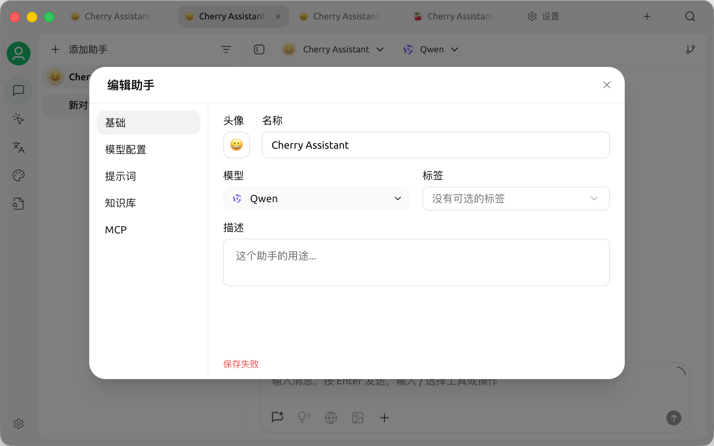

# Assistant 编辑弹窗保存失败后无法关闭

## 状态

- 结论：Bug 已确认存在。
- 发现版本：Cherry Studio Next `2.0.0-alpha.14` macOS 安装包。
- 调查日期：2026-07-22。
- 对照代码基线：`a22fe22c2c`。
- 修复状态：当前工作区已修复并通过定向及全量回归测试，待合并和安装包验证。

## 问题表现

编辑 Assistant 时，弹窗底部显示“保存失败”。此后点击关闭按钮、按 Esc 或点击遮罩均无法关闭弹窗。

失败期间，应用会重复发起以下内部 DataApi 请求：

```text
PATCH /assistants/<assistant-id>
```

该请求不是发往模型提供商的外部网络请求，而是 Electron 渲染进程到主进程的 DataApi 请求。

### 现场截图



## alpha.14 已确认的故障链

```text
Assistant 表单生成 PATCH
  → settings.mcpMode 在运行时不是合法枚举值
  → 主进程 UpdateAssistantSchema 拒绝请求
  → persist() 将 saveFailedRef 设为 true
  → 关闭操作先调用 flush() 再检查 saveFailedRef
  → saveFailedRef 为 true 时直接 return
  → 弹窗保持打开，且用户没有放弃修改并关闭的出口
```

主进程只接受以下值：

```text
disabled | auto | manual
```

日志中的 Zod 错误稳定指向：

```text
path: ["settings", "mcpMode"]
code: "invalid_value"
```

相关代码：

- `src/shared/data/types/assistant.ts`：`McpModeSchema`。
- `src/shared/data/api/schemas/assistants.ts`：`UpdateAssistantSchema`。
- `src/renderer/utils/resourceCatalog/assistantForm.ts`：表单初始化和 PATCH 组装。
- `src/renderer/components/resourceCatalog/dialogs/edit/AssistantEditDialog.tsx`：自动保存及关闭逻辑。

## 已确认的原因

### 1. 弹窗无法关闭的直接原因

这是已证实的确定性逻辑，而不是关闭按钮失效。

alpha.14 的 `handleOpenChange(false)` 在存在待保存修改时会先等待 `flush()`。保存失败后，`persist()` 设置：

```ts
saveFailedRef.current = true
```

关闭流程随后执行：

```ts
if (saveFailedRef.current) return
```

因此任何持续的保存错误都会把弹窗变成不可退出状态。当前逻辑是为了防止静默丢失修改，但没有提供显式“放弃修改并关闭”的恢复路径。

### 2. 保存失败的直接原因

alpha.14 渲染进程提交的 `settings.mcpMode` 在运行时不属于合法枚举，主进程按 schema 正确拒绝了请求。

这里的问题不是主进程校验过严，而是渲染进程允许未经运行时验证的值进入表单并被重新提交。

alpha.14 的表单使用空值回退：

```ts
mcpMode: settings.mcpMode ?? 'auto'
```

该写法只能处理 `null` 和 `undefined`。布尔值、旧字符串或其他历史数据形状不会触发回退，会原样进入表单。

## 现场实验与结果

### 应用日志

在 2026-07-22 11:47:54 至 11:48:31 之间观察到重复的 PATCH 校验失败。每次失败均指向 `settings.mcpMode`，并紧接着出现：

```text
Failed to auto-save assistant edit dialog
```

日志只记录合法枚举列表，没有记录实际收到的非法值。

### SQLite

- `PRAGMA integrity_check` 返回 `ok`。
- 对应 Assistant 数据库行中的 `settings.mcpMode` 是文本值 `manual`。
- 该行最后成功更新时间为 11:20:48，早于 11:47 开始出现的错误。

因此可以排除当前持久化行损坏。非法值存在于渲染进程的内存资源、表单快照或 PATCH 组装链路中。

### alpha.14 安装包静态检查

直接读取 `app.asar` 中的主进程和渲染进程 bundle，确认：

- 主进程枚举为 `disabled / auto / manual`。
- 渲染进程默认值为 `auto`。
- MCP 开关和下拉框只会主动写入三个合法字符串。
- 表单会把 `form.mcpMode` 原样放进 PATCH。

这说明正常控件交互不会自行创造非法值。非法值更可能来自进入弹窗之前已有的运行时对象或不完整表单快照。

### 外部网络

保存失败期间没有对应的外部 TCP 请求。localhost `23333` 是 API Gateway，与 Assistant DataApi 保存无关。

## 尚未完全确认的上游触发条件

当前证据不能确定运行时非法值具体是什么。以下内容必须继续作为假设，不能写成已确认根因。

### 优先假设：陈旧或旧形状的内存 Assistant

Resource Catalog 和不同窗口可能持有各自的查询缓存。若缓存对象来自旧 schema，例如包含布尔型 `mcpMode`，`?? 'auto'` 不会将其规范化，编辑其他字段时便会把非法值重新提交。

这与以下现场事实吻合：

- 数据库已保存合法的 `manual`。
- 运行时 PATCH 仍提交非法值。
- DataApi 业务数据不会自动同步所有窗口的查询缓存。

仍需通过捕获实际 PATCH body 或构造跨窗口复现来证实。

### 次要假设：表单首次渲染或重置期间出现不完整快照

如果 `form.watch()` 在某个渲染周期返回不完整值，diff 可能把 `mcpMode` 视为变化并发送完整 `settings`。当前静态代码和常规 React Hook Form 行为不支持直接确认该假设，需要专门的组件测试或运行时捕获。

## 已排除项

- 不是 Qwen 或其他模型提供商请求失败。
- 不是外部网络连接失败。
- 不是当前 SQLite 文件损坏。
- 不是数据库行当前保存了非法 `mcpMode`。
- 不是关闭按钮本身没有响应；关闭事件被保存失败逻辑明确拦截。
- 没有证据表明主进程和 alpha.14 渲染 bundle 使用了不同的枚举定义。

## 已实施修复

### 1. 表单边界规范化

`initialAssistantFormState()` 现在使用现有 `McpModeSchema.safeParse()` 校验运行时值：

```text
合法值 → 保持原值
布尔值、未知字符串等非法值 → 回退到 DEFAULT_ASSISTANT_SETTINGS.mcpMode
```

这能阻止历史数据、旧缓存或跨版本对象把非法值带入新的 PATCH。

`diffAssistantUpdate()` 在用户只修改名称、描述等无关字段时，也会用规范化后的值覆盖原始非法值，因此发送的完整 `settings` 不再携带非法 `mcpMode`。

### 2. 保存失败后的可恢复关闭

弹窗不再使用一个永久阻塞关闭的布尔标记，而是记录“保存失败的精确表单快照”：

- 首次关闭仍会尝试保存；失败时保留弹窗并显示错误。
- 对同一失败快照再次关闭时，不再重复 PATCH，视为用户放弃该快照并关闭。
- 失败后继续编辑会产生新快照；再次关闭会重新尝试保存，成功后关闭。

该行为同时适用于关闭按钮、Esc 和遮罩关闭，因为它们都经过同一个 `handleOpenChange(false)`。

### 3. 回归测试

已扩展以下测试：

- `src/renderer/utils/resourceCatalog/__tests__/assistantForm.test.ts`
- `src/renderer/components/resourceCatalog/dialogs/edit/__tests__/EditDialogs.test.tsx`

覆盖非法布尔值和未知字符串、修改无关字段后的合法 PATCH、同一失败快照二次关闭，以及失败后修改为新快照重新保存。

### 4. 验证结果

- 定向回归：2 个测试文件、48 个测试通过。
- 独立 subagent 复核：修复实现和当时的 46 个定向测试均通过；其建议补充的 2 个场景随后已加入上述 48 个测试。
- `corepack pnpm lint`：通过（0 error；保留仓库原有 warning）。
- `corepack pnpm test`：通过；1493 个测试文件通过，17687 个测试通过、65 个跳过。
- `corepack pnpm format`：通过，无额外格式修改。
- `corepack pnpm build:check`：通过；1493 个测试文件通过，17687 个测试通过、65 个跳过。

首次全量测试暴露本地安装阶段尚未构建 `better-sqlite3` 和 Electron 二进制；按工作区 `allowBuilds` 配置执行 pending rebuild 后，相关失败消失。该问题属于本地依赖准备，不是本次代码回归。

## 未实施的后续改进

- 继续定位非法运行时值最初来自哪个缓存或窗口同步路径。
- 如需增加日志，只记录 `typeof mcpMode` 和经过筛选的枚举值；不要记录完整 Assistant prompt、凭据或整个请求体。

## 验收标准

- 非法或历史形状的 `mcpMode` 不会进入 PATCH。
- 合法 `mcpMode` 的行为没有变化。
- 编辑任意 Assistant 字段不会因无关的历史设置值而失败。
- 保存失败时错误仍然可见，但用户可以明确放弃修改并关闭。
- 不出现保存失败导致的重复关闭尝试或请求风暴。
- 非法运行时值和旧数据输入有自动化测试覆盖；跨窗口触发路径在后续安装包验证中确认。
- 实现完成后通过仓库要求的 `corepack pnpm lint`、`corepack pnpm test`、`corepack pnpm format` 和 `corepack pnpm build:check`。

## 后续调查需要捕获的信息

若问题仍可复现，下一次应优先捕获以下最小信息：

```text
typeof payload.settings.mcpMode
payload.settings.mcpMode
resource.settings.mcpMode
form.getValues('mcpMode')
```

只记录这些非敏感字段即可，不需要抓取完整请求体。
