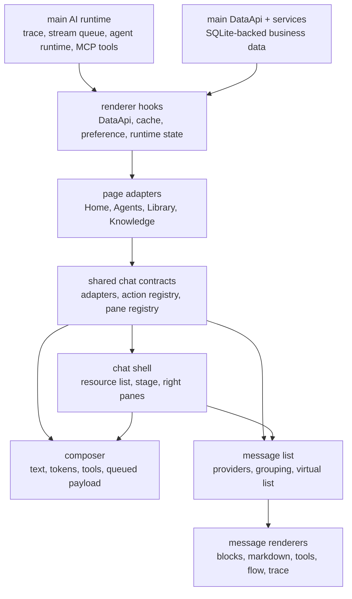
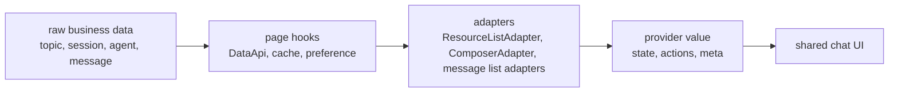
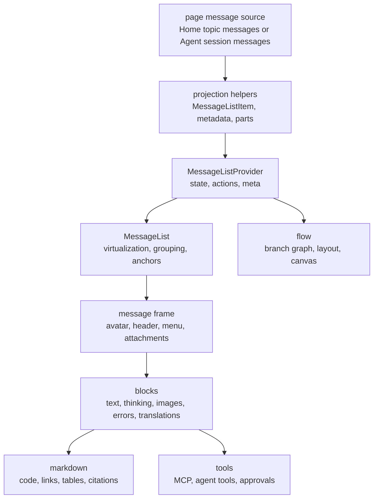

# feat/chat-page Architecture

Last updated: 2026-06-10

This working note describes the target architecture behind the `feat/chat-page` split. It is a temporary v2 refactor document and should move or be deleted with `v2-refactor-temp/` after the split stack lands.

## Goals

- Share one chat experience foundation across Home chat and Agent chat.
- Keep business data ownership in page/data/runtime layers, not inside reusable UI components.
- Make the AI runtime, DataApi, resource library, composer, message list, trace pane, and tool renderers reviewable as separate business boundaries.
- Avoid an equivalence or catch-all PR that hides unrelated changes behind one large diff.

## Layer Map

## Backend Ownership

The backend side of this split has two primary owners:

- `src/main/ai/` owns runtime execution: trace capture, stream steering, agent sessions, and MCP tool runtime.
- `src/main/data/` owns SQLite-backed business data through DataApi handlers, services, schemas, and renderer hooks.

DataApi changes should stay contract-shaped. If a feature needs schema, service, handler, hook, and consumer changes to remain coherent, keep that whole contract in one PR rather than forcing a smaller but misleading split.

Backend split areas:

| Area | Responsibility | Split PRs |
| --- | --- | --- |
| Trace observability | Capture trace spans and expose container-owned trace IDs | `split-16`, `split-31`, `split-35` |
| Stream control | Queue steering and continuation events for active streams | `split-17` |
| Agent runtime | Keep agent sessions warm and expose agent resource policy | `split-18`, `split-30` |
| Agent workspaces | Manage DataApi-backed agent workspace workflows and session links | `split-65` |
| Assistant data bootstrap | Persist assistant source metadata and seed the v2 default assistant through DataApi/bootstrap consumers | `split-28`, `split-64` |
| MCP tools | Add Claude MCP tool runtime and chat tool-rendering foundations | `split-19`, `split-52` through `split-58` |
| Builtin tools | Keep builtin tool contracts shared, extract knowledge/web lookup cores, and expose Cherry builtin tools through MCP | `split-59`, `split-60`, `split-61`, `split-62` |
| AI SDK meta tools | Harden meta-tool search, inspect, invoke, and defer exposition behavior | `split-63` |
| Topic operations | Copy a selected topic branch into a new topic | `split-32` |
| Provider settings | Merge provider setting patches without losing fields | `split-20` |

## Renderer Ownership

`src/renderer/components/chat/` is the shared chat surface. It is not a page and should not own Home-only or Agent-only business data. Page directories own route-specific data reads, mutations, navigation, and side panes.

Shared chat owns:

- presentational primitives and stable contracts
- resource list and shell layout primitives
- composer runtime and token rendering
- message-list provider contracts
- message grouping, virtualization, selection, and flow helpers
- message blocks, markdown, tool renderers, and trace UI

Pages own:

- route search params and navigation
- active topic/session/agent selection
- agent workspace selection and workflow state
- page-specific data hooks and mutations
- page-specific sidebars, nav bars, and right panes
- capability injection into shared chat contracts

## Adapter Boundary

Adapters are the boundary between business state and shared UI. They should be pure projection helpers plus stable callback delegation.

Rules:

- Shared chat components consume provider values, adapter output, or registries.
- Shared chat components must not import page-private modules from `@renderer/pages/home/...` or `@renderer/pages/agents/...`.
- Missing actions mean missing capabilities. Do not add page-mode booleans such as `isHome`, `isAgent`, or `mode`.
- Adapters do not fetch data, persist data, or become a second cache.

## Shell And Resource Lists

The shell layer gives Home and Agents the same layout vocabulary without forcing one page implementation:

- `ChatAppShell` and `ConversationShell` organize the left resource area, center stage, composer slot, overlay host, and right pane host.
- `ResourceList` projects topics, sessions, assistants, prompts, skills, and agents into UI-facing resource items.
- Action registries and menu descriptors keep context-menu behavior capability-driven.
- Right pane registries let pages expose trace, branch, artifacts, and settings panes without hard-coding page modes into the shell.

Home supplies topic and assistant resources. Agents supply agent, session, workspace, artifact, and task resources. Both render through the same shell primitives.

## Composer

The composer layer is split into a shared core plus page variants:

- Shared core owns editor schema, token nodes, prompt-variable tokens, paste parsing, draft serialization, tool launcher plumbing, and queued follow-up payloads.
- Home variant owns chat topic send/edit behavior and chat knowledge/model scoping.
- Agent variant owns agent session send behavior, permission requests, ask-user-question prompts, and workspace-aware resources.

Composer contracts should move text, attachments, tokens, and command callbacks across the adapter boundary. Persisted message data remains owned by page/runtime services.

## Message List And Rendering

The message system is the largest renderer vertical slice. Its core rule is one reusable message UI implementation with page-specific data injected.

Message-list ownership:

- `types` and provider contracts define `state`, `actions`, and `meta`.
- `list` owns grouping, multi-model layout, anchors, virtualizer runtime, selection, and scroll memory.
- `frame` owns message chrome, menus, attachments, and visible action affordances.
- `blocks` owns message-part rendering.
- `markdown` owns message markdown rendering only.
- `tools` owns tool response rendering, parent metadata, activity/status helpers, arguments tables, approval controls, output truncation, task normalization, and future agent tool renderers.
- `flow` owns branch graph construction and React Flow layout.

The virtual list and providers must not become a second source of truth for messages. They render projected data and call injected actions.

## Trace And Flow

Trace and branch flow are separate:

- Trace describes execution and observability spans from AI/runtime services.
- Flow describes topic message branching and active-path visualization.

Trace enters the renderer through container-owned trace IDs and trace-data IPC. Flow is built from topic message trees, sibling groups, and live pending message state. Review these as separate concerns even when they appear in the same right pane.

## Resource Library And Selectors

The resource library supports the chat page by making agents, assistants, prompts, skills, tags, presets, and model selectors reusable:

- selector/model infrastructure is shared before form workflows consume it
- tag mutation hooks are independent reusable resource operations
- assistant catalog source metadata is DataApi-owned
- default assistant bootstrap is DataApi-owned and should keep schema, seeding, migration transforms, service, hook, and immediate consumers together
- library form adapters convert resource entities into form DTOs
- skill detail dialog is a focused library interaction, not a chat shell concern

The broad library resource workflow should be finalized after its extracted prerequisites are reviewed.

## Split Mapping

| Architecture area | Split PRs |
| --- | --- |
| UI primitives and renderer utilities | `split-02` through `split-12` |
| Backend AI/runtime | `split-16` through `split-20` |
| Shared chat contracts and shell | `split-21` through `split-24`, `split-36`, `split-37` |
| Library/resource support | `split-25` through `split-30`, `split-34`, `split-64` |
| Trace and topic DataApi | `split-31`, `split-32`, `split-35` |
| Agent workspace DataApi | `split-65` |
| Composer | `split-38` |
| Message list foundations | `split-40` through `split-49` |
| Message flow | `split-50`, `split-51`; reconcile with `split-39` |
| Chat tool foundations | `split-52` through `split-58` |
| Builtin tool lookup foundations | `split-59`, `split-60`, `split-61`, `split-62` |
| AI SDK meta-tool hardening | `split-63` |

## Non-goals

- No catch-all `feat/chat-page` equivalence PR.
- No duplicate message-list implementation for Home and Agents.
- No shared chat component importing page-private Home or Agent modules.
- No mode booleans in shared components when provider actions or variants can express the capability.
- No DataApi endpoint without SQLite-backed business data.
- No renderer-owned business-data cache that competes with DataApi, Cache, or Preference.

## Open Integration Points

The currently open follow-up areas should consume the foundations above:

- clickable file path renderer should consume provider runtime and file path utilities
- markdown renderer should consume tool response foundations only where needed
- agent tool renderers should consume tool response adapter, parent metadata, activity/status helpers, arguments table, output truncation, and task data helpers
- builtin AI tool adapters should consume shared builtin contracts plus the knowledge/web lookup cores, Cherry builtin-tools MCP server, and meta-tool hardening
- remaining Home/Agent page integration should stay in page adapters and route components, not inside shared chat core
- Agent page integration should consume the agent workspace DataApi contract instead of duplicating workspace state inside shared chat components
